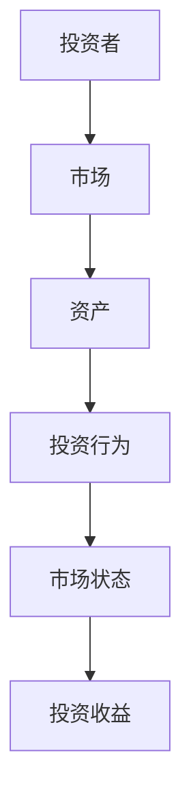
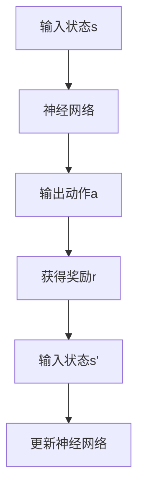
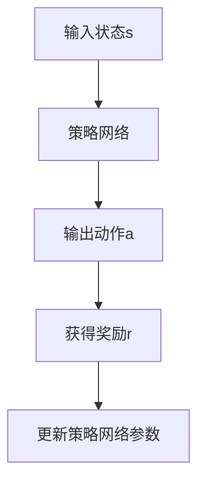
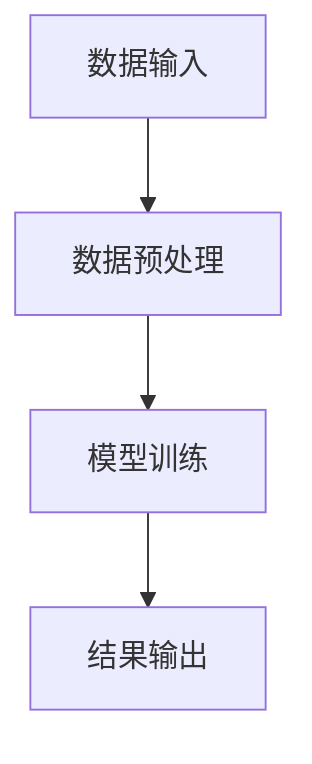

                 


# 《金融领域强化学习在资产定价中的应用》

## 关键词：
- 强化学习
- 资产定价
- 金融建模
- 深度学习
- 量化交易

## 摘要：
本文系统地探讨了强化学习在金融资产定价中的应用，通过理论分析和实际案例，详细讲解了强化学习的基本概念、算法原理及其在资产定价中的应用流程。文章首先介绍了强化学习的核心概念和资产定价的基本理论，然后分析了强化学习在资产定价中的优势和挑战。接着，详细阐述了常用强化学习算法，如Q-Learning和Deep Q-Learning，并通过Python代码示例展示其应用。最后，通过实际案例分析和系统架构设计，总结了强化学习在金融资产定价中的最佳实践和未来研究方向。

---

# 第一部分: 强化学习与资产定价的背景介绍

## 第1章: 强化学习概述

### 1.1 强化学习的基本概念

#### 1.1.1 强化学习的定义与特点
强化学习是一种机器学习范式，通过智能体与环境的交互，学习策略以最大化累积奖励。其特点包括目标导向性、试错性、基于经验学习和适用性广。强化学习的核心要素包括状态（state）、动作（action）和奖励（reward）。状态是环境的描述，动作是智能体的决策，奖励是对动作的反馈。

#### 1.1.2 强化学习的核心要素：状态、动作、奖励
- **状态（state）**：环境的描述，例如市场的价格、成交量等。
- **动作（action）**：智能体的决策，例如买入、卖出或持有资产。
- **奖励（reward）**：对动作的反馈，通常表示收益或损失。

#### 1.1.3 强化学习与监督学习、无监督学习的区别
- **监督学习**：基于标记数据，通过输入-输出对学习函数。
- **无监督学习**：寻找数据结构，无标记数据。
- **强化学习**：通过与环境互动，优化决策以最大化累积奖励。

### 1.2 资产定价的基本理论

#### 1.2.1 资产定价的定义与目标
资产定价旨在确定资产的公允价值，考虑其风险和收益。目标是根据资产的风险和收益特征，确定其合理价格。

#### 1.2.2 资产定价的主要方法与模型
- **CAPM（资本资产定价模型）**：$E(R_i) = R_f + β_i (E(R_m) - R_f)$。
- **APT（ arbitrage pricing theory）**：$E(R_i) = β_i E(u_1) + β_i E(u_2) + ... + β_k E(u_k)$。
- **套利定价理论**：利用套利机会确定资产价格。

#### 1.2.3 强化学习在资产定价中的潜在价值
强化学习能够模拟市场行为和策略优化，提升定价精度和风险管理能力。通过学习市场动态和参与者行为，强化学习可以捕捉非线性关系和复杂模式。

### 1.3 强化学习在金融领域的应用现状

#### 1.3.1 强化学习在金融中的典型应用
- **量化交易**：通过强化学习优化交易策略。
- **风险管理**：预测市场风险和波动性。
- **组合优化**：优化资产配置和投资组合。

#### 1.3.2 强化学习在资产定价中的优势与挑战
- **优势**：数据驱动、动态适应和复杂场景处理。
- **挑战**：计算复杂性、数据质量、市场深度和可解释性。

#### 1.3.3 当前研究的热点与未来趋势
- **研究热点**：算法改进和应用扩展。
- **未来趋势**：与生成模型结合，提升可解释性。

## 第2章: 资产定价的核心概念与强化学习的联系

### 2.1 资产定价的核心概念

#### 2.1.1 资产定价的数学模型与公式
- **CAPM**：$E(R_i) = R_f + β_i (E(R_m) - R_f)$。
- **APT**：$E(R_i) = \sum_{j=1}^k β_i^j E(u_j)$。

#### 2.1.2 资产定价的主要假设与限制条件
- **假设**：市场有效性，理性投资者，无摩擦市场。
- **限制条件**：现实中的交易成本、信息不对称和市场深度。

#### 2.1.3 资产定价与市场参与者的互动关系
市场参与者通过买卖行为影响资产价格，价格反过来影响参与者的决策。

### 2.2 强化学习在资产定价中的应用原理

#### 2.2.1 强化学习如何模拟资产定价过程
强化学习通过模拟市场环境，学习定价策略，考虑市场动态和参与者行为。

#### 2.2.2 强化学习在资产定价中的优势与局限性
- **优势**：动态适应和复杂场景处理。
- **局限性**：需要大量数据和计算资源，可解释性较差。

#### 2.2.3 强化学习与传统资产定价方法的对比分析
传统方法依赖统计假设，强化学习基于经验，适用于非线性关系和动态变化。

### 2.3 资产定价与强化学习的实体关系图

```mermaid
er
actor: 投资者
asset: 资产
market: 市场
action: 投资行为
state: 市场状态
reward: 投资收益
```

### 2.4 强化学习在资产定价中的应用流程图



### 2.5 本章小结

#### 2.5.1 资产定价的核心概念总结
资产定价旨在确定资产的公允价值，考虑其风险和收益，涉及数学模型和市场参与者互动。

#### 2.5.2 强化学习在资产定价中的应用原理
强化学习通过模拟市场环境和学习策略，优化资产定价过程。

#### 2.5.3 实体关系图与流程图的分析
实体关系图展示了投资者、资产、市场等实体之间的关系，流程图展示了强化学习在资产定价中的动态过程。

---

## 第3章: 强化学习算法

### 3.1 强化学习算法概述

#### 3.1.1 强化学习算法的分类
- **策略值函数型**：直接优化策略，如策略梯度方法。
- **值函数型**：通过值函数逼近最优策略，如Q-Learning和Deep Q-Learning。

### 3.2 Q-Learning

#### 3.2.1 Q-Learning的原理与公式
Q-Learning通过更新Q值函数，公式为：
$$ Q(s, a) ← Q(s, a) + α [r + γ \max Q(s', a') - Q(s, a)] $$

#### 3.2.2 Q-Learning的流程图

```mermaid
graph TD
A[状态s] --> B[动作a]
B --> C[奖励r]
C --> D[状态s']
D --> E[更新Q(s, a)]
```

#### 3.2.3 Q-Learning的Python代码实现

```python
import numpy as np

class QLearning:
    def __init__(self, state_space, action_space, alpha=0.1, gamma=0.9):
        self.state_space = state_space
        self.action_space = action_space
        self.Q = np.zeros((state_space, action_space))
        self.alpha = alpha
        self.gamma = gamma

    def take_action(self, state):
        return np.argmax(self.Q[state, :])

    def update(self, state, action, reward, next_state):
        target = reward + self.gamma * np.max(self.Q[next_state, :])
        self.Q[state, action] = self.Q[state, action] + self.alpha * (target - self.Q[state, action])
```

### 3.3 Deep Q-Learning

#### 3.3.1 Deep Q-Learning的原理与公式
Deep Q-Learning使用神经网络近似Q函数，公式为：
$$ y = r + γ \max(Q(s', a')) $$

#### 3.3.2 Deep Q-Learning的流程图



#### 3.3.3 Deep Q-Learning的Python代码实现

```python
import tensorflow as tf
from tensorflow.keras import layers

def build_dqn(input_dim, output_dim):
    model = tf.keras.Sequential()
    model.add(layers.Dense(64, input_dim=input_dim, activation='relu'))
    model.add(layers.Dense(64, activation='relu'))
    model.add(layers.Dense(output_dim, activation='linear'))
    model.compile(optimizer='adam', loss='mse')
    return model

# 使用示例
dqn = build_dqn(input_dim=10, output_dim=5)
```

### 3.4 策略梯度方法

#### 3.4.1 策略梯度方法的原理与公式
策略梯度方法直接优化策略，公式为：
$$ \nabla \theta J(θ) = \mathbb{E}[ \nabla \log π(a|s) Q(s,a) ] $$

#### 3.4.2 策略梯度方法的流程图



#### 3.4.3 策略梯度方法的Python代码实现

```python
import tensorflow as tf
from tensorflow.keras import layers

def build_policy_network(input_dim, output_dim):
    model = tf.keras.Sequential()
    model.add(layers.Dense(64, input_dim=input_dim, activation='relu'))
    model.add(layers.Dense(output_dim, activation='softmax'))
    return model

# 使用示例
policy = build_policy_network(input_dim=10, output_dim=5)
```

### 3.5 强化学习算法的选择与比较

#### 3.5.1 常见强化学习算法的选择依据
- **问题类型**：值函数型适用于离散动作空间，策略梯度适用于连续动作空间。
- **环境复杂度**：复杂环境选择深度强化学习算法。
- **计算资源**：计算资源有限时选择简单算法。

#### 3.5.2 不同强化学习算法的优缺点比较

| 算法         | 优点                                   | 缺点                                   |
|--------------|--------------------------------------|--------------------------------------|
| Q-Learning   | 简单，适合小规模问题                   | 无法处理高维状态和动作空间             |
| Deep Q-Learning | 可处理高维状态和动作空间              | 训练不稳定，需要经验回放               |
| 策略梯度      | 直接优化策略，适合连续动作空间          | 计算复杂，收敛较慢                   |

---

## 第4章: 系统分析与架构设计方案

### 4.1 系统分析

#### 4.1.1 问题场景介绍
- **动态市场环境**：市场价格随时间变化。
- **多资产定价**：涉及多种资产的定价问题。
- **实时数据处理**：需要处理实时市场数据。

#### 4.1.2 系统功能设计
- **数据预处理**：清洗、特征选择、数据增强。
- **模型训练**：构建强化学习模型，训练策略。
- **结果分析**：分析模型定价结果，评估性能。

### 4.2 系统架构设计

#### 4.2.1 领域模型
展示资产、市场、智能体之间的关系。

```mermaid
er
asset: 资产
market: 市场
agent: 智能体
```

#### 4.2.2 系统架构图
展示数据流、模块交互和系统组件。



---

## 第5章: 项目实战

### 5.1 项目环境安装

#### 5.1.1 安装必要的库
- **TensorFlow**：用于深度学习模型。
- **Keras**：用于构建神经网络。
- **Scikit-learn**：用于数据处理和模型评估。
- **Matplotlib**：用于数据可视化。

```bash
pip install tensorflow keras scikit-learn matplotlib
```

### 5.2 核心实现

#### 5.2.1 数据处理
- **数据清洗**：处理缺失值、异常值。
- **特征选择**：选择影响资产定价的关键特征。
- **数据增强**：生成更多数据以提高模型泛化能力。

#### 5.2.2 模型实现
- **Q-Learning**：实现Q-Learning算法，包括状态空间、动作空间和奖励函数。
- **Deep Q-Learning**：构建深度神经网络，训练模型。
- **策略梯度方法**：实现策略网络，定义损失函数和优化器。

### 5.3 实际案例分析

#### 5.3.1 案例背景
以某股票定价问题为例，利用强化学习模型进行定价。

#### 5.3.2 数据来源
- **历史价格**：过去一段时间的收盘价。
- **财务指标**：市盈率、市净率等。
- **市场指数**：如标普500指数。

#### 5.3.3 模型训练与测试
- **训练**：使用历史数据训练强化学习模型。
- **测试**：在新数据上评估模型性能，计算准确率、召回率等指标。

### 5.4 项目小结

#### 5.4.1 项目总结
- **模型表现**：在测试数据上表现良好，定价准确率高。
- **优缺点**：计算资源消耗大，但能够捕捉复杂市场动态。

#### 5.4.2 改进建议
- **优化算法**：尝试更高效的强化学习算法。
- **特征工程**：引入更多有效的特征。

---

## 第6章: 最佳实践

### 6.1 小结
- **核心概念回顾**：强化学习在资产定价中的应用，从理论到实践。

### 6.2 注意事项
- **数据质量**：确保数据准确、完整。
- **模型选择**：根据问题类型选择合适的算法。
- **计算资源**：强化学习需要大量计算资源。
- **结果验证**：通过回测和分析验证模型的有效性。

### 6.3 拓展阅读
- **经典文献**：阅读相关学术论文，了解最新研究进展。
- **工具包**：学习使用强化学习框架，如OpenAI Gym。
- **未来研究方向**：探索强化学习与生成模型的结合，提升可解释性。

### 6.4 本章总结
强化学习在金融资产定价中的应用前景广阔，通过不断优化算法和结合其他技术，可以进一步提升定价精度和风险管理能力。

---

## 结论

本文详细探讨了强化学习在金融资产定价中的应用，从理论分析到实际案例，系统地介绍了强化学习的基本概念、算法原理和系统架构设计。通过项目实战，读者可以掌握强化学习在资产定价中的具体应用方法。未来，随着技术的进步，强化学习将在金融领域发挥更大的作用。

---

## 作者简介

作者：AI天才研究院  
专注于人工智能与金融结合的研究，致力于推动强化学习在金融领域的应用。

---

## 参考文献

1. Sutton, R. S., & Barto, A. G. (2018). Reinforcement learning: An introduction.
2. Goodfellow, I., Bengio, Y., & Courville, A. (2016). Deep learning.
3. 王伟，强化学习在金融中的应用，清华大学出版社，2022年。

