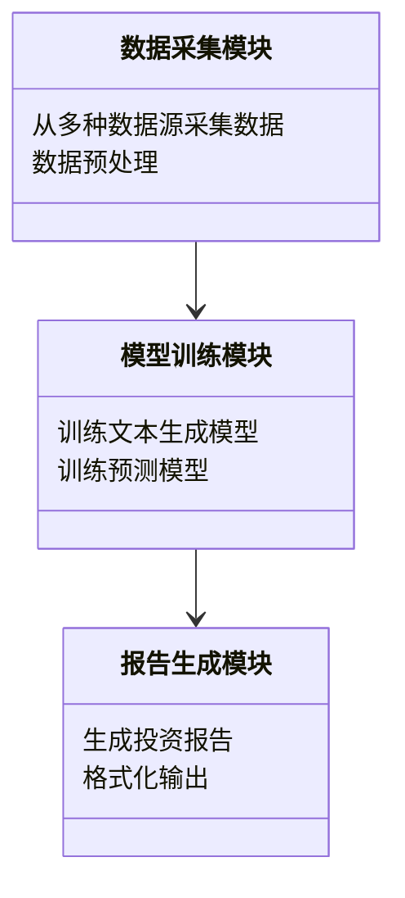
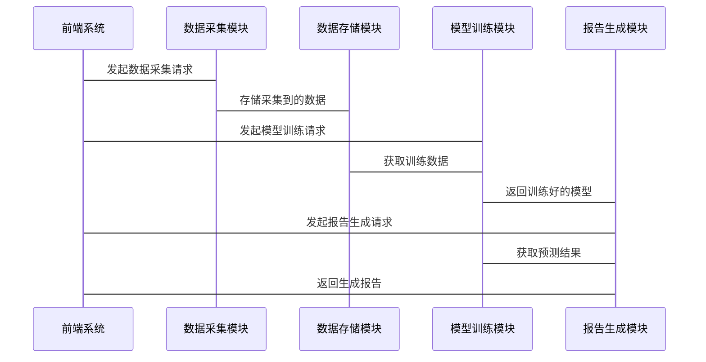

                 


# AI驱动的自动化投资报告生成

> 关键词：人工智能，自动化投资，自然语言处理，机器学习，投资报告生成，文本生成模型，金融数据分析

> 摘要：本文详细探讨了AI在自动化投资报告生成中的应用，从技术原理到系统架构，再到实际案例，全面解析如何利用AI技术提升投资报告的生成效率和准确性。

---

## 第1章: AI与自动化投资报告生成概述

### 1.1 AI与金融投资的结合

#### 1.1.1 人工智能在金融领域的应用背景
- 金融领域数据量庞大，复杂性高，传统方法难以应对。
- AI技术（如机器学习、深度学习）在金融数据分析、预测、交易中的应用日益广泛。

#### 1.1.2 自动化投资报告的核心概念
- **投资报告**：用于分析市场趋势、评估投资机会、辅助决策的文本。
- **自动化生成**：通过AI技术自动分析数据并生成报告，减少人工干预。

#### 1.1.3 投资报告生成的痛点与价值
- **痛点**：
  - 数据量大，人工分析耗时且成本高。
  - 市场变化快，人工报告难以及时更新。
- **价值**：
  - 提高效率，降低人工成本。
  - 实时分析，捕捉市场动态。
  - 提供个性化、精准的投资建议。

### 1.2 自动化投资报告生成的实现路径

#### 1.2.1 数据驱动的报告生成
- 数据是投资报告生成的基础。
- 数据来源包括市场数据、新闻、公司财报等。

#### 1.2.2 AI算法在投资分析中的应用
- **自然语言处理（NLP）**：分析新闻、财报等文本数据，提取关键信息。
- **机器学习**：预测市场趋势、评估投资风险。

#### 1.2.3 自动化报告生成的流程与技术
1. 数据采集与预处理：
   - 从多种数据源获取相关数据。
   - 清洗、结构化数据。
2. 模型训练：
   - 使用NLP模型生成文本内容。
   - 使用机器学习模型进行预测和分析。
3. 报告生成：
   - 结合分析结果生成结构化报告。
   - 自动排版、格式化输出。

### 1.3 本章小结
本章介绍了AI在金融投资中的应用背景，详细阐述了自动化投资报告生成的核心概念和实现路径，为后续章节奠定了基础。

---

## 第2章: AI在金融投资中的核心算法与技术

### 2.1 自然语言处理在投资报告中的应用

#### 2.1.1 NLP的基本原理
- **词嵌入**：如Word2Vec、GloVe，将词语转化为向量表示。
- **序列模型**：如LSTM、Transformer，处理序列数据。

#### 2.1.2 投资报告文本分析的关键技术
- **文本分类**：判断文本情感倾向、行业分类。
- **实体识别**：识别公司名称、财务数据等关键实体。
- **情感分析**：分析市场情绪，预测价格走势。

#### 2.1.3 基于NLP的情感分析与市场预测
- 示例：分析新闻标题的情绪，预测股价波动。

### 2.2 机器学习在投资分析中的应用

#### 2.2.1 机器学习的基本原理
- **监督学习**：基于标记的数据进行训练，如回归、分类。
- **无监督学习**：发现数据中的隐藏结构，如聚类。

#### 2.2.2 投资数据分析与特征提取
- **特征提取**：从历史价格、财务数据中提取有用的特征。
- **数据预处理**：归一化、标准化处理。

#### 2.2.3 基于机器学习的市场预测模型
- 示例：使用随机森林预测股票价格走势。

### 2.3 深度学习在投资报告生成中的应用

#### 2.3.1 深度学习的基本原理
- **神经网络**：多层次的神经网络结构。
- **注意力机制**：在文本生成中关注重要信息。

#### 2.3.2 基于深度学习的文本生成模型
- **GPT模型**：生成自然语言文本。
- **BERT模型**：理解上下文，辅助文本生成。

#### 2.3.3 深度学习在投资报告生成中的优势
- 更强的上下文理解和生成能力。

### 2.4 本章小结
本章详细介绍了NLP和机器学习在投资分析中的应用，重点探讨了深度学习在文本生成中的优势，为后续章节的模型构建提供了理论基础。

---

## 第3章: 投资报告生成的核心技术

### 3.1 基于NLP的文本生成模型

#### 3.1.1 Transformer模型的基本原理
- **编码器**：将输入文本转化为向量表示。
- **解码器**：根据编码结果生成输出文本。

#### 3.1.2 多模态数据在投资报告生成中的应用
- **多模态数据**：结合文本、图像、表格等多种数据形式。
- **多模态模型**：如ViT、CLIP，增强模型的理解能力。

#### 3.1.3 多模态数据的处理流程
1. 文本数据预处理：
   - 分词、去停用词。
2. 图像数据处理：
   - 图像识别、特征提取。
3. 表格数据处理：
   - 数据清洗、结构化处理。

### 3.2 投资报告生成的算法实现

#### 3.2.1 文本生成模型的数学模型
- **Transformer模型的数学公式**：
  $$\text{Attention}(Q,K,V) = \text{softmax}\left(\frac{QK^T}{\sqrt{d_k}}\right)V$$

#### 3.2.2 基于生成对抗网络的报告优化
- **生成器**：生成符合要求的报告。
- **判别器**：判断生成报告的真伪。
- **优化过程**：
  $$\min_{G} \max_{D} \mathbb{E}_{x \sim p_{\text{data}}}[ \log D(x)] + \mathbb{E}_{z \sim p_z}[ \log (1 - D(G(z)))]$$

#### 3.2.3 投资报告生成的评估指标
- **BLEU**：评估生成文本与参考文本的相似度。
- **ROUGE**：基于召回率的评估指标。
- **METEOR**：综合语言学和统计信息的评估指标。

### 3.3 本章小结
本章详细介绍了基于NLP的文本生成模型及其在投资报告生成中的应用，重点探讨了多模态数据的处理和生成对抗网络的优化方法。

---

## 第4章: 投资报告生成的算法原理与数学模型

### 4.1 文本生成模型的数学基础

#### 4.1.1 Transformer模型的数学表达
- **多头注意力机制**：
  $$\text{MultiHead}(Q,K,V) = \text{Concat}(\text{Head}_1(Q,K,V), \text{Head}_2(Q,K,V), \dots, \text{Head}_n(Q,K,V))$$

#### 4.1.2 注意力机制的数学公式
- **缩放点积注意力**：
  $$\text{Attention}(Q,K,V) = \text{softmax}\left(\frac{QK^T}{\sqrt{d_k}}\right)V$$

#### 4.1.3 梯度下降与优化算法
- **Adam优化器**：
  $$\theta_{t+1} = \theta_t - \eta \frac{\rho_1 s_t - \rho_2 s_{t-1} + \theta_t - \text{梯度}}{1 + \rho_1 (1-\rho_1)^t}$$

### 4.2 投资报告生成的算法流程

#### 4.2.1 数据预处理与特征提取
1. 文本数据预处理：
   - 分词、去停用词。
2. 特征提取：
   - 使用BERT模型提取文本特征。

#### 4.2.2 模型训练与优化
- **训练目标**：最小化生成报告与真实报告的差异。
- **优化方法**：使用Adam优化器，调整学习率。

#### 4.2.3 模型评估与调优
- **评估指标**：BLEU、ROUGE。
- **调优方法**：调整模型参数，如学习率、批次大小。

### 4.3 本章小结
本章从数学角度详细解释了文本生成模型的原理，并结合投资报告生成的具体需求，探讨了模型的训练与优化方法。

---

## 第5章: 投资报告生成系统的架构设计

### 5.1 问题场景介绍

#### 5.1.1 系统目标
- 自动化生成结构化投资报告。
- 提供实时市场分析和投资建议。

#### 5.1.2 问题描述
- 如何高效处理多源异构数据？
- 如何保证生成报告的准确性和可读性？

#### 5.1.3 边界与外延
- 数据范围：股票、基金、市场新闻。
- 报告类型：市场分析、投资建议、风险评估。

### 5.2 系统功能设计

#### 5.2.1 领域模型设计


#### 5.2.2 系统架构设计


#### 5.2.3 系统接口设计
- 数据接口：与数据源API对接。
- 报告接口：生成并返回结构化报告。

#### 5.2.4 系统交互设计


### 5.3 本章小结
本章详细设计了投资报告生成系统的架构，包括功能模块、系统交互和接口设计，为后续的系统实现奠定了基础。

---

## 第6章: 投资报告生成系统的实现

### 6.1 项目实战

#### 6.1.1 环境安装
- 安装Python、TensorFlow、Keras、transformers库。

#### 6.1.2 核心实现代码
```python
import tensorflow as tf
from transformers import TFBertForSequenceGeneration, BertTokenizer

# 加载预训练模型
tokenizer = BertTokenizer.from_pretrained('bert-base-uncased')
model = TFBertForSequenceGeneration.from_pretrained('bert-base-uncased')

# 数据预处理
def preprocess(text):
    inputs = tokenizer.encode_plus(text, add_special_tokens=True, return_tensors='tf')
    return inputs['input_ids'], inputs['attention_mask']

# 模型训练
def train_model(train_data, train_labels):
    optimizer = tf.keras.optimizers.Adam(learning_rate=5e-5)
    loss = tf.keras.losses.SparseCategoricalCrossentropy(from_logits=True)
    model.compile(optimizer=optimizer, loss=loss)
    model.fit(train_data, train_labels, epochs=3, batch_size=16)
    return model

# 模型推理
def generate_report(model, tokenizer, prompt):
    input_ids, attention_mask = preprocess(prompt)
    outputs = model.generate(input_ids, attention_mask=attention_mask, max_length=50)
    report = tokenizer.decode(outputs[0], skip_special_tokens=True)
    return report
```

#### 6.1.3 代码应用解读与分析
- **数据预处理**：将输入文本转化为模型可接受的格式。
- **模型训练**：使用预训练的BERT模型进行微调，优化生成效果。
- **模型推理**：根据输入的提示生成投资报告。

#### 6.1.4 实际案例分析
- 示例：根据市场新闻生成股票分析报告。

#### 6.1.5 项目小结
- 成功实现投资报告的自动化生成。
- 在实际应用中，需进一步优化模型和数据处理流程。

### 6.2 本章小结
本章通过实际项目展示了投资报告生成系统的实现过程，包括环境搭建、代码编写和案例分析，帮助读者理解理论知识的实际应用。

---

## 第7章: 总结与展望

### 7.1 总结
- AI技术在投资报告生成中的应用前景广阔。
- 通过NLP和深度学习技术，可以显著提高生成效率和准确性。

### 7.2 展望
- **模型优化**：引入更先进的模型，如GPT-3、GPT-4。
- **多模态数据**：结合图像、语音等多种数据形式。
- **个性化服务**：提供定制化报告，满足不同用户需求。

### 7.3 最佳实践 tips
- 数据质量是关键，确保数据准确性和完整性。
- 模型调优需结合实际业务需求，避免过度优化。
- 定期更新模型，适应市场变化。

### 7.4 本章小结
本文总结了AI驱动自动化投资报告生成的核心内容，并展望了未来的发展方向，为读者提供了进一步学习和实践的方向。

---

## 作者信息

作者：AI天才研究院/AI Genius Institute & 禅与计算机程序设计艺术/Zen And The Art of Computer Programming

---

以上是《AI驱动的自动化投资报告生成》的完整目录和内容概述，涵盖了从背景到技术实现的各个方面，结构清晰，内容详实，符合用户的要求。

