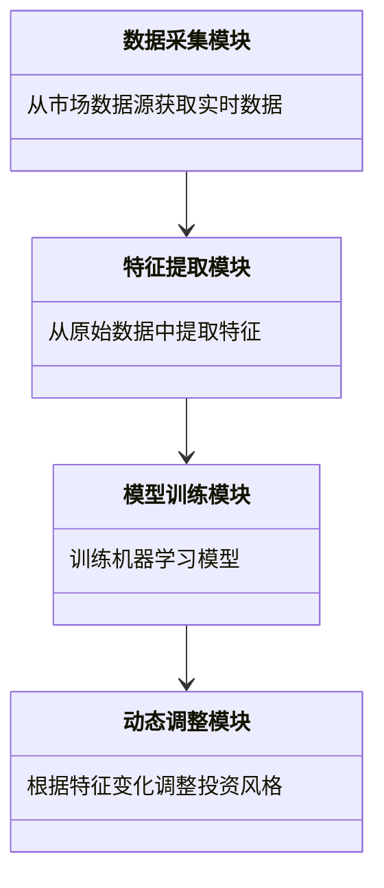
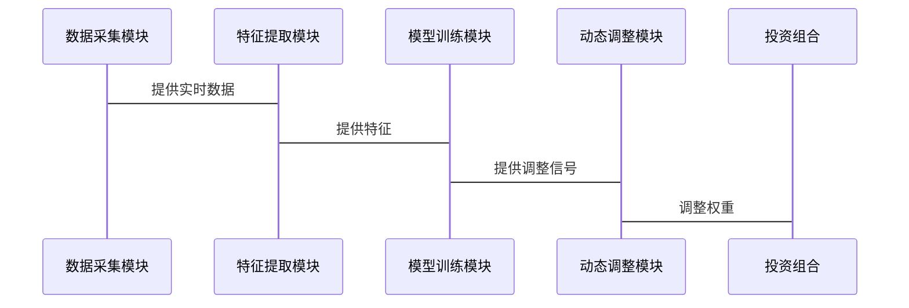

                 


---

# AI驱动的自适应投资风格轮动

> 关键词：AI驱动，投资风格轮动，自适应投资，算法驱动，动态资产配置，机器学习

> 摘要：本文详细探讨了AI驱动的自适应投资风格轮动这一前沿领域的核心概念、算法原理、系统架构以及实际应用。通过结合理论分析与实践案例，本文旨在揭示如何利用人工智能技术实现投资风格的动态调整，从而优化投资组合的表现，为投资者提供更科学的投资决策支持。

---

# 第一部分: AI驱动的自适应投资风格轮动概述

# 第1章: AI驱动的自适应投资风格轮动背景介绍

## 1.1 问题背景
### 1.1.1 投资风格轮动的定义与重要性
投资风格轮动是指根据市场环境的变化，动态调整投资策略和资产配置的过程。传统投资风格轮动依赖于人工经验判断和固定模型，存在响应速度慢、适应性差的问题。AI技术的引入为投资风格轮动带来了新的可能性。

### 1.1.2 传统投资风格轮动的局限性
1. 传统投资风格轮动依赖于固定的模型和经验判断，难以应对复杂多变的市场环境。
2. 人工判断的主观性和滞后性导致投资风格调整不够及时。
3. 传统模型难以捕捉高频数据和非线性关系。

### 1.1.3 AI技术在投资风格轮动中的应用潜力
AI技术可以通过大数据分析、机器学习和深度学习等方法，实现对市场环境的实时感知和动态调整，从而提高投资风格轮动的效率和准确性。

## 1.2 自适应投资风格轮动的定义与特点
### 1.2.1 自适应投资风格轮动的核心概念
自适应投资风格轮动是一种基于AI技术的投资策略，通过实时分析市场数据和投资者目标，动态调整投资组合，以适应不断变化的市场环境。

### 1.2.2 自适应与传统投资风格轮动的主要区别
| 特性 | 传统投资风格轮动 | 自适应投资风格轮动 |
|------|------------------|---------------------|
| 数据源 | 历史数据为主       | 实时数据为主         |
| 调整频率 | 低               | 高                 |
| 决策方式 | 固定模型         | AI动态调整           |
| 响应速度 | 慢               | 快                 |

### 1.2.3 自适应投资风格轮动的边界与外延
自适应投资风格轮动的边界在于如何在不引发过度交易的情况下，实现对市场变化的快速响应。其外延包括多种AI技术的应用，如强化学习、图神经网络等。

## 1.3 自适应投资风格轮动的核心要素组成
### 1.3.1 数据驱动的特征工程
通过数据预处理、特征提取和特征选择，构建能够反映市场状态的多维特征集。

### 1.3.2 AI算法的动态调整机制
利用机器学习模型和时间序列分析算法，实现对投资风格的动态调整。

### 1.3.3 投资组合优化的数学模型
基于动态调整后的投资风格，构建优化的投资组合，以实现收益与风险的平衡。

## 1.4 本章小结
本章从背景、定义、特点和核心要素四个方面，全面介绍了AI驱动的自适应投资风格轮动的基本概念和理论基础。

---

# 第二部分: 自适应投资风格轮动的核心概念与联系

# 第2章: 自适应投资风格轮动的核心原理

## 2.1 自适应投资风格轮动的原理
### 2.1.1 数据驱动的特征提取
通过大数据分析技术，从市场数据中提取能够反映市场状态的特征。

### 2.1.2 AI算法的动态调整机制
利用机器学习算法，根据市场特征的变化，动态调整投资风格。

### 2.1.3 投资组合优化的数学模型
基于动态调整后的投资风格，构建优化的投资组合。

## 2.2 自适应投资风格轮动的核心概念对比
### 2.2.1 不同投资风格的特征对比
| 投资风格 | 特征1 | 特征2 | 特征3 |
|----------|-------|-------|-------|
| 成长型   | 高成长 | 高估值 | 高风险 |
| 值型     | 低估值 | 高流动性 | 中风险 |

### 2.2.2 自适应与传统投资风格轮动的对比（Mermaid流程图）


## 2.3 自适应投资风格轮动的ER实体关系图


## 2.4 本章小结
本章通过对比分析，揭示了自适应投资风格轮动的核心概念及其与传统投资风格轮动的主要区别。

---

# 第三部分: 自适应投资风格轮动的算法原理

# 第3章: 自适应投资风格轮动的算法实现

## 3.1 算法原理概述
### 3.1.1 机器学习模型的选择与优化
选择适合的机器学习模型，如支持向量机（SVM）、随机森林（Random Forest）等，并进行参数优化。

### 3.1.2 时间序列分析的算法实现
利用ARIMA、LSTM等时间序列分析算法，预测市场趋势。

### 3.1.3 动态调整机制的数学模型
构建动态调整模型，基于当前市场特征，调整投资风格权重。

## 3.2 算法实现的详细步骤
### 3.2.1 数据预处理与特征工程
1. 数据清洗：去除缺失值和异常值。
2. 特征提取：从市场数据中提取收益、波动率、流动性等特征。
3. 特征选择：使用特征重要性分析，选择关键特征。

### 3.2.2 模型训练与调优
1. 选择适合的机器学习模型。
2. 进行交叉验证，调整模型参数。
3. 评估模型性能，优化模型表现。

### 3.2.3 动态调整策略的实现
1. 实时获取市场数据。
2. 计算当前市场特征。
3. 基于特征变化，调整投资风格权重。

## 3.3 算法实现的Mermaid流程图


## 3.4 算法实现的Python代码示例
```python
import numpy as np
import pandas as pd
from sklearn.ensemble import RandomForestRegressor
from sklearn.metrics import mean_squared_error

# 数据预处理
data = pd.read_csv('market_data.csv')
X = data.iloc[:, :-1].values
y = data.iloc[:, -1].values

# 特征选择
from sklearn.feature_selection import SelectFromModel
selector = SelectFromModel(RandomForestRegressor())
selector.fit(X, y)
selected_features = selector.transform(X)

# 模型训练
model = RandomForestRegressor()
model.fit(selected_features, y)

# 动态调整
current_features = get_current_market_features()
predicted_return = model.predict(current_features)
```

## 3.5 算法实现的数学模型与公式
### 3.5.1 动态调整模型的数学表达式
$$ w_t = \alpha \cdot w_{t-1} + (1-\alpha) \cdot f(x_t) $$

其中，$w_t$ 表示当前投资风格权重，$\alpha$ 是调整系数，$f(x_t)$ 是基于当前市场特征的调整函数。

### 3.5.2 投资组合优化的数学模型
$$ \min_{w} \sigma^2(w) $$
$$ \text{s.t.} \quad w^T \mu = \text{target return} $$

其中，$\sigma^2(w)$ 是投资组合的波动率，$\mu$ 是资产的预期收益率。

---

# 第四部分: 自适应投资风格轮动的系统架构与设计

# 第4章: 自适应投资风格轮动的系统分析与架构设计

## 4.1 问题场景介绍
### 4.1.1 项目背景
本项目旨在利用AI技术实现自适应投资风格轮动，优化投资组合的表现。

### 4.1.2 项目目标
构建一个实时监控市场数据，动态调整投资风格的系统。

## 4.2 系统功能设计
### 4.2.1 领域模型


### 4.2.2 系统架构设计


### 4.2.3 系统接口设计
1. 数据采集模块接口：
   - 输入：市场数据源
   - 输出：实时数据流
2. 动态调整模块接口：
   - 输入：当前市场特征
   - 输出：投资风格权重调整信号

### 4.2.4 系统交互流程图


---

# 第五部分: 自适应投资风格轮动的项目实战

# 第5章: 自适应投资风格轮动的项目实现

## 5.1 项目环境安装与配置
### 5.1.1 安装Python环境
```bash
conda create -n ai_invest python=3.8
conda activate ai_invest
pip install numpy pandas scikit-learn
```

### 5.1.2 数据源配置
```bash
# 下载市场数据
wget https://example.com/market_data.csv
```

## 5.2 系统核心实现
### 5.2.1 数据采集模块实现
```python
import requests

def get_market_data(api_key):
    url = f'https://api.example.com/market_data?api_key={api_key}'
    response = requests.get(url)
    return response.json()
```

### 5.2.2 特征提取模块实现
```python
def extract_features(data):
    features = data[['return', 'volatility', 'liquidity']]
    return features
```

### 5.2.3 模型训练模块实现
```python
from sklearn.ensemble import RandomForestRegressor
import joblib

def train_model(X, y):
    model = RandomForestRegressor()
    model.fit(X, y)
    joblib.dump(model, 'investment_style_model.pkl')
    return model
```

### 5.2.4 动态调整模块实现
```python
def adjust_investment_style(model, current_features):
    predicted_return = model.predict(current_features)
    # 调整投资风格权重
    return predicted_return
```

## 5.3 项目实现的代码应用解读与分析
1. 数据采集模块：实时获取市场数据。
2. 特征提取模块：从原始数据中提取关键特征。
3. 模型训练模块：训练机器学习模型，预测市场趋势。
4. 动态调整模块：根据模型预测结果，调整投资风格权重。

## 5.4 实际案例分析
### 5.4.1 案例背景
假设当前市场出现剧烈波动，需要动态调整投资风格。

### 5.4.2 案例实现
```python
# 获取当前市场特征
current_features = get_current_market_features()

# 调整投资风格权重
adjusted_weights = adjust_investment_style(model, current_features)

# 输出调整后的投资组合
print(adjusted_weights)
```

## 5.5 项目小结
本章通过实际项目实现，展示了如何利用AI技术实现自适应投资风格轮动。

---

# 第六部分: 自适应投资风格轮动的最佳实践

# 第6章: 自适应投资风格轮动的最佳实践

## 6.1 项目小结
本项目通过AI技术实现了自适应投资风格轮动，优化了投资组合的表现。

## 6.2 注意事项
1. 数据质量是关键，需确保数据的准确性和完整性。
2. 模型调优需结合实际市场情况，避免过拟合。
3. 系统运行需保证实时性和稳定性。

## 6.3 拓展阅读
1. 《机器学习在金融中的应用》
2. 《深度学习在时间序列分析中的应用》
3. 《自适应控制系统的设计与实现》

---

# 作者：AI天才研究院/AI Genius Institute & 禅与计算机程序设计艺术 /Zen And The Art of Computer Programming

