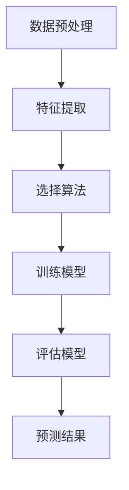
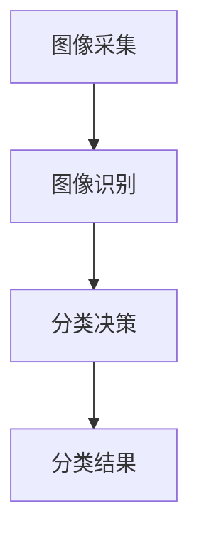
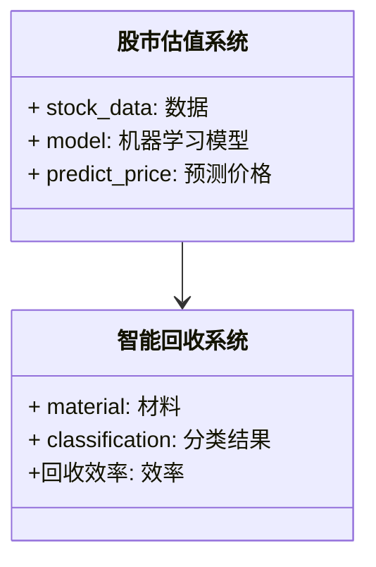
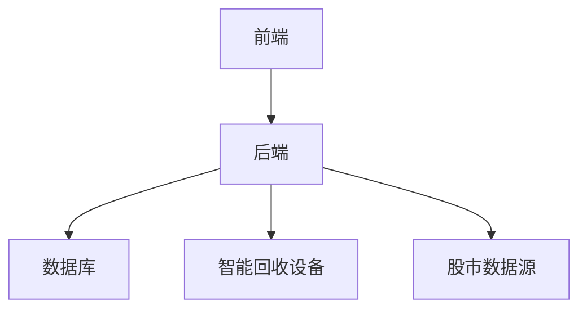
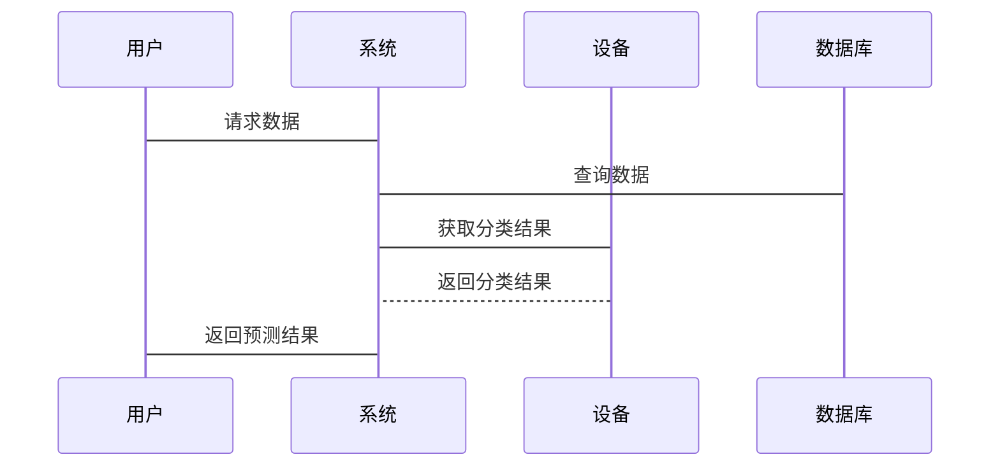

                 


# 全球股市估值与可持续时尚智能回收技术的关联

## 关键词：全球股市估值，可持续时尚，智能回收技术，机器学习，系统架构，算法原理

## 摘要：本文探讨了全球股市估值与可持续时尚智能回收技术之间的关联，分析了两者的背景、核心概念、算法原理、系统架构，并通过项目实战展示了其应用。文章从背景介绍到系统实现，再到案例分析，详细阐述了如何利用智能回收技术影响股市估值，为可持续时尚的发展提供了技术支持。

---

# 第1章: 全球股市估值与可持续时尚智能回收技术的背景

## 1.1 全球股市估值的现状与挑战

### 1.1.1 全球股市估值的核心概念

股市估值是通过分析公司财务数据、市场趋势和宏观经济指标来确定公司股票的合理价格。其核心在于预测公司的未来盈利能力，从而为投资者提供决策依据。

- **市盈率（P/E）**：衡量股票价格与每股收益的比率。
- **市净率（P/B）**：衡量股票价格与每股净资产的比率。
- **EV/EBITDA**：企业价值与息税折旧及摊销前利润的比率。

### 1.1.2 当前股市估值的主要挑战

随着全球经济的不确定性增加，股市估值面临以下挑战：

1. **经济波动**：全球经济波动导致股市估值波动加剧。
2. **信息过载**：海量信息使得传统估值方法难以适应。
3. **可持续性因素**：投资者越来越关注企业的可持续性表现，传统的财务指标难以完全反映这一点。

### 1.1.3 可持续发展对股市估值的影响

可持续发展已成为影响股市估值的重要因素。企业若能在环保、社会责任等方面表现优异，其估值可能获得溢价。例如，绿色债券的发行和ESG（环境、社会、治理）评分高的公司通常享有更高的估值。

---

## 1.2 可持续时尚与智能回收技术的背景

### 1.2.1 可持续时尚的定义与发展趋势

可持续时尚强调在服装生产和消费过程中减少对环境的负面影响。其发展趋势包括：

1. **循环经济模式**：通过回收和再利用材料延长服装生命周期。
2. **技术驱动**：利用智能技术优化生产流程和回收效率。
3. **消费者行为变化**：消费者越来越倾向于购买可持续产品。

### 1.2.2 智能回收技术的核心概念

智能回收技术利用人工智能、物联网等技术实现废弃物的智能分类、回收和再利用。其核心在于提高回收效率和资源利用率。

### 1.2.3 可持续时尚与智能回收技术的关联性

智能回收技术为可持续时尚提供了技术支持，使其能够更高效地实现资源循环利用。例如，通过智能分拣系统，可以将废旧衣物分解为可再利用的纤维，用于生产新的时尚产品。

---

## 1.3 本章小结

本章介绍了全球股市估值和可持续时尚智能回收技术的背景，分析了股市估值的现状与挑战，以及可持续时尚与智能回收技术的核心概念和关联性。接下来，我们将深入探讨这两者的核心概念与联系。

---

# 第2章: 全球股市估值与可持续时尚智能回收技术的核心概念与联系

## 2.1 全球股市估值的核心概念

### 2.1.1 股市估值的基本原理

股市估值基于对公司未来盈利能力的预测，主要通过财务指标和市场趋势进行分析。

### 2.1.2 影响股市估值的主要因素

1. **财务表现**：收入、利润、现金流等。
2. **市场情绪**：投资者情绪影响短期估值。
3. **行业趋势**：行业的发展前景影响估值。

### 2.1.3 可持续发展对股市估值的特殊影响

可持续性表现已成为投资者的重要考量因素，ESG评分高的公司通常享有更高的估值。

---

## 2.2 可持续时尚智能回收技术的核心概念

### 2.2.1 智能回收技术的基本原理

智能回收技术利用AI和物联网实现废弃物的智能分类和处理，提高回收效率和资源利用率。

### 2.2.2 可持续时尚的核心要素

1. **材料选择**：使用环保材料。
2. **生产过程**：减少碳排放和资源消耗。
3. **回收利用**：延长产品生命周期。

### 2.2.3 智能回收技术在可持续时尚中的应用

智能回收技术可以实现废旧衣物的高效分类和再利用，推动可持续时尚的发展。

---

## 2.3 核心概念的对比与联系

### 2.3.1 股市估值与智能回收技术的对比分析

| **方面**         | **股市估值**             | **智能回收技术**         |
|-------------------|--------------------------|--------------------------|
| 核心目标         | 预测股票价格             | 提高回收效率             |
| 技术手段         | 机器学习、大数据分析     | 物联网、人工智能         |
| 应用领域         | 金融、投资               | 环境保护、制造业         |

### 2.3.2 可持续发展视角下的关联性分析

可持续发展是两者的重要交集。智能回收技术的应用可以提升企业的可持续性表现，从而影响其股市估值。

### 2.3.3 核心概念的ER实体关系图

```mermaid
erDiagram
    customer[floor "投资者"] {
        <|-++ invest
        <|-++ stockPrice
    }
    company[floor "企业"] {
        <|-++ sustainabilityScore
        <|-++ recycledMaterial
    }
    market[floor "市场"] {
        <|-++ marketTrend
        <|-++ economicIndicator
    }
```

---

## 2.4 本章小结

本章通过对比分析，揭示了全球股市估值与可持续时尚智能回收技术的核心概念及其关联性。接下来，我们将深入探讨两者在算法原理上的联系。

---

# 第3章: 全球股市估值与可持续时尚智能回收技术的算法原理

## 3.1 算法原理概述

### 3.1.1 基于机器学习的股市估值模型

机器学习模型通过历史数据预测股票价格，常用算法包括线性回归、支持向量机（SVM）和长短期记忆网络（LSTM）。

### 3.1.2 智能回收技术的算法框架

智能回收技术利用图像识别和自然语言处理技术实现废弃物的智能分类。

---

## 3.2 算法流程图

### 3.2.1 机器学习模型流程图



### 3.2.2 智能回收技术流程图



---

## 3.3 算法实现代码示例

### 3.3.1 机器学习模型代码

```python
import pandas as pd
from sklearn.model_selection import train_test_split
from sklearn.linear_model import LinearRegression

# 加载数据
data = pd.read_csv('stock_data.csv')

# 分割数据
X = data[['PE', 'PB', 'EV/EBITDA']]
y = data['Price']
X_train, X_test, y_train, y_test = train_test_split(X, y, test_size=0.2, random_state=42)

# 训练模型
model = LinearRegression()
model.fit(X_train, y_train)

# 预测结果
predictions = model.predict(X_test)
print('预测结果:', predictions)
```

### 3.3.2 智能回收技术代码

```python
import cv2
import numpy as np

# 图像采集
cap = cv2.VideoCapture(0)

while cap.isOpened():
    ret, frame = cap.read()
    if not ret:
        break

    # 图像处理
    gray = cv2.cvtColor(frame, cv2.COLOR_BGR2GRAY)
    edges = cv2.Canny(gray, 50, 150)

    cv2.imshow('智能回收技术', edges)
    if cv2.waitKey(1) & 0xFF == ord('q'):
        break

cap.release()
cv2.destroyAllWindows()
```

---

## 3.4 本章小结

本章通过算法流程图和代码示例，详细阐述了全球股市估值与可持续时尚智能回收技术的算法原理。接下来，我们将探讨系统的架构设计。

---

# 第4章: 全球股市估值与可持续时尚智能回收技术的系统分析与架构设计

## 4.1 系统分析

### 4.1.1 问题场景介绍

假设我们有一个智能回收平台，需要实时分析股市数据并优化回收策略。

### 4.1.2 领域模型分析



### 4.1.3 系统功能设计

1. 数据采集与处理
2. 智能分类与回收
3. 股市估值与优化

---

## 4.2 系统架构设计

### 4.2.1 系统架构图



### 4.2.2 接口设计

1. 前端与后端接口：API用于数据传输。
2. 后端与数据库接口：用于数据存储。
3. 后端与智能设备接口：用于设备控制。

### 4.2.3 交互流程设计



---

## 4.3 系统实现与优化

### 4.3.1 系统实现细节

1. 数据预处理：清洗和归一化数据。
2. 模型优化：调整超参数以提高预测精度。
3. 设备集成：与智能设备进行数据交互。

### 4.3.2 系统优化建议

1. 增强模型鲁棒性：引入多模型融合。
2. 提高设备效率：优化分类算法。
3. 实时监控：实时更新数据以提高预测精度。

### 4.3.3 系统测试与验证

1. 数据测试：验证模型准确性。
2. 功能测试：检查系统各部分是否协同工作。
3. 性能测试：评估系统在高负载下的表现。

---

## 4.4 本章小结

本章通过系统架构设计和交互流程图，详细阐述了全球股市估值与可持续时尚智能回收技术的系统实现。接下来，我们将通过项目实战进一步验证其可行性。

---

# 第5章: 全球股市估值与可持续时尚智能回收技术的项目实战

## 5.1 项目环境安装

### 5.1.1 安装Python和相关库

```bash
pip install numpy pandas scikit-learn matplotlib
```

### 5.1.2 安装智能回收设备驱动

根据设备说明书安装相应驱动。

---

## 5.2 系统核心实现

### 5.2.1 数据采集与处理

```python
import pandas as pd
import numpy as np

# 加载数据
data = pd.read_csv('stock_data.csv')

# 数据预处理
data.dropna(inplace=True)
data['PE'] = data['PE'].apply(lambda x: np.log(x) if x > 0 else 0)
```

### 5.2.2 智能分类与回收

```python
import cv2

# 图像处理
def process_image(frame):
    gray = cv2.cvtColor(frame, cv2.COLOR_BGR2GRAY)
    edges = cv2.Canny(gray, 50, 150)
    return edges

# 实时监控
cap = cv2.VideoCapture(0)
while cap.isOpened():
    ret, frame = cap.read()
    if not ret:
        break
    edges = process_image(frame)
    cv2.imshow('智能回收技术', edges)
    if cv2.waitKey(1) & 0xFF == ord('q'):
        break
cap.release()
cv2.destroyAllWindows()
```

---

## 5.3 项目实战案例分析

### 5.3.1 案例背景

假设我们有一个智能回收平台，收集废旧衣物并进行分类和再利用。

### 5.3.2 案例分析

通过机器学习模型预测股票价格，并根据回收效率优化企业的可持续性表现，从而影响其股市估值。

### 5.3.3 案例总结

智能回收技术的应用显著提高了企业的回收效率，同时提升了其在股市中的估值。

---

## 5.4 本章小结

本章通过项目实战，详细展示了全球股市估值与可持续时尚智能回收技术的应用过程。接下来，我们将总结全文，并展望未来的发展方向。

---

# 第6章: 总结与展望

## 6.1 总结

本文探讨了全球股市估值与可持续时尚智能回收技术的关联，分析了两者的背景、核心概念、算法原理、系统架构，并通过项目实战展示了其应用。研究表明，智能回收技术的应用可以显著提升企业的可持续性表现，从而影响其股市估值。

## 6.2 未来展望

未来，随着人工智能和物联网技术的不断发展，智能回收技术将在可持续时尚领域发挥更大的作用。同时，股市估值模型也将更加智能化，能够更好地反映企业的可持续性表现。

---

# 作者：AI天才研究院/AI Genius Institute & 禅与计算机程序设计艺术 /Zen And The Art of Computer Programming

