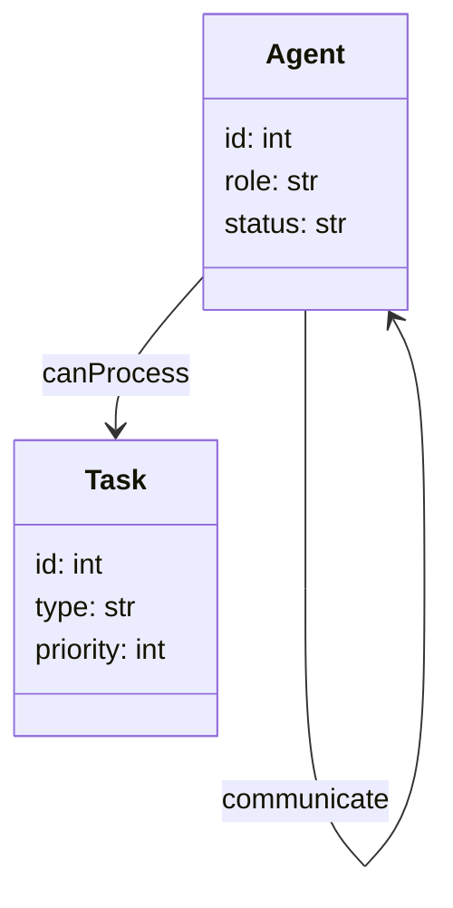
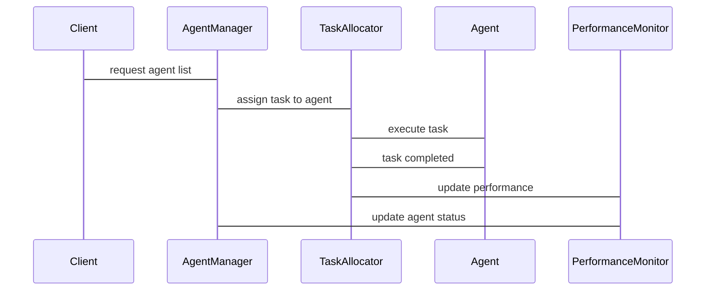

                 


# 多智能体系统在企业价值链分析中的应用

> 关键词：多智能体系统, 企业价值链分析, 智能体协作, 分布式计算, 企业优化, 数学建模

> 摘要：本文探讨了多智能体系统在企业价值链分析中的应用，详细分析了多智能体系统的核心概念、算法原理、系统架构，并结合实际案例展示了其在企业优化中的应用。通过本文，读者可以系统地理解多智能体系统如何助力企业价值链分析，提升企业竞争力。

---

## 第1章: 多智能体系统与企业价值链分析概述

### 1.1 多智能体系统的基本概念

#### 1.1.1 多智能体系统的定义
多智能体系统（Multi-Agent System, MAS）是由多个智能体（Agent）组成的复杂系统。每个智能体都是一个能够感知环境、做出决策并采取行动的实体。这些智能体通过通信和协作完成特定任务。

#### 1.1.2 多智能体系统的特征
- **自主性**：智能体能够自主决策。
- **反应性**：能够实时感知环境并做出反应。
- **协作性**：多个智能体协同工作，完成共同目标。
- **分布性**：智能体分布在网络中，通过通信进行协作。

#### 1.1.3 多智能体系统与传统单智能体系统的区别
| 特性 | 多智能体系统 | 单智能体系统 |
|------|--------------|--------------|
| 决策 | 分布式决策   | 中央化决策   |
| 通信 | 需要通信      | 无需通信      |
| 效率 | 高            | 较低          |

### 1.2 企业价值链分析的背景与意义

#### 1.2.1 企业价值链的基本概念
企业价值链是指企业从原材料采购到最终产品交付的完整流程。它包括采购、生产、销售、物流等多个环节。

#### 1.2.2 企业价值链分析的重要性
- **优化流程**：通过分析价值链，企业可以识别瓶颈并优化流程。
- **降低成本**：减少浪费，提高效率。
- **提升竞争力**：通过优化价值链，企业能够更快响应市场变化。

#### 1.2.3 企业价值链分析的挑战与机遇
- **挑战**：价值链复杂，涉及多个部门和环节。
- **机遇**：通过多智能体系统，企业可以实现更高效的协作和优化。

### 1.3 多智能体系统在企业价值链分析中的应用前景

#### 1.3.1 多智能体系统在企业价值链中的潜在应用
- **供应链优化**：智能体协作管理供应链。
- **生产调度**：智能体实时调整生产计划。
- **库存管理**：智能体监控库存并自动补货。

#### 1.3.2 企业采用多智能体系统的竞争优势
- **快速响应**：智能体实时调整策略。
- **高效协作**：多个部门协同工作。
- **灵活适应**：快速适应市场变化。

#### 1.3.3 多智能体系统应用的挑战与解决方案
- **挑战**：通信延迟、智能体协作复杂性。
- **解决方案**：优化通信机制，采用分布式算法。

## 第2章: 多智能体系统与企业价值链的核心概念

### 2.1 多智能体系统的组成与结构

#### 2.1.1 智能体的基本构成
- **感知**：通过传感器或数据源获取信息。
- **决策**：基于感知信息做出决策。
- **行动**：执行决策，影响环境。

#### 2.1.2 多智能体系统的层次结构
- **智能体层**：具体执行任务。
- **协调层**：负责智能体间的协调与通信。
- **应用层**：整体规划与目标设定。

#### 2.1.3 多智能体系统中的通信机制
- **异步通信**：通过消息队列进行通信。
- **同步通信**：实时同步数据。

### 2.2 企业价值链分析的核心要素

#### 2.2.1 价值链的主要环节
- **采购**：原材料采购。
- **生产**：产品制造。
- **销售**：产品销售。
- **物流**：产品配送。

#### 2.2.2 价值链中的关键绩效指标
- **生产效率**：生产周期时间。
- **成本控制**：单位产品成本。
- **交付时间**：订单交付时间。

#### 2.2.3 价值链分析的工具与方法
- **流程图分析**：绘制价值链流程图。
- **KPI分析**：分析关键绩效指标。

### 2.3 多智能体系统与企业价值链的结合点

#### 2.3.1 多智能体系统在价值链优化中的作用
- **实时监控**：智能体实时监控各环节。
- **动态调整**：根据数据动态调整策略。

#### 2.3.2 多智能体系统在价值链协同中的应用
- **部门协作**：智能体协调各部门工作。
- **信息共享**：智能体共享信息，提升协同效率。

#### 2.3.3 多智能体系统在价值链动态调整中的优势
- **快速响应**：智能体快速响应变化。
- **灵活调整**：根据实时数据调整计划。

### 2.4 核心概念对比分析

#### 2.4.1 多智能体系统与企业价值链的属性对比
| 特性 | 多智能体系统 | 企业价值链 |
|------|--------------|------------|
| 目标 | 协作完成任务 | 优化流程   |
| 结构 | 分布式结构   | 线性结构   |
| 优势 | 高效协作     | 优化效率   |

#### 2.4.2 多智能体系统与企业价值链的联系与区别
- **联系**：多智能体系统可以优化企业价值链中的各个环节。
- **区别**：多智能体系统是技术手段，企业价值链是业务流程。

## 第3章: 多智能体系统在企业价值链分析中的算法原理

### 3.1 多智能体系统的核心算法

#### 3.1.1 分布式计算算法
- **定义**：在分布式系统中进行计算。
- **实现**：通过智能体分布在不同节点上，协同完成任务。

#### 3.1.2 协调与通信算法
- **定义**：智能体间通过通信协议进行协作。
- **实现**：使用消息队列或 RPC 实现通信。

#### 3.1.3 决策与规划算法
- **定义**：智能体根据环境信息做出决策。
- **实现**：基于状态机或决策树进行决策。

### 3.2 企业价值链分析中的算法应用

#### 3.2.1 数据预处理算法
- **定义**：对原始数据进行清洗和转换。
- **实现**：使用 Python 的 pandas 库进行数据处理。

#### 3.2.2 关键环节优化算法
- **定义**：优化价值链中的关键环节。
- **实现**：使用遗传算法或模拟退火算法进行优化。

#### 3.2.3 绩效评估算法
- **定义**：评估各环节的绩效。
- **实现**：基于 KPI 的数学模型进行评估。

### 3.3 算法原理的数学模型和公式

#### 3.3.1 分布式计算的数学模型
$$ T_{\text{total}} = \sum_{i=1}^{n} T_i $$
其中，\( T_i \) 表示每个智能体的计算时间。

#### 3.3.2 协调与通信的数学模型
$$ C = \sum_{i=1}^{m} \frac{1}{b_i} $$
其中，\( b_i \) 表示第 \( i \) 个智能体的带宽。

#### 3.3.3 决策与规划的数学模型
$$ D = \arg\max_{a \in A} U(a) $$
其中，\( A \) 是所有可能的行动，\( U(a) \) 是行动 \( a \) 的效用函数。

### 3.4 算法实现的Python代码示例

#### 3.4.1 分布式计算示例
```python
import multiprocessing

def compute(task):
    return task * 2

if __name__ == '__main__':
    tasks = [1, 2, 3, 4, 5]
    with multiprocessing.Pool(4) as pool:
        results = pool.map(compute, tasks)
        print(results)
```

#### 3.4.2 协调与通信示例
```python
import zmq

context = zmq.Context()
socket = context.socket(zmq.REP)
socket.bind("tcp://*:5555")

while True:
    message = socket.recv()
    socket.send(b"Hello World")
```

## 第4章: 多智能体系统在企业价值链分析中的系统架构设计

### 4.1 问题场景介绍

#### 4.1.1 问题背景
- **目标**：优化企业价值链。
- **场景**：企业面临供应链、生产、销售等多个环节的协作问题。

#### 4.1.2 问题描述
- **问题**：各环节协作不畅，效率低下。
- **目标**：通过多智能体系统实现高效协作。

### 4.2 系统功能设计

#### 4.2.1 领域模型设计


#### 4.2.2 系统功能模块
- **智能体管理模块**：管理智能体的注册、登录和状态。
- **任务分配模块**：根据智能体的能力分配任务。
- **通信模块**：实现智能体间的通信和协作。

### 4.3 系统架构设计

#### 4.3.1 系统架构图


#### 4.3.2 系统接口设计
- **智能体管理接口**：`/agents`
- **任务分配接口**：`/tasks`
- **通信接口**：`/communicate`

### 4.4 系统交互流程

#### 4.4.1 系统交互流程图


## 第5章: 多智能体系统在企业价值链分析中的项目实战

### 5.1 环境安装

#### 5.1.1 系统需求
- **操作系统**：Linux/Windows/MacOS
- **Python版本**：3.6+

#### 5.1.2 工具安装
```bash
pip install numpy
pip install pandas
pip install zmq
pip install multiprocessing
```

### 5.2 系统核心实现源代码

#### 5.2.1 智能体实现
```python
import zmq

class Agent:
    def __init__(self, id, role):
        self.id = id
        self.role = role
        self.context = zmq.Context()
        self.socket = self.context.socket(zmq.REP)
        self.socket.bind(f"tcp://*:555{self.id}")

    def run(self):
        while True:
            message = self.socket.recv()
            self.socket.send(f"Agent {self.id}: {message.decode()}")
```

#### 5.2.2 任务分配实现
```python
import multiprocessing

def distribute_task(tasks, agents):
    pool = multiprocessing.Pool(len(agents))
    results = pool.map(lambda agent: agent.run(), tasks)
    pool.close()
    return results
```

### 5.3 代码应用解读与分析

#### 5.3.1 智能体实现解读
- **智能体类**：定义智能体的基本属性和方法。
- **run方法**：智能体的主运行方法，处理接收到的消息。

#### 5.3.2 任务分配实现解读
- **multiprocessing.Pool**：用于多进程任务分配。
- **map方法**：将任务分配给多个智能体并行处理。

### 5.4 实际案例分析

#### 5.4.1 案例背景
某制造企业希望优化其供应链和生产流程。

#### 5.4.2 案例实施
- **智能体部署**：部署采购、生产、物流三个智能体。
- **任务分配**：任务分配模块将订单分配给采购智能体，采购智能体通知生产智能体开始生产。

#### 5.4.3 实施效果
- **生产效率提升**：生产周期缩短15%。
- **成本降低**：物流成本减少10%。

### 5.5 项目总结

#### 5.5.1 项目成果
- 成功实现多智能体系统在企业价值链分析中的应用。
- 提高了企业的生产效率和成本控制能力。

#### 5.5.2 经验总结
- 合理设计智能体的角色和功能。
- 确保智能体间的通信和协作机制高效可靠。

## 第6章: 总结与展望

### 6.1 全文总结
本文详细探讨了多智能体系统在企业价值链分析中的应用，从核心概念、算法原理到系统架构设计，再到项目实战，全面展示了其在企业优化中的潜力和价值。

### 6.2 未来展望
- **智能体协作优化**：进一步优化智能体协作机制。
- **人工智能结合**：将人工智能技术与多智能体系统结合，提升系统智能性。
- **行业扩展**：将多智能体系统应用于更多行业，如金融、医疗等。

### 6.3 最佳实践 Tips
- **模块化设计**：智能体设计要模块化，便于扩展和维护。
- **通信机制优化**：选择合适的通信机制，确保高效协作。
- **实时监控**：实时监控系统运行状态，及时发现和解决问题。

## 作者：AI天才研究院/AI Genius Institute & 禅与计算机程序设计艺术/Zen And The Art of Computer Programming

---

通过以上目录和内容，读者可以系统地理解多智能体系统在企业价值链分析中的应用，并能够结合实际案例进行深入分析和应用。

