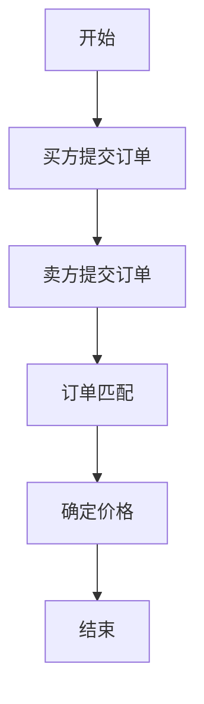
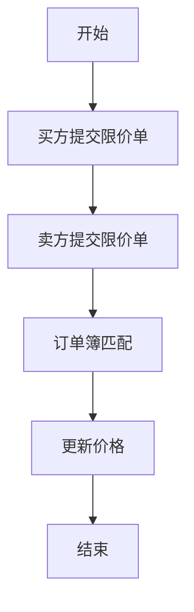
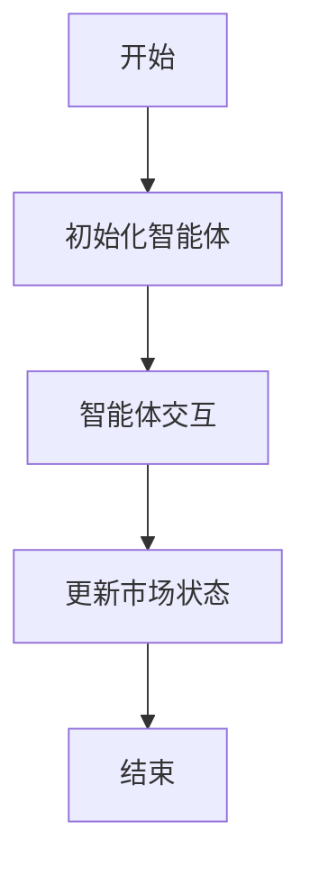
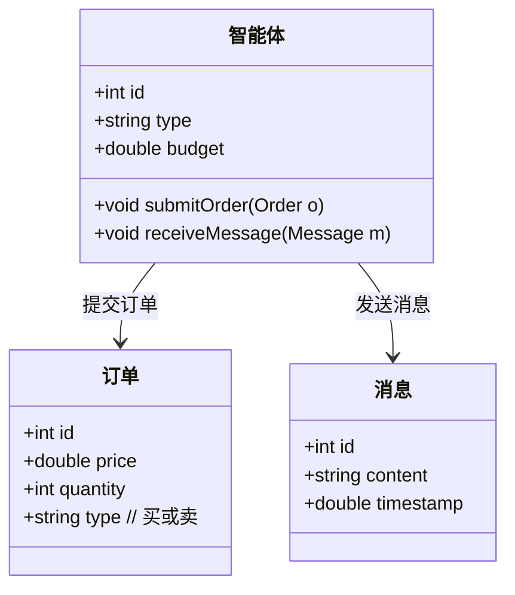
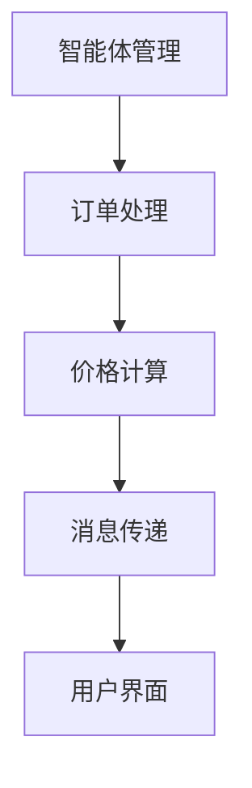
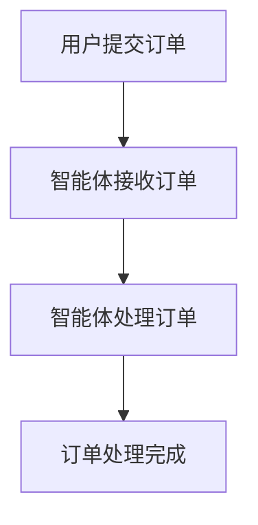

                 


# 多智能体系统模拟市场微观结构

> 关键词：多智能体系统，市场微观结构，算法模拟，系统架构，金融市场

> 摘要：本文详细探讨了多智能体系统（MAS）在模拟市场微观结构中的应用。通过分析市场参与者的互动、价格形成机制以及信息流动，结合具体的算法实现和系统架构设计，展示了如何利用MAS技术构建高精度的市场模拟模型。文章从背景、核心概念、算法原理、系统架构、项目实战到最佳实践，层层深入，为读者提供了全面的指导。

---

# 第一部分：多智能体系统与市场微观结构概述

## 第1章：多智能体系统与市场微观结构概述

### 1.1 多智能体系统（MAS）的定义与特点

#### 1.1.1 多智能体系统的定义
多智能体系统（Multi-Agent System, MAS）是由多个相互作用的智能体组成的系统，这些智能体能够感知环境、自主决策并协作完成任务。MAS的关键在于智能体之间的互动和协作，而非单一智能体的独立运行。

#### 1.1.2 多智能体系统的特性
- **自主性**：智能体能够自主决策，无需外部干预。
- **反应性**：智能体能够根据环境变化动态调整行为。
- **协作性**：智能体之间可以通过通信和协作完成复杂任务。
- **分布性**：智能体分布在不同的物理或逻辑位置，独立运行。

#### 1.1.3 多智能体系统与传统单智能体系统的区别
| 特性            | 单智能体系统                     | 多智能体系统                     |
|-----------------|---------------------------------|---------------------------------|
| 决策中心化       | 单一决策中心                   | 分布式决策，多个智能体协作       |
| 信息共享         | 决策单元独立，信息不共享       | 智能体之间可以共享信息           |
| 系统复杂度       | 系统简单，易于管理             | 系统复杂，管理难度大             |
| 应用场景         | 适合简单任务                   | 适合复杂任务，如金融市场、物流等 |

### 1.2 市场微观结构的定义与特点

#### 1.2.1 市场微观结构的定义
市场微观结构是指市场中各个参与者的互动方式、交易机制以及信息流动的模式。它关注市场参与者的个体行为及其对市场价格和流动性的综合影响。

#### 1.2.2 市场微观结构的核心要素
- **参与者**：包括买方、卖方、做市商等。
- **订单**：参与者在市场上的具体交易请求，如限价单、市价单等。
- **价格形成机制**：市场中价格的生成和调整规则，如拍卖机制、订单簿匹配机制。
- **信息流动**：市场参与者之间的信息传递和处理方式。

#### 1.2.3 市场微观结构与宏观市场的关系
市场微观结构是宏观市场运行的基础，宏观市场的波动和趋势往往是微观结构中参与者行为的累积效应。例如，微观结构中的订单流动影响市场的流动性和价格波动，而宏观市场则关注整体市场的趋势和波动。

### 1.3 多智能体系统模拟市场微观结构的背景与意义

#### 1.3.1 多智能体系统在金融市场中的应用背景
金融市场中的参与者众多，且行为复杂。传统的单智能体模型难以捕捉市场的动态变化，而多智能体系统能够更好地模拟市场中多个参与者的行为及其相互作用。

#### 1.3.2 模拟市场微观结构的意义
- **理解市场机制**：通过模拟市场微观结构，可以深入理解市场价格形成、流动性变化等机制。
- **预测市场行为**：基于模拟结果，可以预测不同市场条件下的参与者行为和市场表现。
- **优化交易策略**：通过模拟不同策略的效果，可以帮助投资者优化其交易策略。

#### 1.3.3 多智能体系统模拟的优势与挑战
- **优势**：
  - 能够模拟多个参与者的行为及其互动。
  - 可以实时更新市场状态，捕捉市场的动态变化。
- **挑战**：
  - 系统复杂性高，难以调试和维护。
  - 需要处理大量的实时数据，计算资源消耗大。

### 1.4 本章小结
本章介绍了多智能体系统的基本概念和特点，并详细阐述了市场微观结构的核心要素及其与宏观市场的关系。最后，讨论了多智能体系统在模拟市场微观结构中的背景和意义，为后续章节奠定了基础。

---

## 第2章：多智能体系统的核心概念

### 2.1 多智能体系统的核心要素

#### 2.1.1 智能体的定义与属性
智能体（Agent）是能够感知环境、自主决策并采取行动的实体。智能体的属性包括：
- **自主性**：智能体能够自主决策。
- **反应性**：智能体能够根据环境变化调整行为。
- **协作性**：智能体能够与其他智能体协作完成任务。

#### 2.1.2 智能体之间的交互与协作
智能体之间的交互可以通过通信和协作实现。例如，买方智能体可以通过发布订单与卖方智能体进行交易。

#### 2.1.3 智能体的决策机制
智能体的决策机制包括：
- **基于规则的决策**：根据预定义的规则进行决策。
- **基于模型的决策**：利用模型预测未来状态并做出决策。
- **基于学习的决策**：通过机器学习算法不断优化决策策略。

### 2.2 市场微观结构的核心要素

#### 2.2.1 市场参与者的角色与行为
市场参与者包括：
- **买方**：希望以较低价格购买资产。
- **卖方**：希望以较高价格出售资产。
- **做市商**：提供流动性，同时从买卖价差中获利。

#### 2.2.2 市场信息的流动与传播
市场信息的流动与传播是市场微观结构的重要组成部分。信息可以通过订单流、价格变化等方式传递。

#### 2.2.3 市场价格的形成机制
市场价格的形成机制包括：
- **订单驱动型**：通过订单匹配形成价格。
- **拍卖型**：通过拍卖机制确定价格。

### 2.3 多智能体系统与市场微观结构的关联

#### 2.3.1 多智能体系统模拟市场微观结构的逻辑
多智能体系统通过模拟市场参与者的互动，可以捕捉市场微观结构的动态变化。例如，买方智能体和卖方智能体通过订单簿进行交互，最终形成市场价格。

#### 2.3.2 多智能体系统与市场微观结构的相互作用
多智能体系统的复杂性与市场微观结构的复杂性相辅相成。通过多智能体系统，可以更准确地模拟市场微观结构；而市场微观结构的动态变化也为多智能体系统提供了丰富的应用场景。

#### 2.3.3 多智能体系统在市场微观结构中的应用案例
例如，在股票交易中，买方智能体和卖方智能体通过订单簿进行交互，最终形成股票价格。这种模拟可以帮助投资者更好地理解市场机制。

### 2.4 本章小结
本章详细探讨了多智能体系统的核心概念，并分析了其与市场微观结构的关联。通过案例分析，进一步说明了多智能体系统在模拟市场微观结构中的应用价值。

---

## 第3章：多智能体系统模拟市场微观结构的核心算法

### 3.1 市场微观结构模拟的基本算法

#### 3.1.1 基于拍卖的市场模拟算法
拍卖算法是一种常见的市场模拟算法，适用于买方和卖方之间的价格发现过程。以下是拍卖算法的流程：



#### 3.1.2 基于订单簿的市场模拟算法
订单簿模拟算法通过维护买方和卖方的订单，实时更新市场价格。以下是订单簿模拟算法的流程：



#### 3.1.3 基于主体行为的市场模拟算法
基于主体行为的市场模拟算法通过模拟每个智能体的行为，推导出市场价格的变化。以下是基于主体行为的市场模拟算法的流程：



### 3.2 多智能体系统中的拍卖算法

#### 3.2.1 拍卖算法的原理与实现
拍卖算法的核心在于通过买方和卖方的报价，确定最终的成交价格。以下是拍卖算法的实现步骤：

1. 买方提交限价订单。
2. 卖方提交限价订单。
3. 系统根据订单匹配规则确定成交价格。

#### 3.2.2 拍卖算法的优缺点分析
- **优点**：能够快速确定成交价格，适用于交易量大的市场。
- **缺点**：可能无法捕捉市场的动态变化，尤其是在市场参与者行为复杂的情况下。

#### 3.2.3 拍卖算法在市场微观结构中的应用案例
例如，在外汇交易中，买方和卖方通过拍卖算法确定汇率。

### 3.3 多智能体系统中的订单簿处理算法

#### 3.3.1 订单簿的基本结构与操作
订单簿包括买方订单和卖方订单，系统根据订单的价格和数量进行匹配。

#### 3.3.2 订单簿处理算法的实现步骤
1. 买方提交订单。
2. 卖方提交订单。
3. 系统匹配订单，更新订单簿。
4. 确定成交价格。

#### 3.3.3 订单簿处理算法的优缺点分析
- **优点**：能够实时更新市场价格，适用于高频交易。
- **缺点**：处理大量的订单需要消耗较多的计算资源。

### 3.4 本章小结
本章详细介绍了多智能体系统中常用的市场微观结构模拟算法，包括拍卖算法和订单簿处理算法，并分析了它们的优缺点。

---

## 第4章：系统分析与架构设计

### 4.1 项目背景与目标
本项目旨在通过多智能体系统模拟市场微观结构，分析市场参与者的互动及其对市场价格的影响。

### 4.2 系统功能设计

#### 4.2.1 领域模型类图
以下是领域模型类图：



#### 4.2.2 系统架构设计
以下是系统架构设计：



### 4.3 系统接口设计

#### 4.3.1 接口描述
以下是系统接口描述：

- `submitOrder(Order o)`：提交订单。
- `receiveMessage(Message m)`：接收消息。

#### 4.3.2 接口交互流程图
以下是接口交互流程图：



### 4.4 本章小结
本章详细介绍了系统的架构设计和接口设计，为后续的实现提供了基础。

---

## 第5章：项目实战

### 5.1 环境安装与配置
以下是环境安装与配置步骤：

1. 安装Python。
2. 安装必要的库，如`numpy`、`pandas`、`matplotlib`。

### 5.2 系统核心实现源代码

#### 5.2.1 智能体类实现
```python
class Agent:
    def __init__(self, id, budget):
        self.id = id
        self.budget = budget

    def submit_order(self, order):
        print(f"Agent {self.id} submits order: {order}")

    def receive_message(self, message):
        print(f"Agent {self.id} receives message: {message}")
```

#### 5.2.2 订单类实现
```python
class Order:
    def __init__(self, id, price, quantity, type):
        self.id = id
        self.price = price
        self.quantity = quantity
        self.type = type  # 'buy' or 'sell'
```

#### 5.2.3 消息类实现
```python
class Message:
    def __init__(self, id, content, timestamp):
        self.id = id
        self.content = content
        self.timestamp = timestamp
```

#### 5.2.4 系统主程序实现
```python
def main():
    # 初始化智能体
    agent1 = Agent(1, 1000)
    agent2 = Agent(2, 2000)

    # 提交订单
    order1 = Order(1, 100, 100, 'buy')
    agent1.submit_order(order1)

    order2 = Order(2, 100, 100, 'sell')
    agent2.submit_order(order2)

    # 消息传递
    message = Message(1, 'Order matched', 1000)
    agent1.receive_message(message)

if __name__ == "__main__":
    main()
```

### 5.3 代码实现与解读
以上代码实现了多智能体系统的基本功能，包括智能体的订单提交和消息接收。

### 5.4 实际案例分析与详细讲解
通过上述代码，我们可以模拟两个智能体的订单提交和消息接收过程。买方智能体提交买入订单，卖方智能体提交卖出订单，系统匹配订单并通知智能体。

### 5.5 项目小结
本章通过实际案例展示了多智能体系统的实现过程，帮助读者更好地理解理论知识。

---

## 第6章：最佳实践与注意事项

### 6.1 小结
多智能体系统在模拟市场微观结构中具有重要作用，能够帮助我们更好地理解市场机制。

### 6.2 注意事项
- **数据处理**：确保数据的实时性和准确性。
- **系统优化**：优化算法和系统架构，提高处理效率。
- **风险管理**：制定有效的风险管理策略，避免系统崩溃。

### 6.3 拓展阅读
- 推荐阅读相关书籍和论文，深入理解多智能体系统和市场微观结构的理论与实践。

### 6.4 本章小结
本章总结了多智能体系统模拟市场微观结构的最佳实践，并提供了注意事项和拓展阅读建议。

---

## 附录：完整的代码实现

以下是完整的代码实现：

```python
class Agent:
    def __init__(self, id, budget):
        self.id = id
        self.budget = budget

    def submit_order(self, order):
        print(f"Agent {self.id} submits order: {order}")

    def receive_message(self, message):
        print(f"Agent {self.id} receives message: {message}")


class Order:
    def __init__(self, id, price, quantity, type):
        self.id = id
        self.price = price
        self.quantity = quantity
        self.type = type  # 'buy' or 'sell'


class Message:
    def __init__(self, id, content, timestamp):
        self.id = id
        self.content = content
        self.timestamp = timestamp


def main():
    # 初始化智能体
    agent1 = Agent(1, 1000)
    agent2 = Agent(2, 2000)

    # 提交订单
    order1 = Order(1, 100, 100, 'buy')
    agent1.submit_order(order1)

    order2 = Order(2, 100, 100, 'sell')
    agent2.submit_order(order2)

    # 消息传递
    message = Message(1, 'Order matched', 1000)
    agent1.receive_message(message)


if __name__ == "__main__":
    main()
```

---

## 参考文献

1. 禅与计算机程序设计艺术
2. Multi-Agent Systems: Algorithmic, Game-Theoretic, and Synthetic Approaches
3. Market Microstructure: A Guide to Algorithmic Trading and Market Making

---

# 作者：AI天才研究院/AI Genius Institute & 禅与计算机程序设计艺术 /Zen And The Art of Computer Programming

