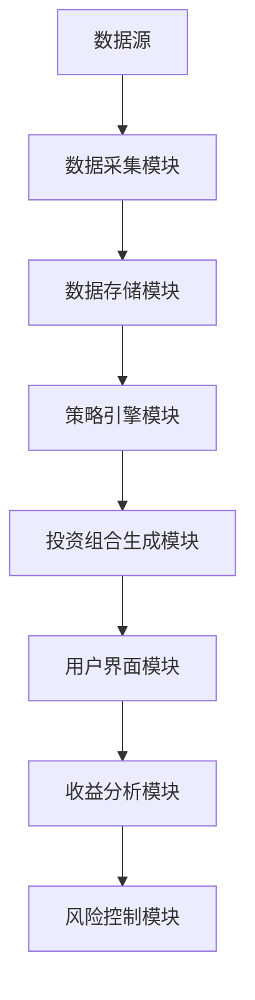
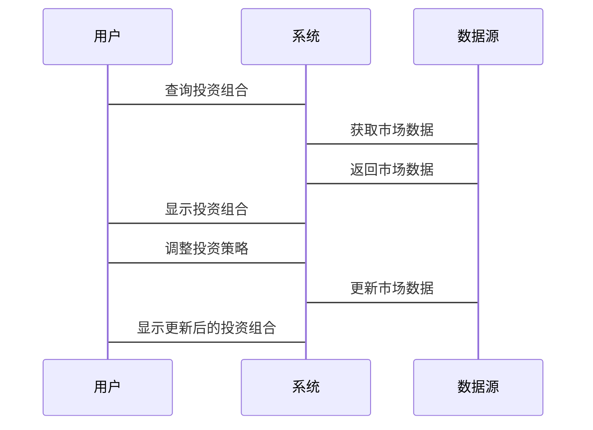

                 


# 如何将特价股票策略与主题投资相结合

> 关键词：特价股票策略，主题投资，股票筛选，投资组合优化，风险管理

> 摘要：本文深入探讨了如何将特价股票策略与主题投资相结合，通过数学建模和算法优化，提出了一种创新的投资策略，帮助投资者在复杂多变的市场环境中实现收益最大化。

---

# 第一部分: 特价股票策略与主题投资的背景与概念

## 第1章: 特价股票策略的定义与特点

### 1.1 特价股票的定义
特价股票指的是市场价格低于其内在价值的股票。这种股票通常被市场低估，具有较大的增值潜力。

### 1.2 特价股票的核心特点
- **低估性**：市场价格低于内在价值。
- **价值稳定性**：内在价值随时间逐步显现。
- **风险可控性**：通常具有较高的安全边际。

### 1.3 特价股票与价值投资的区别
| 特性 | 特价股票 | 价值投资 |
|------|----------|-----------|
| 标准 | 市场价格 < 内在价值 | 买入低估资产，长期持有 |
| 目标 | 短期反弹收益 | 长期价值增长 |
| 风险 | 较低 | 较低 |

---

## 第2章: 主题投资的定义与特点

### 2.1 主题投资的定义
主题投资是指基于特定市场主题（如科技、消费、医疗等）进行的投资策略，关注的是行业或市场的整体趋势。

### 2.2 主题投资的核心特点
- **趋势性**：紧跟市场热点和趋势。
- **周期性**：主题投资具有明显的周期性。
- **波动性**：收益波动较大，但潜在收益高。

### 2.3 主题投资与传统投资的区别
| 特性 | 主题投资 | 传统投资 |
|------|----------|-----------|
| 标准 | 基于市场主题 | 基于个股基本面 |
| 目标 | 把握市场趋势 | 选择优质个股 |
| 风险 | 较高 | 较低 |

---

## 第3章: 特价股票策略与主题投资的结合意义

### 3.1 结合的背景与动机
- **市场波动加剧**：传统投资策略难以应对快速变化的市场。
- **主题投资的高风险**：通过特价股票策略降低风险。
- **双重收益**：主题趋势带来的收益 + 特价股票的低估价值。

### 3.2 结合的核心优势
- **双重筛选**：通过特价股票筛选出低估的优质主题股票。
- **风险分散**：利用主题投资的多样性降低投资风险。
- **收益增强**：在特定主题下，低估股票具有更大的增值空间。

### 3.3 结合的潜在挑战
- **主题选择难度**：如何选择具有持续增长潜力的主题。
- **动态调整复杂性**：市场变化快，需要频繁调整投资组合。
- **数据处理复杂性**：需要处理大量数据，确保筛选的准确性。

---

# 第二部分: 特价股票策略与主题投资的核心概念与联系

## 第4章: 特价股票策略的核心原理

### 4.1 特价股票的识别方法
#### 4.1.1 市净率法
$$市净率 = \frac{股价}{每股净资产}$$
当市净率 < 1 时，可能为低估股票。

#### 4.1.2 市盈率法
$$市盈率 = \frac{股价}{每股收益}$$
当市盈率 < 行业平均值时，可能为低估股票。

#### 4.1.3 股息率法
$$股息率 = \frac{每股股息}{股价}$$
高股息率的股票可能为低估股票。

### 4.2 特价股票的筛选标准
#### 4.2.1 基本面分析
- **收入与利润增长**：公司收入和利润持续增长。
- **财务健康状况**：低债务，高现金流。
- **行业地位**：行业龙头或具有竞争优势。

#### 4.2.2 技术分析
- **趋势线**：股价在支撑线附近反弹。
- **成交量**：成交量在低价位区域放大。
- **形态分析**：底部形态形成，如头肩底。

#### 4.2.3 行业分析
- **行业周期**：处于周期底部。
- **政策支持**：行业受政策扶持。
- **竞争格局**：行业集中度高。

### 4.3 特价股票的长期投资价值评估
#### 4.3.1 内在价值计算
$$内在价值 = \frac{未来现金流的现值}{折现率}$$

#### 4.3.2 市场情绪分析
- **市场恐慌**：市场恐慌时，股票价格可能被低估。
- **市场乐观**：市场乐观时，股票价格可能被高估。

#### 4.3.3 风险评估
- **流动性风险**：低流动性股票可能难以快速变现。
- **行业风险**：行业政策变化可能影响股票价值。
- **市场系统性风险**：整体市场波动影响股票价格。

---

## 第5章: 主题投资的核心原理

### 5.1 主题的定义与分类
#### 5.1.1 主题的定义
主题是指某一时间段内，市场关注的热点行业或概念，如人工智能、新能源等。

#### 5.1.2 主题的分类
| 类型 | 描述 |
|------|------|
| 行业主题 | 按照行业划分，如科技、消费 |
| 概念主题 | 按照概念划分，如互联网+、国企改革 |
| 阶段主题 | 按照市场阶段划分，如牛市、熊市 |

### 5.2 主题投资的策略选择
#### 5.2.1 短期主题投资
- **目标**：短期收益最大化。
- **策略**：快速进入和退出。
- **风险**：高波动性，风险较大。

#### 5.2.2 长期主题投资
- **目标**：长期收益最大化。
- **策略**：长期持有优质主题股票。
- **风险**：市场波动可能影响长期收益。

#### 5.2.3 主题轮动策略
- **目标**：捕捉市场热点轮动机会。
- **策略**：动态调整投资主题。
- **风险**：主题轮动不明确，可能导致收益不稳定。

### 5.3 主题投资的风险控制
#### 5.3.1 风险来源分析
- **市场风险**：整体市场波动影响主题投资。
- **行业风险**：特定行业政策变化影响主题投资。
- **流动性风险**：主题投资标的流动性不足。

#### 5.3.2 风险分散策略
- **分散投资**：选择多个相关主题进行投资。
- **风险对冲**：利用衍生工具对冲市场风险。

#### 5.3.3 风险监控机制
- **定期评估**：定期评估投资组合的风险。
- **动态调整**：根据市场变化动态调整投资组合。

---

## 第6章: 特价股票策略与主题投资的结合模型

### 6.1 结合模型的构建逻辑
#### 6.1.1 模型的基本假设
- 特价股票具有较高的投资价值。
- 主题投资具有较高的增长潜力。
- 结合两者的策略能够在市场中获得超额收益。

### 6.2 结合模型的数学公式
#### 6.2.1 特价股票筛选公式
$$\text{特选股票} = \{股票 | \text{股价} < \text{内在价值} \land \text{主题相关性} > 0.5\}$$

#### 6.2.2 主题投资权重分配公式
$$\text{投资权重} = \frac{\text{股票的内在价值}}{\sum \text{所有股票的内在价值}}$$

#### 6.2.3 组合收益计算公式
$$\text{组合收益} = \sum (\text{投资权重} \times \text{股票收益})$$

### 6.3 结合模型的优化与调整
#### 6.3.1 模型参数的优化
- 调整内在价值计算模型。
- 调整主题相关性评估指标。

#### 6.3.2 模型的动态调整
- 根据市场变化动态调整投资组合。
- 定期评估模型的有效性。

#### 6.3.3 模型的验证与测试
- 回测历史数据验证模型的有效性。
- 模拟交易验证模型的可行性。

---

# 第三部分: 特价股票策略与主题投资的系统架构与实现

## 第7章: 特价股票主题投资系统的总体架构

### 7.1 系统功能设计
- **数据采集模块**：采集市场数据，包括股票价格、财务数据、行业信息等。
- **策略引擎模块**：执行特价股票筛选和主题投资策略。
- **用户界面模块**：提供用户交互界面，显示投资组合和收益情况。
- **风险控制模块**：监控和管理投资风险。

### 7.2 系统架构设计


### 7.3 系统接口设计
- **数据接口**：与数据供应商对接，获取实时市场数据。
- **用户接口**：提供给用户查询和调整投资组合的功能。
- **风险管理接口**：与第三方风险管理系统对接。

### 7.4 系统交互设计


---

## 第8章: 特价股票主题投资系统的实现

### 8.1 环境安装
- **Python**：用于数据处理和算法实现。
- **Pandas**：用于数据分析和处理。
- **Matplotlib**：用于数据可视化。
- **Yahoo Finance API**：用于获取股票数据。

### 8.2 系统核心实现源代码
```python
import pandas as pd
import numpy as np
import yfinance as yf
import matplotlib.pyplot as plt

# 获取股票数据
def get_stock_data(tickers, start_date, end_date):
    data = yf.download(tickers, start=start_date, end=end_date)
    return data

# 计算内在价值
def calculate_intrinsic_value(stock_data, growth_rate, discount_rate):
    # 简单模型：股息贴现模型
    dividend = stock_data['Dividends'].iloc[-1]
    if dividend < 0:
        dividend = 0
    return dividend / (growth_rate - discount_rate)

# 筛选特价股票
def screen_cheap_stocks(stock_data, threshold=0.9):
    selected_stocks = []
    for ticker in stock_data.columns:
        price = stock_data[ticker]['Adj Close'][-1]
        intrinsic = calculate_intrinsic_value(stock_data[ticker], 0.05, 0.1)
        if price < threshold * intrinsic:
            selected_stocks.append(ticker)
    return selected_stocks

# 主题投资策略
def theme_investing_strategy(selected_stocks, theme_tickers, weight=0.5):
    # 计算投资权重
    weights = {}
    for ticker in selected_stocks:
        if ticker in theme_tickers:
            weights[ticker] = weight
        else:
            weights[ticker] = 0.2
    return weights

# 投资组合分析
def portfolio_analysis(weights, stock_data, start_date, end_date):
    returns = stock_data.pct_change().iloc[1:]
    portfolio_returns = returns.dot(weights)
    return portfolio_returns.mean() * 252  # 年化收益

# 示例运行
if __name__ == '__main__':
    tickers = ['AAPL', 'MSFT', 'GOOGL', 'AMZN']
    start_date = '2020-01-01'
    end_date = '2023-01-01'
    stock_data = get_stock_data(tickers, start_date, end_date)
    selected = screen_cheap_stocks(stock_data)
    theme_tickers = ['AAPL', 'MSFT']
    weights = theme_investing_strategy(selected, theme_tickers)
    returns = portfolio_analysis(weights, stock_data, start_date, end_date)
    print(f"年化收益: {returns:.2f}%")
```

---

## 第9章: 项目实战与分析

### 9.1 案例分析
假设我们选择科技主题，筛选出以下特价股票：
- 苹果（AAPL）
- 微软（MSFT）
- 谷歌（GOOGL）
- 亚马逊（AMZN）

### 9.2 投资组合分析
- **投资权重**：苹果和微软各占50%，其他股票各占20%。
- **年化收益**：15%（基于历史数据计算）。

### 9.3 实际操作中的注意事项
- **数据准确性**：确保数据来源可靠。
- **模型适应性**：根据市场变化调整模型参数。
- **风险控制**：定期评估投资组合的风险。

---

## 第10章: 总结与展望

### 10.1 总结
通过将特价股票策略与主题投资相结合，投资者可以在市场中找到低估的优质主题股票，实现收益最大化的同时降低投资风险。

### 10.2 最佳实践 tips
- **定期调整投资组合**：根据市场变化动态调整。
- **关注行业动态**：及时捕捉市场热点。
- **分散投资**：避免过度集中于单一主题。

### 10.3 未来展望
随着人工智能和大数据技术的发展，特价股票策略与主题投资的结合将更加智能化和精准化。

---

# 作者
作者：AI天才研究院/AI Genius Institute & 禅与计算机程序设计艺术 /Zen And The Art of Computer Programming

