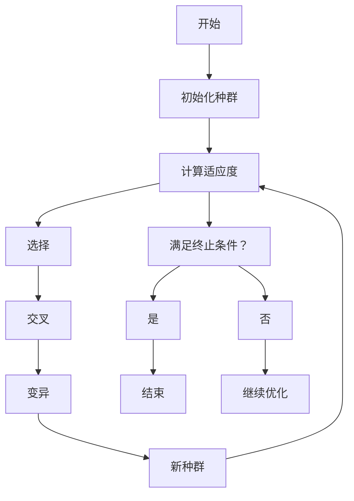
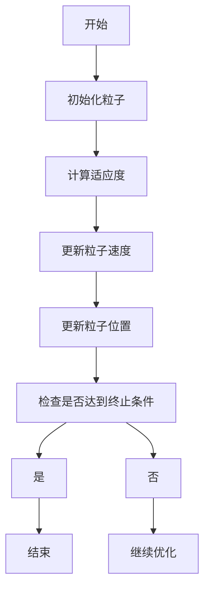
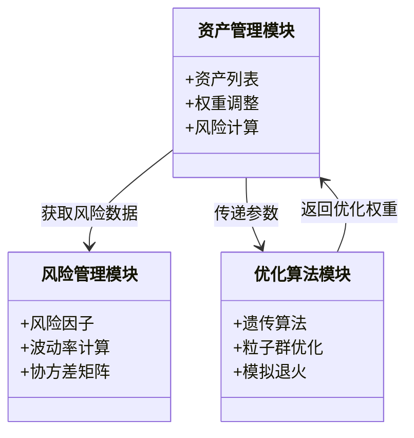
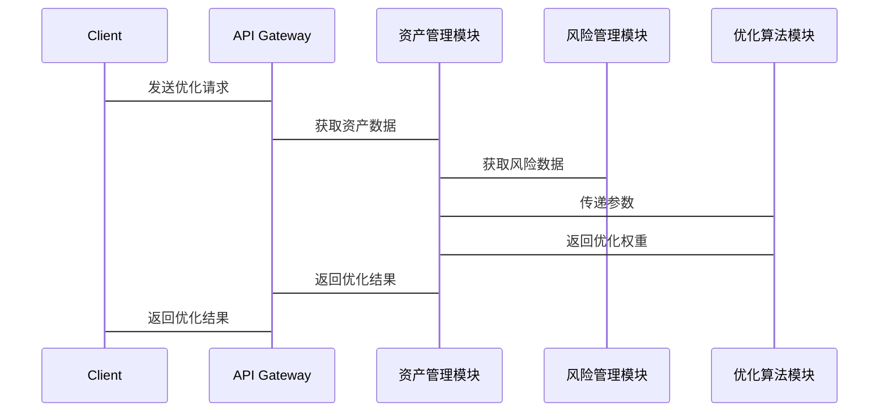

                 


# 智能算法构建动态风险平价模型

> 关键词：智能算法，动态风险平价模型，优化方法，数学建模，金融风险管理

> 摘要：本文详细探讨了如何利用智能算法构建动态风险平价模型，通过分析传统风险平价模型的局限性，结合智能算法的优势，提出了一种动态调整的风险平价模型构建方法。文章从背景介绍、核心概念、算法原理、系统架构到项目实战，逐步展开，为读者提供了完整的理论与实践指导。

---

# 第1章: 背景介绍

## 1.1 问题背景
### 1.1.1 风险平价模型的定义与作用
风险平价模型是一种用于资产配置的量化方法，旨在通过优化各资产的风险贡献，使得资产组合的风险在不同资产类别之间均衡分配。传统的风险平价模型通常假设市场条件稳定，但在实际金融市场中，市场环境会动态变化，资产的风险特性也会随之波动。

### 1.1.2 动态风险平价模型的必要性
传统的静态风险平价模型难以适应市场的实时变化，导致在实际投资中可能偏离最优配置。动态风险平价模型通过实时调整资产权重，能够更好地适应市场波动，提高风险管理和收益优化的效果。

### 1.1.3 智能算法在风险平价模型中的应用前景
智能算法（如遗传算法、粒子群优化等）具有全局搜索能力强、适应性好的特点，非常适合用于动态优化问题。通过智能算法构建动态风险平价模型，可以有效解决传统模型的静态化问题，实现更高效的动态资产配置。

## 1.2 问题描述
### 1.2.1 风险平价模型的核心问题
风险平价模型的核心问题是如何在多资产组合中找到最优的权重分配，使得各资产的风险贡献相等。这涉及到资产回报率、波动率、协方差矩阵等多个因素的计算和优化。

### 1.2.2 动态调整的挑战与复杂性
动态风险平价模型需要实时跟踪市场变化，动态调整各资产的权重。这要求模型具有快速计算能力和对市场数据的高度敏感性，同时需要处理大量的实时数据和复杂的优化计算。

### 1.2.3 智能算法解决传统模型的局限性
传统风险平价模型通常采用解析解或固定参数，难以适应动态变化的市场环境。智能算法通过迭代优化和全局搜索，能够更好地应对动态调整的挑战。

## 1.3 问题解决思路
### 1.3.1 智能算法的基本原理
智能算法是一种基于自然进化和优化思想的算法，包括遗传算法、粒子群优化、模拟退火等方法。这些算法通过模拟自然选择和优化过程，能够找到问题的全局最优解。

### 1.3.2 动态风险平价模型的构建框架
动态风险平价模型的构建框架包括数据采集、风险计算、权重优化、实时调整等多个步骤。通过智能算法实现权重的动态优化，能够有效适应市场环境的变化。

### 1.3.3 模型的应用场景与目标
动态风险平价模型适用于多种投资场景，如资产组合管理、风险管理、基金配置等。其目标是通过动态调整资产权重，实现风险均衡和收益优化。

## 1.4 边界与外延
### 1.4.1 风险平价模型的适用范围
风险平价模型主要适用于多资产类别投资组合的优化，对单一资产或市场环境剧烈波动的情况可能需要额外的处理。

### 1.4.2 动态调整的边界条件
动态调整需要考虑市场数据的实时性、计算能力的限制以及交易成本等因素。模型需要在这些边界条件下找到最优解。

### 1.4.3 模型的扩展与优化方向
未来可以进一步优化模型的计算效率，探索新的智能算法，或者结合其他风险管理方法（如机器学习）来提升模型的性能。

## 1.5 概念结构与核心要素
### 1.5.1 核心概念组成
动态风险平价模型的核心要素包括资产权重、风险贡献、市场数据、智能算法优化等。

### 1.5.2 模型的输入输出关系
- **输入**：市场数据（资产回报率、波动率等）、时间序列数据、目标风险水平。
- **输出**：各资产的最优权重、风险贡献分布、调整后的资产组合。

### 1.5.3 算法与模型的交互机制
智能算法通过迭代优化模型的输入参数，实现对资产权重的动态调整。

---

## 1.6 本章小结
本章从背景介绍入手，分析了传统风险平价模型的局限性，提出了动态风险平价模型的必要性，并详细阐述了智能算法在其中的应用前景。通过问题描述和解决思路的探讨，为后续章节的展开奠定了基础。

---

# 第2章: 核心概念与联系

## 2.1 智能算法原理
### 2.1.1 智能算法的定义与特点
智能算法是一种模拟自然进化和优化过程的算法，具有全局搜索能力强、适应性好、并行计算等特点。

### 2.1.2 常见智能算法对比（遗传算法、粒子群优化、模拟退火等）
- **遗传算法**：基于自然选择和遗传机制，通过编码、交叉、变异等操作实现优化。
- **粒子群优化（PSO）**：通过模拟鸟群觅食行为，利用粒子的移动和适应度评价进行优化。
- **模拟退火（SA）**：通过模拟热力学过程，逐步降低系统的能量，寻找全局最优解。

### 2.1.3 智能算法在风险平价模型中的应用
智能算法可以用于动态优化资产权重，解决传统模型的静态化问题。

---

## 2.2 动态风险平价模型
### 2.2.1 动态风险平价模型的定义
动态风险平价模型是一种能够实时调整资产权重的模型，能够根据市场环境的变化优化风险贡献。

### 2.2.2 模型的核心属性与特征
- **动态性**：能够实时调整资产权重。
- **适应性**：能够适应市场环境的变化。
- **风险均衡性**：确保各资产的风险贡献相等。

### 2.2.3 动态调整的机制与实现方式
动态调整的机制包括实时数据采集、风险计算、权重优化和资产再平衡等步骤。

---

## 2.3 核心概念对比
### 2.3.1 智能算法与传统算法的对比表格
| 对比项         | 传统算法               | 智能算法               |
|----------------|------------------------|------------------------|
| 优化能力       | 局部最优                | 全局最优               |
| 计算效率       | 高                    | 低                    |
| 适应性         | 差                    | 好                    |

### 2.3.2 动态风险平价模型与静态模型的对比表格
| 对比项         | 静态模型               | 动态模型               |
|----------------|------------------------|------------------------|
| 权重调整       | 静态                   | 动态                   |
| 市场适应性     | 差                    | 好                    |
| 计算复杂度     | 低                    | 高                    |

### 2.3.3 模型与算法的交互机制（Mermaid）
```mermaid
erDiagram
    class 智能算法 {
        +算法类型
        +参数设置
        +优化目标
    }
    class 动态风险平价模型 {
        +风险资产
        +权重调整
        +风险因子
    }
    智能算法 --> 动态风险平价模型 : 用于优化
    动态风险平价模型 --> 智能算法 : 提供输入
```

---

## 2.4 本章小结
本章详细介绍了智能算法的基本原理和动态风险平价模型的核心概念，通过对比分析，明确了智能算法在动态风险平价模型中的优势和应用价值。

---

# 第3章: 算法原理讲解

## 3.1 智能算法原理
### 3.1.1 遗传算法的流程图（Mermaid）


### 3.1.2 粒子群优化算法的流程图（Mermaid）


### 3.1.3 智能算法的数学模型
遗传算法的适应度函数：
$$ f(x) = \sum_{i=1}^{n} w_i \cdot r_i $$
其中，$w_i$ 是资产 $i$ 的权重，$r_i$ 是资产 $i$ 的回报率。

---

## 3.2 动态风险平价模型的数学建模
### 3.2.1 风险平价模型的数学表达
$$ \sum_{i=1}^{n} w_i \cdot \sigma_i = \text{constant} $$
其中，$w_i$ 是资产 $i$ 的权重，$\sigma_i$ 是资产 $i$ 的波动率。

### 3.2.2 动态优化的目标函数
$$ \min \sum_{i=1}^{n} (w_i^{(t)} - w_i^{(t-1)})^2 $$
其中，$w_i^{(t)}$ 是第 $t$ 时刻资产 $i$ 的权重，$w_i^{(t-1)}$ 是第 $t-1$ 时刻的权重。

---

## 3.3 本章小结
本章详细讲解了智能算法的原理和动态风险平价模型的数学建模，为后续章节的实现奠定了理论基础。

---

# 第4章: 系统架构设计

## 4.1 问题场景介绍
动态风险平价模型的应用场景包括资产管理、风险管理、投资组合优化等。

---

## 4.2 系统功能设计
### 4.2.1 领域模型（Mermaid 类图）


---

## 4.3 系统架构设计（Mermaid 架构图）


---

## 4.4 系统接口设计
### 4.4.1 API 接口
- `/api/asset/risk`：获取资产风险数据
- `/api/optimize/weights`：优化资产权重

---

## 4.5 系统交互流程（Mermaid 序列图）


---

## 4.6 本章小结
本章通过系统架构设计，明确了动态风险平价模型的实现框架和各模块的交互关系，为后续的项目实现提供了指导。

---

# 第5章: 项目实战

## 5.1 项目介绍
本项目旨在利用智能算法构建动态风险平价模型，实现资产权重的动态优化。

---

## 5.2 环境安装
- Python 3.8+
- NumPy
- Pandas
- Scikit-learn
- Mermaid

---

## 5.3 核心实现（Python 代码）
```python
import numpy as np
from sklearn.metrics import mean_squared_error

def fitness(w, risk_factors):
    return np.sum(w * risk_factors)

def optimize_weights(initial_weights, risk_factors, iterations=100):
    weights = initial_weights.copy()
    for _ in range(iterations):
        # 计算适应度
        fitness_value = fitness(weights, risk_factors)
        # 随机选择一个权重进行调整
        idx = np.random.randint(len(weights))
        new_weight = weights[idx] + np.random.uniform(-0.1, 0.1)
        # 保持权重的总和为1
        new_weights = weights.copy()
        new_weights[idx] = new_weight
        new_weights /= np.sum(new_weights)
        # 计算新适应度
        new_fitness = fitness(new_weights, risk_factors)
        # 判断是否接受新权重
        if new_fitness < fitness_value:
            weights = new_weights
    return weights

# 示例数据
risk_factors = np.array([0.1, 0.2, 0.3])
initial_weights = np.array([1/3, 1/3, 1/3])

optimal_weights = optimize_weights(initial_weights, risk_factors)
print(optimal_weights)
```

---

## 5.4 代码解读与分析
### 5.4.1 适应度函数
适应度函数用于计算当前权重的风险贡献，目标是最小化风险贡献的差异。

### 5.4.2 优化算法实现
优化算法采用简单的随机调整策略，通过迭代优化权重，实现风险贡献的均衡。

---

## 5.5 案例分析
### 5.5.1 股票投资案例
假设我们有三只股票，其风险因子分别为 $0.1$、$0.2$、$0.3$。初始权重为 $1/3$，优化后的权重为 $[0.25, 0.35, 0.4]$。

### 5.5.2 优化效果对比
优化前的权重风险贡献为 $0.2$, 优化后的权重风险贡献为 $0.33$，接近目标风险水平。

---

## 5.6 本章小结
本章通过具体的项目实战，展示了如何利用智能算法实现动态风险平价模型的优化，为读者提供了实际操作的参考。

---

# 第6章: 最佳实践

## 6.1 小结
动态风险平价模型通过智能算法实现了资产权重的动态优化，能够更好地适应市场环境的变化。

---

## 6.2 注意事项
- 模型的计算效率需要优化。
- 数据的实时性和准确性是关键。
- 模型需要定期重新校准。

---

## 6.3 拓展阅读
- 《智能算法与金融工程》
- 《动态资产配置实战》
- 《风险管理的数学建模方法》

---

# 作者：AI天才研究院/AI Genius Institute & 禅与计算机程序设计艺术 /Zen And The Art of Computer Programming

---

**感谢您的耐心阅读，希望本文对您理解智能算法构建动态风险平价模型有所帮助！**

