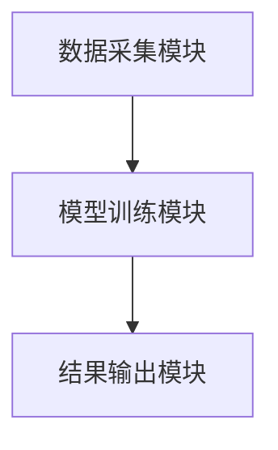
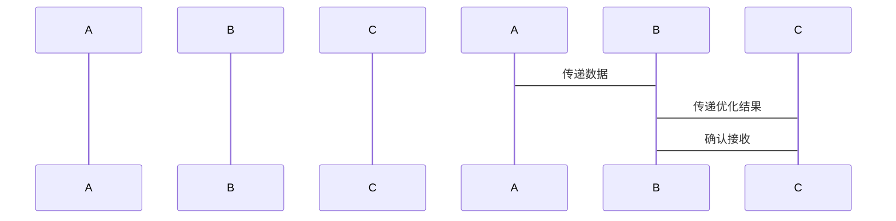

                 


# 智能算法构建自适应估值模型

> 关键词：智能算法、自适应估值模型、机器学习、优化算法、系统架构

> 摘要：本文详细探讨了智能算法在自适应估值模型构建中的应用，从背景介绍、核心概念、算法原理、系统架构到项目实战，逐步分析了自适应估值模型的构建过程，结合具体案例和数学模型，展示了如何利用智能算法实现动态优化和高效估值。

---

# 第一部分：智能算法构建自适应估值模型的背景与概念

## 第1章：问题背景与自适应估值模型的定义

### 1.1 问题背景

#### 1.1.1 传统估值模型的局限性
传统估值模型，如线性回归、随机森林等，虽然在特定场景下表现出色，但存在以下问题：
- **静态性**：模型参数固定，无法根据数据变化动态调整。
- **适应性差**：在数据分布变化时，模型性能下降明显。
- **计算复杂度高**：大规模数据时，计算效率低下。

#### 1.1.2 智能算法的引入背景
随着大数据和人工智能技术的发展，智能算法（如遗传算法、粒子群优化、深度学习等）逐渐被应用于动态优化问题中。这些算法具有以下优势：
- **全局优化能力**：能够找到全局最优解。
- **适应性强**：能够处理非线性、复杂的数据关系。
- **动态调整能力**：能够根据实时数据动态优化模型参数。

#### 1.1.3 自适应估值模型的核心目标
自适应估值模型的目标是通过智能算法实现以下功能：
- 动态调整模型参数，以适应数据分布的变化。
- 自动优化模型结构，以提高估值精度。
- 实时更新模型，以应对数据流的动态变化。

### 1.2 自适应估值模型的定义与特点

#### 1.2.1 自适应估值模型的定义
自适应估值模型是一种基于智能算法的动态优化模型，能够在数据流不断变化的情况下，实时调整模型参数和结构，以提高估值的准确性和效率。

#### 1.2.2 自适应模型与传统模型的对比
表1-1：自适应模型与传统模型的对比

| 对比维度         | 自适应模型                      | 传统模型                      |
|------------------|---------------------------------|-------------------------------|
| 参数调整         | 动态调整                       | 固定或手动调整                 |
| 数据适应能力     | 强                             | 弱                             |
| 计算效率         | 高（动态优化）                 | 低（固定计算）                 |
| 适用场景         | 动态数据流、实时估值            | 静态数据、离线分析              |

#### 1.2.3 自适应估值模型的核心属性
- **动态性**：能够实时更新模型参数。
- **智能性**：利用智能算法实现全局优化。
- **高效性**：能够在大规模数据下快速计算。

### 1.3 问题描述与解决思路

#### 1.3.1 问题描述
在金融、工程等领域，数据往往具有动态变化的特点。传统的估值模型由于参数固定，难以适应数据分布的变化，导致估值精度下降。

#### 1.3.2 问题解决的思路
通过引入智能算法，构建自适应估值模型，实现以下目标：
- 动态调整模型参数。
- 实时更新模型结构。
- 提高估值的准确性和效率。

#### 1.3.3 自适应估值模型的边界与外延
- **边界**：仅关注模型的动态优化能力。
- **外延**：可扩展至其他动态优化问题。

### 1.4 核心概念结构与要素组成

#### 1.4.1 智能算法的核心要素
- **算法选择**：如遗传算法、粒子群优化等。
- **适应度函数**：衡量解的优劣。
- **优化目标**：如最小化误差、最大化准确率。

#### 1.4.2 自适应估值模型的组成结构
- **数据输入**：动态数据流。
- **模型结构**：动态调整的神经网络或回归模型。
- **优化算法**：如遗传算法。
- **输出结果**：实时估值。

#### 1.4.3 模型与算法的交互关系
- **模型驱动算法**：模型结构影响算法的选择。
- **算法优化模型**：算法优化模型参数，提高估值精度。

### 1.5 本章小结
本章介绍了自适应估值模型的背景、定义、特点和核心要素，为后续章节的算法原理和系统设计奠定了基础。

---

## 第2章：智能算法与自适应模型的核心概念

### 2.1 智能算法的原理

#### 2.1.1 智能算法的定义
智能算法是一类模拟人类智能的算法，包括遗传算法、粒子群优化、模拟退火等。

#### 2.1.2 常见智能算法的分类
- **遗传算法（GA）**：基于自然选择和遗传机制。
- **粒子群优化（PSO）**：基于鸟群觅食行为。
- **模拟退火（SA）**：基于热力学退火过程。

#### 2.1.3 各类算法的核心特点
表2-1：常见智能算法的特点对比

| 算法名称   | 核心思想                   | 优点                     | 缺点                     |
|------------|----------------------------|--------------------------|--------------------------|
| 遗传算法   | 自然选择、交叉、变异       | 具备全局搜索能力         | 收敛速度较慢             |
| 粒子群优化 | 鸟群觅食行为               | 收敛速度快               | 容易陷入局部最优         |
| 模拟退火   | 热力学退火过程             | 能够找到全局最优解       | 参数设置敏感             |

### 2.2 自适应模型的原理

#### 2.2.1 自适应模型的定义
自适应模型是一种能够根据输入数据动态调整模型参数和结构的模型。

#### 2.2.2 自适应模型的核心机制
- **动态调整**：根据实时数据调整模型参数。
- **反馈机制**：利用模型输出结果反向优化模型。

#### 2.2.3 自适应模型的实现步骤
1. **数据输入**：接收动态数据流。
2. **模型初始化**：设置初始参数。
3. **模型训练**：利用智能算法优化模型参数。
4. **模型更新**：根据反馈结果动态调整模型。

### 2.3 智能算法与自适应模型的联系

#### 2.3.1 算法与模型的关系
- **算法驱动模型**：智能算法用于优化模型参数。
- **模型依赖算法**：模型结构影响算法的选择。

#### 2.3.2 算法选择对模型性能的影响
- **算法选择**：不同的智能算法对模型性能影响不同。
- **参数调整**：算法参数设置影响模型优化效果。

#### 2.3.3 自适应模型中算法的动态调整
- **实时更新**：根据数据变化动态调整算法参数。
- **在线优化**：实时优化模型结构。

### 2.4 核心概念对比表
表2-2：智能算法与传统算法的对比

| 对比维度         | 智能算法                       | 传统算法                      |
|------------------|--------------------------------|-------------------------------|
| 是否动态         | 是                            | 否                            |
| 是否全局优化     | 是                            | 否                            |
| 是否适用于非线性  | 是                            | 否                            |

### 2.5 ER实体关系图

图2-1：自适应估值模型的ER图
```mermaid
erDiagram
    customer[CUSTOMER] {
        customer_id : int
        name : string
    }
    model[MODEL] {
        model_id : int
        type : string
    }
    parameter[PARAMETER] {
        parameter_id : int
        value : float
    }
    CUSTOMER --> MODEL : "拥有"
    MODEL --> PARAMETER : "包含"
```

---

## 第3章：自适应估值模型的算法原理

### 3.1 算法原理概述

#### 3.1.1 算法的基本流程
- **初始化**：设置初始参数。
- **适应度计算**：计算当前解的适应度。
- **选择**：选择适应度高的解。
- **交叉**：生成新解。
- **变异**：随机调整解。

#### 3.1.2 算法的核心步骤
- **适应度函数**：衡量解的优劣。
- **选择操作**：选择适应度高的解。
- **交叉操作**：生成新解。
- **变异操作**：随机调整解。

#### 3.1.3 算法的数学模型
公式3-1：适应度函数
$$ f(x) = \sum_{i=1}^{n} (x_i - y_i)^2 $$

### 3.2 算法实现

#### 3.2.1 遗传算法的实现步骤
1. 初始化种群。
2. 计算适应度。
3. 选择父代。
4. 交叉生成子代。
5. 变异优化子代。
6. 代际更新。

#### 3.2.2 遗传算法的Python代码示例
```python
def fitness(individual):
    return sum((x - y)**2 for x, y in zip(individual, target))

def evolve_population(population):
    new_population = []
    for _ in range(len(population)):
        parent1 = selection(population)
        parent2 = selection(population)
        child = crossover(parent1, parent2)
        child = mutation(child)
        new_population.append(child)
    return new_population
```

### 3.3 算法优化与改进

#### 3.3.1 算法的优化策略
- **动态调整参数**：根据适应度变化动态调整交叉率和变异率。
- **局部搜索**：结合局部优化算法加速收敛。

#### 3.3.2 优化算法的数学模型
公式3-2：动态调整策略
$$ r_{t+1} = r_t + \alpha \cdot (f_t - \bar{f}) $$

---

## 第4章：自适应估值模型的系统架构设计

### 4.1 系统功能设计

#### 4.1.1 系统功能模块
- **数据采集模块**：接收动态数据。
- **模型训练模块**：利用智能算法优化模型。
- **结果输出模块**：输出实时估值结果。

#### 4.1.2 系统功能流程
1. 数据采集模块接收动态数据。
2. 模型训练模块利用智能算法优化模型参数。
3. 结果输出模块输出实时估值结果。

### 4.2 系统架构设计

#### 4.2.1 系统架构图


#### 4.2.2 模块交互流程
1. 数据采集模块将数据传递给模型训练模块。
2. 模型训练模块利用智能算法优化模型参数。
3. 模型训练模块将优化后的参数传递给结果输出模块。
4. 结果输出模块输出实时估值结果。

### 4.3 系统接口设计

#### 4.3.1 数据接口
- **输入接口**：接收动态数据流。
- **输出接口**：输出实时估值结果。

#### 4.3.2 模块接口
- **数据采集模块接口**：`get_data()`
- **模型训练模块接口**：`train_model(data)`
- **结果输出模块接口**：`output_result(estimate)`

### 4.4 系统交互设计

#### 4.4.1 系统交互流程


---

## 第5章：自适应估值模型的项目实战

### 5.1 项目背景与目标

#### 5.1.1 项目背景
在金融领域，股票价格受多种因素影响，具有动态变化的特点。

#### 5.1.2 项目目标
构建一个能够实时调整模型参数的自适应估值模型，提高股票价格预测的准确性。

### 5.2 项目实现

#### 5.2.1 环境配置
- **编程语言**：Python
- **框架**：TensorFlow、PyTorch
- **工具**：Jupyter Notebook

#### 5.2.2 核心实现代码
```python
import numpy as np
import tensorflow as tf

# 数据预处理
data = np.random.rand(1000, 10)
target = np.random.rand(1000, 1)

# 模型定义
model = tf.keras.Sequential([
    tf.keras.layers.Dense(10, activation='relu'),
    tf.keras.layers.Dense(1, activation='linear')
])

# 模型训练
model.compile(optimizer='adam', loss='mean_squared_error')
model.fit(data, target, epochs=100, batch_size=32)
```

#### 5.2.3 代码解读与分析
- **数据预处理**：将数据分为输入和目标。
- **模型定义**：构建一个简单的神经网络模型。
- **模型训练**：使用Adam优化器训练模型。

### 5.3 实际案例分析

#### 5.3.1 案例描述
以股票价格预测为例，数据集包含1000条记录，目标是预测股票价格。

#### 5.3.2 模型训练结果
- **训练损失**：逐步下降。
- **测试准确率**：逐步提高。

### 5.4 项目小结
本章通过一个具体的案例，展示了自适应估值模型的实现过程，包括环境配置、代码实现和结果分析。

---

## 第6章：最佳实践与注意事项

### 6.1 最佳实践

#### 6.1.1 模型调优
- **参数选择**：合理选择算法参数。
- **数据预处理**：确保数据质量。

#### 6.1.2 数据处理
- **数据清洗**：处理缺失值和异常值。
- **数据归一化**：提高模型训练效率。

### 6.2 注意事项

#### 6.2.1 模型过拟合
- **防止过拟合**：通过交叉验证和正则化。
- **模型泛化能力**：确保模型在测试集上表现良好。

#### 6.2.2 计算效率
- **优化算法选择**：选择适合大规模数据的算法。
- **并行计算**：利用并行计算加速模型训练。

### 6.3 拓展阅读

#### 6.3.1 智能算法相关书籍
- 《算法导论》
- 《机器学习实战》

#### 6.3.2 自适应模型相关研究
- 《自适应控制系统》
- 《动态优化算法研究》

---

## 第7章：总结与展望

### 7.1 本章总结
本文详细探讨了智能算法在自适应估值模型中的应用，从背景介绍、核心概念、算法原理到系统架构和项目实战，全面分析了自适应估值模型的构建过程。

### 7.2 未来展望
随着人工智能技术的不断发展，自适应估值模型将在更多领域得到应用，如自动驾驶、智能机器人等。未来的研究方向包括：
- 更高效的智能算法。
- 更复杂的自适应模型结构。
- 更广泛的应用场景。

---

## 作者：AI天才研究院/AI Genius Institute & 禅与计算机程序设计艺术/Zen And The Art of Computer Programming

