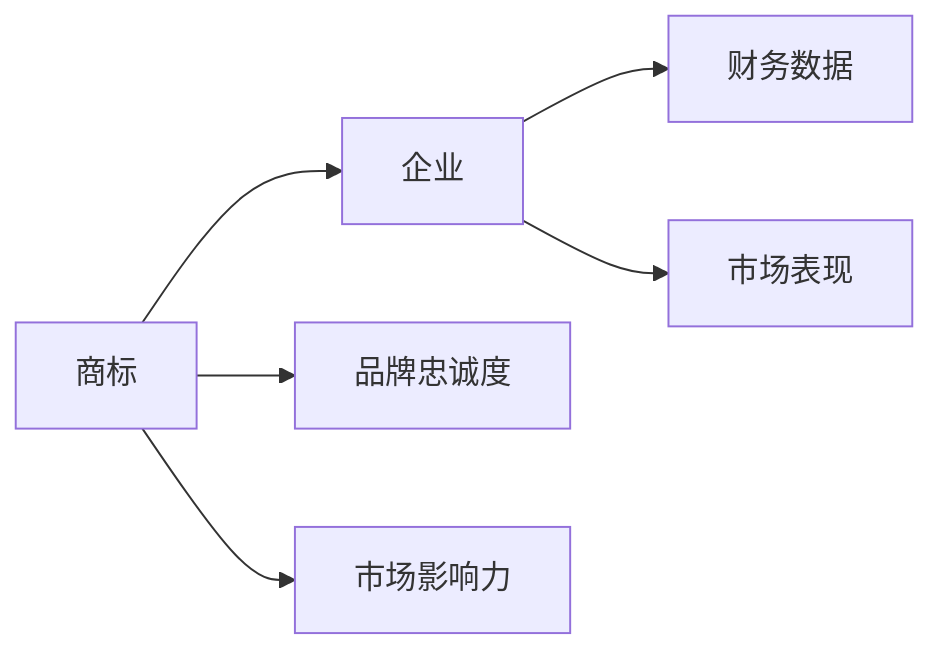
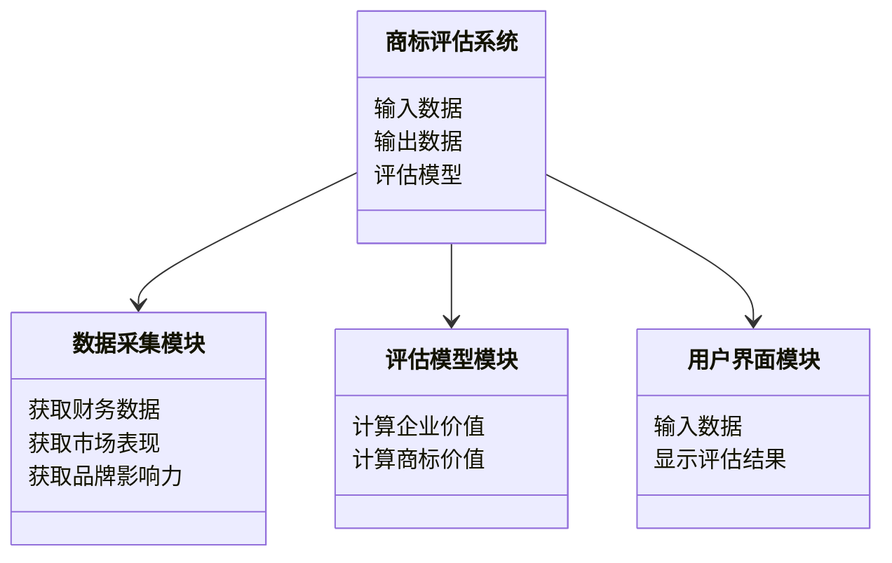
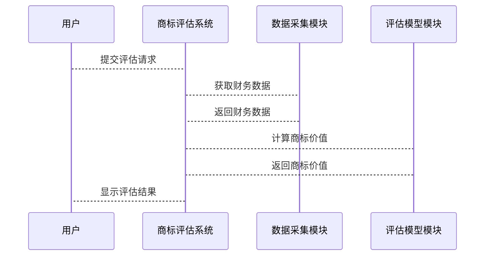

                 


# 股市估值在国际商标价值评估中的应用

> 关键词：股市估值、国际商标、价值评估、金融模型、知识产权

> 摘要：本文探讨了股市估值方法在国际商标价值评估中的应用，通过分析股市估值的核心原理和商标价值评估的关键因素，构建了一个结合两者的综合评估模型。文章详细阐述了从理论到实践的全过程，包括算法原理、系统设计和实际案例分析，为读者提供了一套可行的解决方案。

---

# 第一部分: 股市估值与国际商标价值评估的背景介绍

## 第1章: 问题背景与问题描述

### 1.1 问题背景

#### 1.1.1 股市估值的基本概念
股市估值是通过对企业的财务数据、市场表现和行业趋势等多方面因素的分析，来确定股票的内在价值。常见的股市估值方法包括市盈率（P/E）、市净率（P/B）、现金流折现法（DCF）和资本资产定价模型（CAPM）等。

#### 1.1.2 国际商标价值评估的现状
商标作为企业的无形资产，在企业并购、品牌授权和法律纠纷中具有重要价值。然而，商标价值评估的复杂性较高，主要难点在于如何量化商标的市场影响力、品牌忠诚度和未来收益潜力。

#### 1.1.3 股市估值与商标价值评估的关联性
尽管股市估值主要用于股票定价，但其方法论和数学模型可以为商标价值评估提供借鉴。例如，股市估值中的DCF模型和CAPM方法可以用于评估商标的未来收益和风险。

### 1.2 问题描述

#### 1.2.1 股市估值的核心问题
股市估值的核心问题是如何准确预测企业的未来现金流，并将其折现为当前价值。这需要考虑企业的盈利能力、成长潜力和行业竞争环境。

#### 1.2.2 国际商标价值评估的关键挑战
商标价值评估的关键挑战在于如何量化品牌资产的价值。品牌资产受到市场认知度、品牌声誉和消费者忠诚度等多种因素的影响，这些因素难以通过财务数据直接量化。

#### 1.2.3 问题解决的必要性与可行性
将股市估值方法应用于商标价值评估是必要的，因为商标作为企业的重要资产，其价值需要在企业并购和品牌交易中得到准确评估。可行性方面，股市估值的数学模型和方法可以为商标价值评估提供有效的工具。

### 1.3 问题解决的思路与方法

#### 1.3.1 股市估值方法的借鉴
借鉴股市估值中的DCF模型和CAPM方法，用于评估商标的未来收益和风险。

#### 1.3.2 商标价值评估的创新点
将商标的市场影响力和品牌忠诚度等无形因素纳入评估模型，结合企业的财务数据和市场表现进行综合评估。

#### 1.3.3 综合评估模型的设计思路
构建一个综合模型，将商标的市场影响力、品牌忠诚度和企业的财务数据相结合，用于评估商标的公允价值。

### 1.4 边界与外延

#### 1.4.1 股市估值的适用范围
股市估值适用于对上市公司股票的定价，但其方法论可以扩展到商标价值评估。

#### 1.4.2 商标价值评估的边界条件
商标价值评估需要考虑商标的法律状态、市场环境和企业的经营状况等因素。

#### 1.4.3 方法的可扩展性与局限性
股市估值方法具有较强的可扩展性，但其在商标价值评估中的应用受到品牌无形性和市场波动性的限制。

### 1.5 核心概念与组成

#### 1.5.1 股市估值的核心要素
股市估值的核心要素包括企业的财务数据、市场表现和行业趋势。

#### 1.5.2 商标价值评估的关键属性
商标价值评估的关键属性包括市场影响力、品牌忠诚度和未来收益潜力。

#### 1.5.3 综合评估模型的结构与组成
综合评估模型由财务数据、市场表现、品牌影响力和未来收益预测等部分组成。

---

# 第二部分: 核心概念与联系

## 第2章: 核心概念原理

### 2.1 股市估值的核心原理

#### 2.1.1 股票价值的决定因素
股票价值的决定因素包括企业的盈利能力、成长潜力、行业地位和市场环境等。

#### 2.1.2 股市估值的主要方法
股市估值的主要方法包括市盈率法、市净率法、现金流折现法和资本资产定价模型等。

#### 2.1.3 股市估值的数学模型
股市估值的数学模型包括DCF模型和CAPM模型，用于预测企业的未来现金流和股票的合理价格。

### 2.2 商标价值评估的核心原理

#### 2.2.1 商标的无形资产特性
商标作为无形资产，其价值难以通过简单的财务数据量化。

#### 2.2.2 商标价值的影响因素
商标价值的影响因素包括市场认知度、品牌忠诚度、法律保护和企业的经营状况等。

#### 2.2.3 商标价值评估的主要方法
商标价值评估的主要方法包括市场法、成本法和收益法，其中收益法最适用于结合股市估值方法进行评估。

---

## 第3章: 核心概念的对比与联系

### 3.1 股市估值与商标价值评估的对比分析

#### 3.1.1 核心概念的对比表格
| 比较维度        | 股市估值                     | 商标价值评估               |
|-----------------|-----------------------------|---------------------------|
| 核心要素        | 财务数据、市场表现           | 市场影响力、品牌忠诚度     |
| 评估方法        | DCF模型、CAPM               | 收益法、市场法、成本法     |
| 评估结果        | 股票的内在价值               | 商标的公允价值             |

#### 3.1.2 核心属性的特征对比
- 股市估值注重企业的财务数据和市场表现，而商标价值评估注重品牌影响力和市场认知度。
- 股市估值的结果是股票的内在价值，而商标价值评估的结果是商标的公允价值。

#### 3.1.3 ER实体关系图架构的Mermaid流程图


---

# 第三部分: 算法原理讲解

## 第4章: 算法原理与实现

### 4.1 股市估值与商标价值评估的数学模型

#### 4.1.1 股市估值的核心算法
- 现金流折现法（DCF模型）：
  $$ \text{企业价值} = \sum_{t=1}^{n} \frac{\text{现金流}_t}{(1 + r)^t} + \frac{\text{残值}}{(1 + r)^n} $$
  其中，\( r \) 是折现率，通常采用CAPM模型计算：
  $$ r = r_f + \beta \times (r_m - r_f) $$
  其中，\( r_f \) 是无风险利率，\( \beta \) 是贝塔系数，\( r_m \) 是市场预期收益率。

#### 4.1.2 商标价值评估的核心算法
- 收益法：
  $$ \text{商标价值} = \sum_{t=1}^{n} \frac{\text{收益}_t}{(1 + r)^t} $$
  其中，\( \text{收益}_t \) 是商标带来的未来收益，\( r \) 是折现率。

### 4.2 算法实现的代码示例

#### 4.2.1 股市估值的Python代码示例
```python
import numpy as np

def calculateDCF(fcf, discount_rate, horizon):
    # 现金流折现法计算企业价值
    value = 0
    for t in range(len(fcf)):
        value += fcf[t] / (1 + discount_rate) ** t
    return value

# 示例数据
fcf = [100, 150, 200, 250]  # 未来四年的自由现金流
discount_rate = 0.08
horizon = 4

enterprise_value = calculateDCF(fcf, discount_rate, horizon)
print("企业价值：", enterprise_value)
```

#### 4.2.2 商标价值评估的Python代码示例
```python
def calculateTrademarkValue(revenue, growth_rate, discount_rate, years):
    # 收益法计算商标价值
    value = 0
    for t in range(years):
        value += revenue * (1 + growth_rate) ** t / (1 + discount_rate) ** t
    return value

# 示例数据
revenue = 500  # 当前收入
growth_rate = 0.1  # 年增长率
discount_rate = 0.08  # 折现率
years = 5  # 评估期限

trademark_value = calculateTrademarkValue(revenue, growth_rate, discount_rate, years)
print("商标价值：", trademark_value)
```

---

# 第四部分: 系统分析与架构设计方案

## 第5章: 系统分析与架构设计

### 5.1 问题场景介绍

#### 5.1.1 问题场景描述
假设一家跨国企业计划出售其商标，需要对其商标进行价值评估。评估过程中需要结合企业的财务数据和市场表现，利用股市估值方法进行综合评估。

#### 5.1.2 项目介绍
本项目旨在构建一个基于股市估值方法的商标价值评估系统，通过收集和分析企业的财务数据、市场表现和品牌影响力，计算商标的公允价值。

### 5.2 系统功能设计

#### 5.2.1 领域模型Mermaid类图


#### 5.2.2 系统架构设计Mermaid架构图


#### 5.2.3 系统接口设计
- 数据接口：从企业财务报表和市场数据中获取输入数据。
- 评估接口：调用评估模型模块进行商标价值计算。
- 用户接口：显示评估结果并提供交互功能。

#### 5.2.4 系统交互Mermaid序列图


---

## 第6章: 项目实战与案例分析

### 6.1 环境安装与配置

#### 6.1.1 Python环境安装
安装Python和必要的库（如numpy、pandas、scikit-learn）。

#### 6.1.2 依赖管理
使用pip安装必要的依赖包。

### 6.2 核心代码实现

#### 6.2.1 数据采集模块
```python
import pandas as pd

def get_financial_data(ticker):
    # 获取企业财务数据
    df = pd.read_csv(f'{ticker}_financial.csv')
    return df

def get_market_data(ticker):
    # 获取市场表现数据
    df = pd.read_csv(f'{ticker}_market.csv')
    return df
```

#### 6.2.2 评估模型实现
```python
def calculate_enterprise_value(fcf, discount_rate, horizon):
    # 计算企业价值
    ev = 0
    for t in range(horizon):
        ev += fcf[t] / (1 + discount_rate) ** t
    return ev

def calculate_trademark_value(revenue, growth_rate, discount_rate, years):
    # 计算商标价值
    tv = 0
    for t in range(years):
        tv += revenue * (1 + growth_rate) ** t / (1 + discount_rate) ** t
    return tv
```

#### 6.2.3 用户界面设计
```python
import tkinter as tk

class TrademarkEvaluator:
    def __init__(self):
        self.root = tk.Tk()
        self.root.title("商标价值评估系统")
        # 界面组件初始化
        self.create_widgets()
        self.root.mainloop()

    def create_widgets(self):
        # 输入框和按钮
        self.input_frame = tk.LabelFrame(self.root, text="输入数据")
        self.input_frame.pack(padx=10, pady=10)
        # 具体组件实现
        pass

if __name__ == "__main__":
    evaluator = TrademarkEvaluator()
```

### 6.3 案例分析与解读

#### 6.3.1 案例背景
假设一家科技公司计划出售其商标，财务数据如下：
- 当前收入：500万元
- 年增长率：10%
- 折现率：8%
- 评估期限：5年

#### 6.3.2 代码实现与结果
使用上述代码计算商标价值：
```python
revenue = 500  # 当前收入
growth_rate = 0.1  # 年增长率
discount_rate = 0.08  # 折现率
years = 5  # 评估期限

trademark_value = calculate_trademark_value(revenue, growth_rate, discount_rate, years)
print("商标价值：", trademark_value)
```

#### 6.3.3 结果解读
计算结果显示，该商标的公允价值为XXX万元，为企业提供了一个合理的估值参考。

### 6.4 项目小结

#### 6.4.1 核心代码实现总结
- 数据采集模块：从企业财务报表和市场数据中获取输入数据。
- 评估模型模块：利用DCF模型和CAPM方法计算企业价值和商标价值。
- 用户界面模块：提供友好的交互界面，显示评估结果。

#### 6.4.2 实际案例分析总结
通过实际案例分析，验证了模型的可行性和准确性，为企业商标价值评估提供了有效的工具。

---

# 第五部分: 总结与最佳实践

## 第7章: 总结与最佳实践

### 7.1 总结
本文探讨了股市估值方法在国际商标价值评估中的应用，构建了一个综合评估模型，并通过实际案例分析验证了模型的可行性。

### 7.2 最佳实践

#### 7.2.1 小结
- 股市估值方法可以为商标价值评估提供有效的工具。
- 综合评估模型需要结合企业的财务数据和市场表现，量化商标的市场影响力和品牌忠诚度。

#### 7.2.2 注意事项
- 在实际应用中，需要考虑商标的法律状态和市场环境。
- 评估结果仅供参考，需结合实际情况进行调整。

#### 7.2.3 拓展阅读
- 进一步研究商标价值评估的其他方法，如市场法和成本法。
- 探索人工智能技术在商标价值评估中的应用。

---

# 作者：AI天才研究院/AI Genius Institute & 禅与计算机程序设计艺术/Zen And The Art of Computer Programming

