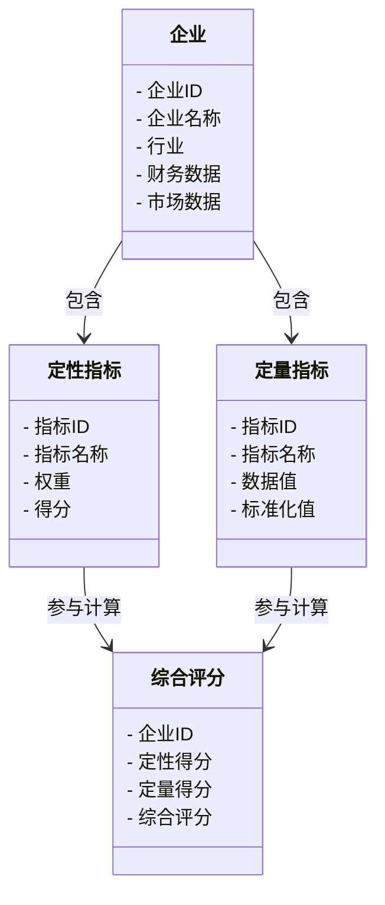
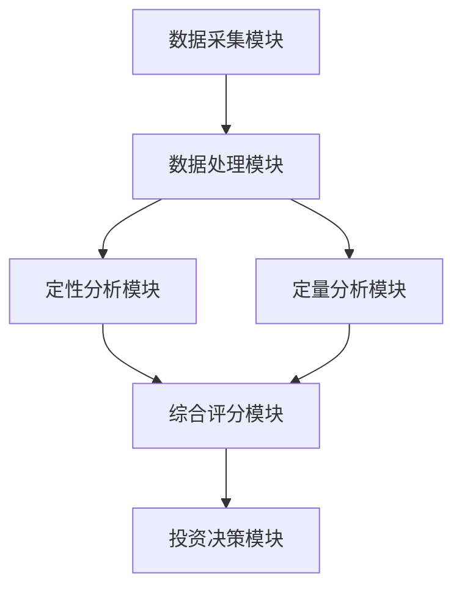
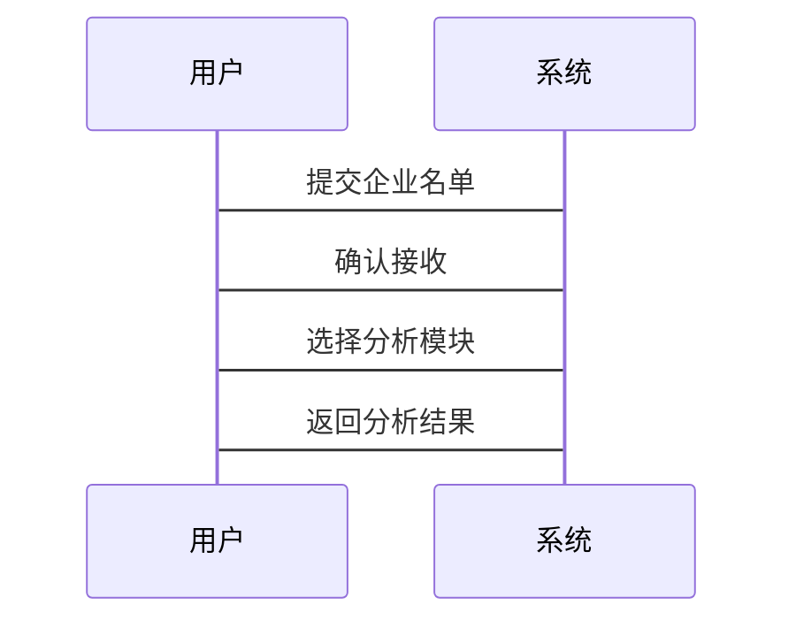

                 


# 芒格的"双轨分析"：结合定性和定量的投资方法

## 关键词：芒格、双轨分析、定性分析、定量分析、投资方法、系统架构

## 摘要：芒格的双轨分析是一种结合定性和定量分析的投资方法，旨在通过全面评估企业基本面和市场估值来做出更明智的投资决策。本文详细介绍了双轨分析的背景、核心概念、算法原理、系统架构、项目实战以及最佳实践，为投资者提供了一个系统化的投资框架。

---

## 第一部分: 芒格的"双轨分析"概述

### 第1章: 双轨分析的背景与定义

#### 1.1 投资分析的演变

##### 1.1.1 传统投资分析方法的局限性
传统的投资分析方法往往过于依赖单一的分析维度，例如仅关注财务指标或仅关注市场情绪，导致投资者在决策时容易忽视其他重要因素。这种片面性使得投资结果常常受到市场波动或企业基本面变化的影响。

##### 1.1.2 芒格投资理念的形成背景
芒格的投资理念深受其导师巴菲特的影响，但他在实践中逐渐发展出一套独特的分析方法。双轨分析的形成背景可以追溯到他对投资决策的深入思考和实践中对多种因素的综合考量。

##### 1.1.3 双轨分析的核心思想
双轨分析的核心思想是通过结合定性分析和定量分析，全面评估企业的内在价值和市场估值，从而做出更为科学的投资决策。这种方法强调对企业和市场的深刻理解，同时结合数据支持的量化分析。

#### 1.2 双轨分析的定义与特点

##### 1.2.1 双轨分析的定义
双轨分析是一种结合定性分析和定量分析的投资方法，旨在通过全面评估企业的基本面和市场估值，帮助投资者做出更为明智的投资决策。

##### 1.2.2 定性分析与定量分析的结合
定性分析关注企业的战略、管理、文化等因素，而定量分析则关注财务指标、估值指标等可量化的数据。双轨分析通过将这两者结合起来，提供了一个更为全面的分析框架。

##### 1.2.3 双轨分析的优势与适用场景
双轨分析的优势在于其全面性和灵活性，能够帮助投资者在复杂多变的市场环境中做出更准确的判断。其适用场景包括长期投资、价值投资以及成长投资等。

#### 1.3 双轨分析与其他投资方法的对比

##### 1.3.1 基本面分析与技术分析的区别
基本面分析关注企业的内在价值，而技术分析关注市场的价格走势和交易量等数据。双轨分析则结合了基本面分析和部分技术分析的思路。

##### 1.3.2 价值投资与成长投资的差异
价值投资注重低估值，而成长投资注重高增长潜力。双轨分析则通过综合评估企业的内在价值和成长潜力，帮助投资者找到兼具价值和成长性的投资标的。

##### 1.3.3 双轨分析的独特性
双轨分析的独特性在于其对定性和定量分析的结合，既关注企业的基本面，又关注市场的估值水平，从而能够在不同市场环境下灵活调整投资策略。

### 第2章: 定性分析与定量分析的核心要素

#### 2.1 定性分析的关键维度

##### 2.1.1 企业治理结构
企业治理结构的优劣直接影响企业的长期发展。良好的治理结构能够确保管理层的有效决策和股东权益的保护。

##### 2.1.2 管理层能力
管理层的能力和决策水平是影响企业绩效的重要因素。具备优秀管理能力的团队能够带领企业应对市场挑战，实现持续增长。

##### 2.1.3 行业地位与竞争优势
企业的行业地位和竞争优势决定了其在市场中的竞争力。具备独特竞争优势的企业能够在行业中占据领先地位，并实现长期的盈利增长。

##### 2.1.4 企业文化与价值观
企业文化与价值观是企业的灵魂，直接影响员工的积极性和企业的长期发展。具备积极向上的企业文化的企业更有可能实现可持续发展。

#### 2.2 定量分析的关键指标

##### 2.2.1 财务指标分析
财务指标是评估企业财务健康状况的重要工具，包括盈利能力、偿债能力、运营效率等方面的指标。

##### 2.2.2 市盈率、市净率等估值指标
市盈率（P/E）和市净率（P/B）是常用的估值指标，能够帮助投资者判断企业的市场估值是否合理。

##### 2.2.3 资金流动与市场情绪指标
资金流动和市场情绪指标能够反映市场的整体走势和投资者的市场参与度，帮助投资者判断市场的短期走势。

##### 2.2.4 风险评估指标
风险评估指标包括波动率、贝塔系数等，能够帮助投资者评估投资标的的市场风险。

#### 2.3 定性与定量分析的关联性

##### 2.3.1 定性分析对定量分析的指导作用
定性分析能够为定量分析提供方向和框架，帮助投资者更好地理解企业的基本面，从而更准确地进行量化分析。

##### 2.3.2 定量分析对定性分析的验证功能
定量分析能够通过数据支持来验证定性分析的结论，确保分析结果的可靠性和准确性。

##### 2.3.3 两者结合的协同效应
定性和定量分析的结合能够充分发挥各自的优点，帮助投资者做出更为全面和科学的投资决策。

### 第3章: 双轨分析的数学模型与算法

#### 3.1 双轨分析的数学基础

##### 3.1.1 定量分析的数学模型
定量分析的数学模型包括财务指标的计算、估值模型的应用等。例如，市盈率（P/E）的计算公式为：

$$ P/E = \frac{\text{股价}}{\text{每股收益}} $$

##### 3.1.2 定性分析的评估框架
定性分析的评估框架通常采用加权评分法，将各个定性指标赋予不同的权重，计算出综合得分。例如：

$$ \text{综合得分} = \sum (\text{权重}_i \times \text{指标得分}_i) $$

##### 3.1.3 综合评分模型的构建
综合评分模型将定性和定量分析的结果结合起来，计算出最终的投资评分。例如：

$$ \text{最终评分} = \alpha \times \text{定量得分} + (1-\alpha) \times \text{定性得分} $$

其中，$\alpha$ 是定量分析的权重，$1-\alpha$ 是定性分析的权重。

#### 3.2 双轨分析的算法流程

##### 3.2.1 数据收集与预处理
数据收集与预处理是双轨分析的第一步，包括收集企业的财务数据、市场数据等，并进行数据清洗和标准化处理。

##### 3.2.2 定性指标的权重分配
根据定性指标的重要性，为每个指标分配相应的权重。例如：

| 定性指标               | 权重 |
|------------------------|------|
| 企业治理结构           | 0.2  |
| 管理层能力             | 0.3  |
| 行业地位与竞争优势     | 0.25 |
| 企业文化与价值观       | 0.25 |

##### 3.2.3 定量指标的计算与标准化
将定量指标进行标准化处理，消除量纲的影响。例如，使用Z-score标准化：

$$ z = \frac{x - \mu}{\sigma} $$

其中，$\mu$ 是均值，$\sigma$ 是标准差。

##### 3.2.4 综合评分与决策判断
根据综合评分模型计算出最终评分，并根据评分结果做出投资决策。例如：

- 评分高于80分：强烈推荐
- 评分在60-80分之间：谨慎推荐
- 评分低于60分：不推荐

#### 3.3 双轨分析的实现代码

##### 3.3.1 环境安装与配置
需要安装Python、Pandas、NumPy等库，并确保环境配置正确。

##### 3.3.2 数据处理代码示例
```python
import pandas as pd
import numpy as np

# 加载数据
data = pd.read_csv('data.csv')

# 数据清洗
data.dropna(inplace=True)

# 标准化处理
def normalize(data):
    return (data - data.mean()) / data.std()

normalized_data = normalize(data['财务指标'])
```

##### 3.3.3 综合评分算法实现
```python
def calculate_score(quantitative_score, qualitative_score, alpha=0.5):
    return alpha * quantitative_score + (1 - alpha) * qualitative_score

# 示例计算
quantitative = 70
qualitative = 80
score = calculate_score(quantitative, qualitative)
print(f'最终评分: {score}')
```

##### 3.3.4 结果可视化与分析
使用Matplotlib或Seaborn等库进行结果可视化，例如绘制评分分布图：

```python
import matplotlib.pyplot as plt

scores = [75, 80, 65, 90, 70]
plt.hist(scores, bins=5, alpha=0.7)
plt.xlabel('评分')
plt.ylabel('频率')
plt.show()
```

### 第4章: 双轨分析的系统架构设计

#### 4.1 投资决策系统的功能模块

##### 4.1.1 数据采集模块
负责从多种数据源（如数据库、API接口）获取企业的财务数据、市场数据等。

##### 4.1.2 定性分析模块
对企业的治理结构、管理层能力等定性指标进行评估，计算定性得分。

##### 4.1.3 定量分析模块
计算企业的财务指标、估值指标等定量指标，计算定量得分。

##### 4.1.4 综合评分与决策模块
结合定性和定量得分，计算综合评分，并根据评分结果做出投资决策。

#### 4.2 系统架构设计

##### 4.2.1 模块化设计思想
采用模块化设计，确保各功能模块的独立性和可扩展性。

##### 4.2.2 数据流与模块交互
数据流从数据采集模块开始，经过定性和定量分析模块的处理，最终在综合评分模块得出结果。

##### 4.2.3 系统架构的可扩展性
系统架构设计时考虑未来可能的功能扩展，例如增加新的分析指标或优化算法。

#### 4.3 接口设计与交互流程

##### 4.3.1 数据接口规范
定义数据接口的标准格式和数据结构，确保不同模块之间的数据能够顺利交互。

##### 4.3.2 用户交互界面设计
设计友好的用户界面，方便用户输入数据和查看分析结果。

##### 4.3.3 系统调用流程图
使用Mermaid绘制系统调用流程图，展示模块之间的交互关系。

### 第5章: 双轨分析的项目实战

#### 5.1 项目背景与目标

##### 5.1.1 项目需求分析
通过双轨分析方法，对某行业的几家企业进行投资评估，寻找具有投资价值的企业。

##### 5.1.2 项目目标设定
完成企业数据的收集与处理，建立双轨分析模型，计算综合评分，并根据评分结果制定投资策略。

##### 5.1.3 项目范围界定
明确项目的范围和边界，例如限定在特定行业或特定规模的企业。

#### 5.2 系统核心实现

##### 5.2.1 数据处理与清洗
对收集到的企业数据进行清洗和预处理，确保数据的完整性和准确性。

##### 5.2.2 定性指标的评估
根据预先设定的定性指标和权重，对企业进行定性评估，计算定性得分。

##### 5.2.3 定量指标的计算与标准化
计算企业的财务指标和估值指标，并进行标准化处理，确保不同指标之间的可比性。

##### 5.2.4 综合评分与决策判断
结合定性和定量得分，计算综合评分，并根据评分结果制定投资策略。

#### 5.3 实际案例分析与详细解读

##### 5.3.1 案例背景
选择一个具体的行业和企业，例如科技行业的某公司。

##### 5.3.2 数据收集与处理
收集该公司的财务数据、市场数据等，进行清洗和预处理。

##### 5.3.3 定性分析与评估
评估公司的治理结构、管理层能力、行业地位和企业文化，计算定性得分。

##### 5.3.4 定量分析与评估
计算公司的财务指标、估值指标等，进行标准化处理，计算定量得分。

##### 5.3.5 综合评分与投资决策
结合定性和定量得分，计算综合评分，并根据评分结果做出投资决策。

##### 5.3.6 分析结果与反思
对分析结果进行反思，总结经验教训，为未来项目提供参考。

#### 5.4 项目小结

##### 5.4.1 项目成果
完成双轨分析模型的构建和应用，成功找到具有投资价值的企业。

##### 5.4.2 项目经验总结
总结项目实施过程中的经验和教训，提出改进建议。

##### 5.4.3 项目未来展望
展望未来，考虑如何进一步优化双轨分析模型，扩大应用范围。

---

## 第二部分: 双轨分析的系统架构与实现

### 第6章: 系统分析与架构设计方案

#### 6.1 问题场景介绍

##### 6.1.1 问题背景
在复杂的市场环境中，投资者需要一种高效、准确的投资分析方法来做出决策。

##### 6.1.2 问题描述
传统投资分析方法的局限性使得投资者难以全面评估企业的价值和风险。

##### 6.1.3 问题解决
双轨分析通过结合定性和定量分析，提供了一个更为全面的投资分析框架。

#### 6.2 项目介绍

##### 6.2.1 项目目标
构建一个基于双轨分析的投资决策支持系统，帮助投资者做出更明智的投资决策。

##### 6.2.2 项目范围
限定在特定行业或特定规模的企业，确保项目的可行性和可管理性。

##### 6.2.3 项目约束
数据获取的限制、模型复杂度的控制等。

#### 6.3 系统功能设计

##### 6.3.1 领域模型设计
使用Mermaid绘制领域模型类图，展示系统的主要实体和它们之间的关系。



##### 6.3.2 系统架构设计
使用Mermaid绘制系统架构图，展示系统的主要组件及其交互关系。



#### 6.4 系统接口设计

##### 6.4.1 数据接口规范
定义数据接口的标准格式和数据结构，例如使用JSON格式进行数据交换。

##### 6.4.2 系统交互设计
使用Mermaid绘制系统交互序列图，展示用户与系统之间的交互流程。



#### 6.5 系统实现细节

##### 6.5.1 数据处理与清洗
详细说明数据处理的每一步骤，例如如何处理缺失值、异常值等。

##### 6.5.2 定性分析与评估
详细描述定性分析的每一步骤，例如如何评估企业治理结构、管理层能力等。

##### 6.5.3 定量分析与评估
详细描述定量分析的每一步骤，例如如何计算财务指标、估值指标等。

##### 6.5.4 综合评分与决策判断
详细描述综合评分的计算过程，以及如何根据评分结果做出投资决策。

### 第7章: 双轨分析的系统实现与优化

#### 7.1 环境安装与配置

##### 7.1.1 安装Python
安装Python 3.8或更高版本，确保环境配置正确。

##### 7.1.2 安装依赖库
安装Pandas、NumPy、Matplotlib等依赖库，例如：

```bash
pip install pandas numpy matplotlib
```

##### 7.1.3 配置开发环境
配置IDE，例如PyCharm或Jupyter Notebook，确保代码能够顺利运行。

#### 7.2 系统核心实现

##### 7.2.1 数据处理代码
```python
import pandas as pd

# 加载数据
data = pd.read_csv('data.csv')

# 数据清洗
data.dropna(inplace=True)

# 数据标准化
from sklearn.preprocessing import StandardScaler

scaler = StandardScaler()
normalized_data = scaler.fit_transform(data[['财务指标1', '财务指标2']])
```

##### 7.2.2 定性分析与评估
```python
def qualitative_analysis(data, weights):
    qualitative_score = 0
    for metric, weight in weights.items():
        qualitative_score += data[metric] * weight
    return qualitative_score

weights = {
    '企业治理结构': 0.2,
    '管理层能力': 0.3,
    '行业地位与竞争优势': 0.25,
    '企业文化与价值观': 0.25
}

qualitative_score = qualitative_analysis(data, weights)
```

##### 7.2.3 定量分析与评估
```python
def quantitative_analysis(data):
    quantitative_score = 0
    # 示例：计算市盈率
    pe = data['股价'] / data['每股收益']
    quantitative_score = pe.mean()
    return quantitative_score

quantitative_score = quantitative_analysis(data)
```

##### 7.2.4 综合评分与决策判断
```python
alpha = 0.5
score = alpha * quantitative_score + (1 - alpha) * qualitative_score

if score > 80:
    print("强烈推荐")
elif 60 <= score <= 80:
    print("谨慎推荐")
else:
    print("不推荐")
```

#### 7.3 系统优化与改进

##### 7.3.1 算法优化
考虑引入机器学习算法，例如使用回归分析或分类算法来优化评分模型。

##### 7.3.2 系统性能优化
优化数据处理和分析的效率，例如使用并行计算或分布式计算来提高处理速度。

##### 7.3.3 用户界面优化
改进用户界面设计，使其更加直观、易用，提高用户体验。

### 第8章: 双轨分析的项目实战与案例分析

#### 8.1 项目背景与目标

##### 8.1.1 项目需求分析
通过双轨分析方法，对某行业的几家企业进行投资评估，寻找具有投资价值的企业。

##### 8.1.2 项目目标设定
完成企业数据的收集与处理，建立双轨分析模型，计算综合评分，并根据评分结果制定投资策略。

##### 8.1.3 项目范围界定
限定在特定行业或特定规模的企业，确保项目的可行性和可管理性。

#### 8.2 项目核心实现

##### 8.2.1 数据处理与清洗
对收集到的企业数据进行清洗和预处理，确保数据的完整性和准确性。

##### 8.2.2 定性指标的评估
根据预先设定的定性指标和权重，对企业进行定性评估，计算定性得分。

##### 8.2.3 定量指标的计算与标准化
计算企业的财务指标和估值指标，并进行标准化处理，确保不同指标之间的可比性。

##### 8.2.4 综合评分与决策判断
结合定性和定量得分，计算综合评分，并根据评分结果制定投资策略。

#### 8.3 案例分析与详细解读

##### 8.3.1 案例背景
选择一个具体的行业和企业，例如科技行业的某公司。

##### 8.3.2 数据收集与处理
收集该公司的财务数据、市场数据等，进行清洗和预处理。

##### 8.3.3 定性分析与评估
评估公司的治理结构、管理层能力、行业地位和企业文化，计算定性得分。

##### 8.3.4 定量分析与评估
计算公司的财务指标、估值指标等，进行标准化处理，计算定量得分。

##### 8.3.5 综合评分与投资决策
结合定性和定量得分，计算综合评分，并根据评分结果做出投资决策。

##### 8.3.6 分析结果与反思
对分析结果进行反思，总结经验教训，为未来项目提供参考。

#### 8.4 项目小结

##### 8.4.1 项目成果
完成双轨分析模型的构建和应用，成功找到具有投资价值的企业。

##### 8.4.2 项目经验总结
总结项目实施过程中的经验和教训，提出改进建议。

##### 8.4.3 项目未来展望
展望未来，考虑如何进一步优化双轨分析模型，扩大应用范围。

---

## 第三部分: 双轨分析的最佳实践与小结

### 第9章: 双轨分析的最佳实践

#### 9.1 双轨分析的优缺点

##### 9.1.1 优点
- 全面性：结合定性和定量分析，提供更全面的评估。
- 灵活性：能够适应不同市场环境和投资策略。
- 可操作性：易于理解和应用，适合不同类型的投资者。

##### 9.1.2 缺点
- 复杂性：需要同时处理定性和定量数据，增加了分析的复杂性。
- 数据依赖性：依赖于高质量的数据，数据获取可能存在困难。
- 主观性：定性分析存在一定的主观性，可能影响分析结果的准确性。

#### 9.2 双轨分析的注意事项

##### 9.2.1 数据质量
确保数据的准确性和完整性，避免因数据问题导致分析结果偏差。

##### 9.2.2 模型假设
明确模型的假设和限制，避免因假设不合理导致分析结果错误。

##### 9.2.3 持续优化
定期回顾和优化分析模型，确保其适应市场环境的变化。

### 第10章: 小结

#### 10.1 全文回顾
芒格的双轨分析通过结合定性和定量分析，提供了一种更为全面的投资分析方法。本文详细介绍了双轨分析的背景、核心概念、算法原理、系统架构、项目实战以及最佳实践。

#### 10.2 核心内容总结
双轨分析的核心在于将定性和定量分析结合起来，通过综合评估企业的基本面和市场估值，帮助投资者做出更为明智的投资决策。

#### 10.3 未来展望
未来，随着人工智能和大数据技术的发展，双轨分析模型可以进一步优化和扩展，为投资者提供更加智能化和个性化的投资建议。

---

## 作者：AI天才研究院/AI Genius Institute & 禅与计算机程序设计艺术/Zen And The Art of Computer Programming

