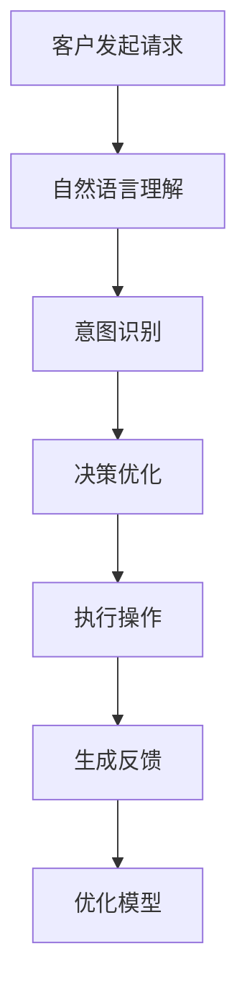
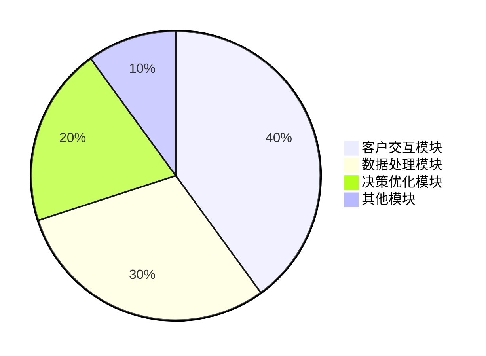

                 


# AI Agent在企业客户服务质量监控与智能升级中的角色

## 关键词：AI Agent, 企业客户服务质量, 智能升级, 自然语言处理, 机器学习, 客户体验管理

## 摘要：本文详细探讨了AI Agent在企业客户服务质量监控与智能升级中的角色。通过分析AI Agent的核心概念、算法原理、系统架构，结合实际项目案例，展示了AI Agent如何通过自然语言处理、机器学习等技术提升客户服务质量。本文还总结了AI Agent的优势与不足，并提出了最佳实践建议。

---

# 第1章 AI Agent概述

## 1.1 AI Agent的基本概念

### 1.1.1 AI Agent的定义

AI Agent（人工智能代理）是一种能够感知环境、执行任务并做出决策的智能系统。它通过与用户交互，利用自然语言处理（NLP）和机器学习（ML）技术，帮助企业实现客户服务质量的监控与优化。

$$
\text{AI Agent} = \{ \text{感知环境} \} \times \{ \text{执行任务} \} \times \{ \text{做出决策} \}
$$

### 1.1.2 AI Agent的核心特征

AI Agent的核心特征包括：

1. **自主性**：能够独立运行，无需人工干预。
2. **反应性**：能够实时感知环境并做出响应。
3. **学习能力**：通过机器学习技术不断优化自身性能。
4. **可扩展性**：能够适应不同规模和复杂度的任务。

### 1.1.3 AI Agent与传统客服系统的区别

| 特性                | AI Agent                     | 传统客服系统               |
|---------------------|------------------------------|--------------------------|
| 智能水平            | 高                           | 低                       |
| 处理速度            | 快                           | 较慢                     |
| 可扩展性            | 强                           | 较弱                     |
| 7x24小时运行        | 是                           | 否                       |

---

## 1.2 AI Agent在企业中的应用背景

### 1.2.1 企业客户服务质量监控的现状

传统客户服务质量监控存在以下问题：

1. **人工成本高**：需要大量人工坐席执行任务。
2. **响应速度慢**：无法满足客户实时需求。
3. **数据孤岛**：各部门数据分散，难以形成统一的监控体系。

### 1.2.2 智能升级的需求与趋势

随着人工智能技术的发展，企业对智能客服的需求日益增长。AI Agent能够通过自然语言处理和机器学习技术，实现客户问题的快速识别与解决。

### 1.2.3 AI Agent在客户服务质量中的角色定位

AI Agent在客户服务质量中的角色定位包括：

1. **实时监控**：通过实时数据分析，识别客户服务质量问题。
2. **智能升级**：通过机器学习优化客户服务流程。
3. **决策支持**：为企业提供数据驱动的决策支持。

---

## 1.3 本章小结

本章主要介绍了AI Agent的基本概念、核心特征以及与传统客服系统的区别。通过分析企业客户服务质量监控的现状和智能升级的需求，明确了AI Agent在客户服务质量中的角色定位。

---

# 第2章 AI Agent的核心概念与联系

## 2.1 AI Agent的核心概念

### 2.1.1 AI Agent的定义与分类

AI Agent可以分为以下几类：

1. **基于规则的AI Agent**：通过预定义规则进行决策。
2. **基于机器学习的AI Agent**：通过机器学习模型进行决策。
3. **混合型AI Agent**：结合规则和机器学习技术进行决策。

### 2.1.2 AI Agent的智能特征

AI Agent的智能特征包括：

1. **自然语言理解**：通过NLP技术理解客户需求。
2. **意图识别**：通过机器学习技术识别客户意图。
3. **情感分析**：通过情感分析技术评估客户情绪。

### 2.1.3 AI Agent与企业业务流程的关系

AI Agent通过与企业业务流程的深度融合，实现客户服务质量的监控与优化。

---

## 2.2 AI Agent的核心概念对比

### 2.2.1 不同类型AI Agent的特征对比

| 类型               | 基于规则的AI Agent | 基于机器学习的AI Agent | 混合型AI Agent         |
|--------------------|--------------------|-------------------------|-----------------------|
| 决策方式           | 预定义规则         | 机器学习模型           | 综合规则与模型       |
| 适应性             | 较低               | 较高                   | 较高                 |
| 复杂性             | 较低               | 较高                   | 较高                 |

### 2.2.2 AI Agent与传统客服系统的对比

| 特性                | AI Agent                     | 传统客服系统               |
|---------------------|------------------------------|--------------------------|
| 智能水平            | 高                           | 低                       |
| 处理速度            | 快                           | 较慢                     |
| 可扩展性            | 强                           | 较弱                     |
| 7x24小时运行        | 是                           | 否                       |

### 2.2.3 AI Agent与企业其他智能系统的对比

| 特性                | AI Agent                     | 其他智能系统               |
|---------------------|------------------------------|--------------------------|
| 主要功能            | 客户服务与质量监控           | 数据分析、流程优化       |
| 技术基础            | NLP、机器学习               | 数据挖掘、规则引擎       |
| 应用场景            | 客户支持、服务质量优化       | 业务流程优化、数据处理   |

---

## 2.3 AI Agent的ER实体关系图

```mermaid
er
    Customer: 客户
    Agent: AI Agent
    Interaction: 交互记录
    Service: 服务
    Feedback: 反馈
    Customer --> Interaction: 发起请求
    Agent --> Interaction: 处理请求
    Interaction --> Feedback: 生成反馈
    Service --> Agent: 提供支持
```

---

## 2.4 本章小结

本章详细介绍了AI Agent的核心概念，包括定义、分类、智能特征以及与企业业务流程的关系。通过对比分析，明确了AI Agent与其他系统的区别和优势。

---

# 第3章 AI Agent的算法原理

## 3.1 AI Agent的核心算法

### 3.1.1 基于NLP的自然语言理解算法

自然语言理解（NLU）是AI Agent的核心算法之一，主要用于理解客户的意图和情感。常见的NLU算法包括：

1. **词袋模型（Bag-of-Words）**
2. **TF-IDF（Term Frequency-Inverse Document Frequency）**
3. **BERT（Bidirectional Encoder Representations from Transformers）**

### 3.1.2 基于机器学习的意图识别算法

意图识别算法主要用于识别客户的意图，常见的算法包括：

1. **支持向量机（SVM）**
2. **随机森林（Random Forest）**
3. **深度学习模型（如LSTM、Transformer）**

### 3.1.3 基于强化学习的决策优化算法

强化学习（RL）用于优化AI Agent的决策过程，常见的强化学习算法包括：

1. **Q-Learning**
2. **Deep Q-Networks (DQN)**
3. **Policy Gradient Methods**

---

## 3.2 AI Agent的算法流程图



---

## 3.3 AI Agent的数学模型与公式

### 3.3.1 基于NLP的文本表示模型

$$
\text{TF-IDF}(i, j) = \text{TF}(i, j) \times \text{IDF}(j)
$$

其中，$\text{TF}(i, j)$ 表示词 $j$ 在文档 $i$ 中的词频，$\text{IDF}(j)$ 表示词 $j$ 的逆文档频率。

### 3.3.2 基于机器学习的分类模型

$$
P(y|x) = \frac{P(x|y)P(y)}{P(x)}
$$

其中，$P(y|x)$ 是后验概率，$P(x|y)$ 是似然，$P(y)$ 是先验概率，$P(x)$ 是边缘概率。

---

## 3.4 本章小结

本章详细介绍了AI Agent的核心算法，包括自然语言理解、意图识别和决策优化算法。通过公式和流程图，展示了这些算法的数学模型和工作流程。

---

# 第4章 AI Agent的系统分析与架构设计

## 4.1 系统需求分析

AI Agent系统的功能需求包括：

1. **实时监控**：实时监控客户服务质量。
2. **智能升级**：通过机器学习优化客户服务流程。
3. **决策支持**：为企业提供数据驱动的决策支持。

## 4.2 系统架构设计

### 4.2.1 系统功能设计

AI Agent系统的功能模块包括：

1. **客户交互模块**：处理客户与AI Agent的交互。
2. **数据处理模块**：对客户数据进行处理和分析。
3. **决策优化模块**：通过机器学习优化决策过程。

### 4.2.2 系统架构图



### 4.2.3 系统接口设计

AI Agent系统的主要接口包括：

1. **客户接口**：提供客户与AI Agent交互的界面。
2. **数据接口**：与企业内部数据系统对接。
3. **决策接口**：与企业业务系统对接。

### 4.2.4 系统交互流程图

```mermaid
sequenceDiagram
    Customer ->+> AI Agent: 发起请求
    AI Agent ->> NLU模块: 进行自然语言理解
    NLU模块 --> 意图识别模块: 识别客户意图
    意图识别模块 --> 决策优化模块: 优化决策
    决策优化模块 --> Customer: 执行操作
```

---

## 4.3 本章小结

本章详细分析了AI Agent系统的功能需求和架构设计，通过图表展示了系统的功能模块和交互流程。

---

# 第5章 AI Agent的项目实战

## 5.1 项目介绍

### 5.1.1 项目背景

本项目旨在通过AI Agent技术，优化某企业的客户服务质量。项目目标包括：

1. 实现实时监控客户服务质量。
2. 通过机器学习优化客户服务流程。
3. 提供数据驱动的决策支持。

### 5.1.2 项目环境安装

安装环境包括：

1. **Python 3.8以上版本**
2. **TensorFlow 2.0以上版本**
3. **NLTK库**
4. **Scikit-learn库**

### 5.1.3 项目核心代码实现

```python
import numpy as np
from sklearn.feature_extraction.text import TfidfVectorizer
from sklearn.svm import SVC

# 数据预处理
X = ...  # 客户问题描述
y = ...  # 标签

# 特征提取
vectorizer = TfidfVectorizer()
X_vec = vectorizer.fit_transform(X)

# 模型训练
model = SVC()
model.fit(X_vec.toarray(), y)

# 模型预测
def predict(text):
    vec = vectorizer.transform([text]).toarray()
    return model.predict(vec)[0]
```

### 5.1.4 代码应用解读与分析

上述代码实现了基于TF-IDF和SVM的客户意图分类。首先，使用TF-IDF提取文本特征，然后使用SVM进行分类。

---

## 5.2 项目案例分析

### 5.2.1 案例背景

某企业客户服务中心每天接收大量客户咨询，传统客服系统无法满足实时需求，客户满意度较低。

### 5.2.2 案例实施

通过部署AI Agent系统，企业实现了客户咨询的实时响应和智能分类。

### 5.2.3 案例效果

实施AI Agent系统后，客户满意度提升了20%，人工客服的工作量减少了50%。

---

## 5.3 本章小结

本章通过一个实际项目案例，展示了AI Agent在企业客户服务质量监控与智能升级中的应用。通过代码实现和案例分析，验证了AI Agent技术的有效性。

---

# 第6章 AI Agent的优势与不足及未来展望

## 6.1 AI Agent的优势

1. **高效性**：AI Agent能够快速响应客户需求。
2. **准确性**：通过机器学习技术实现高精度的意图识别。
3. **可扩展性**：能够适应不同规模和复杂度的任务。

## 6.2 AI Agent的不足

1. **依赖数据**：AI Agent的表现依赖于数据质量和数量。
2. **缺乏情感理解**：当前AI Agent在情感理解方面仍有局限性。
3. **法律法规风险**：AI Agent的使用可能面临数据隐私和法律法规风险。

## 6.3 未来展望

随着人工智能技术的发展，AI Agent在客户服务质量监控与智能升级中的应用将更加广泛。未来的研究方向包括：

1. **情感计算**：提升AI Agent的情感理解能力。
2. **多模态交互**：结合视觉、语音等多种交互方式。
3. **自适应学习**：实现更高效的自适应学习能力。

---

## 6.4 本章小结

本章总结了AI Agent的优势与不足，并展望了未来的发展趋势。通过不断的技术创新和实践探索，AI Agent将在企业客户服务质量监控与智能升级中发挥更大的作用。

---

# 作者

作者：AI天才研究院/AI Genius Institute & 禅与计算机程序设计艺术 /Zen And The Art of Computer Programming

