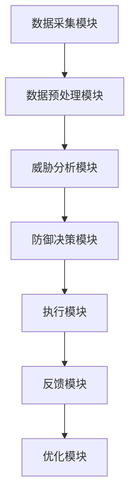

                 


# AI Agent在企业网络安全防御中的前沿应用

> **关键词**：AI Agent, 企业网络安全, 威胁检测, 强化学习, 自动化防御

> **摘要**：随着企业网络安全威胁的日益复杂化，传统的基于规则的防御方法已难以应对新型攻击手段。AI Agent作为一种智能化的网络安全防御工具，能够通过机器学习算法实时分析网络流量，识别异常行为，并自动采取防御措施。本文将从AI Agent的基本概念出发，详细探讨其在企业网络安全中的核心算法、系统架构设计、项目实战以及最佳实践，为企业网络安全防御提供新的思路和解决方案。

---

## 第一部分: AI Agent 在企业网络安全防御中的基础与原理

### 第1章: AI Agent 与企业网络安全概述

#### 1.1 AI Agent 的基本概念

##### 1.1.1 什么是AI Agent
AI Agent（人工智能代理）是一种能够感知环境、自主决策并执行任务的智能实体。在企业网络安全领域，AI Agent通常被设计为能够实时监控网络流量、识别潜在威胁并采取防御措施的智能系统。

##### 1.1.2 AI Agent 的核心特征
- **自主性**：能够自主决策，无需人工干预。
- **反应性**：能够实时感知环境变化并做出响应。
- **学习能力**：通过机器学习算法不断优化自身的威胁识别能力。
- **可扩展性**：能够适应不同规模和复杂度的企业网络环境。

##### 1.1.3 AI Agent 在企业中的应用价值
- 提高网络安全防御的效率和准确性。
- 实现自动化威胁检测与响应，降低人为错误。
- 适应复杂多变的网络安全威胁，提供动态防御能力。

#### 1.2 企业网络安全的挑战与需求

##### 1.2.1 传统网络安全的局限性
- 基于规则的防御机制难以应对未知威胁。
- 人工监控效率低下，容易漏掉复杂攻击。
- 面对高级持续性威胁（APT），传统方法难以有效应对。

##### 1.2.2 现代企业网络安全的需求
- 实时监控与快速响应能力。
- 智能化威胁分析与预测能力。
- 自动化防御与修复能力。

##### 1.2.3 AI Agent 在网络安全中的角色定位
- **威胁检测**：通过机器学习算法识别异常行为。
- **防御决策**：基于实时数据做出防御策略。
- **自动化执行**：快速执行防御动作，最小化攻击影响。

#### 1.3 本章小结
本章介绍了AI Agent的基本概念及其在企业网络安全中的核心特征和应用价值。同时，分析了传统网络安全的局限性和现代企业对智能化防御的需求，为后续章节的深入探讨奠定了基础。

---

### 第2章: AI Agent 的核心概念与原理

#### 2.1 AI Agent 的工作原理

##### 2.1.1 感知层：数据采集与分析
AI Agent通过网络传感器、日志分析工具等渠道采集网络流量数据，并利用自然语言处理（NLP）和特征提取技术进行数据预处理。

##### 2.1.2 决策层：威胁判断与策略制定
基于机器学习模型（如监督学习、无监督学习和强化学习），AI Agent分析数据，识别潜在威胁，并制定防御策略。

##### 2.1.3 执行层：防御动作的实施
根据决策层的指令，AI Agent执行具体的防御动作，如封锁可疑IP、切断网络连接或触发警报。

#### 2.2 AI Agent 的核心算法

##### 2.2.1 监督学习算法
- **逻辑回归**：用于分类网络流量，判断是否为恶意流量。
- **随机森林**：用于分类和回归分析，识别异常行为模式。

##### 2.2.2 强化学习算法
- **Q-learning**：通过奖励机制优化防御策略，实现动态防御。
- **深度强化学习（DRL）**：利用深度神经网络和强化学习结合，提高决策的复杂性和准确性。

##### 2.2.3 无监督学习算法
- **聚类分析**：用于识别网络中的异常行为模式。
- **自动编码器（AE）**：用于检测异常数据点，发现潜在威胁。

#### 2.3 AI Agent 的优势与挑战

##### 2.3.1 优势：高效性与智能化
- 能够快速处理大量数据，实时识别威胁。
- 通过机器学习不断优化威胁检测能力。

##### 2.3.2 挑战：数据依赖性与模型鲁棒性
- 对数据质量和数量的依赖性较高。
- 模型可能存在过拟合或欠拟合问题，影响威胁检测的准确性。

#### 2.4 本章小结
本章详细介绍了AI Agent的核心概念和工作原理，重点分析了其在企业网络安全中的算法实现及其优缺点，为后续章节的系统设计和项目实现提供了理论基础。

---

### 第3章: 企业网络安全的现状与问题分析

#### 3.1 传统企业网络安全体系的局限性

##### 3.1.1 基于规则的防御机制
- 需要手动配置规则，难以应对未知威胁。
- 规则更新滞后，无法及时应对新型攻击手法。

##### 3.1.2 人工监控的低效性
- 人工监控效率低下，容易漏掉复杂攻击。
- 需要大量专业人员，企业成本较高。

##### 3.1.3 面对高级威胁的无力性
- APT攻击难以被传统防御手段检测。
- 需要更高级的防御技术应对复杂威胁。

#### 3.2 现代企业网络安全的需求

##### 3.2.1 实时性与动态性
- 需要实时监控网络流量，快速响应潜在威胁。
- 能够动态调整防御策略，应对变化的威胁环境。

##### 3.2.2 智能化与自主性
- 需要智能化的威胁分析能力，识别复杂攻击模式。
- 能够自主决策并执行防御动作，减少人为干预。

##### 3.2.3 可扩展性与可定制性
- 需要支持不同规模和复杂度的企业网络环境。
- 能够根据企业需求定制化防御策略。

#### 3.3 AI Agent 在企业网络安全中的应用前景

##### 3.3.1 威胁检测与响应
- 通过机器学习算法实时检测网络中的威胁。
- 自动触发防御机制，快速响应潜在威胁。

##### 3.3.2 行为分析与异常识别
- 通过行为分析识别内部威胁和外部攻击。
- 基于用户行为分析（UBA）技术检测异常行为模式。

##### 3.3.3 自动化防御与修复
- 自动化执行防御动作，如封锁恶意IP、切断网络连接。
- 自动修复受损系统，减少攻击影响。

#### 3.4 本章小结
本章分析了传统企业网络安全体系的局限性，提出了现代企业对智能化、自动化防御的需求，并探讨了AI Agent在企业网络安全中的应用前景。

---

### 第4章: AI Agent 在企业网络安全中的算法实现

#### 4.1 基于监督学习的威胁检测

##### 4.1.1 数据标注与训练
- 数据标注：将网络流量标记为正常或异常。
- 模型训练：使用逻辑回归或随机森林算法训练分类模型。

##### 4.1.2 分类算法的实现
- 逻辑回归实现：
  ```python
  from sklearn.linear_model import LogisticRegression
  model = LogisticRegression()
  model.fit(X_train, y_train)
  ```

- 随机森林实现：
  ```python
  from sklearn.ensemble import RandomForestClassifier
  model = RandomForestClassifier()
  model.fit(X_train, y_train)
  ```

##### 4.1.3 模型评估与优化
- 评估指标：准确率、召回率、F1分数。
- 超参数优化：使用网格搜索（Grid Search）优化模型性能。

#### 4.2 基于强化学习的防御策略

##### 4.2.1 状态空间的定义
- 状态：当前网络的流量特征，如流量大小、来源IP、目标IP等。

##### 4.2.2 动作空间的设计
- 动作：允许或禁止某个IP的访问，调整防火墙规则。

##### 4.2.3 奖励函数的构建
- 奖励：当防御策略成功阻止攻击时，给予正向奖励；当误阻正常流量时，给予负向惩罚。

##### 4.2.4 强化学习算法实现
- Q-learning实现：
  ```python
  import numpy as np
  q_table = np.zeros([state_space, action_space])
  for episode in range(num_episodes):
      current_state = get_current_state()
      while not episode_over:
          # 选择动作
          action = choose_action(current_state)
          # 执行动作并观察下一个状态和奖励
          next_state, reward = take_action(action)
          # 更新Q表
          q_table[current_state][action] = q_table[current_state][action] + learning_rate * (reward + discount_factor * np.max(q_table[next_state]) - q_table[current_state][action])
          current_state = next_state
  ```

#### 4.3 基于无监督学习的异常检测

##### 4.3.1 聚类算法的实现
- K-means实现：
  ```python
  from sklearn.cluster import KMeans
  model = KMeans(n_clusters=2)
  model.fit(X)
  ```

##### 4.3.2 张成空间的构建
- 使用主成分分析（PCA）或t-SNE对数据进行降维，构建张成空间。

##### 4.3.3 自动编码器的应用
- 自动编码器结构：
  ```python
  input_layer = Input(shape=(input_dim,))
  encoder = Dense(units=encoding_dim, activation='relu')(input_layer)
  decoder = Dense(units=input_dim, activation='sigmoid')(encoder)
  autoencoder = Model(inputs=input_layer, outputs=decoder)
  autoencoder.compile(optimizer='adam', loss='binary_crossentropy')
  autoencoder.fit(X_train, X_train, epochs=10, batch_size=256)
  ```

#### 4.4 算法实现的数学模型与公式

##### 4.4.1 分类算法的损失函数
- 逻辑回归损失函数：
  $$ L(y, y_{pred}) = -\frac{1}{m} \sum_{i=1}^{m} [y_i \ln y_{pred} + (1 - y_i) \ln (1 - y_{pred})] $$

##### 4.4.2 强化学习的Q-learning公式
  $$ Q(s, a) = Q(s, a) + \alpha [r + \gamma \max Q(s', a') - Q(s, a)] $$

##### 4.4.3 无监督学习的聚类算法公式
  $$ \text{目标函数} = \sum_{i=1}^{n} \sum_{j=1}^{k} w_{ij}^2 + \sum_{j=1}^{k} \sum_{m=1}^{d} (\mu_j - \mu_m)^2 $$

#### 4.5 本章小结
本章详细探讨了AI Agent在企业网络安全中的算法实现，重点分析了监督学习、强化学习和无监督学习的原理与实现方式，并通过具体的Python代码示例和数学公式加深了读者的理解。

---

### 第5章: 企业网络安全防御的系统架构设计

#### 5.1 系统功能设计

##### 5.1.1 数据采集模块
- 功能：实时采集网络流量数据，包括IP地址、端口号、数据包大小等。
- 工具：使用tcpdump、Wireshark等工具采集网络数据。

##### 5.1.2 威胁分析模块
- 功能：利用机器学习算法分析数据，识别潜在威胁。
- 工具：使用Scikit-learn、TensorFlow等机器学习框架实现威胁检测。

##### 5.1.3 防御决策模块
- 功能：根据威胁分析结果，制定防御策略。
- 工具：使用规则引擎或决策树算法实现防御策略的制定。

##### 5.1.4 执行与反馈模块
- 功能：执行防御动作，如封锁IP、切断网络连接，并收集反馈信息以优化模型。

#### 5.2 系统架构设计

##### 5.2.1 分层架构设计
- **数据采集层**：负责数据的采集与预处理。
- **威胁分析层**：负责威胁的识别与分类。
- **防御决策层**：负责防御策略的制定与执行。
- **反馈与优化层**：负责模型优化与效果评估。

##### 5.2.2 微服务架构设计
- **数据采集服务**：负责数据的采集与传输。
- **威胁分析服务**：负责威胁的识别与分类。
- **防御决策服务**：负责防御策略的制定与执行。
- **反馈与优化服务**：负责模型优化与效果评估。

##### 5.2.3 系统交互设计
- 使用RESTful API进行模块间的通信。
- 使用消息队列（如Kafka）实现异步数据传输。

#### 5.3 系统架构图


#### 5.4 本章小结
本章详细设计了AI Agent在企业网络安全防御中的系统架构，包括功能设计、架构设计和系统交互设计，为后续章节的项目实现提供了系统的架构支持。

---

## 第二部分: 项目实战与最佳实践

### 第6章: 项目实战

#### 6.1 环境安装与配置

##### 6.1.1 安装依赖
- 安装Python环境：Python 3.8+
- 安装机器学习库：Scikit-learn, TensorFlow, Keras
- 安装网络数据采集工具：tcpdump, Wireshark

##### 6.1.2 安装框架
- 安装Flask框架用于Web接口开发。
- 安装Django框架用于系统管理。

#### 6.2 系统核心实现

##### 6.2.1 数据采集模块实现
```python
import socket

def capture_packet():
    s = socket.socket(socket.AF_INET, socket.SOCK_RAW, socket.IPPROTO_TCP)
    s.bind(('0.0.0.0', 0))
    s.setsockopt(socket.SOL_IP, socket.IP_HDRINCL, 1)
    while True:
        packet = s.recvfrom(65535)
        # 处理数据包
        yield packet
```

##### 6.2.2 威胁分析模块实现
```python
from sklearn.ensemble import RandomForestClassifier
import pandas as pd

# 数据预处理
data = pd.read_csv('network_traffic.csv')
X = data.drop('label', axis=1)
y = data['label']

# 模型训练
model = RandomForestClassifier()
model.fit(X, y)

# 模型预测
new_data = pd.read_csv('new_traffic.csv')
predicted_labels = model.predict(new_data)
```

##### 6.2.3 防御决策模块实现
```python
import requests

def block_ip(ip):
    # 发送API请求，封锁IP
    response = requests.post('http://firewall/api/block_ip', json={'ip': ip})
    return response.status_code
```

##### 6.2.4 执行与反馈模块实现
```python
import logging
import time

def execute_defense(ip):
    try:
        status_code = block_ip(ip)
        if status_code == 200:
            logging.info(f'Successfully blocked IP: {ip}')
        else:
            logging.error(f'Failed to block IP: {ip}')
    except Exception as e:
        logging.error(f'Error blocking IP: {ip}, error: {str(e)}')

# 示例：执行防御动作
execute_defense('192.168.1.100')
```

#### 6.3 代码应用解读与分析

##### 6.3.1 数据采集模块
- 使用原始套接字捕获网络数据包。
- 数据包捕获后，存储到文件或数据库中。

##### 6.3.2 威胁分析模块
- 使用随机森林算法训练分类模型。
- 对新数据进行预测，识别潜在威胁。

##### 6.3.3 防御决策模块
- 根据预测结果，决定是否采取防御措施。
- 调用API接口，实现IP封锁等防御动作。

##### 6.3.4 执行与反馈模块
- 执行防御动作后，记录日志并反馈结果。
- 根据反馈信息，优化模型或调整防御策略。

#### 6.4 实际案例分析

##### 6.4.1 案例背景
- 某企业遭受DDoS攻击，传统防火墙未能有效防御。
- 引入AI Agent后，成功识别并阻止了攻击。

##### 6.4.2 案例分析
- 数据采集：捕获网络流量数据。
- 威胁分析：随机森林算法识别出异常流量。
- 防御决策：自动封锁攻击源IP。
- 执行与反馈：记录日志并优化模型。

#### 6.5 项目小结
本章通过实际案例展示了AI Agent在企业网络安全中的应用，详细解读了系统核心实现，并分析了项目实施的效果和价值。

---

### 第7章: 最佳实践与注意事项

#### 7.1 最佳实践

##### 7.1.1 数据质量管理
- 确保数据的完整性和准确性。
- 去除噪声数据，提高模型性能。

##### 7.1.2 模型优化
- 使用网格搜索优化模型参数。
- 定期更新模型，应对新威胁。

##### 7.1.3 系统安全
- 确保AI Agent系统的安全性，防止被攻击。
- 定期进行安全审计和漏洞扫描。

##### 7.1.4 团队协作
- 建立跨学科团队，包括数据科学家、网络安全专家和开发人员。
- 保持团队协作，持续改进系统。

#### 7.2 注意事项

##### 7.2.1 数据隐私保护
- 遵守数据隐私法规，保护用户数据。
- 使用加密技术，防止数据泄露。

##### 7.2.2 模型鲁棒性
- 防止模型被攻击者利用，提高模型的鲁棒性。
- 使用对抗训练方法，增强模型的防御能力。

##### 7.2.3 系统可扩展性
- 设计可扩展的系统架构，应对企业网络的扩展需求。
- 使用云原生技术，提高系统的弹性。

#### 7.3 本章小结
本章总结了AI Agent在企业网络安全中的最佳实践和注意事项，为读者提供了实际应用中的经验和建议。

---

## 第三部分: 总结与展望

### 第8章: 总结与展望

#### 8.1 本章总结
- AI Agent作为一种智能化的网络安全防御工具，能够通过机器学习算法实时分析网络流量，识别异常行为，并自动采取防御措施。
- 本文详细探讨了AI Agent的核心概念、算法实现、系统架构设计以及项目实战，为企业网络安全防御提供了新的思路和解决方案。

#### 8.2 未来展望
- **模型优化**：引入更先进的机器学习算法，如图神经网络（GNN），提高威胁检测的准确性。
- **多模态分析**：结合网络流量、日志数据和用户行为等多种数据源，实现更全面的威胁分析。
- **人机协作**：AI Agent与人类专家协同工作，结合人类的判断力和机器的自动化能力，提升防御效果。
- **边缘计算**：将AI Agent部署在边缘设备上，实现更快速的响应和更低的延迟。

#### 8.3 本章小结
本章总结了全文的主要内容，并对未来的研究方向和应用场景进行了展望，为读者提供了更广阔的思考空间。

---

## 作者：AI天才研究院/AI Genius Institute & 禅与计算机程序设计艺术/Zen And The Art of Computer Programming

---

**注**：本文仅展示了部分关键章节和核心内容，完整文章将包含更多详细的技术细节和实战代码。

