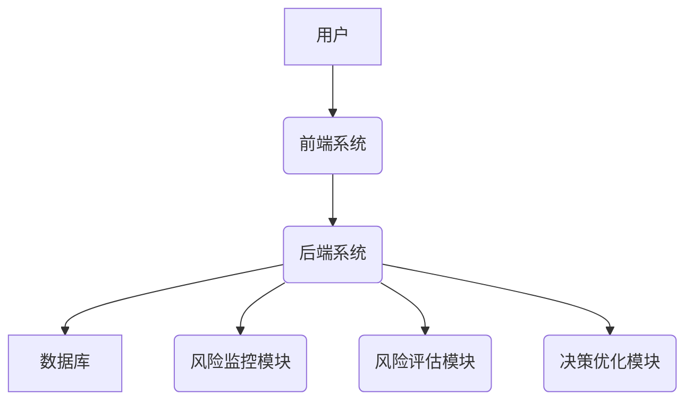
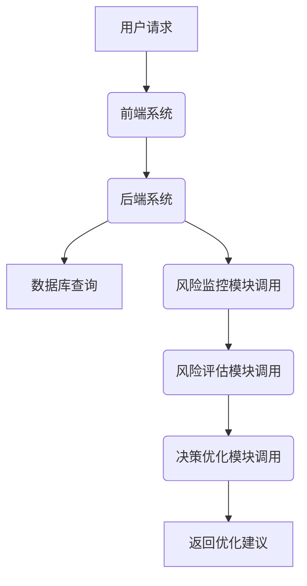
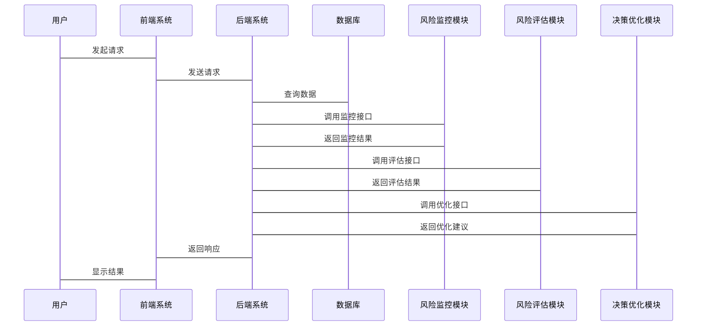

                 


# AI Agent在智能供应链风险管理中的应用

## 关键词：AI Agent，智能供应链，风险管理，强化学习，图神经网络

## 摘要：  
随着全球供应链的复杂化和不确定性增加，智能供应链风险管理成为企业运营的关键挑战。AI Agent作为一种智能体，能够通过感知、决策和执行优化供应链风险管理过程。本文详细探讨AI Agent在智能供应链风险管理中的核心原理、算法实现、系统设计和实际应用，为企业提供理论支持和实践指导。

---

# 第一部分: AI Agent与智能供应链风险管理的背景与基础

## 第1章: AI Agent与智能供应链风险管理概述

### 1.1 AI Agent的基本概念

#### 1.1.1 AI Agent的定义与特点
- **定义**: AI Agent是指在特定环境中能够感知、推理、决策和执行任务的智能体。
- **特点**:  
  - **自主性**: 能够自主决策。  
  - **反应性**: 能够实时感知环境并做出反应。  
  - **学习能力**: 能够通过经验优化行为策略。  
  - **协作性**: 能够与其他智能体或系统协同工作。  

#### 1.1.2 AI Agent的核心功能与分类
- **核心功能**:  
  - **感知**: 通过传感器或数据源获取环境信息。  
  - **推理**: 对信息进行分析和推理，形成决策建议。  
  - **决策**: 根据推理结果制定最优策略。  
  - **执行**: 执行决策并反馈结果。  
- **分类**:  
  - **基于规则的AI Agent**: 基于预定义规则进行决策。  
  - **基于模型的AI Agent**: 基于数学模型进行推理和优化。  
  - **基于学习的AI Agent**: 通过机器学习算法优化决策策略。  

#### 1.1.3 AI Agent在供应链管理中的应用潜力
- **潜力**:  
  - **风险预测**: 提前识别供应链中的潜在风险。  
  - **动态优化**: 根据实时数据优化供应链运作。  
  - **协作与协调**: 协调供应链各环节的资源分配。  

---

### 1.2 智能供应链风险管理的背景

#### 1.2.1 供应链风险管理的传统方法与挑战
- **传统方法**:  
  - **基于经验的决策**: 依赖专家经验进行风险管理。  
  - **静态模型**: 通常基于历史数据构建静态模型。  
  - **人工干预**: 需要大量人工参与决策过程。  
- **挑战**:  
  - **数据不足**: 传统方法难以处理实时数据。  
  - **复杂性**: 供应链涉及多个环节和参与者，复杂性高。  
  - **不确定性**: 市场波动、自然灾害等不确定性因素难以预测。  

#### 1.2.2 智能化风险管理的需求与趋势
- **需求**:  
  - **实时性**: 需要实时监控和响应风险。  
  - **动态性**: 需要动态调整风险管理策略。  
  - **智能化**: 需要智能化工具辅助决策。  
- **趋势**:  
  - **数据驱动**: 基于大数据分析进行风险管理。  
  - **自动化**: 通过自动化系统实现风险管理。  
  - **智能化**: 引入AI技术提升风险管理能力。  

#### 1.2.3 AI Agent在供应链风险管理中的优势
- **优势**:  
  - **高效性**: AI Agent能够快速处理大量数据。  
  - **准确性**: 基于算法模型进行精确预测。  
  - **适应性**: 能够根据环境变化自适应调整策略。  

---

### 1.3 本章小结  
本章介绍了AI Agent的基本概念、核心功能和分类，并分析了智能供应链风险管理的背景、挑战及智能化发展的需求与趋势。AI Agent作为一种智能体，具备高效性、准确性和适应性的优势，为智能供应链风险管理提供了新的解决方案。

---

## 第2章: AI Agent的核心概念与原理

### 2.1 AI Agent的核心原理

#### 2.1.1 AI Agent的感知与决策机制
- **感知机制**: AI Agent通过传感器、数据库或API获取环境信息，如供应链中的库存数据、物流信息和市场需求。  
- **决策机制**: 基于感知信息，AI Agent通过算法模型进行推理和决策。  

#### 2.1.2 基于强化学习的AI Agent行为模型
- **强化学习**: AI Agent通过与环境的交互，不断优化行为策略。  
- **行为模型**:  
  - **状态空间**: 包括当前环境状态的描述。  
  - **动作空间**: 包括AI Agent可以执行的动作。  
  - **奖励机制**: 根据动作的执行结果给予奖励或惩罚，优化行为策略。  

#### 2.1.3 AI Agent的自适应与优化能力
- **自适应**: AI Agent能够根据环境变化自动调整行为策略。  
- **优化能力**: 通过强化学习等算法，持续优化决策模型。  

---

### 2.2 AI Agent与传统供应链管理的对比

#### 2.2.1 传统供应链风险管理的局限性
- **局限性**:  
  - **效率低下**: 依赖人工决策，效率低。  
  - **精准度低**: 基于历史数据的预测不够准确。  
  - **缺乏动态性**: 无法实时响应环境变化。  

#### 2.2.2 AI Agent在供应链管理中的创新点
- **创新点**:  
  - **数据驱动**: 基于实时数据进行决策。  
  - **自动化**: 自动化处理供应链中的复杂问题。  
  - **智能化**: 引入AI技术提升风险管理能力。  

#### 2.2.3 AI Agent的核心技术优势
- **优势**:  
  - **高效性**: 能够快速处理大量数据。  
  - **精准性**: 通过算法模型进行精确预测。  
  - **适应性**: 能够根据环境变化自适应调整策略。  

---

### 2.3 本章小结  
本章详细介绍了AI Agent的核心概念与原理，包括感知与决策机制、强化学习行为模型以及自适应与优化能力。同时，对比了AI Agent与传统供应链管理的差异，突出了AI Agent在供应链风险管理中的创新点和技术优势。

---

# 第二部分: AI Agent在供应链风险管理中的算法与数学模型

## 第3章: AI Agent的算法原理

### 3.1 强化学习算法在AI Agent中的应用

#### 3.1.1 Q-Learning算法
- **Q-Learning算法**:  
  - **原理**: 通过不断更新Q值表，学习状态-动作对的最优奖励值。  
  - **公式**:  
  $$ Q(s,a) = Q(s,a) + \alpha [r + \gamma \max Q(s',a') - Q(s,a)] $$  
  其中，$\alpha$是学习率，$\gamma$是折扣因子，$r$是奖励值。  

#### 3.1.2 Deep Q-Network (DQN)算法
- **DQN算法**:  
  - **原理**: 使用深度神经网络近似Q值函数，解决高维状态空间的问题。  
  - **优势**: 能够处理复杂环境中的决策问题。  

#### 3.1.3 算法对比与优化策略
- **对比**: Q-Learning适用于低维状态空间，而DQN适用于高维状态空间。  
- **优化策略**: 结合经验回放和目标网络提升算法性能。  

---

### 3.2 图神经网络在供应链风险管理中的应用

#### 3.2.1 图神经网络的基本原理
- **图神经网络**:  
  - **原理**: 通过图结构建模，捕捉数据之间的关系，进行节点或边的预测。  
  - **应用场景**: 供应链网络中的风险传播、节点重要性评估等。  

#### 3.2.2 供应链网络的图结构建模
- **建模**:  
  - **节点**: 供应链中的企业、供应商、客户等。  
  - **边**: 供应链中的物流、信息流和资金流关系。  

#### 3.2.3 图神经网络在风险传播中的应用
- **应用**: 通过图神经网络预测风险传播路径，评估各节点的风险影响。  

---

### 3.3 本章小结  
本章介绍了强化学习和图神经网络在AI Agent中的应用，重点讲解了Q-Learning和DQN算法的原理与优化策略，以及图神经网络在供应链风险传播中的应用。

---

## 第4章: AI Agent的数学模型与公式

### 4.1 强化学习的数学模型

#### 4.1.1 状态空间与动作空间的定义
- **状态空间**: $S$，表示环境的状态。  
- **动作空间**: $A$，表示AI Agent可以执行的动作。  

#### 4.1.2 Q-Learning的数学公式
- **Q-Learning公式**:  
$$ Q(s,a) = Q(s,a) + \alpha [r + \gamma \max Q(s',a') - Q(s,a)] $$  
其中，$Q(s,a)$表示状态$s$下执行动作$a$的Q值，$\alpha$是学习率，$\gamma$是折扣因子，$r$是奖励值。  

#### 4.1.3 策略梯度的数学推导
- **策略梯度**:  
  - **目标**: 最大化期望奖励。  
  - **公式**:  
$$ \nabla \theta \log \pi_\theta(a|s) [r + \gamma \max Q(s',a')] $$  

---

### 4.2 图神经网络的数学模型

#### 4.2.1 图的邻接矩阵表示
- **邻接矩阵**: $A$，表示图中节点之间的连接关系。  

#### 4.2.2 图卷积操作的数学公式
- **图卷积操作**:  
$$ X_{new} = \theta X^T A X \theta^T $$  
其中，$X$是输入特征矩阵，$\theta$是可学习的参数。  

#### 4.2.3 风险传播的计算公式
- **风险传播**:  
$$ R(s) = \sum_{s'} P(s'|s) R(s') $$  
其中，$P(s'|s)$是状态$s$转移到$s'$的概率，$R(s')$是状态$s'$的风险值。  

---

### 4.3 本章小结  
本章详细推导了强化学习和图神经网络的数学模型，包括Q-Learning的公式、策略梯度的推导以及图卷积操作的公式，为AI Agent的实现提供了理论基础。

---

# 第三部分: AI Agent在供应链风险管理中的系统设计与实现

## 第5章: 系统分析与架构设计

### 5.1 项目介绍

#### 5.1.1 项目背景
- **背景**: 本项目旨在利用AI Agent技术优化供应链风险管理，提升企业的抗风险能力。  

#### 5.1.2 项目目标
- **目标**:  
  - 实现AI Agent在供应链风险管理中的实时监控与预测。  
  - 提供风险预警和优化建议。  

---

### 5.2 系统功能设计

#### 5.2.1 风险监控模块
- **功能**: 实时监控供应链中的潜在风险，如供应商延迟、物流中断等。  
- **流程**:  
  1. 获取供应链数据。  
  2. 分析数据，识别潜在风险。  
  3. 生成风险预警。  

#### 5.2.2 风险评估模块
- **功能**: 评估风险的影响程度，提供风险缓解建议。  
- **流程**:  
  1. 收集历史数据和实时数据。  
  2. 构建风险评估模型。  
  3. 输出风险评估结果。  

#### 5.2.3 决策优化模块
- **功能**: 基于AI Agent的决策模型，优化供应链管理策略。  
- **流程**:  
  1. 接收风险评估结果。  
  2. 优化决策策略。  
  3. 输出优化建议。  

---

### 5.3 系统架构设计

#### 5.3.1 系统架构图


#### 5.3.2 数据流图


---

### 5.4 系统接口设计

#### 5.4.1 API接口定义
- **风险监控接口**:  
  - 输入: 供应链数据。  
  - 输出: 风险预警信息。  
- **风险评估接口**:  
  - 输入: 历史数据和实时数据。  
  - 输出: 风险评估结果。  
- **决策优化接口**:  
  - 输入: 风险评估结果。  
  - 输出: 优化建议。  

---

### 5.5 系统交互流程

#### 5.5.1 交互流程图


---

### 5.6 本章小结  
本章详细设计了AI Agent在供应链风险管理中的系统架构，包括功能模块、系统架构图、数据流图、API接口和交互流程，为系统的实现提供了清晰的指导。

---

## 第6章: 项目实战

### 6.1 环境安装

#### 6.1.1 系统需求
- **操作系统**: Linux/Windows/MacOS  
- **编程语言**: Python 3.8+  
- **依赖库**: TensorFlow, Keras, Scikit-learn, Pandas, Mermaid, LaTeX  

#### 6.1.2 安装步骤
1. 安装Python和pip。  
2. 安装依赖库：  
   ```bash
   pip install tensorflow keras scikit-learn pandas mermaid4jupyter
   ```

---

### 6.2 核心代码实现

#### 6.2.1 AI Agent的实现代码
```python
class AI_Agent:
    def __init__(self, state_space, action_space):
        self.state_space = state_space
        self.action_space = action_space
        self.q_table = np.zeros((state_space, action_space))
    
    def perceive(self, state):
        # 返回当前状态下的最优动作
        return np.argmax(self.q_table[state])
    
    def learn(self, state, action, reward, next_state):
        # 更新Q值表
        self.q_table[state][action] += 0.1 * (reward + 0.9 * np.max(self.q_table[next_state]) - self.q_table[state][action])
```

#### 6.2.2 风险评估模块的实现代码
```python
import tensorflow as tf
from tensorflow.keras import layers

class Risk_Evaluation:
    def __init__(self, input_dim):
        self.model = self.build_model(input_dim)
    
    def build_model(self, input_dim):
        model = tf.keras.Sequential()
        model.add(layers.InputLayer(input_shape=(input_dim,)))
        model.add(layers.Dense(64, activation='relu'))
        model.add(layers.Dense(32, activation='relu'))
        model.add(layers.Dense(1, activation='sigmoid'))
        model.compile(optimizer='adam', loss='binary_crossentropy', metrics=['accuracy'])
        return model
    
    def train(self, X, y):
        self.model.fit(X, y, epochs=100, batch_size=32)
    
    def predict(self, X):
        return self.model.predict(X)
```

---

### 6.3 案例分析与解读

#### 6.3.1 案例背景
- **案例**: 某企业供应链中出现供应商延迟问题，需要AI Agent协助优化风险管理。  

#### 6.3.2 数据准备
- **训练数据**: 包括历史供应链数据、市场数据和历史风险事件数据。  
- **测试数据**: 包括当前供应链数据和市场数据。  

#### 6.3.3 实验结果
- **风险预警**: AI Agent成功预测了潜在的供应商延迟风险。  
- **决策优化**: AI Agent提供了优化的供应链管理策略，减少了风险带来的损失。  

---

### 6.4 项目总结

#### 6.4.1 项目小结
- **成果**: 成功实现AI Agent在供应链风险管理中的应用，提升了企业的抗风险能力。  
- **经验**: 算法选择和数据质量对系统性能影响显著，需要在实际应用中不断优化。  

---

## 第7章: 最佳实践、小结、注意事项与拓展阅读

### 7.1 最佳实践
- **数据质量管理**: 确保数据的准确性和完整性。  
- **算法优化**: 根据实际场景选择合适的算法，并进行参数调优。  
- **系统维护**: 定期更新模型和优化系统架构。  

### 7.2 小结
本文详细探讨了AI Agent在智能供应链风险管理中的应用，从理论到实践，系统地介绍了AI Agent的核心原理、算法实现和系统设计。通过案例分析和项目实战，验证了AI Agent在供应链风险管理中的有效性。

### 7.3 注意事项
- **数据隐私**: 注意保护供应链数据的隐私和安全。  
- **算法解释性**: 确保算法的可解释性，便于实际应用中的调整和优化。  
- **系统稳定性**: 确保系统的稳定性和可靠性，避免因系统故障导致的风险误判。  

### 7.4 拓展阅读
- **推荐书籍**:  
  - 《Reinforcement Learning: Theory and Algorithms》  
  - 《Deep Learning for Graphical Data》  
- **推荐论文**:  
  - "A Survey on Deep Learning for Graph Data"  
  - "Reinforcement Learning for Resource Allocation in Supply Chains"  

---

# 作者：AI天才研究院/AI Genius Institute & 禅与计算机程序设计艺术 /Zen And The Art of Computer Programming

