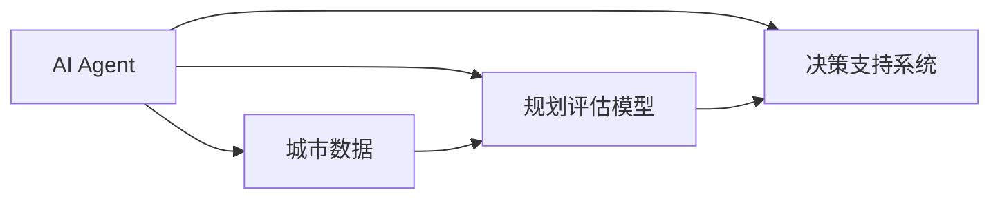
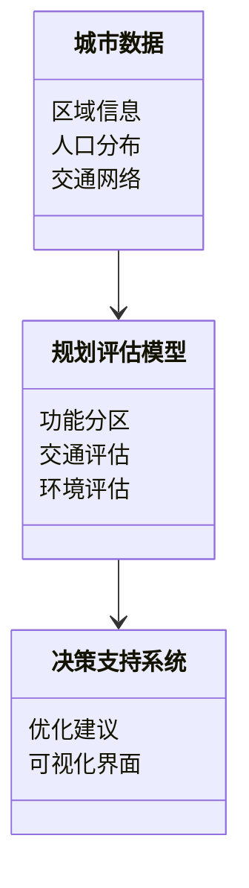
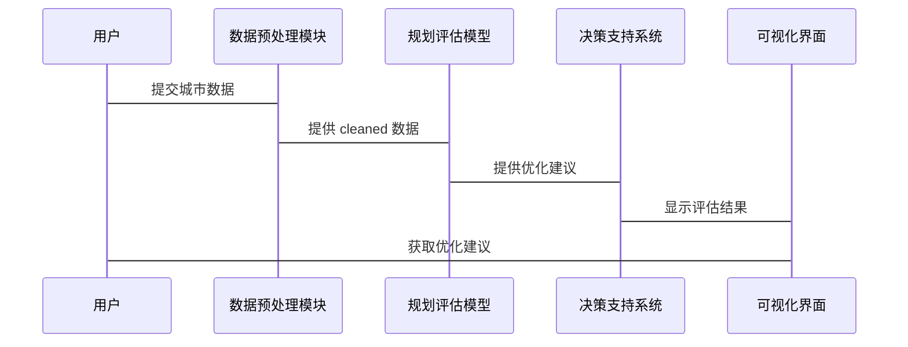

                 


# AI Agent在智能城市规划评估中的角色

> 关键词：AI Agent, 智能城市, 城市规划评估, 人工智能, 城市数据, 决策支持系统, 算法原理

> 摘要：本文探讨了AI Agent在智能城市规划评估中的核心角色，通过分析AI Agent的基本概念、算法原理、系统架构，以及在城市规划评估中的具体应用，展示了AI Agent如何通过数据驱动的方法优化城市规划过程，提升城市可持续发展能力。

---

# 第一部分: AI Agent在智能城市规划评估中的背景与概念

## 第1章: AI Agent与智能城市概述

### 1.1 AI Agent的基本概念

#### 1.1.1 AI Agent的定义与特点
- **定义**：AI Agent（人工智能代理）是一种能够感知环境、自主决策并执行任务的智能实体。
- **特点**：
  - **自主性**：能够在无外部干预的情况下运行。
  - **反应性**：能够实时感知环境并做出反应。
  - **目标导向**：通过优化目标函数实现特定任务。
  - **学习能力**：能够通过数据学习和优化模型。

#### 1.1.2 AI Agent的核心属性与功能
- **感知能力**：通过传感器、API或其他数据源获取环境信息。
- **决策能力**：基于感知数据，利用算法生成决策。
- **执行能力**：通过执行器或接口将决策转化为行动。
- **学习能力**：通过强化学习、监督学习等方法优化模型。

#### 1.1.3 AI Agent与传统自动化系统的区别
| 特性       | AI Agent               | 传统自动化系统           |
|------------|------------------------|--------------------------|
| 智能性     | 高                     | 低                      |
| 自适应性   | 强                     | 弱                      |
| 决策能力   | 强                     | 无或弱                  |
| 学习能力   | 强                     | 无或弱                  |

### 1.2 智能城市规划评估的背景与挑战

#### 1.2.1 智能城市的发展现状
- 城市化进程加速，城市规模不断扩大。
- 城市资源分配不均、环境污染等问题日益突出。
- 智能城市通过数字化手段优化资源配置。

#### 1.2.2 城市规划评估中的关键问题
- 数据量大、维度复杂。
- 评估标准多样，难以统一。
- 传统方法效率低，难以应对动态变化。

#### 1.2.3 AI Agent在城市规划评估中的潜在价值
- 提供实时数据处理能力。
- 优化评估模型，提高评估效率。
- 支持动态调整，增强决策的灵活性。

### 1.3 AI Agent在智能城市中的角色定位

#### 1.3.1 AI Agent在城市数据处理中的作用
- 数据清洗、整合与分析。
- 数据驱动的决策支持。

#### 1.3.2 AI Agent在城市决策支持中的功能
- 智能化决策模型构建。
- 多目标优化与权衡。

#### 1.3.3 AI Agent在城市规划评估中的创新应用
- 动态评估模型。
- 可视化评估结果。

### 1.4 本章小结
本章介绍了AI Agent的基本概念、核心属性以及在智能城市中的角色定位，为后续章节奠定了基础。

---

# 第二部分: AI Agent的核心概念与技术原理

## 第2章: AI Agent的核心概念与系统架构

### 2.1 AI Agent的核心概念

#### 2.1.1 AI Agent的组成要素
- **感知模块**：负责数据采集。
- **决策模块**：负责策略生成。
- **执行模块**：负责任务执行。
- **学习模块**：负责模型优化。

#### 2.1.2 AI Agent的感知与决策机制
- **感知**：通过传感器或API获取数据。
- **决策**：基于感知数据生成决策。

#### 2.1.3 AI Agent的执行与反馈循环
- **执行**：将决策转化为行动。
- **反馈**：根据执行结果优化模型。

### 2.2 AI Agent的系统架构

#### 2.2.1 分层架构模型
- **感知层**：数据采集与处理。
- **决策层**：模型构建与优化。
- **执行层**：任务执行与反馈。

#### 2.2.2 分布式架构模型
- **分布式感知**：多节点数据采集。
- **分布式决策**：多节点协同决策。
- **分布式执行**：多节点任务执行。

#### 2.2.3 混合式架构模型
- **混合感知**：结合集中式与分布式感知。
- **混合决策**：结合集中式与分布式决策。
- **混合执行**：结合集中式与分布式执行。

### 2.3 AI Agent与城市规划评估系统的实体关系



### 2.4 本章小结
本章详细探讨了AI Agent的核心概念与系统架构，为后续章节的算法实现奠定了基础。

---

# 第三部分: AI Agent的算法原理与数学模型

## 第3章: AI Agent的核心算法原理

### 3.1 基于强化学习的AI Agent算法

#### 3.1.1 强化学习的基本原理
- **定义**：通过试错法学习策略，最大化累积奖励。
- **核心要素**：
  - **状态空间**：环境的状态表示。
  - **动作空间**：可执行的动作集合。
  - **奖励函数**：衡量动作的好坏。

#### 3.1.2 Q-learning算法的实现
- **算法流程**：
  1. 初始化Q表。
  2. 环境返回当前状态。
  3. 根据策略选择动作。
  4. 执行动作并获取奖励。
  5. 更新Q表。

#### 3.1.3 Deep Q-Networks (DQN)算法的应用
- **DQN算法**：使用深度神经网络近似Q值函数。
- **算法步骤**：
  1. 环境返回当前状态。
  2. 神经网络输出动作值。
  3. 执行动作并获取奖励。
  4. 更新神经网络权重。

#### 3.1.4 Q-learning算法的数学公式
$$ Q(s, a) = Q(s, a) + \alpha [r + \gamma \max Q(s', a') - Q(s, a)] $$

### 3.2 基于监督学习的AI Agent算法

#### 3.2.1 监督学习的基本原理
- **定义**：通过训练数据学习映射关系。
- **核心要素**：
  - **输入特征**：输入数据的特征。
  - **输出标签**：目标标签。
  - **损失函数**：衡量预测与真实值的差异。

#### 3.2.2 分类与回归任务在AI Agent中的应用
- **分类任务**：城市功能区划分。
- **回归任务**：城市人口预测。

#### 3.2.3 分类任务的实现流程
1. 数据预处理。
2. 模型训练。
3. 模型预测。

### 3.3 基于生成对抗网络的AI Agent算法

#### 3.3.1 GAN的基本原理
- **生成器**：生成逼真数据。
- **判别器**：区分真实与生成数据。

#### 3.3.2 在城市规划评估中的潜在应用
- **城市布局生成**：通过GAN生成合理的城市布局。
- **城市交通模拟**：通过GAN模拟城市交通流量。

### 3.4 AI Agent算法的数学模型
- **Q-learning数学公式**：
$$ Q(s, a) = Q(s, a) + \alpha [r + \gamma \max Q(s', a') - Q(s, a)] $$
- **DQN数学公式**：
$$ \text{损失} = \mathbb{E}[(r + \gamma Q(s', a') - Q(s, a))^2] $$

### 3.5 本章小结
本章详细探讨了AI Agent的核心算法原理，包括强化学习、监督学习和生成对抗网络的应用。

---

# 第四部分: 系统分析与架构设计方案

## 第4章: 系统分析与架构设计

### 4.1 问题场景介绍
- **项目背景**：城市规划评估系统需要实时数据处理与动态优化。
- **项目目标**：构建一个高效的AI Agent驱动的城市规划评估系统。

### 4.2 系统功能设计

#### 4.2.1 领域模型


#### 4.2.2 系统架构设计


#### 4.2.3 系统接口设计
- **输入接口**：城市数据输入。
- **输出接口**：评估结果输出。
- **交互接口**：用户与系统交互。

#### 4.2.4 系统交互流程图


### 4.3 本章小结
本章详细设计了AI Agent驱动的城市规划评估系统的功能模块、架构设计与交互流程。

---

# 第五部分: 项目实战

## 第5章: 项目实战

### 5.1 环境安装与配置

#### 5.1.1 安装Python
```bash
python --version
```

#### 5.1.2 安装依赖库
```bash
pip install numpy
pip install matplotlib
pip install gym
pip install tensorflow
```

### 5.2 系统核心实现

#### 5.2.1 Q-learning算法实现
```python
import numpy as np
import gym
from gym import spaces

class AIAGENT(gym.Env):
    def __init__(self):
        super(AIAGENT, self).__init__()
        self.observation_space = spaces.Discrete(10)
        self.action_space = spaces.Discrete(10)
        self.Q = np.zeros((10, 10), dtype=np.float32)

    def step(self, action):
        # 状态转移逻辑
        # 奖励计算逻辑
        return new_state, reward, done, info

    def reset(self):
        return initial_state
```

#### 5.2.2 DQN算法实现
```python
import tensorflow as tf
from tensorflow.keras import layers

model = tf.keras.Sequential([
    layers.Dense(64, activation='relu'),
    layers.Dense(10, activation='linear')
])
```

#### 5.2.3 评估模型实现
```python
def evaluate_model(model):
    total_reward = 0
    for _ in range(100):
        state = env.reset()
        done = False
        while not done:
            action = model.predict([state])[0]
            next_state, reward, done, _ = env.step(action)
            total_reward += reward
    return total_reward / 100
```

### 5.3 案例分析与详细讲解
- **案例背景**：某城市交通拥堵问题。
- **解决方案**：通过AI Agent优化交通信号灯控制。
- **实现步骤**：
  1. 数据采集与预处理。
  2. 模型训练与优化。
  3. 模型部署与测试。

### 5.4 本章小结
本章通过实际案例展示了AI Agent在城市规划评估中的具体应用，验证了其有效性。

---

# 第六部分: 最佳实践与总结

## 第6章: 最佳实践与总结

### 6.1 小结
- AI Agent在智能城市规划评估中的核心作用。
- AI Agent的优势与局限性。

### 6.2 注意事项
- 数据质量的重要性。
- 模型的可解释性。
- 系统的安全性与稳定性。

### 6.3 拓展阅读
- 推荐书籍：《Reinforcement Learning: Theory and Algorithms》。
- 推荐论文：Nature's paper on DQN。

### 6.4 本章小结
本章总结了AI Agent在智能城市规划评估中的应用，并提出了未来的研究方向。

---

# 作者信息

作者：AI天才研究院/AI Genius Institute & 禅与计算机程序设计艺术 /Zen And The Art of Computer Programming

---

> **说明**：本文内容基于AI Agent在智能城市规划评估中的实际应用，结合了技术背景、算法原理、系统架构与项目实战，旨在为读者提供一个全面的视角，帮助理解AI Agent在智能城市中的核心作用。

