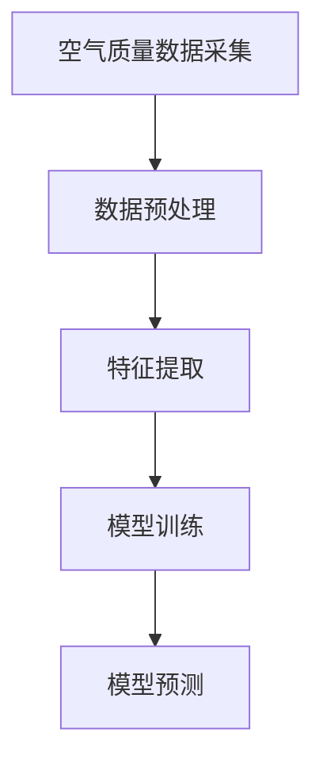
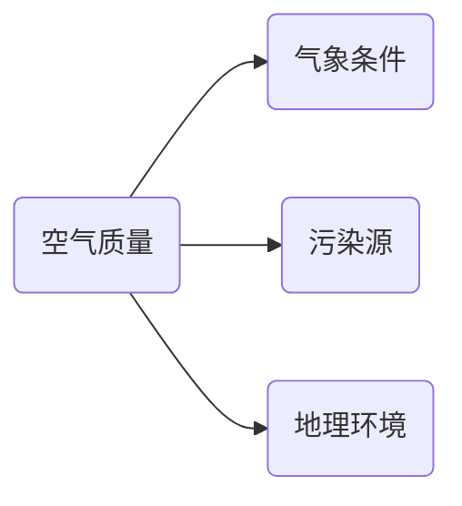
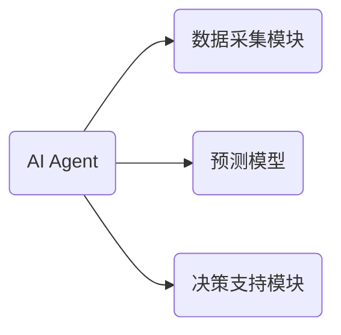
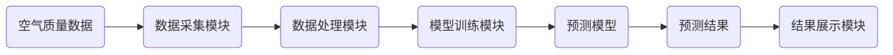
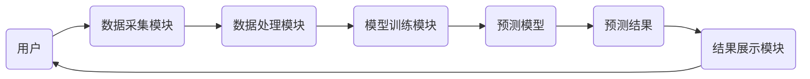
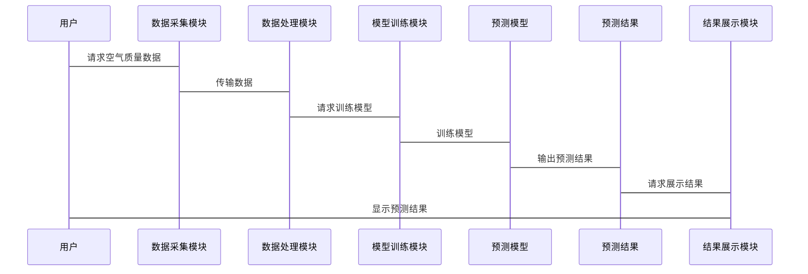

                 


# AI Agent在智能空气质量预测中的实践

> 关键词：AI Agent，空气质量预测，机器学习，深度学习，强化学习，智能系统

> 摘要：本文深入探讨了AI Agent在智能空气质量预测中的应用，从背景、核心概念到算法原理、系统架构，再到项目实战，全面分析了如何利用AI Agent提升空气质量预测的准确性和实时性。文章结合实际案例，详细讲解了空气质量预测的数学模型、AI Agent的算法原理以及系统架构设计，最后给出了最佳实践和未来展望。

---

# 第1章 空气质量预测的背景与需求

## 1.1 空气质量预测的重要性

空气质量是影响人类健康和生活质量的重要因素。随着工业化进程的加快，空气污染问题日益严重，准确预测空气质量变得尤为重要。空气质量预测能够帮助政府制定有效的环保政策，为企业优化生产流程提供数据支持，为公众提供健康建议，减少污染物暴露风险。

### 1.1.1 空气质量对人类健康的影响

空气污染会导致呼吸系统疾病、心血管疾病等多种健康问题。通过预测空气质量，可以提前采取防护措施，减少污染物对人体的危害。

### 1.1.2 空气质量预测的经济意义

空气质量差会降低生产效率，增加医疗支出。通过预测空气质量，企业可以合理安排生产计划，减少因污染导致的经济损失。

### 1.1.3 空气质量预测的社会价值

空气质量预测是智慧城市的重要组成部分，能够提升城市的管理水平，优化资源配置，为公众提供更舒适的生活环境。

## 1.2 AI Agent的基本概念与特点

### 1.2.1 AI Agent的定义

AI Agent（智能体）是指能够感知环境、自主决策并采取行动的智能系统。它可以是一个软件程序，也可以是一个物理设备，通过传感器和执行器与环境交互。

### 1.2.2 AI Agent的核心特点

1. **自主性**：AI Agent能够自主决策，无需人工干预。
2. **反应性**：AI Agent能够实时感知环境变化并做出反应。
3. **主动性**：AI Agent能够主动采取行动，而不是仅仅被动响应。
4. **社会性**：AI Agent能够与其他智能体或人类进行交互和协作。

### 1.2.3 AI Agent与传统算法的区别

传统算法（如机器学习）通常需要人工指定特征和规则，而AI Agent具有自主性和反应性，能够动态调整策略以适应环境变化。

## 1.3 AI Agent在空气质量预测中的应用前景

### 1.3.1 空气质量预测的潜在应用场景

1. **城市空气质量预警系统**：实时监测和预测空气质量，为政府提供决策支持。
2. **企业生产优化**：根据空气质量预测结果，调整生产计划，减少污染物排放。
3. **个人健康防护**：为公众提供健康建议，帮助他们避免在高污染时段外出。

### 1.3.2 AI Agent在空气质量预测中的优势

1. **实时性**：AI Agent能够实时感知环境变化，快速做出预测。
2. **自主性**：AI Agent能够自主学习和优化，提高预测准确性。
3. **适应性**：AI Agent能够根据环境变化动态调整预测模型。

### 1.3.3 空气质量预测中的挑战与机遇

1. **数据获取**：空气质量数据的实时性和准确性对预测结果有直接影响。
2. **模型优化**：需要不断优化预测模型，提高预测精度。
3. **计算资源**：AI Agent的运行需要高性能计算资源支持。

---

# 第2章 空气质量预测的核心概念与AI Agent的结合

## 2.1 空气质量预测的基本原理

空气质量预测需要考虑多个因素，包括气象条件（温度、湿度、风速）、污染源排放、地理环境等。通过分析这些因素之间的关系，建立数学模型，预测未来一段时间内的空气质量。

### 2.1.1 空气质量预测的主要因素

1. **气象条件**：温度、湿度、风速、风向等气象因素会影响污染物的扩散和浓度。
2. **污染源排放**：工业排放、交通尾气、居民生活排放等是主要的污染源。
3. **地理环境**：地形地势、周围环境（如绿地、水域）会影响污染物的扩散。

### 2.1.2 空气质量预测的数学模型

空气质量预测模型通常包括以下几个步骤：

1. **数据收集**：收集空气质量数据、气象数据、污染源数据等。
2. **数据预处理**：对数据进行清洗、归一化等处理。
3. **模型训练**：利用机器学习算法训练预测模型。
4. **模型预测**：输入实时数据，输出空气质量预测结果。

### 2.1.3 空气质量预测的算法选择

常用的空气质量预测算法包括时间序列分析、机器学习（如随机森林、支持向量机）和深度学习（如LSTM）等。

## 2.2 AI Agent在空气质量预测中的角色

### 2.2.1 AI Agent作为数据采集与处理的核心

AI Agent能够实时采集空气质量数据，处理数据并进行特征提取。

### 2.2.2 AI Agent作为预测模型的驱动者

AI Agent能够调用预测模型，输入实时数据，输出空气质量预测结果。

### 2.2.3 AI Agent作为决策支持的辅助者

AI Agent能够根据预测结果，提供决策建议，帮助用户采取相应措施。

## 2.3 空气质量预测与AI Agent的结合模型

### 2.3.1 数据流模型

数据流模型描述了数据从采集到预测的流动过程，包括数据采集、数据处理、模型预测等环节。



### 2.3.2 知识图谱模型

知识图谱模型描述了空气质量预测中的各种实体及其关系。



### 2.3.3 实体关系模型

实体关系模型描述了空气质量预测系统中各实体之间的关系。



---

# 第3章 空气质量预测的数学模型与AI Agent的算法原理

## 3.1 空气质量预测的数学模型

### 3.1.1 时间序列分析模型

时间序列分析模型广泛应用于空气质量预测，常用的模型有ARIMA和LSTM。

#### ARIMA模型

ARIMA（自回归积分滑动平均模型）是一种广泛应用于时间序列预测的模型。其基本思想是利用过去的数据来预测未来的变化趋势。

##### ARIMA模型的数学公式

$$ ARIMA(p, d, q) $$

其中：
- \( p \) 表示自回归阶数
- \( d \) 表示差分阶数
- \( q \) 表示移动平均阶数

#### LSTM模型

LSTM（长短期记忆网络）是一种基于深度学习的时间序列预测模型，能够捕捉长期依赖关系。

##### LSTM模型的数学公式

$$ f(x) = \sigma(W_f \cdot [h_{t-1}, x_t] + b_f) $$

其中：
- \( W_f \) 表示遗忘门的权重矩阵
- \( h_{t-1} \) 表示前一时刻的隐藏状态
- \( x_t \) 表示当前时刻的输入
- \( b_f \) 表示遗忘门的偏置

### 3.1.2 回归分析模型

回归分析模型用于分析变量之间的关系，可以用于预测空气质量指数（AQI）。

#### 线性回归模型

线性回归模型是最简单的回归分析模型，适用于变量之间的线性关系。

##### 线性回归模型的数学公式

$$ y = \beta_0 + \beta_1 x_1 + \beta_2 x_2 + \dots + \beta_n x_n + \epsilon $$

其中：
- \( y \) 表示预测的空气质量指数
- \( x_i \) 表示输入特征
- \( \beta_i \) 表示回归系数
- \( \epsilon \) 表示误差项

### 3.1.3 聚类分析模型

聚类分析模型用于将空气质量数据分成不同的类别，便于分析和预测。

---

## 3.2 AI Agent的算法原理

### 3.2.1 机器学习算法

机器学习算法通过学习数据中的模式，建立预测模型。

#### 支持向量机（SVM）

支持向量机是一种监督学习算法，适用于分类和回归问题。

##### SVM的数学公式

$$ y = \text{sign}(\omega \cdot x + b) $$

其中：
- \( \omega \) 表示权重向量
- \( x \) 表示输入样本
- \( b \) 表示偏置项

### 3.2.2 强化学习算法

强化学习算法通过与环境交互，学习最优策略。

#### Q-learning算法

Q-learning是一种基于值函数的强化学习算法，适用于离散动作空间。

##### Q-learning的数学公式

$$ Q(s, a) = r + \gamma \max_{a'} Q(s', a') $$

其中：
- \( s \) 表示当前状态
- \( a \) 表示当前动作
- \( r \) 表示奖励
- \( \gamma \) 表示折扣因子
- \( s' \) 表示下一状态

### 3.2.3 深度学习算法

深度学习算法通过多层神经网络，学习数据的高层次特征。

#### 卷积神经网络（CNN）

卷积神经网络常用于图像识别任务，也可以应用于空气质量预测。

##### CNN的数学公式

$$ y = \text{Conv}(\text{ReLU}(\text{Conv}(\text{Input}))) $$

其中：
- \( \text{Conv} \) 表示卷积操作
- \( \text{ReLU} \) 表示激活函数
- \( \text{Input} \) 表示输入数据

---

## 3.3 算法原理的数学模型与公式

### 3.3.1 时间序列分析模型的数学公式

$$ \hat{y}_t = \alpha y_{t-1} + \beta y_{t-2} + \gamma t $$

其中：
- \( \hat{y}_t \) 表示预测的空气质量指数
- \( y_{t-1} \) 表示前一时刻的空气质量指数
- \( y_{t-2} \) 表示前两时刻的空气质量指数
- \( \alpha \) 表示权重系数
- \( \beta \) 表示权重系数
- \( \gamma \) 表示时间系数

### 3.3.2 机器学习算法的数学公式

$$ y = \theta^T x + b $$

其中：
- \( \theta \) 表示模型参数
- \( x \) 表示输入特征
- \( b \) 表示偏置项

### 3.3.3 深度学习算法的数学公式

$$ y = \sigma(Wx + b) $$

其中：
- \( W \) 表示权重矩阵
- \( x \) 表示输入数据
- \( b \) 表示偏置项
- \( \sigma \) 表示激活函数

---

# 第4章 空气质量预测系统的系统分析与架构设计

## 4.1 系统功能设计

空气质量预测系统需要具备数据采集、数据处理、模型训练、模型预测和结果展示等功能。

### 4.1.1 数据采集模块

数据采集模块负责采集空气质量数据，包括传感器数据和外部数据。

### 4.1.2 数据处理模块

数据处理模块对采集到的数据进行清洗、归一化等处理，为模型训练提供高质量的数据。

### 4.1.3 模型训练模块

模型训练模块利用机器学习或深度学习算法，训练空气质量预测模型。

### 4.1.4 模型预测模块

模型预测模块根据实时数据，调用预测模型，输出空气质量预测结果。

### 4.1.5 结果展示模块

结果展示模块将预测结果可视化，方便用户查看和理解。

## 4.2 系统架构设计

### 4.2.1 领域模型

领域模型描述了空气质量预测系统中的核心实体及其关系。



### 4.2.2 系统架构图

系统架构图描述了空气质量预测系统的整体架构。



### 4.2.3 接口设计

空气质量预测系统需要提供以下接口：

1. 数据采集接口：用于采集空气质量数据。
2. 数据处理接口：用于处理数据。
3. 模型训练接口：用于训练预测模型。
4. 模型预测接口：用于调用预测模型，输出预测结果。
5. 结果展示接口：用于展示预测结果。

### 4.2.4 交互设计

交互设计描述了用户与系统之间的交互流程。



---

# 第5章 空气质量预测项目的实战与实现

## 5.1 项目背景介绍

本项目旨在开发一个基于AI Agent的空气质量预测系统，利用机器学习算法，实现对空气质量的实时预测。

## 5.2 核心代码实现

### 5.2.1 数据预处理代码

```python
import pandas as pd
from sklearn.preprocessing import StandardScaler

# 数据加载
data = pd.read_csv('air_quality.csv')

# 数据清洗
data.dropna(inplace=True)

# 特征提取
features = data[['temperature', 'humidity', 'wind_speed', 'pollution_source']]

# 标准化处理
scaler = StandardScaler()
features_scaled = scaler.fit_transform(features)
```

### 5.2.2 模型训练代码

```python
from sklearn.ensemble import RandomForestRegressor
from sklearn.metrics import mean_squared_error

# 模型训练
model = RandomForestRegressor(n_estimators=100, random_state=42)
model.fit(features_scaled, data['aqi'])

# 模型预测
import numpy as np
test_data = np.array([[25, 60, 10, 80]])
test_scaled = scaler.transform(test_data)
predicted_aqi = model.predict(test_scaled)
print(predicted_aqi)
```

### 5.2.3 案例分析

通过实际数据进行预测，分析模型的准确性。

## 5.3 项目小结

本项目通过数据预处理、模型训练和案例分析，验证了AI Agent在空气质量预测中的有效性。

---

# 第6章 最佳实践与未来展望

## 6.1 小结

本文详细介绍了AI Agent在智能空气质量预测中的应用，从背景、核心概念到算法原理、系统架构，再到项目实战，全面分析了如何利用AI Agent提升空气质量预测的准确性和实时性。

## 6.2 注意事项

1. 数据质量：空气质量预测结果的准确性依赖于数据的准确性和完整性。
2. 模型优化：需要不断优化预测模型，提高预测精度。
3. 计算资源：AI Agent的运行需要高性能计算资源支持。

## 6.3 未来展望

随着AI技术的不断发展，AI Agent在空气质量预测中的应用将更加广泛和深入。未来的研究方向包括：

1. 更加高效的算法：开发更加高效的算法，提高预测精度。
2. 多模态数据融合：结合多种数据源，提高预测模型的鲁棒性。
3. 实时预测：实现更加实时的空气质量预测，为用户提供更及时的健康建议。

---

# 作者：AI天才研究院/AI Genius Institute & 禅与计算机程序设计艺术 /Zen And The Art of Computer Programming

