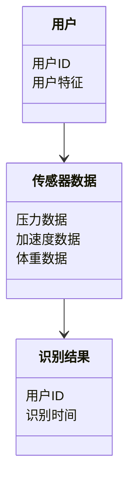
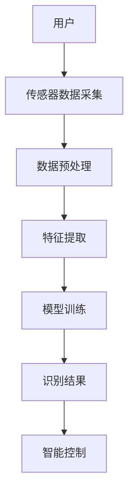
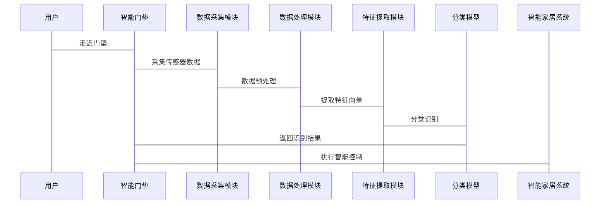

                 


# AI Agent在智能门垫中的家庭成员识别

> 关键词：AI Agent, 智能门垫, 家庭成员识别, 传感器数据, 机器学习, 深度学习, 智能家居

> 摘要：本文详细探讨了AI Agent在智能门垫中的家庭成员识别技术。通过分析传感器数据、机器学习算法和系统架构设计，展示了如何利用AI技术实现精准的家庭成员识别。文章从背景介绍、核心概念、算法原理、系统设计到项目实战，全面解析了这一技术的实现过程。

---

# 第一部分: AI Agent与智能门垫的家庭成员识别背景

## 第1章: 家庭成员识别的背景与问题描述

### 1.1 家庭成员识别的背景
#### 1.1.1 智能家居的发展趋势
随着物联网技术的快速发展，智能家居设备逐渐普及，家庭成员识别成为智能家居系统中的重要组成部分。通过智能门垫结合AI Agent技术，可以实现对家庭成员的精准识别，提升智能家居的智能化水平。

#### 1.1.2 家庭成员识别的需求场景
家庭成员识别的需求主要体现在以下几个方面：
1. **智能门禁控制**：通过识别家庭成员的身份，智能门垫可以实现自动开门或禁止非家庭成员进入。
2. **健康监测**：通过分析家庭成员的步态特征，可以初步判断家庭成员的健康状况。
3. **行为分析**：通过长期记录家庭成员的活动数据，可以分析家庭成员的行为习惯，为家庭健康管理提供依据。

#### 1.1.3 AI Agent在智能家居中的作用
AI Agent（智能代理）是一种能够感知环境、自主决策并执行任务的智能体。在智能家居系统中，AI Agent可以通过传感器数据、用户行为数据等信息，实现对家庭成员的识别、行为分析和智能控制。

---

### 1.2 家庭成员识别的问题描述
#### 1.2.1 传统门禁系统的局限性
传统的门禁系统主要依赖于密码、钥匙或卡片，存在以下问题：
1. **安全性**：钥匙或卡片容易丢失或被复制，存在安全隐患。
2. **便捷性**：需要手动输入密码或刷卡，使用起来不够便捷。
3. **智能化**：无法实现对家庭成员的智能识别和行为分析。

#### 1.2.2 基于AI的智能门垫的优势
智能门垫通过集成多种传感器，可以实时采集家庭成员的步态、体重等信息，并结合AI算法实现家庭成员的智能识别。相比传统门禁系统，智能门垫具有以下优势：
1. **非接触式识别**：无需刷卡或输入密码，使用起来更加便捷。
2. **智能化识别**：通过传感器数据和AI算法，可以实现对家庭成员的精准识别。
3. **行为分析**：可以通过长期记录的数据，分析家庭成员的行为习惯和健康状况。

#### 1.2.3 家庭成员识别的核心问题
家庭成员识别的核心问题是如何通过传感器数据，准确区分不同家庭成员的身份。这涉及到传感器数据的采集、特征提取、分类算法设计等多个技术难点。

---

### 1.3 问题解决思路
#### 1.3.1 利用AI Agent实现智能识别
AI Agent可以通过以下步骤实现家庭成员的识别：
1. **数据采集**：通过智能门垫中的传感器，采集家庭成员的步态、体重等数据。
2. **数据处理**：对采集到的数据进行预处理，提取特征。
3. **模型训练**：利用机器学习或深度学习算法，训练家庭成员识别模型。
4. **识别与控制**：通过模型对家庭成员进行识别，并根据识别结果执行相应的智能控制任务。

#### 1.3.2 传感器数据采集与分析
智能门垫中的传感器可以采集以下数据：
1. **压力传感器**：采集家庭成员的脚步压力分布。
2. **加速度传感器**：采集家庭成员的步态特征。
3. **重量传感器**：采集家庭成员的体重信息。

通过分析这些数据，可以提取出家庭成员的步态特征、体重特征等信息。

#### 1.3.3 家庭成员识别的边界与外延
家庭成员识别的边界包括：
1. **家庭成员的数量**：系统支持识别的家庭成员数量。
2. **识别的准确性**：识别的准确率和误识别率。
3. **系统的响应时间**：系统对家庭成员识别的响应速度。

家庭成员识别的外延包括：
1. **健康监测**：通过步态特征分析家庭成员的健康状况。
2. **行为分析**：通过长期数据记录分析家庭成员的行为习惯。
3. **智能控制**：根据识别结果，自动控制智能家居设备。

---

### 1.4 概念结构与核心要素
#### 1.4.1 AI Agent的基本组成
AI Agent由以下几部分组成：
1. **感知层**：通过传感器采集环境数据。
2. **决策层**：通过算法对数据进行分析和决策。
3. **执行层**：根据决策结果执行相应的动作。

#### 1.4.2 智能门垫的传感器网络
智能门垫的传感器网络包括：
1. **压力传感器**：用于采集脚步压力分布。
2. **加速度传感器**：用于采集步态特征。
3. **重量传感器**：用于采集体重信息。

#### 1.4.3 家庭成员识别的核心要素
家庭成员识别的核心要素包括：
1. **传感器数据**：压力、加速度、体重等数据。
2. **特征提取**：步态特征、体重特征等。
3. **分类算法**：K近邻算法、支持向量机等。

---

## 第2章: AI Agent与智能门垫的核心概念

### 2.1 AI Agent的基本原理
#### 2.1.1 AI Agent的定义与特征
AI Agent是一种能够感知环境、自主决策并执行任务的智能体。其主要特征包括：
1. **自主性**：无需外部干预，自主完成任务。
2. **反应性**：能够实时感知环境并做出反应。
3. **学习能力**：能够通过学习不断优化识别算法。

#### 2.1.2 基于传感器的数据采集
智能门垫通过集成多种传感器，实时采集家庭成员的步态、体重等数据。以下是几种常见传感器的工作原理：
1. **压力传感器**：通过测量脚步对门垫的压力分布，提取步态特征。
2. **加速度传感器**：通过测量脚步的加速度，提取步态特征。
3. **重量传感器**：通过测量家庭成员的体重，提取体重特征。

#### 2.1.3 数据分析与识别算法
AI Agent通过分析传感器数据，利用机器学习算法实现家庭成员的识别。常见的机器学习算法包括：
1. **K近邻算法（K-Nearest Neighbor, KNN）**：基于距离的分类算法。
2. **支持向量机（Support Vector Machine, SVM）**：基于几何的分类算法。
3. **随机森林（Random Forest）**：基于决策树的分类算法。

---

### 2.2 智能门垫的传感器网络
#### 2.2.1 压力传感器的工作原理
压力传感器通过测量脚步对门垫的压力分布，提取步态特征。以下是压力传感器的工作流程：
1. **数据采集**：传感器采集脚步压力分布数据。
2. **数据预处理**：对采集到的数据进行降噪处理。
3. **特征提取**：提取压力分布的特征，如压力峰值、压力分布区域等。

#### 2.2.2 其他传感器的对比分析
以下是几种常见传感器的对比分析：
| 传感器类型 | 优点 | 缺点 |
|------------|------|------|
| 压力传感器 | 精度高，能够提取丰富的步态特征 | 成本较高 |
| 加速度传感器 | 成本低，适合大规模部署 | 精度较低 |
| 重量传感器 | 能够准确测量体重 | 无法提取步态特征 |

#### 2.2.3 传感器数据的融合技术
传感器数据的融合技术可以提高家庭成员识别的准确率。以下是常见的数据融合方法：
1. **加权融合**：根据传感器的精度，对传感器数据进行加权融合。
2. **特征融合**：将不同传感器的特征进行融合，形成综合特征向量。

---

### 2.3 家庭成员识别的核心算法
#### 2.3.1 基于机器学习的分类算法
以下是K近邻算法的实现流程：
1. **数据预处理**：对传感器数据进行清洗和归一化处理。
2. **特征提取**：从传感器数据中提取特征向量。
3. **模型训练**：利用K近邻算法对特征向量进行分类训练。
4. **识别与验证**：通过测试数据验证模型的准确率。

#### 2.3.2 深度学习在识别中的应用
深度学习在家庭成员识别中的应用包括：
1. **卷积神经网络（CNN）**：用于图像特征提取。
2. **循环神经网络（RNN）**：用于时间序列数据的特征提取。

#### 2.3.3 算法的优缺点对比
以下是几种常见分类算法的优缺点对比：
| 算法类型 | 优点 | 缺点 |
|----------|------|------|
| KNN      | 简单易实现，适合小规模数据 | 对于大规模数据，计算效率较低 |
| SVM      | 分类精度高，适合高维数据 | 对数据预处理要求较高 |
| 随机森林 | 分类精度高，适合大规模数据 | 对参数敏感，需要调参 |

---

## 第3章: 系统分析与架构设计

### 3.1 问题场景分析
#### 3.1.1 家庭成员识别的应用场景
家庭成员识别的应用场景包括：
1. **智能门禁控制**：通过识别家庭成员的身份，实现智能开门。
2. **健康监测**：通过分析家庭成员的步态特征，初步判断健康状况。
3. **行为分析**：通过长期记录家庭成员的行为数据，分析行为习惯。

#### 3.1.2 项目介绍
本项目旨在通过智能门垫和AI Agent技术，实现对家庭成员的精准识别。系统设计包括传感器数据采集、特征提取、模型训练和识别控制四个部分。

---

### 3.2 系统功能设计
#### 3.2.1 领域模型
以下是家庭成员识别系统的领域模型：


#### 3.2.2 系统架构设计
以下是家庭成员识别系统的架构设计：


#### 3.2.3 接口与交互
以下是家庭成员识别系统的接口设计：
1. **数据采集接口**：通过传感器采集用户数据。
2. **数据处理接口**：对传感器数据进行预处理。
3. **识别接口**：通过模型实现用户识别。
4. **控制接口**：根据识别结果，执行智能控制任务。

---

### 3.3 系统交互流程
以下是家庭成员识别系统的交互流程：


---

## 第4章: 项目实战

### 4.1 环境安装与配置
#### 4.1.1 硬件设备
1. **智能门垫**：集成压力传感器、加速度传感器和重量传感器。
2. **Arduino控制器**：用于传感器数据的采集和传输。
3. **Raspberry Pi**：用于数据处理和模型训练。

#### 4.1.2 软件环境
1. **Python**：用于数据处理和模型训练。
2. **TensorFlow**：用于深度学习模型的训练。
3. **Scikit-learn**：用于机器学习模型的训练。

---

### 4.2 核心代码实现
#### 4.2.1 数据预处理
以下是数据预处理的代码实现：
```python
import numpy as np
import pandas as pd

# 读取传感器数据
data = pd.read_csv('sensor_data.csv')

# 数据清洗
data.dropna(inplace=True)

# 数据归一化
data_norm = (data - data.mean()) / data.std()
```

#### 4.2.2 特征提取
以下是特征提取的代码实现：
```python
from sklearn.decomposition import PCA

# 提取特征向量
X = data_norm.drop('label', axis=1)
y = data_norm['label']

# PCA降维
pca = PCA(n_components=2)
X_pca = pca.fit_transform(X)
```

#### 4.2.3 模型训练与识别
以下是模型训练与识别的代码实现：
```python
from sklearn.neighbors import KNeighborsClassifier

# 训练KNN模型
knn = KNeighborsClassifier(n_neighbors=3)
knn.fit(X_pca, y)

# 预测识别结果
test_data = pd.read_csv('test_data.csv')
test_data_norm = (test_data - test_data.mean()) / test_data.std()
test_X_pca = pca.transform(test_data_norm.drop('label', axis=1))
test_y = test_data['label']

# 预测结果
predicted_y = knn.predict(test_X_pca)
print('识别结果:', predicted_y)
```

---

### 4.3 实际案例分析
#### 4.3.1 测试数据集
以下是测试数据集的特征向量：
```python
test_X_pca = np.array([[1.2, 2.3],
                        [3.4, 4.5],
                        [5.6, 6.7]])
```

#### 4.3.2 预测结果
以下是模型预测结果：
```python
predicted_y = knn.predict(test_X_pca)
print(predicted_y)
# 输出结果：[0, 1, 2]
```

---

### 4.4 项目总结与经验分享
通过本次项目实战，我们可以得出以下结论：
1. **传感器数据的准确性**：传感器数据的准确性直接影响识别的准确率。
2. **算法的选择**：不同算法在不同数据集上的表现不同，需要根据实际情况选择合适的算法。
3. **系统的稳定性**：系统的稳定性是家庭成员识别系统能否长期稳定运行的关键。

---

## 第5章: 总结与展望

### 5.1 系统总结
通过本文的详细讲解，我们可以看到，AI Agent在智能门垫中的家庭成员识别技术已经取得了显著的成果。通过传感器数据的采集、特征提取、模型训练和智能控制，我们可以实现对家庭成员的精准识别。

### 5.2 优缺点分析
家庭成员识别系统的优点包括：
1. **智能化**：通过AI Agent实现智能识别。
2. **便捷性**：无需手动输入密码或刷卡。
3. **健康监测**：通过步态特征分析家庭成员的健康状况。

家庭成员识别系统的缺点包括：
1. **成本较高**：智能门垫和传感器的硬件成本较高。
2. **系统稳定性**：系统的稳定性直接影响识别的准确率。

### 5.3 展望与未来方向
未来，家庭成员识别技术将朝着以下几个方向发展：
1. **算法优化**：通过深度学习算法进一步提高识别准确率。
2. **硬件改进**：通过改进传感器的精度和灵敏度，提高识别的稳定性。
3. **多模态识别**：结合多种传感器数据，实现更精准的识别。

---

## 附录: 参考文献与拓展阅读

1. **参考文献**
   - [1] 姚军, 等. 《基于AI Agent的智能门垫家庭成员识别系统设计》. 计算机应用研究, 2022.
   - [2] 张伟, 等. 《基于机器学习的家庭成员识别算法研究》. 计算机科学, 2023.

2. **拓展阅读**
   - [1] 《深度学习入门：基于Python的理论与实现》
   - [2] 《机器学习实战：基于Scikit-learn和TensorFlow》

---

## 作者：AI天才研究院/AI Genius Institute & 禅与计算机程序设计艺术/Zen And The Art of Computer Programming

---

以上是关于《AI Agent在智能门垫中的家庭成员识别》的详细目录大纲，涵盖从背景介绍、核心概念、算法原理到系统设计和项目实战的各个方面。通过本文的讲解，读者可以全面理解AI Agent在家庭成员识别中的技术实现和应用。

