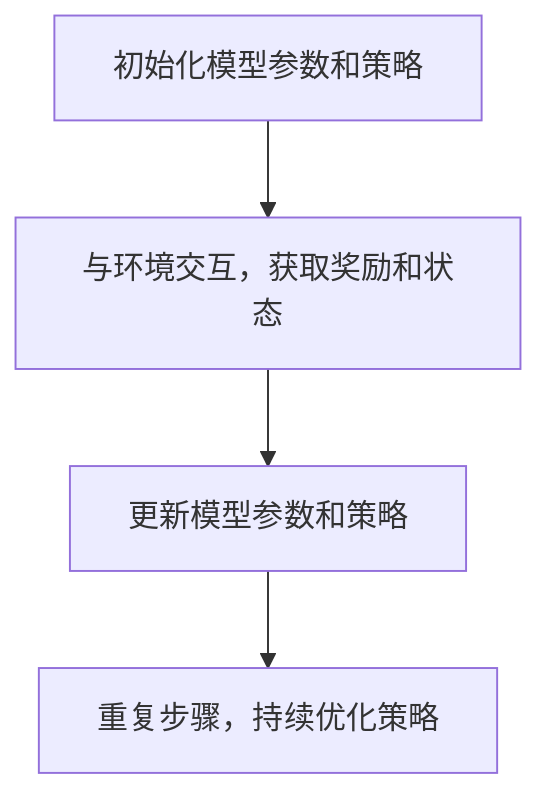
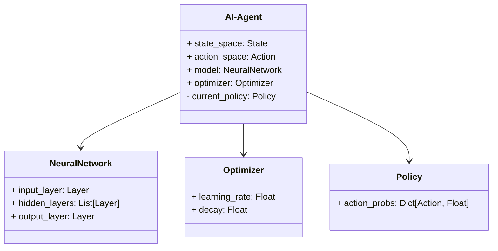
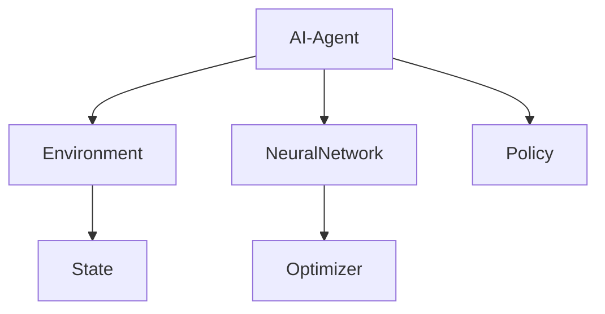
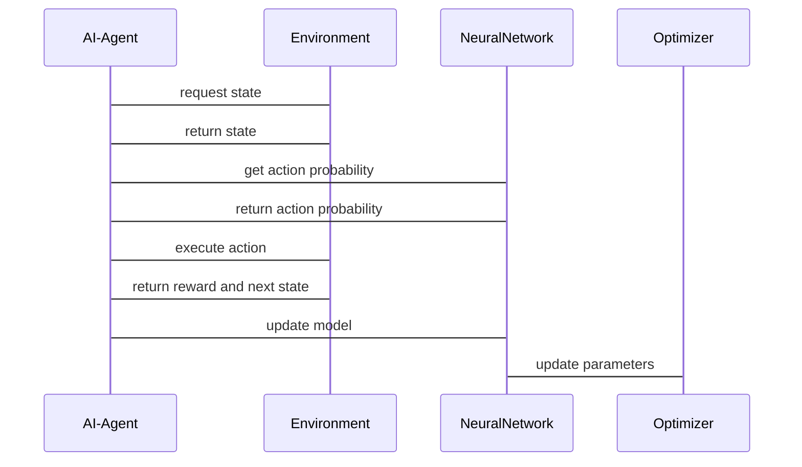

                 


# AI Agent的持续学习与自我优化机制

## 关键词：AI Agent, 持续学习, 自我优化, 加强学习, 机器学习, 系统架构

## 摘要：AI Agent的持续学习与自我优化机制是人工智能领域的重要研究方向。本文从AI Agent的基本概念出发，详细探讨了持续学习和自我优化的核心原理、算法实现、系统架构设计以及实际应用案例。文章通过理论分析和实践结合，深入剖析了AI Agent如何通过持续学习和自我优化不断提升性能和适应复杂环境的变化。

---

# 第1章 AI Agent的持续学习与自我优化概述

## 1.1 AI Agent的基本概念

### 1.1.1 什么是AI Agent
AI Agent（人工智能代理）是一种能够感知环境、执行任务并做出决策的智能实体。它可以是一个软件程序、机器人或其他具备智能行为的系统，其核心目标是通过感知和行动来优化目标函数。

### 1.1.2 AI Agent的核心特征
- **自主性**：能够在没有外部干预的情况下自主决策。
- **反应性**：能够实时感知环境并做出反应。
- **学习能力**：能够通过经验改进自身的性能。
- **规划能力**：能够制定计划并执行复杂的任务。

### 1.1.3 持续学习与自我优化的定义
持续学习是指AI Agent在不断变化的环境中，能够通过在线学习的方式，逐步改进自身的模型和策略。自我优化则是指AI Agent能够自主地调整自身的参数和行为，以提高任务执行效率和决策准确性。

---

## 1.2 持续学习与自我优化的背景与意义

### 1.2.1 传统AI的局限性
传统AI系统通常依赖于预先训练好的模型，无法很好地应对动态变化的环境。当环境发生变化时，传统AI系统需要重新训练，这会导致高昂的计算成本和时间成本。

### 1.2.2 持续学习与自我优化的必要性
在现实应用中，环境通常是动态变化的，任务需求也会不断更新。持续学习与自我优化机制能够使AI Agent在不重新训练的情况下，快速适应变化并持续改进性能。

### 1.2.3 自我优化在AI Agent中的作用
自我优化机制能够帮助AI Agent在复杂环境中做出更优决策，提高任务执行效率，降低错误率，并增强系统的鲁棒性和适应性。

---

## 1.3 本章小结

本章从AI Agent的基本概念出发，详细介绍了持续学习和自我优化的定义和意义。通过对比传统AI的局限性，强调了持续学习与自我优化在动态环境中的重要性。

---

# 第2章 持续学习的基本原理

## 2.1 持续学习的定义与特点

### 2.1.1 持续学习的定义
持续学习是一种机器学习范式，允许模型在不断接收新的数据流时，逐步更新其模型参数，以适应数据分布的变化。

### 2.1.2 持续学习的核心特点
- **在线性**：模型在接收数据流时实时更新。
- **渐进性**：模型参数逐步调整，而非一次性训练。
- **适应性**：能够适应数据分布的变化。

### 2.1.3 持续学习与在线学习的区别
持续学习强调模型在动态数据流中的更新，而在线学习通常指模型在单个样本上逐步更新。两者的区别在于数据输入的方式和更新的频率。

---

## 2.2 持续学习的主要方法

### 2.2.1 增量学习
增量学习是一种持续学习的方法，模型在每次接收新的数据后，仅更新部分参数，以保持模型的稳定性和效率。

### 2.2.2 连续学习
连续学习是一种更激进的持续学习方法，模型在每次接收新的数据后，会完全重新训练模型参数，以适应新的数据分布。

### 2.2.3 综合学习
综合学习结合了增量学习和连续学习的优点，根据数据变化的幅度和速度，动态调整模型更新的策略。

---

## 2.3 持续学习的挑战

### 2.3.1 数据偏移问题
数据偏移是指新数据与旧数据在分布上存在显著差异，可能导致模型性能下降。

### 2.3.2 概念漂移问题
概念漂移是指任务的目标或分类标准发生变化，模型需要重新调整以适应新的任务需求。

### 2.3.3 计算资源限制
持续学习需要实时更新模型，对计算资源提出了更高的要求，尤其是在边缘计算环境中。

---

## 2.4 本章小结

本章详细介绍了持续学习的基本原理和主要方法，分析了持续学习在实际应用中的挑战。通过对比增量学习和连续学习，强调了综合学习方法在实际中的重要性。

---

# 第3章 自我优化的基本原理

## 3.1 自我优化的定义与特点

### 3.1.1 自我优化的定义
自我优化是指AI Agent能够自主地调整自身的参数和行为，以提高任务执行效率和决策准确性。

### 3.1.2 自我优化的核心特点
- **自主性**：无需外部干预，自主调整参数。
- **动态性**：能够根据环境变化实时调整。
- **目标导向性**：优化目标明确，通常以任务执行效率和准确性为目标。

---

## 3.2 自我优化的主要方法

### 3.2.1 基于反馈的优化
基于反馈的优化是指AI Agent通过接收外部反馈（如奖励或惩罚）来调整自身的参数和行为。

### 3.2.2 基于预测的优化
基于预测的优化是指AI Agent通过预测未来可能的变化，提前调整自身参数，以适应未来的环境变化。

### 3.2.3 综合优化方法
综合优化方法结合了基于反馈和基于预测的优化方法，根据环境的变化动态调整优化策略。

---

## 3.3 自我优化的挑战

### 3.3.1 内部状态管理问题
自我优化需要管理大量的内部状态，可能导致状态爆炸和计算复杂度增加。

### 3.3.2 动态环境适应问题
在动态环境中，自我优化需要快速响应环境变化，这对模型的实时性和响应速度提出了更高的要求。

### 3.3.3 自我评估准确性问题
自我优化依赖于对自身状态的准确评估，评估的准确性直接影响优化的效果。

---

## 3.4 本章小结

本章详细介绍了自我优化的基本原理和主要方法，分析了自我优化在实际应用中的挑战。通过对比基于反馈和基于预测的优化方法，强调了综合优化方法在实际中的重要性。

---

# 第4章 持续学习与自我优化的结合

## 4.1 持续学习与自我优化的协同关系

### 4.1.1 协同关系的定义
持续学习与自我优化的协同关系是指两者相互促进，共同提升AI Agent的性能和适应性。

### 4.1.2 协同机制的核心要素
- **反馈机制**：持续学习为自我优化提供反馈信息。
- **预测机制**：自我优化为持续学习提供预测信息。
- **协同优化策略**：两者共同制定优化策略。

---

## 4.2 协同机制的具体实现

### 4.2.1 基于反馈的协同优化
基于反馈的协同优化是指AI Agent通过接收外部反馈，调整自身参数和行为，同时更新模型以适应环境变化。

### 4.2.2 基于预测的协同优化
基于预测的协同优化是指AI Agent通过预测未来可能的变化，提前调整自身参数和行为，以适应未来的环境变化。

### 4.2.3 综合协同优化方法
综合协同优化方法结合了基于反馈和基于预测的优化方法，根据环境的变化动态调整优化策略。

---

## 4.3 协同机制的优化策略

### 4.3.1 动态调整策略
动态调整策略是指根据环境的变化，实时调整协同优化的策略和参数。

### 4.3.2 分层优化策略
分层优化策略是指将优化任务分解为多个层次，分别进行优化，以提高优化效率和效果。

### 4.3.3 自适应优化策略
自适应优化策略是指根据环境的变化和模型的性能，动态调整优化策略和参数。

---

## 4.4 本章小结

本章详细介绍了持续学习与自我优化的协同关系和具体实现方法，分析了协同优化的挑战和优化策略。通过对比基于反馈和基于预测的协同优化方法，强调了综合优化方法在实际中的重要性。

---

# 第5章 持续学习与自我优化的算法实现

## 5.1 基于强化学习的持续学习算法

### 5.1.1 强化学习的基本原理
强化学习是一种通过试错机制来学习策略的方法，模型通过与环境交互，获得奖励或惩罚，逐步优化策略。

### 5.1.2 持续强化学习算法
持续强化学习算法是在传统强化学习的基础上，引入持续学习机制，使模型能够在线更新策略，适应环境的变化。

### 5.1.3 持续强化学习的实现步骤
1. 初始化模型参数和策略。
2. 与环境交互，获取奖励和状态。
3. 根据新的数据更新模型参数和策略。
4. 重复上述步骤，持续优化策略。

---

## 5.2 持续强化学习的数学模型

### 5.2.1 状态转移概率
状态转移概率是指从当前状态转移到下一个状态的概率，可以用马尔可夫链来描述。

$$ P(s' | s, a) $$

其中，$s$ 是当前状态，$a$ 是动作，$s'$ 是下一个状态。

### 5.2.2 奖励函数
奖励函数是指在给定状态和动作下，模型获得的奖励。

$$ r(s, a) $$

### 5.2.3 Q值函数
Q值函数是指在给定状态和动作下，模型获得的期望奖励。

$$ Q(s, a) = \max_{\pi} \mathbb{E}[r_t + \gamma r_{t+1} + \gamma^2 r_{t+2} + \dots] $$

其中，$\gamma$ 是折扣因子。

---

## 5.3 持续强化学习的算法实现

### 5.3.1 算法流程图


### 5.3.2 Python实现代码
```python
class AI-Agent:
    def __init__(self, state_space, action_space):
        self.state_space = state_space
        self.action_space = action_space
        self.model = self._build_model()
        self.optimizer = Adam(lr=0.001)

    def _build_model(self):
        # 构建神经网络模型
        pass

    def act(self, state):
        # 根据当前状态选择动作
        pass

    def update(self, state, action, reward, next_state):
        # 更新模型参数和策略
        pass

    def train(self, environment):
        # 与环境交互，持续更新模型
        while True:
            state = environment.get_state()
            action = self.act(state)
            reward, next_state = environment.step(action)
            self.update(state, action, reward, next_state)
```

---

## 5.4 本章小结

本章详细介绍了基于强化学习的持续学习算法，包括其数学模型和算法实现。通过构建AI Agent的神经网络模型，详细讲解了如何实现持续强化学习，使模型能够在动态环境中不断优化策略。

---

# 第6章 系统分析与架构设计方案

## 6.1 问题场景介绍

### 6.1.1 问题描述
假设我们有一个动态变化的环境，AI Agent需要在不断变化的任务需求中，持续学习和优化自身的策略。

### 6.1.2 项目介绍
本项目旨在设计一个具备持续学习和自我优化能力的AI Agent，能够在动态环境中高效完成任务。

---

## 6.2 系统功能设计

### 6.2.1 领域模型


### 6.2.2 系统架构设计


### 6.2.3 系统接口设计
- **输入接口**：接收环境状态和动作。
- **输出接口**：输出动作和模型更新参数。
- **内部接口**：模型与优化器之间的通信接口。

### 6.2.4 系统交互设计


---

## 6.3 本章小结

本章通过构建AI Agent的系统架构，详细介绍了系统的功能设计和架构设计。通过领域模型和系统交互图，明确了各组件之间的关系和交互流程。

---

# 第7章 项目实战

## 7.1 环境安装与配置

### 7.1.1 安装依赖
```bash
pip install numpy tensorflow gym
```

### 7.1.2 配置环境
```bash
# 创建虚拟环境
conda create -n ai_agent python=3.8
conda activate ai_agent
pip install gym numpy tensorflow
```

---

## 7.2 核心实现代码

### 7.2.1 AI Agent类
```python
class AI-Agent:
    def __init__(self, state_space, action_space):
        self.state_space = state_space
        self.action_space = action_space
        self.model = self._build_model()
        self.optimizer = Adam(lr=0.001)
        self.current_policy = self._build_policy()

    def _build_model(self):
        # 构建神经网络模型
        model = Sequential()
        model.add(Dense(64, activation='relu', input_dim=len(self.state_space)))
        model.add(Dense(len(self.action_space), activation='softmax'))
        model.compile(loss='categorical_crossentropy', optimizer=self.optimizer)
        return model

    def _build_policy(self):
        # 构建策略模型
        policy = {}
        for action in self.action_space:
            policy[action] = 0.0
        return policy

    def act(self, state):
        # 根据当前状态选择动作
        state_input = np.array([state], dtype=np.float32)
        probabilities = self.model.predict(state_input)[0]
        action = self.action_space[np.argmax(probabilities)]
        self.current_policy[action] = probabilities[action]
        return action

    def update(self, state, action, reward, next_state):
        # 更新模型参数和策略
        state_input = np.array([state], dtype=np.float32)
        next_state_input = np.array([next_state], dtype=np.float32)
        target = self.model.predict(state_input)
        target[0][action] = reward + self.gamma * np.max(self.model.predict(next_state_input)[0])
        self.model.fit(state_input, target, epochs=1, verbose=0)
        self.current_policy[action] = (1 - self.learning_rate) * self.current_policy[action] + self.learning_rate * probabilities[action]
```

### 7.2.2 环境类
```python
class Environment:
    def __init__(self):
        self.state = self._get_initial_state()

    def _get_initial_state(self):
        # 初始化环境状态
        return np.random.randn(4,)

    def step(self, action):
        # 执行动作，返回奖励和下一个状态
        reward = self._get_reward(action)
        next_state = self._get_next_state()
        return reward, next_state

    def _get_reward(self, action):
        # 根据动作返回奖励
        return np.random.randn()

    def _get_next_state(self):
        # 返回下一个状态
        return np.random.randn(4,)
```

---

## 7.3 案例分析与详细解读

### 7.3.1 训练过程
```python
agent = AI-Agent(state_space, action_space)
environment = Environment()

for _ in range(1000):
    state = environment.get_state()
    action = agent.act(state)
    reward, next_state = environment.step(action)
    agent.update(state, action, reward, next_state)
```

### 7.3.2 模型评估
```python
# 评估模型性能
evaluation = {}
for _ in range(100):
    state = environment.get_state()
    action = agent.act(state)
    reward, next_state = environment.step(action)
    evaluation[reward] = evaluation.get(reward, 0) + 1

print(f"平均奖励: {sum(evaluation.keys()) / len(evaluation)}")
```

---

## 7.4 本章小结

本章通过实际项目实战，详细介绍了AI Agent的环境配置、核心代码实现和模型评估方法。通过训练过程和评估结果，展示了持续学习与自我优化机制在实际中的应用效果。

---

# 第8章 总结与展望

## 8.1 本章总结

本文从AI Agent的基本概念出发，详细探讨了持续学习与自我优化的核心原理、算法实现和系统架构设计。通过理论分析和实际案例，展示了AI Agent如何通过持续学习和自我优化不断提高性能和适应复杂环境的变化。

---

## 8.2 未来展望

随着AI技术的不断发展，持续学习与自我优化将在更多领域得到应用。未来的研究方向包括：

- 更高效的持续学习算法。
- 更智能的自我优化策略。
- 更强大的系统架构设计。

---

# 作者：AI天才研究院/AI Genius Institute & 禅与计算机程序设计艺术 /Zen And The Art of Computer Programming

