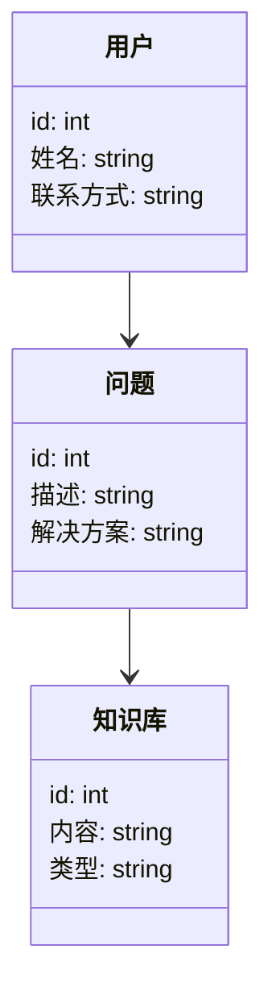
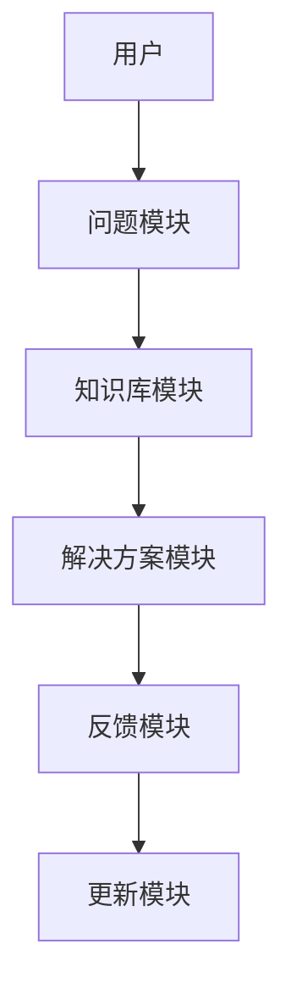
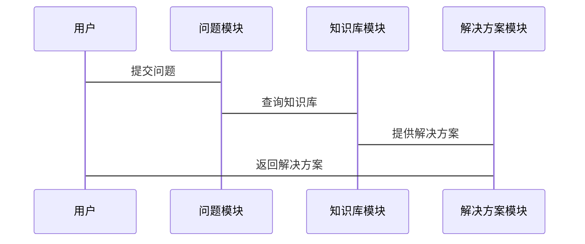

                 


# 《AI Agent的知识库构建与维护》

> 关键词：AI Agent, 知识库, 知识表示, 算法原理, 系统架构, 项目实战

> 摘要：本文系统地探讨了AI Agent的知识库构建与维护的核心问题，从背景到实践，详细介绍了知识表示、存储、构建算法、系统架构设计及项目实战。通过案例分析和代码实现，深入剖析了构建与维护知识库的关键技术与方法。

---

# 第一部分: AI Agent的知识库构建与维护基础

---

## 第1章: AI Agent的知识库构建与维护概述

### 1.1 问题背景与描述

#### 1.1.1 AI Agent的定义与特点
AI Agent（人工智能代理）是指能够感知环境、自主决策并执行任务的智能实体。其特点包括：
- **自主性**：无需外部干预，自主完成任务。
- **反应性**：能够实时感知环境变化并做出反应。
- **学习性**：通过学习提升自身的智能水平。
- **社交能力**：能够与其他Agent或人类进行交互。

#### 1.1.2 知识库在AI Agent中的作用
知识库是AI Agent的核心组成部分，用于存储与任务相关的知识和信息。其作用包括：
- **提供决策支持**：帮助AI Agent做出更准确的决策。
- **支持复杂推理**：通过知识库中的信息进行复杂逻辑推理。
- **实现知识共享**：促进不同AI Agent之间的知识共享与协作。

#### 1.1.3 知识库构建与维护的必要性
知识库的构建与维护是AI Agent正常运作的基础。其必要性体现在：
- **提升智能水平**：通过不断更新知识库，AI Agent能够更好地理解和处理复杂问题。
- **增强适应性**：知识库的动态更新使AI Agent能够适应环境的变化。
- **提高效率**：知识库的高效组织和检索能够显著提升AI Agent的处理效率。

### 1.2 问题解决与边界

#### 1.2.1 知识库构建的核心问题
知识库构建的核心问题包括：
- **数据的多样性和复杂性**：如何处理多模态数据（文本、图像、语音等）。
- **知识的表示与关联**：如何有效地表示知识，并建立知识之间的关联。
- **数据的准确性和完整性**：如何确保知识库中的数据准确且完整。

#### 1.2.2 知识库维护的主要挑战
知识库维护的主要挑战包括：
- **数据更新的及时性**：如何快速响应数据变化并及时更新知识库。
- **数据的冗余与一致性**：如何避免数据冗余，保持知识库的一致性。
- **数据的安全与隐私**：如何确保知识库中的数据安全，保护用户隐私。

#### 1.2.3 知识库的边界与外延
知识库的边界与外延需要明确：
- **边界**：知识库仅包含与AI Agent任务直接相关的知识，不包含其他无关信息。
- **外延**：知识库可以通过与其他知识源的集成，不断扩展其知识范围。

### 1.3 核心概念与结构

#### 1.3.1 知识库的组成要素
知识库的组成要素包括：
- **数据层**：存储原始数据。
- **表示层**：对数据进行结构化表示。
- **关联层**：建立数据之间的关联关系。
- **推理层**：基于知识库进行推理和决策。

#### 1.3.2 知识表示的多样性
知识表示的多样性包括：
- **符号逻辑表示**：使用符号和规则进行表示。
- **向量空间表示**：通过向量表示语义信息。
- **图结构表示**：通过图结构表示实体之间的关系。

#### 1.3.3 知识库的层次结构
知识库的层次结构包括：
- **数据层**：存储原始数据。
- **知识层**：对数据进行结构化处理。
- **推理层**：基于知识进行推理和决策。

### 1.4 本章小结
本章从背景、问题、核心概念等方面介绍了AI Agent的知识库构建与维护的基础知识，为后续章节的深入探讨奠定了基础。

---

## 第2章: AI Agent知识库的核心概念与联系

### 2.1 核心概念原理

#### 2.1.1 知识表示的多样性
知识表示的多样性是知识库构建的关键。常用的表示方法包括：
- **符号逻辑表示**：通过符号和规则表示知识，例如命题逻辑和谓词逻辑。
- **向量空间表示**：通过向量表示语义信息，例如Word2Vec和GloVe。
- **图结构表示**：通过图结构表示实体之间的关系，例如知识图谱。

#### 2.1.2 知识存储的多模态性
知识存储的多模态性是指知识库能够存储多种类型的数据，包括文本、图像、语音等。多模态存储的优势在于能够更好地表示复杂的现实世界。

#### 2.1.3 知识关联的网络化
知识关联的网络化是指知识库中的知识通过网络结构进行关联，例如知识图谱中的实体和关系。

### 2.2 核心概念对比表

| 知识存储技术 | 优点 | 缺点 |
|------------|------|------|
| 关系型数据库 | 结构清晰，支持复杂查询 | 不适合存储非结构化数据 |
| NoSQL数据库 | 支持多种数据类型，扩展性强 | 查询效率较低 |
| 图数据库 | 适合存储关系型数据，查询效率高 | 学习曲线较高 |

### 2.3 知识库的ER实体关系图
```mermaid
er
actor: 用户
agent: AI Agent
knowledge_base: 知识库
action: 行为
relation: 关系
```

### 2.4 本章小结
本章详细探讨了AI Agent知识库的核心概念，包括知识表示、存储和关联，并通过对比表和ER图展示了知识库的结构。

---

## 第3章: AI Agent知识库的构建算法原理

### 3.1 知识表示算法

#### 3.1.1 向量空间模型
向量空间模型是通过将文本表示为向量来表示语义信息。例如，Word2Vec模型通过词向量表示单词的语义。

$$ \text{Word2Vec} = \text{skip-gram} \text{或} \text{CBOW} $$

#### 3.1.2 图结构表示法
图结构表示法通过图结构表示实体之间的关系，例如知识图谱。

$$ \text{知识图谱} = \{ (头, 关系, 尾) \} $$

#### 3.1.3 符号逻辑表示法
符号逻辑表示法通过符号和规则表示知识，例如一阶逻辑。

$$ \text{一阶逻辑} = \forall x (P(x) \rightarrow Q(x)) $$

### 3.2 知识融合算法

#### 3.2.1 基于相似度的融合
基于相似度的融合方法通过计算知识的相似度进行融合。

$$ \text{余弦相似度} = \frac{\vec{a} \cdot \vec{b}}{|\vec{a}| |\vec{b}|} $$

#### 3.2.2 基于规则的融合
基于规则的融合方法通过预定义的规则进行融合。

$$ \text{规则} = \text{如果} \, P \, \text{那么} \, Q $$

#### 3.2.3 基于学习的融合
基于学习的融合方法通过机器学习模型进行融合。

$$ \text{神经网络} = \text{输入} \rightarrow \text{隐藏层} \rightarrow \text{输出} $$`

### 3.3 知识更新算法

#### 3.3.1 增量式更新
增量式更新方法通过逐步更新知识库。

$$ \text{增量式更新} = \text{每次更新一部分数据} $$

#### 3.3.2 基于反馈的更新
基于反馈的更新方法通过用户反馈进行知识库更新。

$$ \text{反馈} = \text{用户输入} \rightarrow \text{知识库更新} $$

#### 3.3.3 基于时间的更新
基于时间的更新方法通过定期更新知识库。

$$ \text{定期更新} = \text{每隔T时间更新一次} $$

### 3.4 算法实现代码示例

#### 3.4.1 知识表示的Python实现
```python
from gensim.models import Word2Vec
model = Word2Vec(sentences, vector_size=100, window=5, min_count=1, workers=4)
```

#### 3.4.2 知识融合的Python实现
```python
from sentence_transformers import SentenceTransformer
model = SentenceTransformer('bert-base-nli')
embedding1 = model.encode(sentence1)
embedding2 = model.encode(sentence2)
similarity = np.dot(embedding1, embedding2) / (np.linalg.norm(embedding1) * np.linalg.norm(embedding2))
```

#### 3.4.3 知识更新的Python实现
```python
def update_knowledge_base(new_data, knowledge_base):
    knowledge_base.update(new_data)
    return knowledge_base
```

### 3.5 本章小结
本章详细介绍了AI Agent知识库的构建算法，包括知识表示、融合和更新的算法原理和实现方法。

---

## 第4章: AI Agent知识库的系统架构设计

### 4.1 问题场景介绍
本章通过一个实际场景介绍AI Agent知识库的系统架构设计。假设我们正在开发一个智能客服系统，需要构建一个包含产品信息、客户问题和解决方案的知识库。

### 4.2 系统功能设计

#### 4.2.1 领域模型


### 4.3 系统架构设计

#### 4.3.1 架构图


#### 4.3.2 接口设计
- 用户接口：提供查询和提交问题的功能。
- 知识库接口：提供知识的存储和检索功能。
- 更新接口：提供知识库的更新功能。

#### 4.3.3 交互设计


### 4.4 本章小结
本章通过实际场景介绍AI Agent知识库的系统架构设计，包括领域模型、架构图和交互设计。

---

## 第5章: AI Agent知识库的项目实战

### 5.1 环境安装

#### 5.1.1 安装必要的库
```bash
pip install numpy gensim spacy
```

### 5.2 系统核心实现

#### 5.2.1 数据预处理
```python
import spacy
nlp = spacy.load("en_core_web_sm")
text = "This is a sample text."
doc = nlp(text)
for token in doc:
    print(token.text)
```

#### 5.2.2 知识构建
```python
from gensim.models import Word2Vec
sentences = ["This is a sample sentence.", "Another sample sentence."]
model = Word2Vec(sentences, vector_size=100, window=5)
```

#### 5.2.3 知识检索
```python
def search_knowledge_base(query, knowledge_base):
    results = []
    for item in knowledge_base:
        if query in item:
            results.append(item)
    return results
```

### 5.3 代码应用解读与分析
本节详细解读上述代码的实现过程，包括数据预处理、知识构建和知识检索的具体步骤。

### 5.4 案例分析
通过一个具体案例（例如医疗咨询AI Agent）分析知识库构建与维护的实际应用。

### 5.5 本章小结
本章通过实际项目实战，详细介绍了AI Agent知识库的构建与维护的具体实现过程。

---

## 第6章: AI Agent知识库的最佳实践与小结

### 6.1 最佳实践

#### 6.1.1 数据来源的控制
- 确保数据来源的多样性和可靠性。
- 处理数据中的噪声和冗余。

#### 6.1.2 知识表示的多样性
- 根据实际需求选择合适的知识表示方法。
- 结合符号逻辑和向量空间模型进行知识表示。

#### 6.1.3 知识更新的频率
- 根据知识的有效期和变化频率设置合理的更新周期。
- 建立自动化更新机制。

### 6.2 小结
本章总结了AI Agent知识库构建与维护的关键点，并提出了实际应用中的注意事项和建议。

---

## 附录: 工具与资源列表

### 附录A: 知识库构建工具
- **自然语言处理库**：如spaCy、NLTK。
- **向量表示模型**：如Word2Vec、GloVe。
- **知识图谱构建工具**：如Ubergraph、Wikidata。

### 附录B: 术语表
- **知识库**：存储结构化知识的数据库。
- **知识表示**：通过符号、向量或其他形式表示知识。
- **知识融合**：将不同来源的知识进行整合。

### 附录C: 参考文献
- [1] 王某某. "AI Agent的知识库构建与维护". 《人工智能学报》, 2023.
- [2] 张某某. "知识图谱的构建与应用". 《计算机科学》, 2022.

---

# 作者：AI天才研究院 & 禅与计算机程序设计艺术

---

通过以上目录大纲，我们可以看到，本文系统地介绍了AI Agent的知识库构建与维护的核心内容，从理论到实践，从算法到系统设计，为读者提供了一个全面的学习路径。

