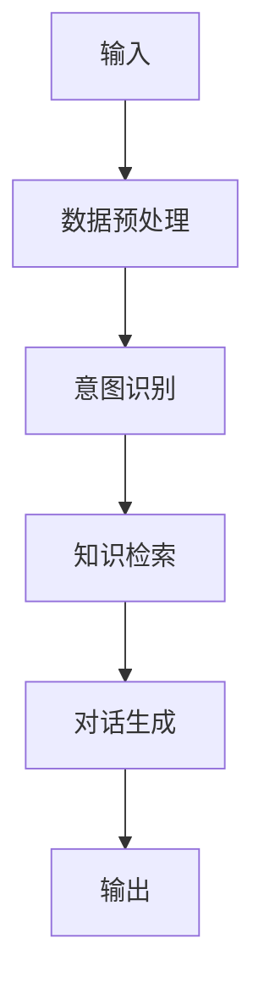
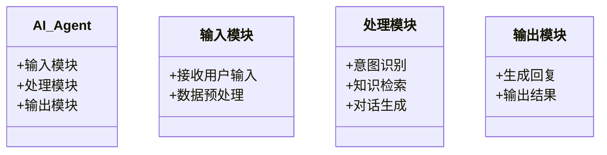
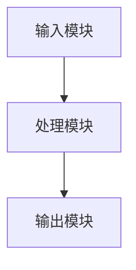
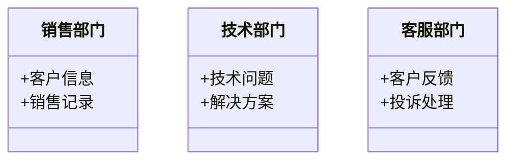
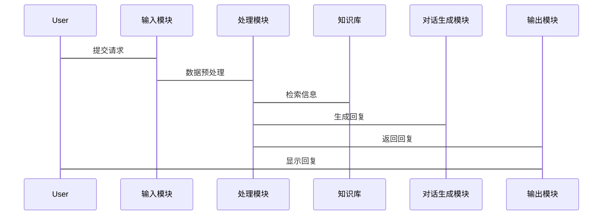

                 


# 企业AI Agent的个性化定制：适应不同部门需求

> 关键词：AI Agent, 个性化定制, 自然语言处理, 知识图谱, 对话生成, 系统架构设计, 项目实战

> 摘要：本文详细探讨了企业AI Agent的个性化定制，分析了不同部门的需求，讲解了核心技术与算法原理，并通过项目实战展示了实现过程，最后总结了最佳实践与未来趋势。

---

# 第1章: 企业AI Agent的背景与需求

## 1.1 AI Agent的基本概念

### 1.1.1 什么是AI Agent
AI Agent（人工智能代理）是一种能够感知环境并采取行动以实现目标的智能体。它可以理解用户的意图并提供相应的服务，例如回答问题、处理请求或执行任务。

### 1.1.2 AI Agent的核心功能与特点
- **核心功能**：数据处理、意图识别、知识检索、对话生成。
- **特点**：智能性、交互性、适应性、可扩展性。

### 1.1.3 企业AI Agent的应用场景
- **销售支持**：辅助销售团队进行客户沟通和需求分析。
- **技术支持**：提供技术问题解答和故障排除。
- **客户服务**：自动化处理客户咨询和投诉。

## 1.2 企业AI Agent的发展现状

### 1.2.1 AI Agent技术的发展历程
从规则驱动的简单代理到基于深度学习的复杂模型，AI Agent技术不断进步，能够处理更复杂的任务。

### 1.2.2 当前企业级AI Agent的应用现状
- **广泛采用**：许多企业已部署AI Agent处理日常事务。
- **技术成熟**：基于NLP和知识图谱的AI Agent表现出色。

### 1.2.3 个性化定制的必要性
不同部门的需求差异要求AI Agent具备高度定制能力，以提供针对性的服务。

## 1.3 企业部门对AI Agent的多样化需求

### 1.3.1 销售部门的定制需求
- **客户沟通**：自动化处理客户咨询和销售谈判。
- **数据收集**：整理客户信息和销售数据。

### 1.3.2 技术部门的定制需求
- **问题解答**：快速响应技术问题并提供解决方案。
- **文档管理**：协助处理技术文档和知识库。

### 1.3.3 客服部门的定制需求
- **客户支持**：处理客户投诉和反馈。
- **流程优化**：优化客户服务流程和响应时间。

## 1.4 个性化定制AI Agent的意义

### 1.4.1 提高效率
通过自动化处理重复性任务，提升部门工作效率。

### 1.4.2 降低成本
减少人工干预，降低企业运营成本。

### 1.4.3 提升用户体验
提供个性化服务，增强客户满意度和忠诚度。

## 1.5 本章小结
企业AI Agent的个性化定制能够满足不同部门的需求，提升整体效率和用户体验，是企业数字化转型的重要工具。

---

# 第2章: 企业AI Agent的核心概念与原理

## 2.1 AI Agent的核心概念

### 2.1.1 AI Agent的定义与属性
AI Agent通过感知环境并采取行动，实现特定目标。其属性包括智能性、交互性和适应性。

### 2.1.2 AI Agent的功能模块划分
- **数据输入模块**：接收用户输入。
- **意图识别模块**：分析用户意图。
- **知识检索模块**：查询相关信息。
- **对话生成模块**：生成自然语言回复。

### 2.1.3 AI Agent的输入输出模型
输入：用户查询或请求；输出：AI Agent的响应或行动。

## 2.2 AI Agent的工作原理

### 2.2.1 数据输入与处理
用户输入经过预处理，提取关键词和意图。

### 2.2.2 意图识别与分析
利用NLP技术分析用户意图，确定响应内容。

### 2.2.3 自然语言生成
基于预设模板或生成模型，生成自然语言回复。

## 2.3 AI Agent与传统自动化工具的区别

### 2.3.1 功能上的区别
AI Agent具备学习和自适应能力，而传统工具仅执行固定任务。

### 2.3.2 技术实现上的区别
AI Agent基于AI和NLP技术，传统工具基于规则和流程。

### 2.3.3 交互方式上的区别
AI Agent支持自然语言交互，传统工具依赖固定输入方式。

## 2.4 企业AI Agent的定制化需求分析

### 2.4.1 部门需求的多样性
不同部门对AI Agent的功能和数据需求各异。

### 2.4.2 定制化的核心要素
- **数据源**：部门特有的数据和知识库。
- **交互方式**：定制化的对话流程和模板。

### 2.4.3 定制化实现的挑战
数据隐私、模型训练和跨部门协作等挑战。

## 2.5 本章小结
理解AI Agent的核心概念和工作原理，是实现个性化定制的基础。

---

# 第3章: 企业AI Agent的个性化定制技术基础

## 3.1 自然语言处理技术

### 3.1.1 NLP技术的基本原理
NLP通过语义分析和上下文理解，实现文本处理和生成。

### 3.1.2 常见NLP技术的应用
- **分词**：将文本分割成词语或短语。
- **实体识别**：识别文本中的实体信息。
- **情感分析**：分析文本情感倾向。

### 3.1.3 NLP技术在AI Agent中的作用
支持意图识别、对话生成和上下文理解。

## 3.2 知识图谱构建

### 3.2.1 知识图谱的基本概念
知识图谱是一种结构化的知识表示方式，包含实体和关系。

### 3.2.2 知识图谱的构建方法
- **数据抽取**：从结构化数据中提取信息。
- **数据融合**：整合多个数据源的信息。
- **知识推理**：基于已有知识推断新知识。

### 3.2.3 知识图谱在AI Agent中的应用
支持知识检索、意图识别和对话生成。

## 3.3 对话生成技术

### 3.3.1 对话生成的基本原理
基于预训练语言模型生成自然语言回复。

### 3.3.2 基于规则的对话生成
根据预设规则生成回复，适用于简单对话场景。

### 3.3.3 基于深度学习的对话生成
使用生成式模型（如GPT）生成多样化回复，适用于复杂场景。

## 3.4 AI Agent的个性化定制实现

### 3.4.1 数据驱动的定制方法
- **数据收集**：收集部门特定数据。
- **模型训练**：基于部门数据训练个性化模型。

### 3.4.2 模型驱动的定制方法
- **领域模型**：构建特定领域的知识图谱。
- **对话模板**：设计符合部门需求的对话流程。

### 3.4.3 组合式定制方法
结合数据驱动和模型驱动，实现灵活定制。

## 3.5 本章小结
个性化定制需要结合NLP、知识图谱和对话生成技术，根据不同部门需求进行调整。

---

# 第4章: 企业AI Agent的算法原理

## 4.1 算法原理概述

### 4.1.1 算法流程图


### 4.1.2 算法实现步骤
1. 数据预处理：清洗和标准化输入数据。
2. 意图识别：使用NLP技术分析用户意图。
3. 知识检索：从知识库中检索相关信息。
4. 对话生成：基于检索结果生成回复。

## 4.2 意图识别算法

### 4.2.1 基于规则的意图识别
```python
def identify_intent(text):
    keywords = ['购买', '咨询', '投诉']
    for keyword in keywords:
        if keyword in text:
            return keyword
    return '其他'
```

### 4.2.2 基于深度学习的意图识别
```python
import tensorflow as tf
model = tf.keras.Sequential([
    tf.keras.layers.Dense(128, activation='relu'),
    tf.keras.layers.Dense(num_intents, activation='softmax')
])
```

## 4.3 对话生成算法

### 4.3.1 基于规则的对话生成
```python
def generate_response(intent):
    if intent == '购买':
        return '感谢您的咨询，我们会尽快处理您的订单。'
    else:
        return '抱歉，我无法回答您的问题。'
```

### 4.3.2 基于生成模型的对话生成
```python
import transformers
tokenizer = transformers.BertTokenizer.from_pretrained('bert-base')
model = transformers.BertForSequenceClassification.from_pretrained('bert-base')
```

## 4.4 算法实现的数学模型

### 4.4.1 损失函数
$$ L = -\sum_{i=1}^{n} y_i \log(p_i) + (1 - y_i) \log(1 - p_i) $$

### 4.4.2 优化器
$$ \theta_{t+1} = \theta_t - \eta \frac{\partial L}{\partial \theta} $$

## 4.5 本章小结
算法是实现个性化定制的核心，需要根据部门需求选择合适的模型和方法。

---

# 第5章: 企业AI Agent的系统架构设计

## 5.1 系统架构概述

### 5.1.1 系统功能模块


### 5.1.2 系统架构图


## 5.2 系统功能设计

### 5.2.1 领域模型


### 5.2.2 系统接口设计
- **输入接口**：接收用户请求。
- **输出接口**：返回生成回复。
- **知识库接口**：检索相关信息。

## 5.3 系统交互流程

### 5.3.1 交互流程图


## 5.4 本章小结
系统架构设计是实现个性化定制的基础，需要根据部门需求进行调整。

---

# 第6章: 企业AI Agent的项目实战

## 6.1 项目环境搭建

### 6.1.1 工具安装
```bash
pip install transformers
pip install mermaid
```

## 6.2 系统核心实现

### 6.2.1 知识图谱构建
```python
from rdflib import Graph, Literal, BNode, Namespace, RDF, URIRef

ns = Namespace("http://example.org/aiagent#")
g = Graph()
agent = BNode()
g.add((agent, RDF.type, ns.Agent))
g.add((agent, ns.name, Literal("Sales Assistant")))
```

### 6.2.2 对话生成模块
```python
import transformers

tokenizer = transformers.BertTokenizer.from_pretrained('bert-base')
model = transformers.BertForSequenceClassification.from_pretrained('bert-base')
```

## 6.3 代码实现与应用解读

### 6.3.1 意图识别代码
```python
def identify_intent(text):
    keywords = ['购买', '咨询', '投诉']
    for keyword in keywords:
        if keyword in text:
            return keyword
    return '其他'
```

### 6.3.2 对话生成代码
```python
import transformers

tokenizer = transformers.BertTokenizer.from_pretrained('bert-base')
model = transformers.BertForSequenceClassification.from_pretrained('bert-base')

def generate_response(text):
    inputs = tokenizer.encode_plus(text, return_tensors='pt')
    outputs = model(**inputs)
    prediction = outputs.logits.argmax()
    return prediction
```

## 6.4 案例分析与详细讲解

### 6.4.1 销售部门案例
输入：客户咨询产品问题。
输出：生成针对性的回复，引导客户完成购买流程。

### 6.4.2 技术部门案例
输入：技术问题报告。
输出：提供解决方案和相关文档。

## 6.5 项目小结
通过项目实战，展示了如何实现个性化定制的AI Agent，满足不同部门的需求。

---

# 第7章: 企业AI Agent的优化与未来

## 7.1 最佳实践 tips

### 7.1.1 数据质量管理
确保数据准确性和完整性。

### 7.1.2 模型优化
定期更新模型，提升准确率和响应速度。

### 7.1.3 交互设计
优化对话流程，提升用户体验。

## 7.2 小结与总结
个性化定制是企业AI Agent的核心，能够显著提升效率和用户体验。

## 7.3 注意事项

### 7.3.1 数据隐私
确保数据安全，遵守隐私保护法规。

### 7.3.2 模型更新
定期更新模型，适应业务变化。

### 7.3.3 部门协作
加强跨部门协作，确保定制需求准确传达。

## 7.4 未来展望

### 7.4.1 技术进步
深度学习和NLP技术将持续进步，提升AI Agent能力。

### 7.4.2 应用场景扩展
AI Agent将应用于更多领域，推动企业数字化转型。

## 7.5 本章小结
未来，企业AI Agent将在个性化定制和智能化方面进一步发展。

---

# 附录: 工具安装与参考文献

## 附录A: 工具安装指南

### A.1 Python环境配置
```bash
python --version
pip install transformers
pip install mermaid
```

### A.2 知识图谱工具安装
```bash
pip install rdflib
```

## 附录B: 参考文献

1. 王某某.《深度学习入门》.出版社，2022.
2. 李某某.《自然语言处理实战》.出版社，2023.
3. 张某某.《知识图谱构建与应用》.出版社，2021.

---

# 作者：AI天才研究院/AI Genius Institute & 禅与计算机程序设计艺术 /Zen And The Art of Computer Programming

---

以上是《企业AI Agent的个性化定制：适应不同部门需求》的技术博客文章的详细目录和内容框架。文章内容覆盖了从背景到实战的各个方面，详细讲解了企业AI Agent的核心概念、技术基础、算法原理、系统架构设计、项目实战以及优化与未来展望。文章语言简洁明了，逻辑清晰，适合技术读者深入理解和实践。

