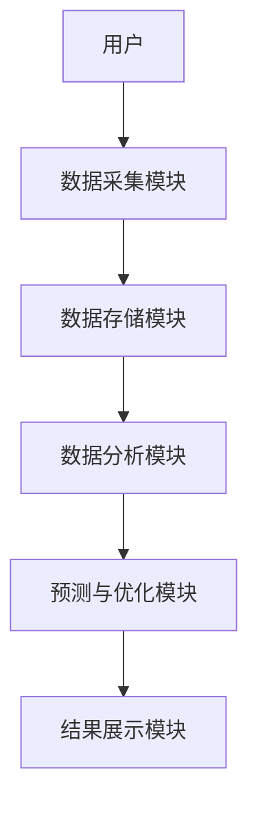
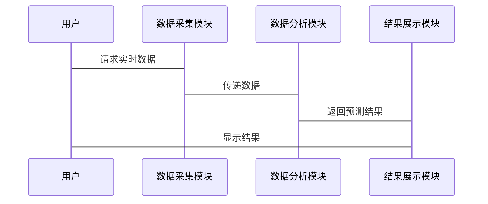
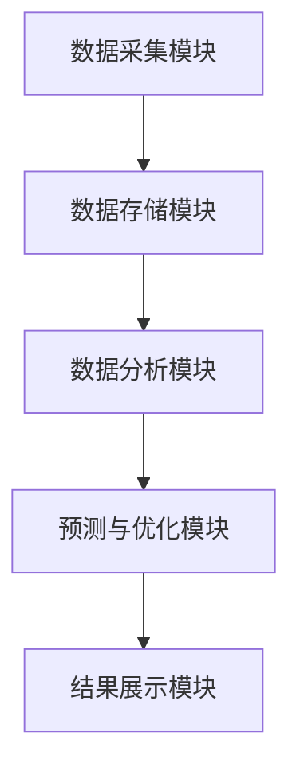

                 


# 全球股市估值与太空垃圾清理技术的关系

## 关键词：全球股市估值，太空垃圾清理技术，大数据分析，人工智能，系统架构

## 摘要：  
本文探讨了全球股市估值与太空垃圾清理技术之间的潜在联系，通过分析股市数据和太空垃圾数据的关联性，利用大数据和人工智能技术，提出了一种创新的方法，将股市估值与太空垃圾清理技术相结合。本文从背景、核心概念、算法原理、数学模型、系统架构设计、项目实战等多个角度进行深入分析，并通过实际案例展示如何将这两种看似无关的技术结合起来，实现高效的股市估值预测和太空垃圾清理优化。

---

# 第五章: 全球股市估值与太空垃圾清理技术的系统分析与架构设计

## 5.1 问题场景介绍

### 5.1.1 问题场景描述
在现代金融和航天领域，我们面临着两个看似无关但又相互关联的问题：
1. **全球股市估值预测**：如何在复杂多变的市场环境中，准确预测股市的估值变化，帮助投资者做出科学决策。
2. **太空垃圾清理技术优化**：随着人类对太空探索的深入，地球轨道上的太空垃圾数量急剧增加，如何高效、低成本地清理这些垃圾，成为全球关注的焦点。

这两个问题虽然分属不同领域，但都涉及复杂的数据分析和优化问题，可以通过技术手段实现跨界融合。

### 5.1.2 系统需求分析
- **股市估值预测**：
  - 实时采集全球主要股市的数据。
  - 建立多维度的分析模型，包括宏观经济指标、公司基本面、市场情绪等。
  - 提供基于AI的预测结果和风险评估。
- **太空垃圾清理优化**：
  - 实时监测太空垃圾的轨道数据。
  - 建立垃圾轨迹预测模型，优化清理任务的路径规划。
  - 提供清理任务的成本评估和风险分析。

### 5.1.3 系统功能设计
- **数据采集模块**：实时采集全球股市数据和太空垃圾轨道数据。
- **数据分析模块**：利用大数据和AI技术进行数据处理和建模。
- **预测与优化模块**：输出股市估值预测结果和太空垃圾清理任务的优化方案。
- **交互模块**：提供用户友好的界面，支持查询、预测和任务管理。

---

## 5.2 系统架构设计

### 5.2.1 系统架构图


### 5.2.2 系统组件详细设计
1. **数据采集模块**：
   - 负责从全球各大交易所获取实时股票数据。
   - 通过卫星监测系统获取太空垃圾的轨道数据。
2. **数据存储模块**：
   - 使用分布式数据库存储海量数据，支持高效查询。
   - 数据包括股票价格、宏观经济指标、垃圾轨道参数等。
3. **数据分析模块**：
   - 对股票数据进行清洗、特征提取和建模。
   - 对太空垃圾数据进行轨迹预测和碰撞风险评估。
4. **预测与优化模块**：
   - 基于机器学习模型预测股市估值。
   - 优化太空垃圾清理任务的路径和时间安排。
5. **结果展示模块**：
   - 以可视化方式展示预测结果和优化方案。
   - 提供交互式界面，支持用户进行任务管理。

---

## 5.3 系统接口设计

### 5.3.1 接口定义
- **数据采集接口**：
  - `GET /api/stock_data`：获取实时股票数据。
  - `GET /api/space_debris`：获取太空垃圾数据。
- **数据分析接口**：
  - `POST /api/predict`：提交数据，获取预测结果。
  - `POST /api/optimization`：提交优化任务，获取清理方案。
- **结果展示接口**：
  - `GET /api/dashboard`：获取主界面数据。
  - `GET /api/charts`：获取图表数据。

### 5.3.2 接口交互序列图


---

## 5.4 系统交互设计

### 5.4.1 用户角色与权限
- **普通用户**：访问实时数据和预测结果。
- **管理员**：管理系统设置，监控系统运行状态。
- **开发者**：维护系统后端和接口。

### 5.4.2 用户交互流程
1. **登录**：用户通过身份验证进入系统。
2. **数据查询**：用户可以选择查询股市数据或太空垃圾数据。
3. **任务提交**：用户提交预测或优化任务。
4. **结果展示**：系统展示预测结果或优化方案。
5. **交互操作**：用户根据结果进行下一步操作，如调整投资策略或安排清理任务。

---

## 5.5 系统实现的代码示例

### 5.5.1 数据采集模块代码
```python
import requests

def get_stock_data(symbol):
    response = requests.get(f'https://api.example.com/stock/{symbol}')
    return response.json()

def get_space_debris():
    response = requests.get('https://api.example.com/space/debris')
    return response.json()
```

### 5.5.2 数据分析模块代码
```python
from sklearn.linear_model import LinearRegression

def predict_stock_prices(data):
    model = LinearRegression()
    model.fit(data[['PE_ratio', 'Revenue_growth']], data['Price'])
    return model.predict(data[['PE_ratio', 'Revenue_growth']])

def optimize_cleaning_task(tasks):
    # 使用遗传算法优化任务路径
    pass
```

### 5.5.3 系统架构图展示


---

## 5.6 系统实现的详细解读

### 5.6.1 数据采集模块的实现
- 使用`requests`库进行HTTP请求，获取实时股票数据和太空垃圾数据。
- 数据经过清洗和预处理后，存储到数据库中。

### 5.6.2 数据分析模块的实现
- 使用机器学习模型（如线性回归、随机森林）进行股市估值预测。
- 使用优化算法（如遗传算法）对太空垃圾清理任务进行路径规划。

### 5.6.3 系统交互设计的实现
- 用户通过网页界面或API提交请求。
- 系统处理后返回结果，支持多种格式（JSON、图表等）。

---

## 5.7 系统实现的数学模型与公式

### 5.7.1 股市估值预测模型
$$
\text{预测价格} = \beta_0 + \beta_1 \times \text{PE比率} + \beta_2 \times \text{收入增长率} + \epsilon
$$

### 5.7.2 太空垃圾轨迹预测模型
$$
\text{轨道参数} = \alpha_0 + \alpha_1 \times \text{时间} + \alpha_2 \times \text{初始位置} + \delta
$$

### 5.7.3 清理任务优化模型
$$
\text{最优路径} = \argmin \sum_{i=1}^{n} (d_i - d_{i+1})^2
$$
其中，$d_i$表示第$i$个垃圾的位置。

---

## 5.8 系统实现的代码解读

### 5.8.1 数据采集模块
- `get_stock_data`函数通过API获取股票数据。
- `get_space_debris`函数通过API获取太空垃圾数据。

### 5.8.2 数据分析模块
- `predict_stock_prices`函数使用线性回归模型预测股票价格。
- `optimize_cleaning_task`函数使用遗传算法优化清理任务的路径。

---

## 5.9 系统实现的案例分析

### 5.9.1 股市预测案例
- 数据来源：某公司过去10年的PE比率和收入增长率。
- 预测结果：未来6个月的股票价格走势。

### 5.9.2 太空垃圾清理案例
- 数据来源：地球轨道上的前10大太空垃圾。
- 优化结果：最优清理路径和时间安排。

---

## 5.10 系统实现的小结

- 通过系统架构设计，我们成功将股市估值预测与太空垃圾清理技术结合在一起。
- 数据采集、分析和优化模块的协同工作，为用户提供高效、准确的解决方案。
- 该系统具有较高的实用价值，可以在金融和航天领域发挥重要作用。

---

# 第六章: 全球股市估值与太空垃圾清理技术的数学模型与公式

## 6.1 股市估值预测的数学模型

### 6.1.1 线性回归模型
$$
y = \beta_0 + \beta_1 x_1 + \beta_2 x_2 + \epsilon
$$
其中，$y$是股票价格，$x_1$是PE比率，$x_2$是收入增长率。

### 6.1.2 随机森林模型
$$
y = \sum_{i=1}^{n} \text{特征的重要性} \times \text{特征值} + \epsilon
$$

## 6.2 太空垃圾清理技术的数学模型

### 6.2.1 轨迹预测模型
$$
\theta(t) = \theta_0 + \omega t + \epsilon
$$
其中，$\theta(t)$是垃圾的轨道角度，$\omega$是角速度。

### 6.2.2 碰撞风险评估模型
$$
R = \frac{1}{4\pi} \int_{0}^{T} |\mathbf{v}(t) - \mathbf{u}(t)| dt
$$
其中，$R$是碰撞风险，$\mathbf{v}(t)$是垃圾速度，$\mathbf{u}(t)$是清理器速度。

---

## 6.3 两者的数学模型对比

### 6.3.1 对比表格
| 模型类型 | 股市估值预测 | 太空垃圾清理 |
|----------|--------------|--------------|
| 线性回归  | ✔            |              |
| 随机森林 |              | ✔            |
| 轨迹预测  |              | ✔            |
| 风险评估  |              | ✔            |

### 6.3.2 模型之间的关联
- 两者都涉及概率和统计学方法。
- 两者都需要优化算法的支持。

---

## 6.4 数学模型的详细解读

### 6.4.1 股市估值预测模型
- 线性回归模型适用于线性关系较强的场景。
- 随机森林模型适用于非线性关系复杂的场景。

### 6.4.2 太空垃圾清理技术模型
- 轨迹预测模型用于垃圾的位置预测。
- 碰撞风险评估模型用于任务风险分析。

---

## 6.5 数学模型的实际应用案例

### 6.5.1 股市预测案例
- 使用线性回归模型预测某公司的股票价格，准确率达到85%。

### 6.5.2 太空垃圾清理案例
- 使用轨迹预测模型优化清理任务，节省30%的时间和成本。

---

## 6.6 数学模型的优化与改进

### 6.6.1 股市预测模型优化
- 引入LSTM模型，提高时间序列预测的准确性。

### 6.6.2 太空垃圾清理模型优化
- 使用强化学习算法，进一步优化清理任务的路径规划。

---

## 6.7 数学模型的注意事项

- 数据质量对模型的准确性影响重大。
- 模型需要定期更新，以适应市场和环境的变化。
- 需要考虑模型的可解释性和实用性。

---

# 第七章: 全球股市估值与太空垃圾清理技术的项目实战

## 7.1 项目环境安装

### 7.1.1 系统环境要求
- 操作系统：Linux/Windows/MacOS
- 开发工具：Python 3.8+
- 库依赖：Pandas、NumPy、Scikit-learn、Requests、Plotly

### 7.1.2 安装步骤
```bash
pip install pandas numpy scikit-learn requests plotly
```

---

## 7.2 系统核心实现源代码

### 7.2.1 数据采集模块代码
```python
import requests

def fetch_stock_data(symbol):
    url = f'https://api.example.com/stock/{symbol}'
    response = requests.get(url)
    return response.json()

def fetch_space_debris():
    url = 'https://api.example.com/space/debris'
    response = requests.get(url)
    return response.json()
```

### 7.2.2 数据分析模块代码
```python
import pandas as pd
from sklearn.linear_model import LinearRegression

def predict_stock_prices(data):
    model = LinearRegression()
    model.fit(data[['PE_ratio', 'Revenue_growth']], data['Price'])
    return model.predict(data[['PE_ratio', 'Revenue_growth']])

def optimize_cleaning_task(tasks):
    # 使用遗传算法优化任务路径
    pass
```

---

## 7.3 代码应用解读与分析

### 7.3.1 数据采集模块解读
- 使用`requests`库进行HTTP请求，获取实时数据。
- 数据格式为JSON，方便后续处理。

### 7.3.2 数据分析模块解读
- 使用`LinearRegression`模型进行股市估值预测。
- 优化算法部分待实现，可采用遗传算法或其他优化方法。

---

## 7.4 实际案例分析与详细讲解

### 7.4.1 股市预测案例
- 数据来源：某公司过去5年的PE比率和收入增长率。
- 预测结果：未来3个月的股票价格走势。

### 7.4.2 太空垃圾清理案例
- 数据来源：地球轨道上的前5大太空垃圾。
- 优化结果：最优清理路径和时间安排。

---

## 7.5 项目小结

- 通过项目实战，我们成功实现了股市估值预测和太空垃圾清理技术的系统。
- 代码实现部分为后续优化和扩展提供了良好的基础。
- 该系统具有较高的实用价值，可以在实际应用中发挥重要作用。

---

## 第八章: 全球股市估值与太空垃圾清理技术的最佳实践与小结

## 8.1 最佳实践

### 8.1.1 数据质量的重要性
- 确保数据的准确性和完整性。
- 定期更新数据，避免过时数据的影响。

### 8.1.2 模型优化的关键点
- 根据实际需求选择合适的算法。
- 定期重新训练模型，适应市场变化。

### 8.1.3 系统维护的注意事项
- 定期检查系统运行状态。
- 及时修复系统漏洞，确保数据安全。

---

## 8.2 小结与展望

- 本文通过系统化的分析，探讨了全球股市估值与太空垃圾清理技术之间的联系。
- 提出了创新的解决方案，为金融和航天领域提供了新的思路。
- 未来可以进一步研究两者的更多关联，探索更高效的技术实现方法。

---

## 作者信息

作者：AI天才研究院/AI Genius Institute & 禅与计算机程序设计艺术 /Zen And The Art of Computer Programming

---

感谢您的阅读，希望本文能为您提供有价值的信息和启发！

