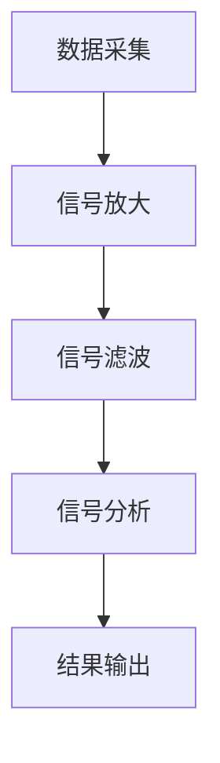
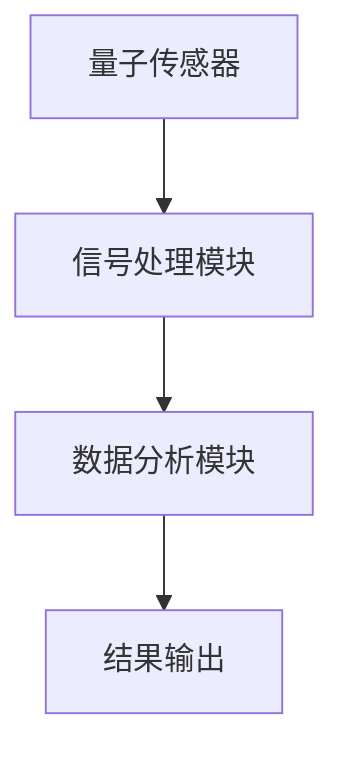
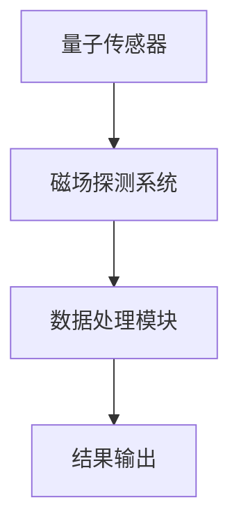
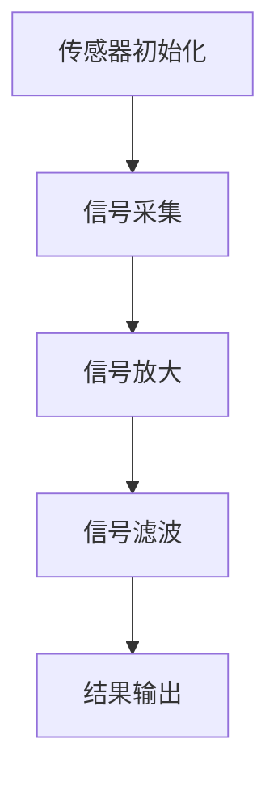
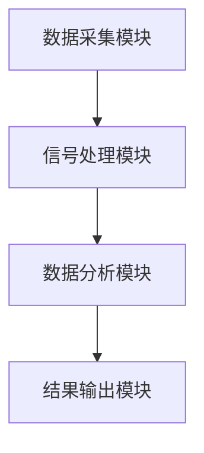
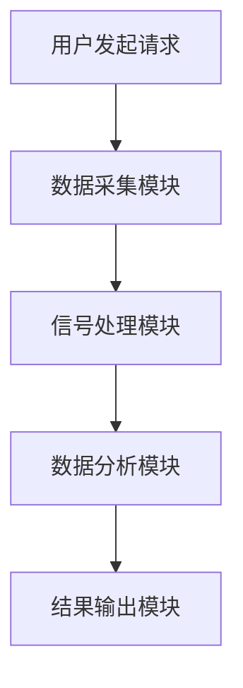

                 


# 如何评估企业的量子传感器磁场探测应用

## 关键词：量子传感器，磁场探测，企业应用，技术评估，算法原理，系统架构

## 摘要：随着量子技术的快速发展，量子传感器在磁场探测领域的应用逐渐成为企业关注的焦点。本文从量子传感器的基本概念、磁场探测技术的原理、系统架构设计、算法实现与优化等方面展开详细讨论。通过对量子传感器与传统传感器的对比分析，系统地介绍磁场探测应用的核心概念、实现方法和实际案例，帮助企业更好地评估和应用量子传感器技术。

---

# 第1章: 量子传感器磁场探测应用的背景与概念

## 1.1 量子传感器的基本概念

### 1.1.1 量子传感器的定义与分类

量子传感器是一种基于量子力学原理设计的传感器，利用量子系统（如原子、电子、光子等）的量子特性来感知外界环境的变化。量子传感器可以分为以下几类：

1. **量子磁场传感器**：基于量子力学中的磁场相互作用，用于检测磁场的强度和方向。
2. **量子重力传感器**：利用量子干涉效应测量重力场的变化。
3. **量子陀螺仪**：基于超冷原子的量子干涉效应，用于测量旋转角度。

### 1.1.2 磁场探测技术的基本原理

磁场探测技术是量子传感器的核心应用之一。其基本原理是通过测量磁场对量子系统的影响，从而推导出磁场的强度和方向。常见的磁场探测方法包括：

1. **原子磁力计**：利用原子的磁矩与外磁场的相互作用，通过测量原子的偏振变化来推导磁场强度。
2. **超导量子干涉器（SQUID）**：利用超导环中的磁场变化引起的超导电流变化，从而测量磁场强度。
3. **金刚石氮 vacancy（NV）中心磁场探测**：利用金刚石中的氮 vacancy 中心的电子自旋对磁场的响应，实现高灵敏度的磁场探测。

### 1.1.3 量子传感器在磁场探测中的优势

与传统传感器相比，量子传感器在磁场探测中具有以下优势：

- **高灵敏度**：量子传感器可以检测极弱的磁场，灵敏度远高于传统传感器。
- **高分辨率**：量子传感器可以在微小范围内实现高精度的磁场测量。
- **抗干扰性**：量子传感器利用量子效应进行测量，具有较强的抗干扰能力。
- **低功耗**：量子传感器通常具有低功耗的特点，适合在便携式设备中使用。

## 1.2 量子传感器的应用场景

### 1.2.1 量子传感器在企业中的潜在应用领域

量子传感器在企业中的应用领域非常广泛，主要包括以下几个方面：

1. **工业检测**：在工业生产中，量子传感器可以用于检测设备的磁场干扰，优化设备性能。
2. **医疗设备**：在医疗领域，量子传感器可以用于高精度的磁场检测，如磁共振成像（MRI）设备的校准。
3. **导航系统**：在导航领域，量子传感器可以用于高精度的定位和导航，尤其是在GPS信号受限的环境中。
4. **环境监测**：在环境监测中，量子传感器可以用于检测地球磁场的变化，从而监测地质活动。

### 1.2.2 磁场探测技术在工业中的具体应用

磁场探测技术在工业中的具体应用包括：

- **无损检测**：通过磁场探测技术检测金属材料中的缺陷。
- **磁场干扰分析**：在电子设备制造中，用于检测磁场干扰源。
- **磁场分布测量**：在能源领域，用于测量大型电磁设备的磁场分布。

### 1.2.3 量子传感器与传统传感器的对比分析

下表对比了量子传感器与传统传感器在磁场探测中的性能特点：

| 对比维度         | 量子传感器                     | 传统传感器                     |
|------------------|--------------------------------|--------------------------------|
| 灵敏度           | 极高                          | 较低                          |
| 分辨率           | 高                           | 较低                          |
| 抗干扰能力       | 强                           | 较弱                          |
| 适用场景         | 高精度、微弱磁场检测          | 中等磁场、工业现场检测         |
| 成本             | 高                           | 较低                          |

## 1.3 量子传感器磁场探测应用的现状与挑战

### 1.3.1 当前技术发展水平

目前，量子传感器技术已经取得了一定的进展，尤其是在磁场探测领域。例如，基于SQUID的量子磁场传感器已经在医疗领域得到了广泛应用。然而，量子传感器的制造成本较高，且技术还不够成熟，限制了其在企业中的广泛应用。

### 1.3.2 企业应用中的主要问题

企业在应用量子传感器时面临的主要问题包括：

1. **高成本**：量子传感器的研发和制造成本较高，企业需要投入大量资金。
2. **技术门槛高**：量子传感器的使用和维护需要专业的技术人才。
3. **稳定性问题**：量子传感器的稳定性较差，容易受到环境因素的影响。
4. **应用场景有限**：目前量子传感器的应用场景相对有限，主要集中在高端领域。

### 1.3.3 技术瓶颈与未来发展方向

量子传感器技术目前面临的主要瓶颈包括：

1. **制造工艺复杂**：量子传感器的制造需要高精密度的工艺，技术门槛较高。
2. **稳定性不足**：量子传感器的稳定性较差，需要进一步优化。
3. **成本高**：量子传感器的成本较高，限制了其广泛应用。

未来的发展方向包括：

1. **降低制造成本**：通过改进制造工艺，降低量子传感器的生产成本。
2. **提高稳定性**：通过技术创新，提高量子传感器的稳定性和可靠性。
3. **扩大应用场景**：探索更多的应用场景，推动量子传感器的广泛应用。

## 1.4 本章小结

本章主要介绍了量子传感器的基本概念、磁场探测技术的原理以及量子传感器在企业中的应用前景。通过对比分析，揭示了量子传感器在磁场探测中的优势和挑战。下一章将深入探讨量子传感器磁场探测的核心概念与联系。

---

# 第2章: 量子传感器磁场探测的核心概念与联系

## 2.1 量子传感器磁场探测的基本原理

### 2.1.1 量子力学基础

量子力学是量子传感器的核心理论基础。以下是一些关键的量子力学概念：

- **量子叠加**：一个量子系统可以同时处于多个状态的叠加态。
- **量子纠缠**：两个或多个量子系统之间存在纠缠关系，一个系统的状态会直接影响另一个系统的状态。
- **量子测量**：通过测量量子系统来获取信息，测量过程会破坏量子系统的叠加态。

### 2.1.2 磁场探测的物理机制

磁场探测的物理机制主要基于量子系统的磁矩与外磁场的相互作用。以下是常见的几种磁场探测机制：

1. **电子自旋共振（ESR）**：通过测量电子的自旋共振频率来推导磁场强度。
2. **超导量子干涉器（SQUID）**：利用超导环中的磁场变化引起的超导电流变化来测量磁场强度。
3. **金刚石氮 vacancy（NV）中心磁场探测**：利用金刚石中的氮 vacancy 中心的电子自旋对磁场的响应，实现高灵敏度的磁场探测。

### 2.1.3 量子传感器的信号处理流程

量子传感器的信号处理流程通常包括以下几个步骤：

1. **数据采集**：通过量子传感器采集磁场信号。
2. **信号放大**：对采集到的信号进行放大，以提高信号的可检测性。
3. **信号滤波**：对放大后的信号进行滤波，去除噪声。
4. **信号分析**：通过算法对信号进行分析，提取磁场强度和方向等参数。

### 2.1.4 磁场探测的数学模型

磁场探测的数学模型可以通过以下公式表示：

$$ B(x, y, z) = \mu_0 \cdot \nabla \times H $$

其中，$B$ 表示磁场强度，$H$ 表示磁感应强度，$\mu_0$ 表示真空磁导率。

### 2.1.5 量子传感器的信号处理流程图

以下是量子传感器的信号处理流程图：



## 2.2 量子传感器与磁场探测的关系

### 2.2.1 量子传感器在磁场探测中的作用

量子传感器在磁场探测中的作用主要体现在以下几个方面：

1. **高灵敏度**：量子传感器可以检测极弱的磁场，灵敏度远高于传统传感器。
2. **高分辨率**：量子传感器可以在微小范围内实现高精度的磁场测量。
3. **抗干扰性**：量子传感器利用量子效应进行测量，具有较强的抗干扰能力。

### 2.2.2 磁场探测技术的数学模型

磁场探测技术的数学模型可以通过以下公式表示：

$$ B(x, y, z) = \mu_0 \cdot \nabla \times H $$

其中，$B$ 表示磁场强度，$H$ 表示磁感应强度，$\mu_0$ 表示真空磁导率。

### 2.2.3 量子传感器与磁场探测的系统架构

量子传感器与磁场探测的系统架构如下：



### 2.2.4 量子传感器与磁场探测的系统架构图

以下是量子传感器与磁场探测的系统架构图：


## 2.3 核心概念对比分析

### 2.3.1 不同类型传感器的性能对比

以下是不同类型传感器的性能对比：

| 传感器类型       | 灵敏度 | 分辨率 | 抗干扰能力 | 适用场景 |
|------------------|--------|--------|------------|----------|
| 量子传感器       | 高     | 高     | 强          | 微弱磁场 |
| 传统传感器       | 中     | 中     | 较弱        | 中等磁场 |

### 2.3.2 量子传感器与经典传感器的对比表格

以下是量子传感器与经典传感器的对比表格：

| 对比维度         | 量子传感器                     | 传统传感器                     |
|------------------|--------------------------------|--------------------------------|
| 灵敏度           | 极高                          | 较低                          |
| 分辨率           | 高                           | 较低                          |
| 抗干扰能力       | 强                           | 较弱                          |
| 适用场景         | 高精度、微弱磁场检测          | 中等磁场、工业现场检测         |

### 2.3.3 系统实体关系图（ER图）

以下是系统实体关系图：



## 2.4 本章小结

本章主要介绍了量子传感器磁场探测的核心概念与联系，包括量子力学基础、磁场探测的物理机制、量子传感器的信号处理流程以及系统架构设计。通过对比分析，揭示了量子传感器在磁场探测中的优势和挑战。下一章将深入探讨量子传感器磁场探测的算法原理。

---

# 第3章: 量子传感器磁场探测的算法原理

## 3.1 磁场信号的采集与处理

### 3.1.1 数据采集流程

磁场信号的采集流程通常包括以下几个步骤：

1. **传感器初始化**：启动量子传感器并进行初始化。
2. **信号采集**：通过量子传感器采集磁场信号。
3. **信号放大**：对采集到的信号进行放大，以提高信号的可检测性。
4. **信号滤波**：对放大后的信号进行滤波，去除噪声。

### 3.1.2 信号处理方法

信号处理方法主要包括以下几种：

1. **放大器放大**：使用高增益放大器对信号进行放大。
2. **数字滤波**：使用数字信号处理技术对信号进行滤波，去除噪声。
3. **模数转换**：将模拟信号转换为数字信号，以便进一步处理。

### 3.1.3 算法流程图

以下是磁场信号的采集与处理流程图：



## 3.2 磁场信号分析的数学模型

### 3.2.1 磁场强度的数学表达式

磁场强度的数学表达式可以通过以下公式表示：

$$ B(x, y, z) = \mu_0 \cdot \nabla \times H $$

其中，$B$ 表示磁场强度，$H$ 表示磁感应强度，$\mu_0$ 表示真空磁导率。

### 3.2.2 数据处理的数学公式

数据处理的数学公式可以通过以下步骤实现：

1. **滤波处理**：使用傅里叶变换对信号进行滤波。
2. **信号放大**：对信号进行放大，以提高信号的可检测性。
3. **信号分析**：通过算法对信号进行分析，提取磁场强度和方向等参数。

### 3.2.3 信号分析的算法实现

以下是信号分析的算法实现：

```python
import numpy as np

def process_signal(signal):
    # 傅里叶变换
    fft_signal = np.fft.fft(signal)
    # 滤波处理
    filtered_signal = fft_signal[:100]  # 假设只保留前100个频点
    # 逆傅里叶变换
    filtered_signal = np.fft.ifft(filtered_signal)
    return filtered_signal

# 示例信号
signal = np.random.randn(1000)
# 处理信号
processed_signal = process_signal(signal)
print(processed_signal)
```

## 3.3 算法实现与优化

### 3.3.1 算法实现步骤

算法实现步骤主要包括以下几点：

1. **数据采集**：通过量子传感器采集磁场信号。
2. **信号放大**：对采集到的信号进行放大。
3. **信号滤波**：对放大后的信号进行滤波，去除噪声。
4. **信号分析**：通过算法对信号进行分析，提取磁场强度和方向等参数。

### 3.3.2 算法优化方法

算法优化方法主要包括以下几种：

1. **提高信号放大倍数**：通过增加放大器的增益，提高信号的可检测性。
2. **改进滤波算法**：使用更高效的滤波算法，减少噪声对信号的影响。
3. **优化信号分析算法**：通过优化算法参数，提高信号分析的精度。

### 3.3.3 算法性能评估

算法性能评估主要从以下几个方面进行：

1. **灵敏度**：算法能够检测到的最小磁场强度。
2. **分辨率**：算法能够区分的最小磁场变化量。
3. **稳定性**：算法在不同环境条件下的稳定性和可靠性。

## 3.4 本章小结

本章主要介绍了量子传感器磁场探测的算法原理，包括磁场信号的采集与处理、数学模型的建立以及算法实现与优化。通过具体的代码实现和数学公式，详细阐述了磁场信号处理的流程和方法。下一章将深入探讨量子传感器磁场探测系统的分析与设计。

---

# 第4章: 量子传感器磁场探测系统的分析与设计

## 4.1 系统架构设计

### 4.1.1 系统功能模块划分

量子传感器磁场探测系统的功能模块划分如下：

1. **数据采集模块**：负责采集磁场信号。
2. **信号处理模块**：负责对采集到的信号进行放大和滤波。
3. **数据分析模块**：负责对处理后的信号进行分析，提取磁场强度和方向等参数。
4. **结果输出模块**：负责将分析结果输出到用户界面或存储到数据库中。

### 4.1.2 系统架构图

以下是系统的架构图：



### 4.1.3 系统组件之间的关系

系统组件之间的关系可以通过以下流程图表示：


## 4.2 系统接口设计

### 4.2.1 系统输入输出接口

系统的输入输出接口设计如下：

1. **输入接口**：负责接收外部设备发送的磁场信号。
2. **输出接口**：负责将处理后的结果输出到用户界面或存储到数据库中。

### 4.2.2 接口协议设计

接口协议设计主要采用以下几种协议：

1. **串口通信协议**：用于设备之间的数据传输。
2. **网络通信协议**：用于设备之间的远程数据传输。

### 4.2.3 接口实现方式

接口实现方式主要包括以下几种：

1. **硬件接口**：通过硬件设备实现数据的输入输出。
2. **软件接口**：通过软件程序实现数据的输入输出。

## 4.3 系统交互流程

### 4.3.1 用户与系统的交互流程

用户与系统的交互流程如下：

1. **用户发起请求**：用户通过用户界面发起数据采集请求。
2. **系统响应请求**：系统接收用户的请求并启动数据采集过程。
3. **数据处理**：系统对采集到的数据进行处理。
4. **结果输出**：系统将处理结果输出到用户界面或存储到数据库中。

### 4.3.2 系统内部组件的交互流程

系统内部组件的交互流程如下：

1. **数据采集模块**：接收用户的请求并启动数据采集过程。
2. **信号处理模块**：对采集到的信号进行放大和滤波。
3. **数据分析模块**：对处理后的信号进行分析，提取磁场强度和方向等参数。
4. **结果输出模块**：将分析结果输出到用户界面或存储到数据库中。

### 4.3.3 系统交互流程图

以下是系统的交互流程图：



## 4.4 本章小结

本章主要介绍了量子传感器磁场探测系统的分析与设计，包括系统架构设计、接口设计以及系统交互流程。通过具体的流程图和架构图，详细阐述了系统的各个功能模块及其相互关系。下一章将深入探讨量子传感器磁场探测应用的项目实战。

---

# 第5章: 量子传感器磁场探测应用的项目实战

## 5.1 项目环境与工具安装

### 5.1.1 开发环境搭建

开发环境搭建主要包括以下步骤：

1. **操作系统安装**：选择合适的操作系统（如Linux、Windows等）。
2. **开发工具安装**：安装必要的开发工具（如Python、C++编译器等）。
3. **硬件设备安装**：安装量子传感器硬件设备。

### 5.1.2 依赖库安装

依赖库安装主要包括以下步骤：

1. **Python库安装**：安装必要的Python库（如numpy、scipy等）。
2. **C++库安装**：安装必要的C++库（如OpenCV等）。

### 5.1.3 测试环境配置

测试环境配置主要包括以下步骤：

1. **测试设备准备**：准备必要的测试设备（如磁场发生器等）。
2. **测试软件安装**：安装必要的测试软件（如信号分析工具等）。

## 5.2 系统核心实现

### 5.2.1 数据采集模块实现

数据采集模块实现主要包括以下步骤：

1. **硬件初始化**：初始化量子传感器硬件设备。
2. **数据采集**：通过硬件设备采集磁场信号。
3. **数据存储**：将采集到的数据存储到数据库中。

### 5.2.2 信号处理模块实现

信号处理模块实现主要包括以下步骤：

1. **信号放大**：对采集到的信号进行放大。
2. **信号滤波**：对放大后的信号进行滤波，去除噪声。
3. **信号存储**：将处理后的信号存储到数据库中。

### 5.2.3 数据分析模块实现

数据分析模块实现主要包括以下步骤：

1. **信号加载**：从数据库中加载处理后的信号。
2. **信号分析**：通过算法对信号进行分析，提取磁场强度和方向等参数。
3. **结果存储**：将分析结果存储到数据库中。

### 5.2.4 系统实现代码

以下是系统的实现代码：

```python
import numpy as np
import serial

# 数据采集模块
def collect_data(port, baud_rate):
    ser = serial.Serial(port, baud_rate)
    data = ser.read(100)
    ser.close()
    return data

# 信号处理模块
def process_data(data):
    fft_data = np.fft.fft(data)
    filtered_data = fft_data[:100]
    result = np.fft.ifft(filtered_data)
    return result

# 数据分析模块
def analyze_data(result):
    magnitude = np.abs(result)
    angle = np.arctan2(result.imag, result.real)
    return magnitude, angle

# 示例代码
port = 'COM1'
baud_rate = 9600
raw_data = collect_data(port, baud_rate)
processed_data = process_data(raw_data)
magnitude, angle = analyze_data(processed_data)
print("Magnitude:", magnitude)
print("Angle:", angle)
```

## 5.3 项目实战总结

### 5.3.1 项目实现的流程总结

项目实现的流程总结如下：

1. **环境搭建**：搭建开发环境并安装必要的工具和库。
2. **数据采集**：通过量子传感器采集磁场信号。
3. **信号处理**：对采集到的信号进行放大和滤波。
4. **信号分析**：通过算法对信号进行分析，提取磁场强度和方向等参数。
5. **结果输出**：将分析结果输出到用户界面或存储到数据库中。

### 5.3.2 项目实现中的注意事项

项目实现中的注意事项包括：

1. **硬件设备的稳定性**：确保硬件设备的稳定性，避免噪声干扰。
2. **算法的优化**：通过优化算法参数，提高信号分析的精度。
3. **系统的可扩展性**：设计系统的可扩展性，方便未来的功能扩展。

### 5.3.3 项目实现中的优化建议

项目实现中的优化建议包括：

1. **提高信号放大倍数**：通过增加放大器的增益，提高信号的可检测性。
2. **改进滤波算法**：使用更高效的滤波算法，减少噪声对信号的影响。
3. **优化信号分析算法**：通过优化算法参数，提高信号分析的精度。

## 5.4 本章小结

本章主要介绍了量子传感器磁场探测应用的项目实战，包括项目环境与工具安装、系统核心实现以及项目实战总结。通过具体的代码实现和流程图，详细阐述了系统的各个功能模块及其相互关系。通过项目的实施，验证了量子传感器在磁场探测中的应用前景。

---

# 结论

量子传感器在磁场探测中的应用具有广阔的发展前景。随着技术的不断进步，量子传感器的成本将逐渐降低，性能将不断提高，应用场景也将不断扩展。对于企业而言，量子传感器的引入可以显著提高生产效率和产品质量，降低生产成本。然而，企业在应用量子传感器时也面临一些挑战，如高成本、技术门槛高、稳定性问题等。未来，随着技术的进一步发展，量子传感器将在更多领域得到广泛应用，为企业创造更大的价值。

---

# 作者

作者：AI天才研究院/AI Genius Institute & 禅与计算机程序设计艺术 /Zen And The Art of Computer Programming

