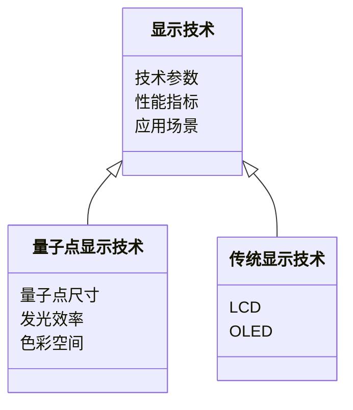
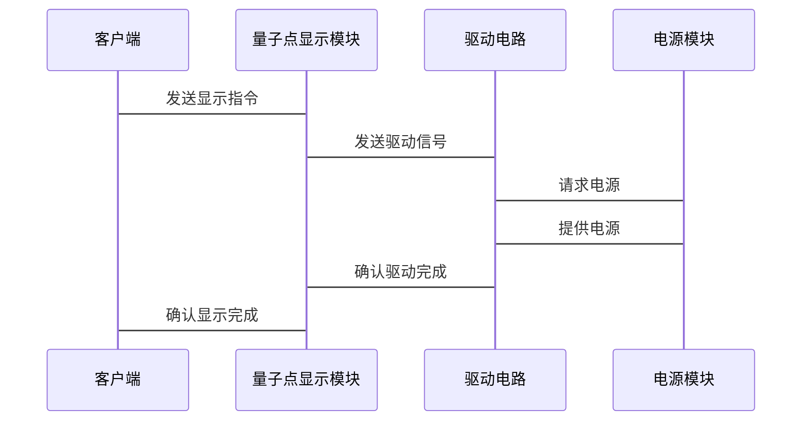

                 


# 如何识别企业的量子点显示技术优势

> 关键词：量子点显示技术、显示技术对比、企业技术优势识别、技术选型指南、技术分析框架

> 摘要：量子点显示技术作为一种新兴的显示技术，凭借其高色域、广视角、高亮度和低能耗等优势，在消费电子、工业和医疗等领域展现出巨大的潜力。本文从量子点显示技术的背景、核心概念、技术原理、与传统显示技术的对比、核心算法与数学模型、系统分析与架构设计、项目实战、最佳实践等方面进行深入分析，帮助读者识别和理解量子点显示技术的优势，并为企业在技术选型和应用中提供指导。

---

# 第一部分：量子点显示技术的背景与基础

# 第1章：量子点显示技术的定义与背景

## 1.1 量子点显示技术的定义

### 1.1.1 量子点的基本概念

量子点（Quantum Dots，QDs）是一种纳米级半导体材料，其尺寸通常在1-10纳米之间。量子点的发光颜色可以通过调整其尺寸来控制，因此在显示技术中具有广泛的应用潜力。

### 1.1.2 量子点显示技术的起源与发展

量子点显示技术起源于20世纪80年代，随着纳米技术的进步，量子点的制备和应用逐渐成熟。近年来，量子点显示技术在消费电子领域的应用逐渐普及。

### 1.1.3 量子点显示技术的核心优势

量子点显示技术的核心优势包括高色域、广视角、高亮度和低能耗等。

## 1.2 显示技术的演进历程

### 1.2.1 传统显示技术的局限性

传统显示技术如LCD和OLED存在色彩饱和度不足、视角受限、能耗较高等问题。

### 1.2.2 新型显示技术的崛起

随着技术的进步，新型显示技术如量子点显示、Micro-OLED等逐渐崛起。

### 1.2.3 量子点显示技术的市场地位

量子点显示技术在显示技术市场中占据重要地位，尤其是在高色域和广视角方面表现出色。

## 1.3 量子点显示技术的应用领域

### 1.3.1 消费电子领域的应用

量子点显示技术在智能手机、电视、平板电脑等消费电子产品中广泛应用。

### 1.3.2 工业领域的应用

量子点显示技术在工业显示设备、医疗显示设备等领域也有重要应用。

### 1.3.3 医疗领域的应用

量子点显示技术在医疗成像、手术显示等场景中表现出色。

## 1.4 量子点显示技术的未来趋势

### 1.4.1 技术发展的主要方向

未来，量子点显示技术将朝着更高色域、更低能耗、更长寿命方向发展。

### 1.4.2 市场需求的增长预测

随着技术的进步和市场的认可，量子点显示技术的需求将持续增长。

### 1.4.3 企业竞争格局的分析

量子点显示技术领域的竞争将主要集中在技术专利和成本控制方面。

## 1.5 本章小结

本章从量子点显示技术的定义、背景、核心优势、应用领域和未来趋势等方面进行了全面介绍，为后续章节的深入分析奠定了基础。

---

# 第2章：量子点显示技术的核心概念与原理

## 2.1 量子点的物理特性

### 2.1.1 量子点的尺寸效应

量子点的发光颜色与其尺寸密切相关，尺寸越大，发光波长越长，颜色越红；尺寸越小，发光波长越短，颜色越蓝。

### 2.1.2 量子点的发光机制

量子点通过电子激发和辐射复合产生发光，发光效率高，颜色纯度高。

### 2.1.3 量子点的化学稳定性

量子点材料具有较高的化学稳定性，能够在不同环境下保持稳定。

## 2.2 量子点显示技术的显示原理

### 2.2.1 量子点发光的激发过程

量子点通过外部光源激发，产生特定颜色的光，用于显示图像。

### 2.2.2 量子点颜色的可调性

通过调整量子点的尺寸，可以实现从蓝光到红光的连续调制。

### 2.2.3 量子点显示的光效优化

优化量子点的发光效率和光散射性能，可以提高显示的亮度和对比度。

## 2.3 量子点显示技术的性能优势

### 2.3.1 高色域与广视角

量子点显示技术可以实现超过NTSC 100%的高色域，视角广，色彩表现优异。

### 2.3.2 高亮度与低能耗

量子点显示技术具有高亮度，同时能耗较低，适合长时间使用。

### 2.3.3 长寿命与稳定性

量子点显示技术的使用寿命长，性能稳定，适合工业和医疗等高可靠性场景。

## 2.4 量子点显示技术的关键指标

### 2.4.1 亮度对比度

亮度对比度是衡量显示技术的重要指标，量子点显示技术在高亮度和高对比度方面表现优异。

### 2.4.2 色彩饱和度

色彩饱和度是衡量显示技术的另一个重要指标，量子点显示技术可以实现高色彩饱和度。

### 2.4.3 响应速度

量子点显示技术的响应速度较快，适合动态图像的显示。

## 2.5 本章小结

本章详细介绍了量子点显示技术的核心概念和原理，重点分析了其物理特性和显示优势，为后续章节的技术对比和应用分析提供了理论基础。

---

# 第3章：量子点显示技术与传统显示技术的对比

## 3.1 显示技术的分类与对比

### 3.1.1 液晶显示（LCD）

LCD（Liquid Crystal Display）是一种常见的显示技术，具有成本低、体积小等优点，但存在色彩饱和度低、响应速度慢等缺点。

### 3.1.2 有机发光二极管显示（OLED）

OLED（Organic Light Emitting Diode）显示技术具有高对比度、广视角、响应速度快等优点，但存在亮度低、寿命短等缺点。

### 3.1.3 量子点显示（QLED）

QLED（Quantum Dot Light Emitting Diode）显示技术结合了量子点的高色域和高亮度，具有较大的市场潜力。

## 3.2 量子点显示技术的优劣势分析

### 3.2.1 优势对比

量子点显示技术在色彩饱和度、亮度和寿命方面具有明显优势。

### 3.2.2 劣势对比

量子点显示技术在成本和响应速度方面存在一定劣势。

### 3.2.3 适用场景分析

量子点显示技术适合高色域、高亮度的场景，如高端电视、医疗显示等。

## 3.3 量子点显示技术的市场定位

### 3.3.1 市场份额分析

目前，量子点显示技术在高端显示市场中占据一定份额，但在成本较高的情况下，市场渗透率有待提高。

### 3.3.2 技术路线选择

企业可以根据具体需求选择量子点显示技术，尤其是在对色彩和亮度要求较高的场景下。

### 3.3.3 未来发展方向

未来，量子点显示技术将朝着更高色域、更低能耗、更长寿命方向发展。

## 3.4 本章小结

本章通过对比量子点显示技术与传统显示技术的优劣势，分析了其市场定位和发展方向，为企业的技术选型提供了参考。

---

# 第4章：量子点显示技术的核心算法与数学模型

## 4.1 量子点显示技术的数学模型

### 4.1.1 量子点发光效率的数学表达

量子点的发光效率可以通过以下公式表示：

$$ E = \frac{hc}{\lambda} $$

其中，\( h \) 是普朗克常数，\( c \) 是光速，\( \lambda \) 是发光波长。

### 4.1.2 量子点颜色的数学表示

量子点的颜色可以通过RGB三色通道表示，公式为：

$$ C = (R, G, B) $$

其中，\( R \)、\( G \)、\( B \) 分别表示红色、绿色和蓝色的强度。

### 4.1.3 量子点显示的光效优化

量子点显示的光效优化可以通过以下步骤实现：

1. 优化量子点的尺寸和形状，提高发光效率。
2. 优化量子点的排列方式，减少光散射。
3. 优化驱动电路设计，提高显示亮度和对比度。

## 4.2 量子点显示技术的算法实现

### 4.2.1 量子点显示的色彩校正算法

色彩校正算法可以通过以下步骤实现：

1. 获取输入图像的RGB值。
2. 根据量子点的发光特性，对RGB值进行校正。
3. 输出校正后的RGB值，实现高色域显示。

### 4.2.2 量子点显示的亮度调节算法

亮度调节算法可以通过以下步骤实现：

1. 检测环境光线强度。
2. 根据光线强度调整量子点的发光亮度。
3. 输出适应环境光线的亮度值。

## 4.3 量子点显示技术的数学模型

### 4.3.1 量子点显示的色彩空间转换

量子点显示的色彩空间转换可以通过以下公式实现：

$$ C_{output} = M \cdot C_{input} $$

其中，\( M \) 是色彩空间转换矩阵，\( C_{input} \) 是输入色彩空间，\( C_{output} \) 是输出色彩空间。

### 4.3.2 量子点显示的亮度调节模型

亮度调节模型可以通过以下公式实现：

$$ L = a \cdot I + b $$

其中，\( L \) 是显示亮度，\( I \) 是环境光线强度，\( a \) 和 \( b \) 是调节参数。

## 4.4 本章小结

本章通过数学模型和算法实现，详细分析了量子点显示技术的核心原理，为企业的技术应用提供了理论支持。

---

# 第5章：量子点显示技术的系统分析与架构设计

## 5.1 问题场景介绍

### 5.1.1 企业需求分析

企业在选择显示技术时，需要综合考虑成本、性能、寿命等因素。

### 5.1.2 技术选型目标

企业希望通过技术选型，找到最适合自身需求的显示技术方案。

## 5.2 系统功能设计

### 5.2.1 领域模型设计

领域模型设计包括显示技术的核心模块和功能模块。

### 5.2.2 领域模型的Mermaid类图



## 5.3 系统架构设计

### 5.3.1 系统架构的Mermaid架构图


### 5.3.2 系统接口设计

系统接口设计包括显示模块与驱动电路的接口、驱动电路与电源模块的接口等。

### 5.3.3 系统交互的Mermaid序列图



## 5.4 本章小结

本章通过系统分析与架构设计，为企业在量子点显示技术的应用中提供了具体的实现方案和设计思路。

---

# 第6章：量子点显示技术的项目实战

## 6.1 环境搭建

### 6.1.1 开发环境的选择

选择适合量子点显示技术开发的软硬件环境，如特定的开发板和开发工具。

### 6.1.2 量子点显示模块的安装

安装量子点显示模块，确保其与驱动电路和控制模块的兼容性。

## 6.2 系统核心实现

### 6.2.1 量子点显示技术的核心代码实现

以下是一个量子点显示技术的核心代码实现示例：

```python
def quantum_dot_display():
    # 初始化显示模块
    initialize_display()
    # 设置显示参数
    set_display_parameters()
    # 发送显示指令
    send_display_command()
    # 等待显示完成
    wait_for_display()
    # 获取显示状态
    get_display_status()
    # 关闭显示模块
    close_display()

quantum_dot_display()
```

### 6.2.2 代码实现的详细解读

1. `initialize_display()`：初始化显示模块，确保模块正常工作。
2. `set_display_parameters()`：设置显示参数，如亮度、对比度等。
3. `send_display_command()`：发送显示指令，控制显示内容。
4. `wait_for_display()`：等待显示完成，确保显示效果稳定。
5. `get_display_status()`：获取显示状态，检查显示是否正常。
6. `close_display()`：关闭显示模块，释放资源。

## 6.3 代码应用解读与分析

### 6.3.1 代码的功能模块分析

量子点显示技术的核心代码实现包括初始化、参数设置、指令发送、状态获取和资源释放等模块。

### 6.3.2 代码的性能优化

通过优化驱动电路和控制算法，可以进一步提高显示效果和降低能耗。

## 6.4 实际案例分析

### 6.4.1 案例背景介绍

某企业希望在高端电视中应用量子点显示技术，提升产品的色彩表现和亮度。

### 6.4.2 技术实现方案

通过选择合适的量子点尺寸和优化驱动电路，实现高色域和高亮度的显示效果。

### 6.4.3 代码实现与效果展示

以下是实现方案的代码示例：

```python
def main():
    # 初始化显示模块
    initialize_display()
    # 设置高色域参数
    set_high_color Gamut_parameters()
    # 发送显示指令
    send_display_command()
    # 等待显示完成
    wait_for_display()
    # 获取显示状态
    get_display_status()
    # 关闭显示模块
    close_display()

main()
```

### 6.4.4 项目小结

通过实际案例分析，验证了量子点显示技术在高端电视中的应用效果，进一步证明了其技术优势。

## 6.5 本章小结

本章通过项目实战，详细讲解了量子点显示技术的环境搭建、核心代码实现、性能优化和实际案例分析，为企业提供了具体的实施指导。

---

# 第7章：量子点显示技术的最佳实践与未来展望

## 7.1 最佳实践 tips

### 7.1.1 技术选型建议

企业在选择量子点显示技术时，应综合考虑成本、性能和应用需求。

### 7.1.2 系统设计建议

建议企业在系统设计中充分考虑显示模块的兼容性和可扩展性。

### 7.1.3 技术实现建议

建议企业在技术实现中注重驱动电路的优化和显示算法的改进。

## 7.2 小结

通过本文的分析，企业可以更好地识别和应用量子点显示技术的优势，提升产品的显示效果和市场竞争力。

## 7.3 注意事项

企业在应用量子点显示技术时，应注重技术的稳定性和成本控制。

## 7.4 拓展阅读

建议企业进一步阅读量子点显示技术的相关文献和行业报告，了解最新的技术动态和市场趋势。

## 7.5 本章小结

本章总结了量子点显示技术的最佳实践和未来展望，为企业提供了长期的技术应用指导。

---

# 作者：AI天才研究院/AI Genius Institute & 禅与计算机程序设计艺术 /Zen And The Art of Computer Programming

