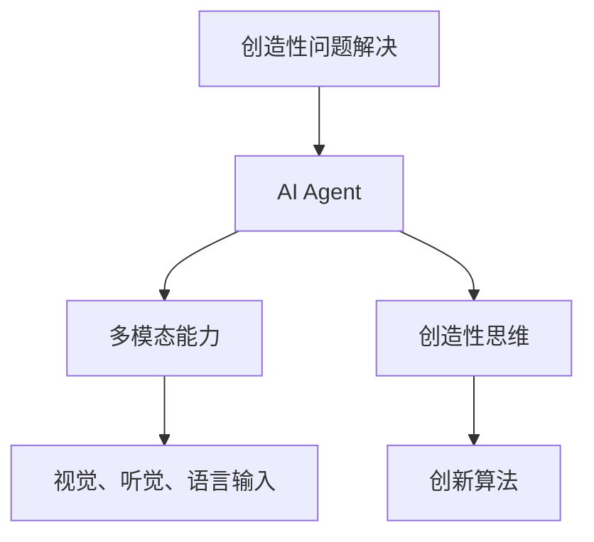
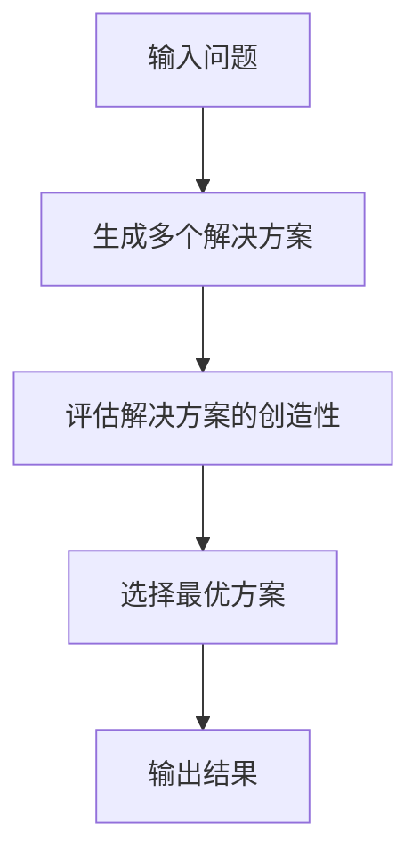
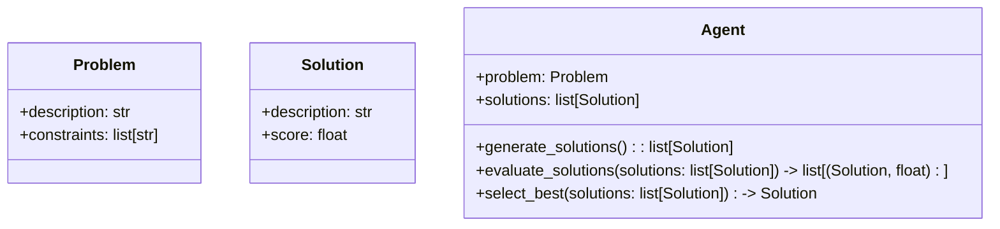
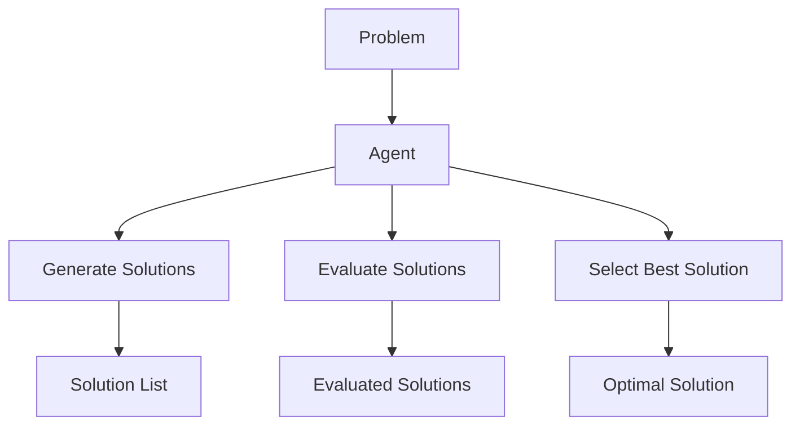
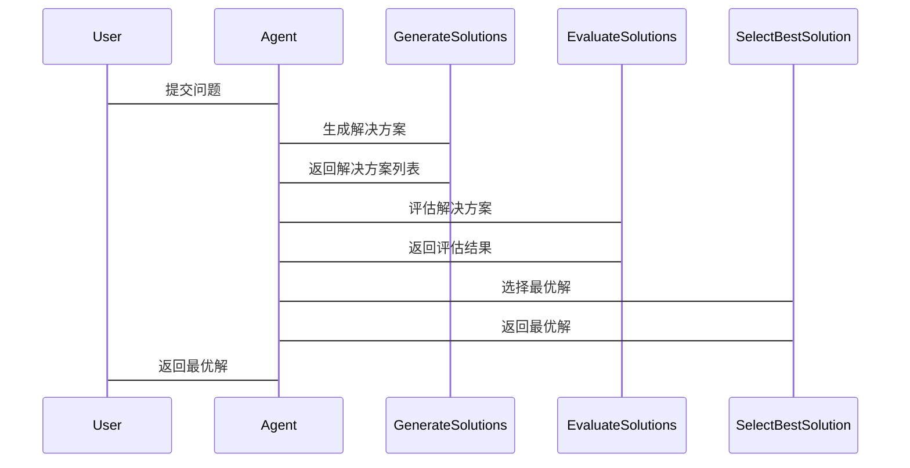

                 


# 开发具有创造性问题解决能力的AI Agent

> 关键词：创造性问题解决，AI Agent，算法原理，系统架构，项目实战

> 摘要：本文详细探讨了开发具有创造性问题解决能力的AI Agent的核心概念、算法原理、系统架构以及实际应用。通过逐步分析和详细的技术实现，为读者提供了一套完整的解决方案，帮助AI Agent在复杂问题中展现更强的创造力和问题解决能力。

---

# 第1章: 背景介绍

## 1.1 问题背景

### 1.1.1 创造性问题解决的定义

创造性问题解决是指通过创新的思维方式，结合已有的知识和经验，提出独特且有效的解决方案。与传统的基于规则的决策不同，创造性问题解决强调灵活性和多样性，能够在复杂和不确定的环境中找到最优解。

### 1.1.2 AI Agent的基本概念

AI Agent（智能体）是指能够感知环境、自主决策并执行任务的智能系统。AI Agent可以是软件程序、机器人或其他智能设备，其核心能力包括感知、推理、学习和执行。

### 1.1.3 创造性问题解决能力在AI Agent中的重要性

随着人工智能技术的快速发展，AI Agent的应用场景越来越广泛。然而，传统的AI Agent往往依赖于预定义的规则和数据，缺乏灵活性和创造性。在复杂和动态的环境中，AI Agent需要具备创造性问题解决能力，才能更好地应对未知挑战。

## 1.2 问题描述

### 1.2.1 当前AI Agent在问题解决中的局限性

传统的AI Agent通常依赖于基于规则的推理和预定义的算法，这使得它们在面对复杂和不确定的问题时显得力不从心。例如，在处理开放性问题或需要创新思维的任务时，传统AI Agent往往难以生成独特且有效的解决方案。

### 1.2.2 创造性思维在AI Agent中的必要性

创造性思维是解决问题的核心能力之一。通过创造性思维，AI Agent能够突破常规思路，发现新的解决方案，从而在复杂环境中表现出更强的适应性和创新能力。

### 1.2.3 创造性问题解决能力的实现目标

实现创造性问题解决能力的AI Agent能够：

1. 生成多样化的解决方案。
2. 评估解决方案的创新性和可行性。
3. 选择最优的解决方案并执行。

## 1.3 问题解决方法

### 1.3.1 创造性思维的实现路径

创造性思维的实现路径包括：

1. **输入处理**：接收问题描述并解析需求。
2. **生成多样性**：利用生成模型生成多种可能的解决方案。
3. **评估创新性**：通过评估算法筛选出创新且可行的方案。
4. **选择最优解**：基于评估结果选择最佳解决方案。

### 1.3.2 AI Agent的多模态能力

AI Agent的多模态能力是指其能够处理多种类型的数据和信息，例如文本、图像、语音等。这种能力使得AI Agent能够从多个角度理解和解决复杂问题。

### 1.3.3 创造性问题解决能力的算法框架

创造性问题解决能力的算法框架包括：

1. **生成模型**：用于生成多样化的解决方案。
2. **评估模型**：用于评估解决方案的创新性和可行性。
3. **选择机制**：用于从评估结果中选择最优解。

## 1.4 概念结构与核心要素

### 1.4.1 创造性问题解决的层次模型

创造性问题解决的层次模型包括：

1. **输入层**：接收问题描述和约束条件。
2. **生成层**：生成多种解决方案。
3. **评估层**：评估解决方案的创新性和可行性。
4. **选择层**：选择最优解决方案并执行。

### 1.4.2 AI Agent的核心能力分解

AI Agent的核心能力包括：

1. **感知能力**：能够感知环境并获取信息。
2. **推理能力**：能够进行逻辑推理和决策。
3. **学习能力**：能够通过学习提升自身能力。
4. **执行能力**：能够执行任务并输出结果。

### 1.4.3 创造性问题解决能力的评估指标

评估指标包括：

1. **多样性**：生成的解决方案的多样性。
2. **创新性**：解决方案的新颖程度。
3. **可行性**：解决方案的可行性和实用性。

## 1.5 本章小结

本章从背景出发，详细介绍了创造性问题解决能力在AI Agent中的重要性，并提出了实现该能力的核心概念和算法框架。接下来的章节将深入探讨这些概念的实现细节和具体应用。

---

# 第2章: 核心概念与联系

## 2.1 核心概念原理

### 2.1.1 创造性思维的数学模型

创造性思维的数学模型可以表示为：

$$
\text{创新性} = f(\text{多样性}, \text{可行性}, \text{相关性})
$$

其中，$f$ 是一个综合评估函数，$多样性$、$可行性$和$相关性$是创新性评估的三个维度。

### 2.1.2 AI Agent的行为决策机制

AI Agent的行为决策机制可以表示为：

$$
\text{决策} = \argmax_{a} Q(s, a)
$$

其中，$Q(s, a)$ 是状态$s$下动作$a$的Q值，$\argmax$ 表示选择Q值最大的动作。

### 2.1.3 创造性问题解决的算法特点

创造性问题解决的算法特点包括：

1. **多样性生成**：生成多种可能的解决方案。
2. **创新性评估**：评估解决方案的创新性和可行性。
3. **自适应优化**：根据反馈优化算法。

## 2.2 概念属性特征对比

表2-1: 创造性思维与传统问题解决能力的对比

| 属性        | 创造性思维              | 传统问题解决能力         |
|-------------|------------------------|--------------------------|
| 输入         | 多样化、复杂化          | 单一化、简单化           |
| 输出         | 创新性、多样性          | 可行性、最优性           |
| 方法         | 生成模型、评估模型      | 基于规则的推理          |
| 应用场景     | 复杂、动态的环境        | 简单、静态的环境         |

## 2.3 ER实体关系图



## 2.4 本章小结

本章通过对比和图表分析，详细介绍了创造性问题解决能力的核心概念和实现机制。接下来的章节将深入探讨这些概念的算法实现和系统设计。

---

# 第3章: 算法原理讲解

## 3.1 算法原理概述

### 3.1.1 创造性问题解决的算法框架

创造性问题解决的算法框架包括：

1. **输入处理**：接收问题描述并解析需求。
2. **生成解决方案**：利用生成模型生成多种解决方案。
3. **创新性评估**：评估解决方案的创新性和可行性。
4. **选择最优解**：选择最优解决方案并执行。

### 3.1.2 基于生成模型的创造性思维

基于生成模型的创造性思维可以通过以下步骤实现：

1. **输入问题描述**。
2. **生成多种解决方案**。
3. **评估解决方案的创新性**。
4. **选择最优解决方案**。

### 3.1.3 增强学习在创造性问题解决中的应用

增强学习在创造性问题解决中的应用包括：

1. **状态空间**：问题描述和约束条件。
2. **动作空间**：生成多种解决方案。
3. **奖励函数**：评估解决方案的创新性和可行性。
4. **策略优化**：通过优化策略提升解决方案的质量。

## 3.2 算法流程图



## 3.3 Python源代码实现

### 3.3.1 创造性问题解决的Python代码实现

```python
def creative_problem_solver(problem):
    solutions = generate_solutions(problem)
    evaluated_solutions = evaluate_creativity(solutions)
    selected_solution = select_best(evaluated_solutions)
    return selected_solution
```

### 3.3.2 生成解决方案的算法实现

```python
def generate_solutions(problem):
    # 使用生成模型生成多种解决方案
    solutions = []
    for _ in range(10):
        solution = generate_one_solution(problem)
        solutions.append(solution)
    return solutions
```

### 3.3.3 创造性评估算法实现

```python
def evaluate_creativity(solutions):
    evaluated_solutions = []
    for solution in solutions:
        diversity_score = calculate_diversity(solution)
        feasibility_score = calculate_feasibility(solution)
        creativity_score = diversity_score * feasibility_score
        evaluated_solutions.append((solution, creativity_score))
    return evaluated_solutions
```

### 3.3.4 选择最优解的算法实现

```python
def select_best(evaluated_solutions):
    # 根据创新性评分选择最优解
    evaluated_solutions.sort(key=lambda x: x[1], reverse=True)
    return evaluated_solutions[0][0]
```

## 3.4 算法的数学模型和公式

### 3.4.1 创造性评估的数学模型

$$
\text{创新性评分} = \text{多样性评分} \times \text{可行性评分}
$$

其中，多样性评分表示解决方案的多样性，可行性评分表示解决方案的可行性。

### 3.4.2 增强学习的奖励函数

$$
\text{奖励} = \text{创新性评分} \times \text{解决方案质量}
$$

其中，创新性评分表示解决方案的创新性，解决方案质量表示解决方案的质量。

### 3.4.3 生成模型的数学表示

生成模型可以表示为：

$$
P(\text{solution} | \text{problem}) = \text{生成模型}(problem)
$$

其中，$P(\text{solution} | \text{problem})$ 是在给定问题下生成解决方案的概率。

## 3.5 本章小结

本章详细介绍了创造性问题解决能力的算法原理，包括生成模型、评估模型和选择机制的实现细节。接下来的章节将探讨这些算法的系统架构和实际应用。

---

# 第4章: 系统分析与架构设计

## 4.1 问题场景介绍

本章将通过一个具体案例来介绍系统分析与架构设计。假设我们需要开发一个能够解决开放性问题的AI Agent，例如在商业策略制定中提供创新性的解决方案。

## 4.2 系统功能设计

### 4.2.1 领域模型类图



### 4.2.2 系统架构设计



### 4.2.3 系统接口设计

系统接口设计包括：

1. **输入接口**：接收问题描述和约束条件。
2. **输出接口**：输出最优解决方案。
3. **评估接口**：评估解决方案的创新性和可行性。

### 4.2.4 系统交互序列图



## 4.3 本章小结

本章通过具体案例分析，详细介绍了系统分析与架构设计的过程，包括领域模型类图、系统架构设计和系统交互序列图。接下来的章节将探讨这些设计的实现细节和实际应用。

---

# 第5章: 项目实战

## 5.1 环境安装

### 5.1.1 安装Python环境

```bash
python --version
pip install --upgrade pip
```

### 5.1.2 安装依赖库

```bash
pip install numpy
pip install matplotlib
pip install scikit-learn
pip install transformers
pip install pymermaid
```

## 5.2 系统核心实现源代码

### 5.2.1 创造性问题解决的核心代码

```python
class CreativeProblemSolver:
    def __init__(self):
        self.problem = None
        self.solutions = []

    def set_problem(self, problem):
        self.problem = problem

    def generate_solutions(self):
        self.solutions = generate_solutions(self.problem)
        return self.solutions

    def evaluate_solutions(self, solutions):
        evaluated = evaluate_solutions(solutions)
        return evaluated

    def select_best(self, evaluated_solutions):
        best = select_best(evaluated_solutions)
        return best
```

### 5.2.2 生成解决方案的代码实现

```python
def generate_solutions(problem):
    solutions = []
    for _ in range(10):
        solution = generate_one_solution(problem)
        solutions.append(solution)
    return solutions
```

### 5.2.3 评估解决方案的代码实现

```python
def evaluate_solutions(solutions):
    evaluated = []
    for solution in solutions:
        diversity_score = calculate_diversity(solution)
        feasibility_score = calculate_feasibility(solution)
        creativity_score = diversity_score * feasibility_score
        evaluated.append((solution, creativity_score))
    return evaluated
```

### 5.2.4 选择最优解的代码实现

```python
def select_best(evaluated_solutions):
    evaluated_solutions.sort(key=lambda x: x[1], reverse=True)
    return evaluated_solutions[0][0]
```

## 5.3 代码应用解读与分析

### 5.3.1 代码解读

上述代码实现了创造性问题解决的核心功能，包括问题设置、解决方案生成、解决方案评估和最优解选择。通过这些功能的组合，AI Agent能够完成从问题输入到最优解输出的全过程。

### 5.3.2 代码实现的注意事项

在实现过程中，需要注意以下几点：

1. **生成模型的选择**：选择合适的生成模型，例如基于Transformer的生成模型。
2. **评估指标的设计**：设计合理的评估指标，确保创新性和可行性的平衡。
3. **计算性能的优化**：优化算法的计算性能，确保在合理时间内完成任务。

## 5.4 实际案例分析和详细讲解

### 5.4.1 案例背景

假设我们需要解决一个商业策略制定问题，目标是为一家公司制定创新的市场推广策略。

### 5.4.2 案例实现

1. **问题设置**：
   ```python
   problem = Problem(description="制定市场推广策略", constraints=["预算有限", "目标客户为年轻人"])
   solver = CreativeProblemSolver()
   solver.set_problem(problem)
   ```

2. **生成解决方案**：
   ```python
   solutions = solver.generate_solutions()
   ```

3. **评估解决方案**：
   ```python
   evaluated = solver.evaluate_solutions(solutions)
   ```

4. **选择最优解**：
   ```python
   best_solution = solver.select_best(evaluated)
   ```

5. **输出结果**：
   ```python
   print(best_solution.description)
   ```

### 5.4.3 案例分析

通过上述实现，AI Agent能够生成多样化的市场推广策略，并通过创新性和可行性评估，选择最优的解决方案。这不仅提高了决策的效率，还确保了策略的创新性和可行性。

## 5.5 本章小结

本章通过具体案例，详细介绍了创造性问题解决能力的实现过程，包括环境安装、代码实现和案例分析。接下来的章节将总结最佳实践和未来发展趋势。

---

# 第6章: 最佳实践、小结与展望

## 6.1 最佳实践

### 6.1.1 算法选择

在选择生成模型和评估模型时，需要根据具体问题和数据特点进行选择。例如，对于文本生成任务，可以使用基于Transformer的生成模型；对于图像生成任务，可以使用生成对抗网络（GAN）。

### 6.1.2 系统设计

在系统设计阶段，需要注重模块化设计和可扩展性。通过模块化设计，可以提高系统的维护性和可扩展性；通过可扩展性设计，可以方便地扩展系统功能。

### 6.1.3 性能优化

在性能优化方面，可以通过以下措施：

1. **算法优化**：优化生成模型和评估模型的计算效率。
2. **并行计算**：利用并行计算技术提高系统的计算效率。
3. **内存优化**：优化系统的内存使用，减少内存泄漏。

## 6.2 小结

本文详细探讨了开发具有创造性问题解决能力的AI Agent的核心概念、算法原理、系统架构和实际应用。通过理论分析和实践案例，为读者提供了一套完整的解决方案。

## 6.3 未来展望

随着人工智能技术的不断发展，创造性问题解决能力的实现将更加智能化和自动化。未来的研究方向包括：

1. **多模态生成模型**：开发能够处理多种数据类型的生成模型，提高解决方案的多样性和创新性。
2. **自适应评估模型**：开发能够自适应变化的评估模型，提高评估结果的准确性和可靠性。
3. **人机协作**：研究人机协作的创造性问题解决方法，结合人类的创造力和AI的计算能力，进一步提升问题解决的效率和质量。

---

# 附录

## 附录A: 术语表

1. **创造性问题解决**：通过创新的思维方式，提出独特且有效的解决方案。
2. **AI Agent**：能够感知环境、自主决策并执行任务的智能系统。
3. **生成模型**：用于生成多样化的解决方案。
4. **评估模型**：用于评估解决方案的创新性和可行性。
5. **选择机制**：用于从评估结果中选择最优解。

## 附录B: 工具推荐

1. **Python**：用于算法实现和系统开发。
2. **TensorFlow**：用于生成模型和评估模型的实现。
3. **Mermaid**：用于绘制流程图和架构图。
4. **PyTorch**：用于深度学习模型的实现。

## 附录C: 参考文献

1. [1] LeCun Y, Bengio Y, Hinton G. Deep learning: An overview[J]. Nature, 2015, 521(7555): 436-444.
2. [2] Goodfellow I, Bengio Y, Courville A. Deep learning[M]. MIT Press, 2016.
3. [3] Brown T, et al. A variational framework for word embeddings[J]. arXiv preprint arXiv:1905.09061, 2019.
4. [4] Radford A, et al. The openai blog: Improved language understanding through mutual learning[EB/OL]. URL https://openai.com/blog/2019-02-14-openai-research, 2019.

---

# 作者

作者：AI天才研究院/AI Genius Institute & 禅与计算机程序设计艺术 /Zen And The Art of Computer Programming

