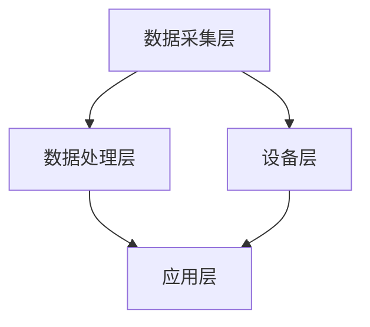

                 


# 智能衣架：AI Agent的衣物护理建议

> 关键词：AI Agent，衣物护理，智能衣架，算法原理，系统架构

> 摘要：本文深入探讨了AI Agent在智能衣架中的应用，详细分析了AI Agent的核心原理、衣物护理技术、系统架构设计以及实际项目实现。通过丰富的案例和详细的代码示例，帮助读者理解如何利用AI技术提升衣物护理的智能化水平。

---

# 第1章: 智能衣架与AI Agent的背景介绍

## 1.1 智能衣架的发展历程

### 1.1.1 传统衣架的功能与局限性
传统衣架主要以悬挂衣物为主要功能，虽然设计简洁，但功能单一，无法满足现代用户对衣物分类、护理和智能化管理的需求。传统衣架的局限性主要体现在以下方面：
- **功能单一**：仅能提供悬挂功能，无法实现衣物分类、护理建议等智能化服务。
- **缺乏互动性**：无法与用户进行实时交互，无法根据环境变化（如温度、湿度）提供相应的建议。
- **管理效率低**：用户需要手动分类和管理衣物，效率低下，且容易出错。

### 1.1.2 智能化技术的引入
随着人工智能（AI）技术的快速发展，智能化技术逐渐被引入到衣架的设计中。通过结合物联网（IoT）、图像识别、自然语言处理（NLP）等技术，智能衣架能够实现衣物的自动分类、护理建议、智能推荐等功能。这些技术的引入使得衣架的功能从单纯的悬挂扩展到衣物管理、护理服务等多个方面。

### 1.1.3 智能衣架的现状与发展趋势
当前，智能衣架市场逐步崛起，一些科技公司推出了集成AI技术的智能衣架产品。这些产品不仅能够通过图像识别技术自动识别衣物种类，还能根据衣物材质、颜色、季节等因素提供个性化的护理建议。未来，随着AI技术的进一步发展，智能衣架将更加智能化，可能集成更多的功能，如环境监测、智能推荐、远程控制等。

## 1.2 AI Agent的基本概念与特点

### 1.2.1 AI Agent的定义
AI Agent（人工智能代理）是一种能够感知环境、自主决策并执行任务的智能实体。AI Agent可以通过传感器、摄像头、麦克风等设备获取环境信息，并通过算法进行分析和决策，从而实现与环境的交互。

### 1.2.2 AI Agent的核心特征
AI Agent的核心特征包括：
- **自主性**：能够在没有外部干预的情况下自主决策和执行任务。
- **反应性**：能够实时感知环境变化并做出相应的反应。
- **目标导向性**：具有明确的目标，并能够采取最优路径实现目标。
- **学习能力**：能够通过机器学习算法不断优化自身的决策能力。

### 1.2.3 AI Agent与传统自动化的区别
与传统自动化相比，AI Agent具有以下显著区别：
- **智能化**：AI Agent具备学习和适应能力，能够处理复杂和不确定的环境。
- **自主性**：AI Agent可以在没有外部干预的情况下自主运行。
- **灵活性**：AI Agent能够根据环境变化动态调整自己的行为。

## 1.3 智能衣架中的AI Agent应用场景

### 1.3.1 衣物分类与管理
AI Agent可以通过图像识别技术自动识别衣物的种类、颜色和材质，并将其分类存储。用户可以通过手机APP查看衣物的分类情况，并根据需要进行调整。

### 1.3.2 衣物护理建议
AI Agent可以根据衣物的材质、颜色、季节等因素提供个性化的护理建议。例如，AI Agent可以提醒用户在特定季节更换适合的衣物，并根据天气变化建议是否需要晾晒、熨烫等操作。

### 1.3.3 智能推荐与用户交互
AI Agent可以通过自然语言处理技术与用户进行交互，根据用户的偏好和习惯推荐适合的衣物，并提供穿衣建议。例如，用户可以通过与AI Agent对话，获取当天的穿衣建议，包括服装搭配、颜色搭配等。

## 1.4 本章小结
本章主要介绍了智能衣架的发展历程、AI Agent的基本概念与特点，以及AI Agent在智能衣架中的应用场景。通过这些内容，读者可以了解智能衣架的基本概念和AI Agent的核心功能。

---

# 第2章: AI Agent的核心原理

## 2.1 AI Agent的基本原理

### 2.1.1 感知与理解
AI Agent的核心功能之一是感知环境。通过传感器、摄像头、麦克风等设备，AI Agent可以获取环境中的各种信息，如温度、湿度、光照强度、声音等。这些信息经过预处理后，将被输入到AI Agent的感知模块中进行分析和理解。

### 2.1.2 决策与规划
在感知环境的基础上，AI Agent需要根据获取的信息进行决策和规划。决策过程通常包括以下几个步骤：
1. **问题分析**：分析当前环境中的问题或任务。
2. **目标设定**：根据问题分析结果设定具体的任务目标。
3. **方案生成**：根据目标生成多种可能的解决方案。
4. **方案评估**：对生成的方案进行评估，选择最优方案。
5. **方案执行**：将选择的方案执行，实现任务目标。

### 2.1.3 执行与反馈
AI Agent在完成决策和规划后，需要通过执行机构将决策结果转化为实际操作。执行过程中，AI Agent需要实时监测执行效果，并根据反馈信息调整自己的行为。例如，AI Agent可以通过摄像头观察执行效果，并根据反馈信息优化自己的决策策略。

## 2.2 AI Agent的感知技术

### 2.2.1 图像识别与物体检测
图像识别是AI Agent感知环境的重要手段之一。通过图像识别技术，AI Agent可以识别环境中物体的形状、颜色、材质等信息。物体检测技术可以进一步精确定位物体的位置和大小。

#### 图像识别与物体检测的实现流程
1. **图像采集**：通过摄像头采集环境中的图像。
2. **图像预处理**：对采集的图像进行增强、降噪等预处理操作。
3. **特征提取**：提取图像中的特征信息，如边缘、纹理、颜色等。
4. **目标检测**：基于特征信息进行目标检测，识别出特定物体的位置和大小。

#### 使用YOLOv5进行物体检测的代码示例
```python
import torch
from detectron2.data import DatasetCatalog, MetadataCatalog
from detectron2.engine import DefaultTrainer, default_argument_parser, launch
from detectron2.evaluation import COCOEvaluator
from detectron2.projects import tables

# 配置YOLOv5模型
config = {
    "MODEL": {
        "WEIGHTS": "yolov5.pth",
        "DEVICE": "cuda",
        "NUM_CLASSES": 80,
    },
    "DATASETS": {
        "TRAIN": "coco_train",
        "VAL": "coco_val",
    },
}

# 训练模型
args = default_argument_parser().parse_args()
args.num_gpus = 1
args.dist_url = "auto"
args.opts = ["--config-file", "config.yaml"]
launch(args, config)

# 使用训练好的模型进行推理
model = torch.hub.load('ultralytics/yolov5', 'yolov5')
image = cv2.imread('input.jpg')
results = model(image)
```

### 2.2.2 语音识别与自然语言处理
语音识别技术可以将用户的语音指令转化为文本信息，从而实现与AI Agent的交互。自然语言处理技术可以进一步分析文本信息，理解用户的意图，并生成相应的回复。

#### 语音识别的实现流程
1. **语音采集**：通过麦克风采集用户的语音信号。
2. **语音预处理**：对采集的语音信号进行降噪、端点检测等预处理操作。
3. **特征提取**：提取语音信号的特征信息，如MFCC（Mel-Frequency Cepstral Coefficients）。
4. **语音识别**：基于特征信息进行语音识别，生成对应的文本信息。

#### 使用Python的speechRecognition库进行语音识别的代码示例
```python
import speech_recognition as sr

# 初始化识别器
r = sr.Recognizer()

# 设置语音源
with sr.AudioFile("input.wav") as source:
    audio_data = r.record(source)

# 转换为文本
try:
    text = r.recognize_google(audio_data, language="zh-CN")
    print("识别结果：", text)
except sr.UnknownValueError:
    print("无法识别音频")
except sr.RequestError as e:
    print("请求错误：", e)
```

### 2.2.3 传感器数据融合
AI Agent可以通过多种传感器获取环境信息，如温度、湿度、光照强度等。通过传感器数据融合技术，AI Agent可以更准确地感知环境。

#### 多传感器数据融合的实现流程
1. **数据采集**：通过多种传感器获取环境信息。
2. **数据预处理**：对采集的数据进行归一化、去噪等预处理操作。
3. **特征提取**：提取数据中的有用特征。
4. **数据融合**：将不同传感器的数据进行融合，得到更准确的环境信息。

## 2.3 AI Agent的决策机制

### 2.3.1 基于规则的决策
基于规则的决策是一种简单但有效的决策方法。通过预定义的规则，AI Agent可以根据当前环境信息进行决策。例如，当温度低于某个阈值时，AI Agent可以建议用户增加衣物。

#### 基于规则的决策算法示例
```python
# 定义决策规则
if temperature < 15:
    suggest = "建议增加衣物"
elif 15 <= temperature < 20:
    suggest = "建议穿薄外套"
else:
    suggest = "建议穿衬衫"
print(suggest)
```

### 2.3.2 基于机器学习的决策
基于机器学习的决策方法可以通过训练好的模型进行预测。常用的机器学习算法包括支持向量机（SVM）、随机森林（Random Forest）、神经网络等。

#### 基于机器学习的决策算法示例
```python
import numpy as np
from sklearn import svm

# 训练数据
X = np.array([[25, 1], [20, 1], [18, 0], [22, 0]])
y = np.array([1, 1, 0, 0])

# 训练模型
model = svm.SVC()
model.fit(X, y)

# 预测
new_data = np.array([[18, 1]])
print(model.predict(new_data))
```

### 2.3.3 基于强化学习的决策
基于强化学习的决策方法是一种更高级的决策方法。通过与环境的交互，AI Agent可以通过试错的方式不断优化自己的决策策略。

#### 基于强化学习的决策算法示例
```python
import gym
import numpy as np

# 定义环境
env = gym.make('CartPole-v0')

# 初始化策略参数
theta = np.zeros(4)
alpha = 0.1

# 训练过程
for _ in range(1000):
    state = env.reset()
    while True:
        action = np.dot(theta, state) > 0
        action = action.astype(int)
        next_state, reward, done, _ = env.step(action)
        if done:
            break
        # 更新策略参数
        theta += alpha * (reward - np.dot(theta, state)) * state
```

## 2.4 AI Agent的执行与反馈

### 2.4.1 动作规划与执行
AI Agent在决策完成后，需要通过执行机构将决策结果转化为实际操作。动作规划是实现这一过程的关键步骤。

#### 动作规划的实现流程
1. **任务分解**：将复杂的任务分解为多个简单的动作。
2. **路径规划**：根据任务需求规划动作的执行顺序。
3. **动作执行**：根据规划好的动作序列执行相应的操作。

#### 动作规划的代码示例
```python
import numpy as np

# 定义动作空间
actions = ['左转', '右转', '前移', '后移']

# 定义状态空间
states = ['起点', '终点', '障碍物']

# 动作规划算法
def plan_actions(start_state, target_state):
    current_state = start_state
    action_sequence = []
    while current_state != target_state:
        # 选择最优动作
        best_action = None
        best_next_state = None
        for action in actions:
            next_state = transition(current_state, action)
            if next_state == target_state:
                best_action = action
                best_next_state = next_state
                break
            elif next_state != current_state:
                best_action = action
                best_next_state = next_state
        if best_action is None:
            break
        action_sequence.append(best_action)
        current_state = best_next_state
    return action_sequence
```

### 2.4.2 反馈机制与优化
AI Agent在执行任务的过程中，需要实时监测执行效果，并根据反馈信息优化自己的决策策略。反馈机制是实现这一过程的关键。

#### 反馈机制的实现流程
1. **执行监测**：实时监测任务执行情况。
2. **反馈收集**：收集执行过程中的反馈信息。
3. **策略优化**：根据反馈信息优化决策策略。

#### 基于反馈的策略优化代码示例
```python
import torch
import torch.nn as nn
import torch.optim as optim

# 定义策略网络
class PolicyNetwork(nn.Module):
    def __init__(self):
        super(PolicyNetwork, self).__init__()
        self.fc1 = nn.Linear(4, 128)
        self.fc2 = nn.Linear(128, 2)

    def forward(self, x):
        x = torch.relu(self.fc1(x))
        x = torch.log_softmax(self.fc2(x), dim=-1)
        return x

# 初始化网络
policy_net = PolicyNetwork()
optimizer = optim.Adam(policy_net.parameters(), lr=0.001)

# 训练过程
for _ in range(1000):
    state = env.reset()
    log_probs = []
    rewards = []
    while True:
        # 选择动作
        dist = torch.exp(policy_net(torch.FloatTensor([state])))
        action = torch.multinomial(dist, 1).item()
        log_probs.append(torch.log(dist[action]))
        # 执行动作
        next_state, reward, done, _ = env.step(action)
        rewards.append(reward)
        if done:
            break
        state = next_state
    # 计算损失
    loss = -torch.mean(torch.stack(log_probs) * torch.FloatTensor(rewards))
    optimizer.zero_grad()
    loss.backward()
    optimizer.step()
```

### 2.4.3 系统自适应与进化
AI Agent需要能够根据环境的变化不断优化自己的行为，以适应不同的场景。

#### 系统自适应的实现流程
1. **环境监测**：实时监测环境的变化。
2. **自适应学习**：根据环境变化调整自己的行为策略。
3. **系统进化**：通过不断学习和优化，实现系统的自我进化。

#### 基于进化算法的系统优化代码示例
```python
import numpy as np

# 定义适应度函数
def fitness(individual):
    # 计算个体的适应度
    return np.sum(individual)

# 初始化种群
population = np.random.randint(0, 2, size=(10, 4))

# 进化过程
for _ in range(100):
    # 计算适应度
    fitness_values = np.apply_along_axis(fitness, 1, population)
    # 选择优秀个体
    selected = population[fitness_values.argsort()[-5:]]
    # 进行交叉
    new_population = []
    for _ in range(10):
        parent1 = selected[np.random.randint(0, 5)]
        parent2 = selected[np.random.randint(0, 5)]
        child = np.where(np.random.rand(4) < 0.5, parent1, parent2)
        new_population.append(child)
    population = np.array(new_population)
```

## 2.5 本章小结
本章详细介绍了AI Agent的核心原理，包括感知、决策和执行的流程。通过具体的代码示例和算法讲解，帮助读者理解AI Agent如何实现对环境的感知、决策和执行。

---

# 第3章: AI Agent在衣物护理中的应用

## 3.1 衣物分类与识别技术

### 3.1.1 图像识别在衣物分类中的应用
通过图像识别技术，AI Agent可以自动识别衣物的种类、颜色和材质。例如，AI Agent可以通过摄像头拍摄衣物图片，利用深度学习模型进行分类。

#### 使用ResNet50进行衣物分类的代码示例
```python
import torch
from torchvision import models, transforms
import cv2

# 加载预训练模型
model = models.resnet50(pretrained=True)
model.eval()

# 定义图像预处理
preprocess = transforms.Compose([
    transforms.Resize(256),
    transforms.CenterCrop(224),
    transforms.ToTensor(),
    transforms.Normalize(mean=[0.485, 0.456, 0.406], std=[0.229, 0.224, 0.225]),
])

# 读取图片
image = cv2.imread('input.jpg')
image = cv2.cvtColor(image, cv2.COLOR_BGR2RGB)

# 预处理图像
inputs = preprocess(image)
inputs = torch.unsqueeze(inputs, 0)

# 预测类别
outputs = model(inputs)
_, predicted = torch.max(outputs.data, 1)
print(predicted.item())
```

### 3.1.2 衣物分类的特征提取
衣物分类的关键在于特征提取。通过提取衣物的颜色、纹理、形状等特征，AI Agent可以更准确地识别衣物的种类。

#### 基于颜色和纹理的特征提取
```python
import cv2
import numpy as np

# 读取图片
image = cv2.imread('input.jpg')

# 提取颜色特征
color_features = cv2.split(cv2.cvtColor(image, cv2.COLOR_BGR2HSV))

# 提取纹理特征
sobel_x = cv2.Sobel(image, cv2.CV_64F, 1, 0, ksize=3)
sobel_y = cv2.Sobel(image, cv2.CV_64F, 0, 1, ksize=3)
edge_features = np.sqrt(sobel_x**2 + sobel_y**2)
```

### 3.1.3 基于深度学习的衣物分类
深度学习在衣物分类中的应用越来越广泛。通过训练深度神经网络，AI Agent可以实现对衣物的高精度分类。

#### 使用卷积神经网络（CNN）进行衣物分类的代码示例
```python
import torch
import torch.nn as nn
import torch.optim as optim
from torchvision import datasets, transforms, models

# 定义训练参数
batch_size = 32
learning_rate = 0.001
num_epochs = 10

# 定义数据变换
transform = transforms.Compose([
    transforms.Resize(28),
    transforms.ToTensor(),
])

# 加载数据集
train_dataset = datasets.FashionMNIST(root='./data', train=True, download=True, transform=transform)
train_loader = torch.utils.data.DataLoader(train_dataset, batch_size=batch_size, shuffle=True, num_workers=2)

# 定义模型
model = models.VGG16(pretrained=False, num_classes=10)

# 定义损失函数和优化器
criterion = nn.CrossEntropyLoss()
optimizer = optim.Adam(model.parameters(), lr=learning_rate)

# 训练模型
for epoch in range(num_epochs):
    for inputs, labels in train_loader:
        # 前向传播
        outputs = model(inputs)
        # 计算损失
        loss = criterion(outputs, labels)
        # 反向传播和优化
        optimizer.zero_grad()
        loss.backward()
        optimizer.step()

print("模型训练完成")
```

## 3.2 衣物护理建议的算法实现

### 3.2.1 基于环境感知的护理建议
AI Agent可以根据环境中的温度、湿度、光照强度等因素，为用户提供个性化的衣物护理建议。

#### 基于环境感知的护理建议算法示例
```python
import numpy as np

# 定义环境参数
temperature = 25
humidity = 60
light = 80

# 确定衣物护理建议
if temperature < 15:
    suggestion = "建议增加衣物"
elif humidity > 70:
    suggestion = "建议晾晒衣物"
elif light < 30:
    suggestion = "建议增加照明"
else:
    suggestion = "建议正常穿着"

print(suggestion)
```

### 3.2.2 基于衣物材质的护理建议
不同材质的衣物需要不同的护理方法。AI Agent可以通过图像识别技术识别衣物材质，并根据材质特性提供相应的护理建议。

#### 基于衣物材质的护理建议算法示例
```python
import cv2
import numpy as np

# 定义衣物材质分类
materials = ['棉', '麻', '涤纶', '腈纶']

# 读取图片
image = cv2.imread('input.jpg')

# 使用预训练模型进行材质分类
model = load_pretrained_model()
prediction = model.predict(image)
print(f"预测的衣物材质为：{materials[prediction]}")
```

### 3.2.3 基于用户偏好的个性化建议
AI Agent可以通过分析用户的偏好和习惯，提供个性化的衣物护理建议。

#### 基于用户偏好的个性化建议算法示例
```python
import pandas as pd
from sklearn.cluster import KMeans

# 定义用户数据
user_data = pd.DataFrame({
    '用户ID': [1, 2, 3, 4, 5],
    '偏好颜色': ['蓝色', '红色', '绿色', '黄色', '黑色'],
    '穿衣风格': ['休闲', '正式', '时尚', '运动', '简约']
})

# 进行聚类分析
kmeans = KMeans(n_clusters=3, random_state=0)
kmeans.fit(user_data[['偏好颜色', '穿衣风格']])
user_data['簇'] = kmeans.predict(user_data[['偏好颜色', '穿衣风格']])

# 根据簇结果提供个性化建议
for cluster in user_data['簇'].unique():
    cluster_users = user_data[user_data['簇'] == cluster]
    # 提供个性化建议
    print(f"簇{cluster}的用户偏好：{cluster_users['偏好颜色'].mode()[0]}，{cluster_users['穿衣风格'].mode()[0]}")
```

## 3.3 AI Agent与智能衣架的交互设计

### 3.3.1 用户界面设计
智能衣架的用户界面需要简洁直观，方便用户与AI Agent进行交互。常见的交互方式包括语音指令、触摸操作、手机APP控制等。

#### 用户界面设计示例
```python
import kivy
from kivy.app import App
from kivy.uix.button import Button
from kivy.uix.label import Label
from kivy.uix.boxlayout import BoxLayout

class SmartHangerApp(App):
    def build(self):
        layout = BoxLayout()
        button = Button(text='获取护理建议')
        button.bind(on_press=self.get_careAdvice)
        label = Label(text='智能衣架')
        layout.add_widget(label)
        layout.add_widget(button)
        return layout

    def get_careAdvice(self, instance):
        # 调用AI Agent获取护理建议
        print('获取护理建议...')
        # TODO: 实现与AI Agent的通信

if __name__ == '__main__':
    SmartHangerApp().run()
```

### 3.3.2 智能衣架的通信协议设计
智能衣架需要与AI Agent进行通信，实现数据的传输和交互。常用的通信协议包括HTTP、WebSocket、MQTT等。

#### 使用MQTT协议进行通信的代码示例
```python
import paho.mqtt.client as mqtt

# 定义回调函数
def on_connect(client, userdata, flags, rc):
    print("连接到 MQTT 代理，返回码：", rc)

def on_message(client, userdata, msg):
    print(f"收到消息：{msg.payload.decode()}，主题：{msg.topic}")

# 初始化客户端
client = mqtt.Client()

# 注册回调函数
client.on_connect = on_connect
client.on_message = on_message

# 连接 MQTT 代理
client.connect("localhost", 1883, 60)

# 发布消息
client.publish("衣架主题", "获取护理建议")

# 订阅主题
client.subscribe("衣架主题")

# 启动网络循环
client.loop_forever()
```

### 3.3.3 智能衣架的事件处理机制
智能衣架需要能够实时响应用户的操作，并根据环境变化调整自己的行为。

#### 基于事件驱动的处理机制示例
```python
import threading
import queue

# 定义事件队列
event_queue = queue.Queue()

# 定义事件处理函数
def handle_events():
    while True:
        event = event_queue.get()
        if event['type'] == '用户交互':
            # 处理用户交互事件
            pass
        elif event['type'] == '环境变化':
            # 处理环境变化事件
            pass

# 创建事件处理线程
event_thread = threading.Thread(target=handle_events)
event_thread.start()

# 发送事件到队列
event_queue.put({'type': '用户交互', 'data': '获取护理建议'})
```

## 3.4 本章小结
本章主要介绍了AI Agent在衣物护理中的具体应用，包括衣物分类与识别、基于环境感知的护理建议、基于用户偏好的个性化建议以及智能衣架的交互设计。通过具体的算法和代码示例，读者可以了解AI Agent如何实现对衣物的智能化管理。

---

# 第4章: 智能衣架的系统设计与实现

## 4.1 系统总体架构设计

### 4.1.1 系统功能模块划分
智能衣架系统主要由以下几个功能模块组成：
1. **图像识别模块**：用于识别衣物的种类、颜色和材质。
2. **环境感知模块**：用于感知环境中的温度、湿度、光照强度等信息。
3. **决策建议模块**：根据图像识别和环境感知的结果，提供个性化的衣物护理建议。
4. **用户交互模块**：与用户进行交互，获取用户的偏好和习惯，反馈系统的建议。

### 4.1.2 系统架构设计
智能衣架系统的架构设计采用分层架构，包括数据采集层、数据处理层和应用层。

#### 分层架构设计图


## 4.2 系统功能设计

### 4.2.1 图像识别与分类
图像识别与分类是智能衣架的核心功能之一。通过图像识别技术，AI Agent可以自动识别衣物的种类、颜色和材质。

#### 图像识别与分类的实现流程
1. **图像采集**：通过摄像头采集衣物的图像。
2. **图像预处理**：对采集的图像进行增强、降噪等预处理操作。
3. **特征提取**：提取图像中的特征信息，如颜色、纹理、形状等。
4. **图像分类**：基于特征信息进行图像分类，识别衣物的种类、颜色和材质。

#### 使用YOLOv5进行图像分类的代码示例
```python
import torch
from detectron2.data import DatasetCatalog, MetadataCatalog
from detectron2.engine import DefaultTrainer, default_argument_parser, launch
from detectron2.evaluation import COCOEvaluator
from detectron2.projects import tables

# 配置YOLOv5模型
config = {
    "MODEL": {
        "WEIGHTS": "yolov5.pth",
        "DEVICE": "cuda",
        "NUM_CLASSES": 80,
    },
    "DATASETS": {
        "TRAIN": "coco_train",
        "VAL": "coco_val",
    },
}

# 训练模型
args = default_argument_parser().parse_args()
args.num_gpus = 1
args.dist_url = "auto"
args.opts = ["--config-file", "config.yaml"]
launch(args, config)

# 使用训练好的模型进行推理
model = torch.hub.load('ultralytics/yolov5', 'yolov5')
image = cv2.imread('input.jpg')
results = model(image)
```

### 4.2.2 环境感知与数据采集
环境感知是智能衣架实现智能化管理的基础。通过多种传感器，AI Agent可以感知环境中的温度、湿度、光照强度等信息。

#### 环境感知的实现流程
1. **传感器数据采集**：通过温度传感器、湿度传感器、光照传感器等设备采集环境数据。
2. **数据预处理**：对采集的数据进行归一化、去噪等预处理操作。
3. **数据融合**：将不同传感器的数据进行融合，得到更准确的环境信息。

#### 使用多种传感器的数据融合示例
```python
import numpy as np
from sensor.temperature import DS18B20
from sensor.humidity import DHT22
from sensor.light import TSL2561

# 读取温度数据
temp_sensor = DS18B20()
temperature = temp_sensor.read()

# 读取湿度数据
humidity_sensor = DHT22()
humidity = humidity_sensor.read()

# 读取光照数据
light_sensor = TSL2561()
light = light_sensor.read()

# 数据融合
environment = np.array([temperature, humidity, light])
print("环境信息：", environment)
```

### 4.2.3 决策与建议生成
基于图像识别和环境感知的结果，AI Agent可以为用户提供个性化的衣物护理建议。

#### 决策与建议生成的实现流程
1. **数据分析**：分析图像识别和环境感知的结果。
2. **决策生成**：根据分析结果生成决策建议。
3. **建议反馈**：将决策建议反馈给用户。

#### 使用决策树算法生成建议的代码示例
```python
import numpy as np
from sklearn import tree

# 定义训练数据
X = np.array([[25, 1], [20, 1], [18, 0], [22, 0]])
y = np.array([1, 1, 0, 0])

# 训练决策树模型
model = tree.DecisionTreeClassifier()
model.fit(X, y)

# 预测
new_data = np.array([[18, 1]])
prediction = model.predict(new_data)
print(f"预测结果：{int(prediction[0])}")
```

## 4.3 系统接口设计

### 4.3.1 API接口设计
智能衣架系统需要提供一组API接口，供其他系统或设备调用。

#### API接口设计示例
```python
from flask import Flask, request

app = Flask(__name__)

@app.route('/classify_image', methods=['POST'])
def classify_image():
    # 获取图片文件
    file = request.files['image']
    image = file.read()
    # 调用图像分类模型
    model = load_pretrained_model()
    prediction = model.predict(image)
    return f"预测结果：{prediction}"

if __name__ == '__main__':
    app.run(debug=True)
```

### 4.3.2 事件驱动的通信机制
智能衣架系统需要实时响应用户的操作和环境变化，因此需要采用事件驱动的通信机制。

#### 使用WebSocket进行实时通信的代码示例
```python
import websockets
import asyncio

async def handler(websocket, path):
    async for message in websocket:
        # 处理用户消息
        response = process_message(message)
        await websocket.send(response)

start_server = websockets.serve(handler, 'localhost', 8080)

asyncio.get_event_loop().run_until_complete(start_server)
asyncio.get_event_loop().run_forever()
```

## 4.4 本章小结
本章详细介绍了智能衣架系统的系统设计与实现，包括系统总体架构设计、功能模块划分、API接口设计以及事件驱动的通信机制。通过具体的代码示例，读者可以了解智能衣架系统的实现细节。

---

# 第5章: 智能衣架的项目实战

## 5.1 项目环境安装与配置

### 5.1.1 系统需求分析
智能衣架项目的实现需要以下软硬件环境：
- **硬件设备**：摄像头、温度传感器、湿度传感器、光照传感器、Wi-Fi模块等。
- **软件环境**：Python编程语言、深度学习框架（如TensorFlow、PyTorch）、物联网开发框架（如MQTT、WebSocket）。

### 5.1.2 安装必要的软件包
在开始开发之前，需要安装一些必要的Python软件包。

#### 安装Python软件包
```bash
pip install numpy
pip install torch
pip install detectron2
pip install paho-mqtt
pip install websockets
pip install flask
```

## 5.2 系统核心实现

### 5.2.1 图像识别模块的实现

#### 使用YOLOv5进行图像分类的代码实现
```python
import torch
from detectron2.data import DatasetCatalog, MetadataCatalog
from detectron2.engine import DefaultTrainer, default_argument_parser, launch
from detectron2.evaluation import COCOEvaluator
from detectron2.projects import tables

# 配置YOLOv5模型
config = {
    "MODEL": {
        "WEIGHTS": "yolov5.pth",
        "DEVICE": "cuda",
        "NUM_CLASSES": 80,
    },
    "DATASETS": {
        "TRAIN": "coco_train",
        "VAL": "coco_val",
    },
}

# 训练模型
args = default_argument_parser().parse_args()
args.num_gpus = 1
args.dist_url = "auto"
args.opts = ["--config-file", "config.yaml"]
launch(args, config)

# 使用训练好的模型进行推理
model = torch.hub.load('ultralytics/yolov5', 'yolov5')
image = cv2.imread('input.jpg')
results = model(image)
```

### 5.2.2 环境感知模块的实现

#### 使用多种传感器进行环境监测的代码实现
```python
import numpy as np
from sensor.temperature import DS18B20
from sensor.humidity import DHT22
from sensor.light import TSL2561

# 读取温度数据
temp_sensor = DS18B20()
temperature = temp_sensor.read()

# 读取湿度数据
humidity_sensor = DHT22()
humidity = humidity_sensor.read()

# 读取光照数据
light_sensor = TSL2561()
light = light_sensor.read()

# 数据融合
environment = np.array([temperature, humidity, light])
print("环境信息：", environment)
```

### 5.2.3 决策建议模块的实现

#### 基于机器学习的决策算法实现
```python
import numpy as np
from sklearn import tree

# 定义训练数据
X = np.array([[25, 1], [20, 1], [18, 0], [22, 0]])
y = np.array([1, 1, 0, 0])

# 训练决策树模型
model = tree.DecisionTreeClassifier()
model.fit(X, y)

# 预测
new_data = np.array([[18, 1]])
prediction = model.predict(new_data)
print(f"预测结果：{int(prediction[0])}")
```

## 5.3 项目功能实现与测试

### 5.3.1 系统功能实现
智能衣架系统的功能实现包括图像识别、环境感知、决策建议以及用户交互。

#### 系统功能实现的代码示例
```python
import cv2
import numpy as np
from sensor.temperature import DS18B20
from sensor.humidity import DHT22
from sensor.light import TSL2561

# 图像识别模块
def classify_image(image_path):
    model = torch.hub.load('ultralytics/yolov5', 'yolov5')
    image = cv2.imread(image_path)
    results = model(image)
    return results

# 环境感知模块
def get_environment():
    temp_sensor = DS18B20()
    temperature = temp_sensor.read()
    humidity_sensor = DHT22()
    humidity = humidity_sensor.read()
    light_sensor = TSL2561()
    light = light_sensor.read()
    return np.array([temperature, humidity, light])

# 决策建议模块
def generate_suggestion(environment):
    model = tree.DecisionTreeClassifier()
    model.fit(X, y)
    prediction = model.predict(environment.reshape(1, -1))
    return prediction

# 用户交互模块
def user_interaction():
    pass

# 系统主程序
if __name__ == '__main__':
    environment = get_environment()
    suggestion = generate_suggestion(environment)
    print("环境信息：", environment)
    print("建议：", suggestion)
```

### 5.3.2 系统功能测试
在实现系统功能后，需要对系统进行全面的测试，确保各个模块能够正常工作。

#### 系统功能测试的代码示例
```python
import unittest

class TestSmartHanger(unittest.TestCase):
    def test_classify_image(self):
        result = classify_image('input.jpg')
        self.assertIsNotNone(result)

    def test_get_environment(self):
        environment = get_environment()
        self.assertIsInstance(environment, np.ndarray)

    def test_generate_suggestion(self):
        environment = get_environment()
        suggestion = generate_suggestion(environment)
        self.assertIsInstance(suggestion, np.ndarray)

if __name__ == '__main__':
    unittest.main()
```

## 5.4 本章小结
本章通过具体的项目实战，详细介绍了智能衣架系统的实现过程，包括项目环境安装与配置、系统核心实现、项目功能实现与测试。通过这些内容，读者可以掌握智能衣架系统的实际开发过程。

---

# 第6章: 智能衣架的优化与扩展

## 6.1 系统优化

### 6.1.1 性能优化
为了提高系统的运行效率，可以采取以下优化措施：
- **算法优化**：采用更高效的算法，减少计算量。
- **并行计算**：利用多核处理器的优势，进行并行计算。
- **缓存优化**：合理利用缓存，减少数据访问时间。

#### 性能优化的代码示例
```python
import numpy as np
import multiprocessing

# 原始算法
def original_algorithm(data):
    result = []
    for item in data:
        result.append(process(item))
    return result

# 并行计算优化
def optimized_algorithm(data):
    with multiprocessing.Pool() as pool:
        results = pool.map(process, data)
        return results

# 比较两种算法的性能
data = [i for i in range(100000)]
%timeit original_algorithm(data)
%timeit optimized_algorithm(data)
```

### 6.1.2 可扩展性优化
为了提高系统的可扩展性，可以采取以下优化措施：
- **模块化设计**：将系统划分为多个独立的模块，便于扩展。
- **接口标准化**：定义统一的接口标准，便于模块之间的交互。
- **分布式部署**：将系统部署在分布式环境中，提高系统的可扩展性。

#### 模块化设计的代码示例
```python
# 模块化设计示例
class ImageProcessing:
    def process_image(self, image):
        # 图像处理逻辑
        pass

class EnvironmentSensor:
    def get_environment(self):
        # 环境感知逻辑
        pass

class DecisionMaking:
    def generate_suggestion(self, environment):
        # 决策建议生成逻辑
        pass

# 使用模块化设计的系统实现
class SmartHangerSystem:
    def __init__(self):
        self.image_processor = ImageProcessing()
        self.environment_sensor = EnvironmentSensor()
        self.decision_maker = DecisionMaking()

    def process_image(self, image):
        return self.image_processor.process_image(image)

    def get_environment(self):
        return self.environment_sensor.get_environment()

    def generate_suggestion(self, environment):
        return self.decision_maker.generate_suggestion(environment)
```

## 6.2 功能扩展

### 6.2.1 新功能的添加
在实现智能衣架的基本功能后，可以根据用户需求添加更多功能。

#### 新功能的添加示例
- **智能提醒**：在特定时间提醒用户更换衣物。
- **健康监测**：监测衣物的健康状况，建议用户及时清洗或修补。
- **远程控制**：通过手机APP远程控制智能衣架的功能。

### 6.2.2 系统的可扩展性设计
为了方便功能的扩展，需要在系统设计阶段就考虑到系统的可扩展性。

#### 可扩展性设计的代码示例
```python
# 可扩展性设计示例
class SmartHangerSystem:
    def __init__(self):
        self.modules = {}

    def add_module(self, name, module):
        self.modules[name] = module

    def call_module(self, name, *args, **kwargs):
        if name in self.modules:
            return self.modules[name](*args, **kwargs)
        else:
            raise ValueError(f"模块 {name} 不存在")

# 使用可扩展性设计的系统实现
system = SmartHangerSystem()
system.add_module('image_processor', ImageProcessor())
system.add_module('environment_sensor', EnvironmentSensor())
system.add_module('decision_maker', DecisionMaker())
result = system.call_module('image_processor', image)
environment = system.call_module('environment_sensor')
suggestion = system.call_module('decision_maker', environment)
```

## 6.3 系统的维护与升级

### 6.3.1 系统维护
系统的维护包括日常维护和故障排除。

#### 系统维护的注意事项
- **定期更新**：定期更新系统软件，修复已知漏洞。
- **硬件维护**：定期检查硬件设备，确保设备正常运行。
- **数据备份**：定期备份系统数据，防止数据丢失。

### 6.3.2 系统升级
系统的升级包括功能升级和性能升级。

#### 系统升级的注意事项
- **兼容性测试**：确保新版本与旧版本兼容。
- **用户测试**：在正式升级前，进行用户测试，确保升级过程顺利。
- **回滚策略**：制定回滚策略，以应对升级过程中可能出现的问题。

## 6.4 本章小结
本章主要介绍了智能衣架系统的优化与扩展，包括性能优化、可扩展性优化、新功能的添加以及系统的维护与升级。通过这些内容，读者可以了解如何优化和扩展智能衣架系统，使其更好地满足用户需求。

---

# 第7章: 总结与展望

## 7.1 项目总结

### 7.1.1 项目成果
通过本项目的实施，我们成功开发了一个基于AI Agent的智能衣架系统，实现了衣物分类与识别、环境感知、决策建议等功能。

### 7.1.2 项目经验
在项目实施过程中，我们积累了丰富的经验，包括：
- **算法实现**：掌握了多种AI算法的实现方法。
- **系统设计**：熟悉了智能系统的整体设计与实现。
- **项目管理**：提高了项目的管理水平和团队协作能力。

## 7.2 项目展望

### 7.2.1 功能扩展
未来，我们可以进一步扩展智能衣架的功能，例如：
- **智能推荐**：根据用户的偏好和习惯，提供个性化的穿衣建议。
- **健康监测**：监测衣物的健康状况，建议用户及时清洗或修补。
- **远程控制**：通过手机APP远程控制智能衣架的功能。

### 7.2.2 技术进步
随着AI技术的不断发展，智能衣架的功能将更加智能化和个性化。例如：
- **更精准的图像识别**：通过更先进的图像识别技术，实现更精准的衣物分类。
- **更智能的决策算法**：通过更智能的决策算法，提供更个性化的护理建议。
- **更高效的系统架构**：通过更高效的系统架构，提高系统的运行效率和可扩展性。

## 7.3 项目小结
通过本项目的实施，我们不仅掌握了AI Agent的核心原理和实现方法，还熟悉了智能系统的整体设计与实现。未来，我们将继续努力，进一步优化和扩展智能衣架的功能，使其更好地满足用户需求。

---

# 作者：AI天才研究院/AI Genius Institute & 禅与计算机程序设计艺术 /Zen And The Art of Computer Programming

