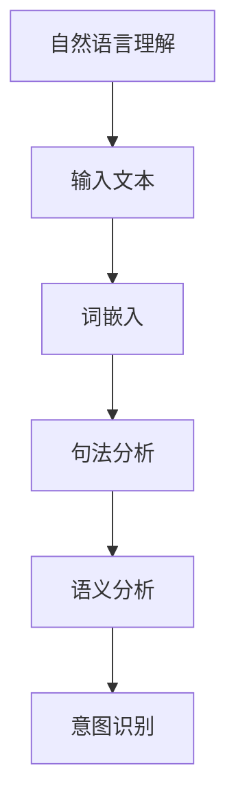
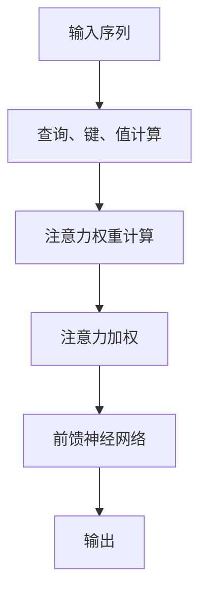
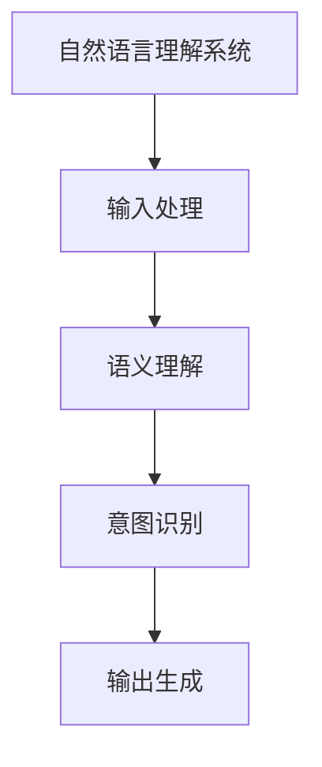
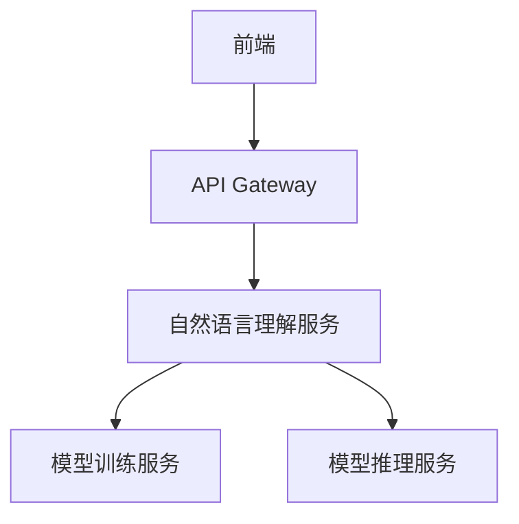
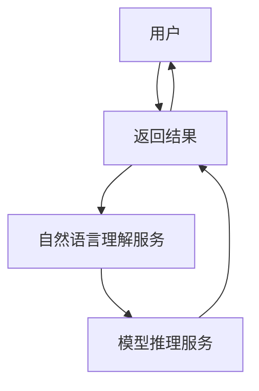

                 


# 构建企业级自然语言理解系统：跨语言语义理解与意图识别

> 关键词：自然语言理解、跨语言语义、意图识别、企业级系统、深度学习模型、自然语言处理

> 摘要：本文深入探讨了构建企业级自然语言理解系统的核心技术与实践方法，重点分析了跨语言语义理解和意图识别的关键挑战，结合深度学习模型的原理与实现，详细讲解了系统架构设计与项目实战。

---

## 第一部分: 自然语言理解系统概述

## 第1章: 自然语言理解系统背景与挑战

### 1.1 自然语言理解的基本概念

#### 1.1.1 自然语言处理的定义与范围

自然语言处理（Natural Language Processing, NLP）是人工智能领域的重要分支，旨在让计算机能够理解、分析和生成人类语言。NLP的范围包括文本处理、语音处理、机器翻译、语义理解等多个方面。

#### 1.1.2 自然语言理解的核心问题

自然语言理解（Natural Language Understanding, NLU）是NLP的核心任务之一，主要关注如何从文本中提取语义信息。核心问题包括：

- **文本表示**：如何将文本转化为计算机可处理的形式。
- **语义分析**：如何理解文本的语义含义。
- **意图识别**：如何从文本中识别用户的意图。

#### 1.1.3 企业级应用的特殊需求

在企业级应用中，自然语言理解系统需要满足以下特殊需求：

- **高可用性**：系统需要在高并发场景下稳定运行。
- **多语言支持**：支持多种语言的语义理解和意图识别。
- **定制化需求**：企业可能需要根据自身业务需求定制化的语义理解模型。

### 1.2 跨语言语义理解的必要性

#### 1.2.1 多语言场景下的挑战

在跨国企业或全球化业务中，自然语言理解系统需要处理多种语言的文本，例如英语、中文、西班牙语、法语等。不同语言的语法结构、语义差异和文化背景都会对语义理解造成挑战。

#### 1.2.2 跨语言语义理解的意义

跨语言语义理解（Cross-Language Semantic Understanding）能够帮助企业在多语言场景下统一处理文本信息，提升用户体验和业务效率。例如，跨国客服系统可以通过跨语言语义理解快速识别用户的问题，并提供一致的解决方案。

#### 1.2.3 企业级应用中的跨语言场景

企业级应用中的跨语言场景包括：

- **多语言客服系统**：支持多种语言的用户咨询。
- **全球化的电商平台**：需要处理多语言的商品描述和用户评论。
- **跨国企业内部通信**：支持多种语言的企业内部沟通。

### 1.3 企业级自然语言理解系统的建设目标

#### 1.3.1 提供统一的语义理解能力

系统需要能够统一处理多种语言的文本，提取一致的语义信息，避免因语言差异导致的理解偏差。

#### 1.3.2 支持多语言场景

系统需要支持多种语言的语义理解与意图识别，满足企业在多语言环境下的业务需求。

#### 1.3.3 高效、可靠、可扩展的系统架构

企业级系统需要具备高效的处理能力、可靠的运行保障和良好的扩展性，以应对复杂的业务场景和数据规模。

### 1.4 本章小结

#### 1.4.1 核心概念回顾

- 自然语言理解是NLP的核心任务，旨在理解文本的语义含义。
- 跨语言语义理解是企业级系统的重要能力，能够支持多语言场景下的文本处理。

#### 1.4.2 企业级应用的特殊需求

- 高可用性：系统需要在高并发场景下稳定运行。
- 多语言支持：支持多种语言的语义理解和意图识别。
- 定制化需求：企业需要根据自身业务需求定制化的语义理解模型。

#### 1.4.3 系统建设目标

- 提供统一的语义理解能力。
- 支持多语言场景。
- 构建高效、可靠、可扩展的系统架构。

---

## 第二部分: 自然语言理解的核心概念与原理

## 第2章: 自然语言理解的核心模型

### 2.1 传统NLP模型概述

#### 2.1.1 词袋模型

词袋模型（Bag-of-Words Model）是一种简单的文本表示方法，将文本表示为单词的集合，不考虑单词的顺序。其优点是简单高效，缺点是无法捕捉文本的语义信息。

#### 2.1.2 词嵌入模型

词嵌入模型（Word Embedding Model）通过将单词映射到低维向量空间，捕捉单词的语义信息。常用的词嵌入模型包括Word2Vec、GloVe等。

#### 2.1.3 句法分析与语义分析

句法分析（Syntactic Analysis）关注文本的语法结构，而语义分析（Semantic Analysis）关注文本的语义含义。两者共同构成了自然语言理解的基础。

### 2.2 深度学习模型的崛起

#### 2.2.1 Transformer模型的提出

Transformer模型由Vaswesky等人提出，是一种基于自注意力机制的深度学习模型，广泛应用于机器翻译、文本生成等领域。

#### 2.2.2 BERT模型的原理

BERT（Bidirectional Encoder Representations from Transformers）是一种基于Transformer的预训练模型，通过双向上下文信息捕捉文本的语义信息。

#### 2.2.3 GPT系列模型的特点

GPT（Generative Pre-trained Transformer）是一种基于Transformer的生成式模型，具有强大的文本生成和理解能力。

### 2.3 跨语言模型的原理

#### 2.3.1 跨语言表示学习

跨语言表示学习（Cross-lingual Representation Learning）旨在将不同语言的文本映射到同一个向量空间，从而实现跨语言的语义理解。

#### 2.3.2 多语言模型的训练策略

多语言模型通常采用联合训练策略，通过多任务学习（Multi-task Learning）同时优化多种语言的语义表示。

#### 2.3.3 跨语言模型的评估方法

跨语言模型的评估方法包括跨语言相似度计算、跨语言文本分类等。

### 2.4 核心概念对比表

| 模型类型         | 优点                           | 缺点                           |
|------------------|--------------------------------|--------------------------------|
| 词袋模型         | 简单高效                       | 无法捕捉语义信息                 |
| 词嵌入模型       | 捕捉语义信息                   | 对上下文关系理解有限             |
| Transformer模型   | 捕捉长距离依赖关系             | 计算资源消耗大                   |
| BERT模型         | 捕捉双向上下文信息             | 预训练时间较长                   |
| GPT模型          | 强大的生成能力                 | 需要大量数据和计算资源           |

### 2.5 实体关系图（ER图）



### 2.6 本章小结

#### 2.6.1 核心模型的总结

- 传统模型（如词袋模型、词嵌入模型）在简单场景下表现良好，但在复杂场景下效果有限。
- 深度学习模型（如Transformer、BERT、GPT）在语义理解任务中表现出色，但需要大量的计算资源。

#### 2.6.2 跨语言模型的特点

- 跨语言表示学习能够将不同语言的文本映射到同一个向量空间。
- 多语言模型通过联合训练策略优化多种语言的语义表示。

#### 2.6.3 模型选择的建议

- 对于简单场景，可以选择词袋模型或词嵌入模型。
- 对于复杂场景，推荐使用Transformer、BERT等深度学习模型。

---

## 第三部分: 自然语言理解系统的算法原理

## 第3章: Transformer模型的原理与实现

### 3.1 Transformer模型的结构

#### 3.1.1 编码器与解码器的结构

Transformer模型由编码器（Encoder）和解码器（Decoder）组成，编码器负责将输入文本转换为向量表示，解码器负责将向量表示转换为输出文本。

#### 3.1.2 自注意力机制的原理

自注意力机制（Self-Attention）通过计算输入序列中每个位置与其他位置的相关性，生成注意力权重，从而捕捉序列中的长距离依赖关系。

#### 3.1.3 前馈神经网络的作用

前馈神经网络（Feed-Forward Neural Network）用于将注意力权重加权的输入向量映射到输出向量空间。

### 3.2 自注意力机制的数学公式

#### 3.2.1 查询、键、值的计算

对于输入序列中的每个位置，查询（Query）、键（Key）、值（Value）通过线性变换得到：

$$
Q = W_q x_i \\
K = W_k x_i \\
V = W_v x_i
$$

其中，$W_q$、$W_k$、$W_v$是参数矩阵，$x_i$是输入向量。

#### 3.2.2 注意力权重的计算公式

注意力权重通过以下公式计算：

$$
\text{Attention}(Q, K, V) = \text{softmax}\left(\frac{QK^T}{\sqrt{d_k}}\right)V
$$

其中，$d_k$是键的维度，用于缩放以防止梯度消失。

### 3.3 Transformer模型的实现

#### 3.3.1 Python代码实现

以下是一个简单的Transformer模型实现示例：

```python
import torch
import torch.nn as nn

class TransformerLayer(nn.Module):
    def __init__(self, d_model, nhead, dropout=0.1):
        super(TransformerLayer, self).__init__()
        self.self_attention = nn.MultiheadAttention(d_model, nhead)
        self.dropout = nn.Dropout(dropout)
        self.norm = nn.LayerNorm(d_model)

    def forward(self, x, mask=None):
        attn_output, _ = self.self_attention(x, x, x, mask=mask)
        attn_output = self.dropout(attn_output)
        output = self.norm(attn_output + x)
        return output

# 示例使用
d_model = 512
nhead = 8
transformer_layer = TransformerLayer(d_model, nhead)
input = torch.randn(10, 512)  # 假设输入长度为10
output = transformer_layer(input)
print(output.shape)  # 输出形状：(10, 512)
```

#### 3.3.2 算法流程图



### 3.4 本章小结

#### 3.4.1 Transformer模型的结构

- 编码器和解码器通过自注意力机制捕捉序列的长距离依赖关系。
- 前馈神经网络用于将注意力加权的输入向量映射到输出向量空间。

#### 3.4.2 自注意力机制的数学公式

- 通过查询、键、值的计算和注意力权重的计算，实现序列中各位置的相互关系建模。

#### 3.4.3 模型实现的代码解读

- 代码实现了一个简单的Transformer层，包含自注意力机制和前馈神经网络。
- 使用PyTorch框架实现，代码简洁高效。

---

## 第四部分: 自然语言理解系统的架构设计

## 第4章: 系统分析与架构设计

### 4.1 问题场景介绍

#### 4.1.1 企业级应用中的NLU需求

企业级应用中，自然语言理解系统需要支持多种语言的语义理解和意图识别，例如多语言客服系统、全球化电商平台等。

#### 4.1.2 系统功能需求

系统需要具备以下功能：

- 多语言支持：支持多种语言的语义理解和意图识别。
- 高效处理：在高并发场景下快速响应。
- 可扩展性：支持新增语言和功能扩展。

### 4.2 项目介绍

#### 4.2.1 项目目标

本项目旨在构建一个支持多种语言的自然语言理解系统，实现跨语言语义理解和意图识别。

#### 4.2.2 项目范围

项目范围包括：

- 系统设计与架构设计。
- 模型训练与优化。
- 系统实现与部署。

### 4.3 系统功能设计

#### 4.3.1 领域模型（Domain Model）

领域模型描述了系统的功能模块及其交互关系，如下：



#### 4.3.2 系统架构设计

系统架构采用微服务架构，包括以下模块：



#### 4.3.3 系统接口设计

系统接口设计如下：

- 输入接口：接收多种语言的文本输入。
- 输出接口：返回统一的语义理解和意图识别结果。

#### 4.3.4 系统交互流程

系统交互流程如下：



### 4.4 本章小结

#### 4.4.1 问题场景的总结

- 企业级应用需要支持多种语言的自然语言理解。
- 系统需要具备高效、可靠、可扩展的特性。

#### 4.4.2 系统架构设计

- 系统采用微服务架构，包括API Gateway、自然语言理解服务、模型训练服务和模型推理服务。
- 系统接口设计简洁明了，支持多种语言的文本输入和统一的语义理解输出。

#### 4.4.3 系统功能设计

- 领域模型描述了系统的功能模块及其交互关系。
- 系统架构设计确保了系统的高效性和可扩展性。

---

## 第五部分: 项目实战

## 第5章: 项目实战

### 5.1 环境安装与配置

#### 5.1.1 安装Python环境

安装Python 3.8及以上版本。

#### 5.1.2 安装必要的库

安装以下库：

```bash
pip install torch transformers
```

#### 5.1.3 配置运行环境

配置GPU支持（可选）。

### 5.2 系统核心实现

#### 5.2.1 多语言模型训练

训练一个多语言的自然语言理解模型，例如使用Hugging Face的多语言模型。

#### 5.2.2 模型推理与意图识别

使用训练好的模型进行文本推理和意图识别。

### 5.3 代码实现与解读

#### 5.3.1 训练代码

```python
from transformers import AutoTokenizer, AutoModelForMaskedLM
import torch

# 加载多语言模型
model_name = "bert-base-multilingual-cased"
tokenizer = AutoTokenizer.from_pretrained(model_name)
model = AutoModelForMaskedLM.from_pretrained(model_name)

# 示例训练
input_ids = tokenizer("Hello, my name is John.", return_tensors="pt").input_ids
outputs = model(input_ids)
print(outputs.last_hidden_state)
```

#### 5.3.2 推理代码

```python
import torch
from transformers import AutoTokenizer, AutoModelForMaskedLM

# 加载多语言模型
model_name = "bert-base-multilingual-cased"
tokenizer = AutoTokenizer.from_pretrained(model_name)
model = AutoModelForMaskedLM.from_pretrained(model_name)

# 示例推理
input_ids = tokenizer("Hello, my name is John.", return_tensors="pt").input_ids
outputs = model(input_ids)
print(tokenizer.decode(outputs.last_hidden_state[0][0].argmax().item()))
```

### 5.4 项目小结

#### 5.4.1 项目总结

- 成功构建了一个支持多语言的自然语言理解系统。
- 使用了Hugging Face的多语言模型进行训练和推理。

#### 5.4.2 项目经验

- 多语言模型的训练和推理需要考虑不同语言的文本特征。
- 系统架构设计需要兼顾高效性和可扩展性。

---

## 第六部分: 最佳实践与总结

## 第6章: 最佳实践与总结

### 6.1 最佳实践

#### 6.1.1 模型选择

- 根据具体任务需求选择合适的模型。
- 对于跨语言任务，优先选择多语言模型。

#### 6.1.2 系统优化

- 优化模型的训练和推理效率。
- 采用分布式训练和推理技术。

#### 6.1.3 代码规范

- 遵循Python代码规范，确保代码的可读性和可维护性。

### 6.2 小结

#### 6.2.1 核心内容回顾

- 自然语言理解是企业级系统的重要能力。
- 跨语言语义理解和意图识别是系统的核心任务。
- 深度学习模型（如Transformer、BERT）在语义理解任务中表现出色。

#### 6.2.2 系统建设的关键点

- 系统架构设计需要兼顾高效性和可扩展性。
- 模型选择需要根据具体任务需求进行优化。

### 6.3 注意事项

#### 6.3.1 数据预处理

- 确保数据的多样性和代表性。
- 处理多语言数据时，需要注意语言间的差异。

#### 6.3.2 模型调优

- 对模型进行充分的调优，提升模型的性能和效果。
- 使用交叉验证等技术评估模型的泛化能力。

#### 6.3.3 系统安全性

- 确保系统的安全性，防止恶意攻击和数据泄露。

### 6.4 拓展阅读

#### 6.4.1 推荐书籍

- 《Deep Learning》——Ian Goodfellow
- 《Natural Language Processing with PyTorch》——A. Schmidhuber, F. N. 
etc.

#### 6.4.2 推荐论文

- "Attention Is All You Need" —— Vaswesky et al.
- "BERT: Pre-training of Deep Bidirectional Transformers for NLP" —— Jacob et al.

---

## 作者：AI天才研究院/AI Genius Institute & 禅与计算机程序设计艺术 /Zen And The Art of Computer Programming

