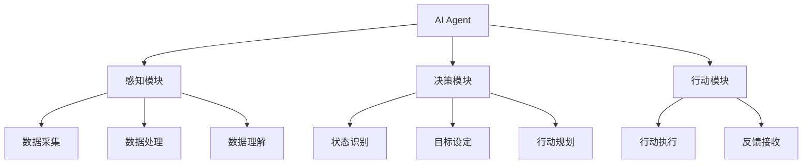
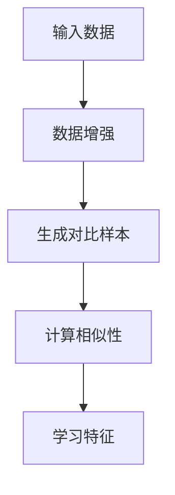
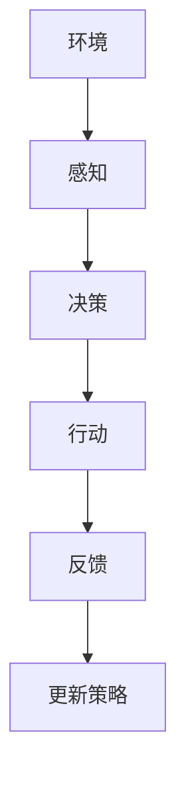
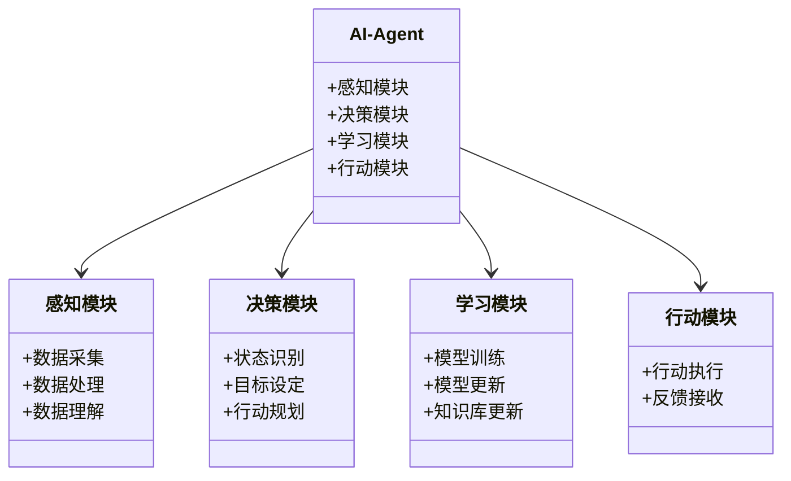
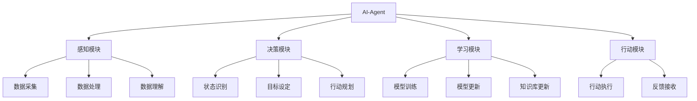
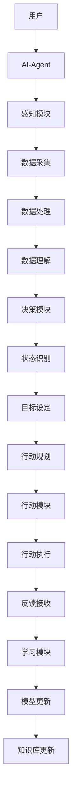

                 


# 构建具有终身学习能力的AI Agent

---

## 关键词：AI Agent，终身学习，机器学习，知识表示，自然语言处理，系统架构

---

## 摘要

本文详细探讨了构建具有终身学习能力的AI Agent的核心概念、技术基础、算法实现、系统架构及实际应用。通过分析AI Agent的基本原理，讲解终身学习的实现方式，结合具体的数学模型和代码实现，展示了如何设计一个能够持续学习和适应新环境的智能系统。文章还提供了系统实体关系图、算法流程图和实际案例，帮助读者全面理解并掌握构建具有终身学习能力的AI Agent的方法。

---

## 第一部分: 背景介绍

### 第1章: AI Agent概述

#### 1.1 AI Agent的基本概念

##### 1.1.1 什么是AI Agent
AI Agent（人工智能代理）是一种智能系统，能够感知环境、理解任务目标，并通过自主决策和行动来实现目标。AI Agent可以是软件程序、机器人或其他智能设备，具备以下核心特征：
- **自主性**：能够在没有外部干预的情况下独立运作。
- **反应性**：能够实时感知环境并做出反应。
- **目标导向性**：具有明确的目标，并通过行动实现这些目标。
- **学习能力**：能够通过经验或数据不断优化自身的性能。

##### 1.1.2 AI Agent的核心特征
AI Agent的核心特征包括：
- **自主性**：AI Agent能够在没有外部干预的情况下独立运作。
- **反应性**：AI Agent能够实时感知环境并做出反应。
- **目标导向性**：AI Agent具有明确的目标，并通过行动实现这些目标。
- **学习能力**：AI Agent能够通过经验或数据不断优化自身的性能。

##### 1.1.3 AI Agent的应用场景
AI Agent广泛应用于多个领域，包括：
- **智能助手**：如Siri、Alexa等，能够通过语音交互帮助用户完成各种任务。
- **自动驾驶**：如自动驾驶汽车，能够实时感知环境并做出决策。
- **智能推荐系统**：如 Netflix 和 Spotify，能够根据用户的偏好推荐内容。
- **机器人**：如工业机器人和家庭服务机器人，能够执行特定任务。

#### 1.2 终身学习能力的必要性

##### 1.2.1 AI Agent面临的挑战
AI Agent在实际应用中面临以下挑战：
- **环境动态变化**：AI Agent需要能够适应不断变化的环境。
- **数据稀疏性**：在某些情况下，数据可能不足，导致模型性能下降。
- **任务多样性**：AI Agent需要能够处理多种任务。

##### 1.2.2 终身学习能力的定义
终身学习能力是指AI Agent能够在其整个生命周期中不断学习和适应新知识、新任务和新环境的能力。与传统AI系统不同，终身学习AI Agent能够持续优化自身性能，而不仅仅依赖于初始训练数据。

##### 1.2.3 终身学习能力的重要性
终身学习能力的重要性体现在以下几个方面：
- **提高适应性**：能够快速适应新环境和新任务。
- **增强泛化能力**：能够在不同场景下表现出色。
- **延长使用寿命**：能够持续优化性能，延长系统的使用寿命。

#### 1.3 相关技术基础

##### 1.3.1 知识表示与推理
知识表示是将知识以某种形式存储，使其能够被计算机理解和推理。常用的表示方法包括：
- **知识图谱**：将知识表示为图结构，节点表示实体，边表示关系。
- **逻辑推理**：通过逻辑规则进行推理，得出新的知识。
- **概念学习**：通过学习概念的特征，构建概念之间的关系。

##### 1.3.2 自然语言处理
自然语言处理（NLP）是AI Agent理解人类语言的关键技术，主要包括：
- **语义理解**：理解文本的含义，提取语义信息。
- **文本生成**：生成符合语境的文本，如对话生成。
- **对话系统**：实现人与AI Agent之间的自然对话。

##### 1.3.3 机器学习基础
机器学习是AI Agent学习的核心技术，包括：
- **监督学习**：基于标记数据进行学习。
- **无监督学习**：基于未标记数据进行学习。
- **深度学习**：通过深层神经网络进行特征学习。

---

## 第二部分: 核心概念与联系

### 第4章: AI Agent的核心概念原理

#### 4.1 AI Agent的感知与决策

##### 4.1.1 感知模块
感知模块是AI Agent获取环境信息的关键部分，包括：
- **数据采集**：通过传感器、摄像头等设备获取环境数据。
- **数据处理**：对获取的数据进行预处理，提取有用的特征。
- **数据理解**：通过自然语言处理等技术，理解数据的含义。

##### 4.1.2 决策模块
决策模块是AI Agent根据感知到的信息做出决策的核心部分，包括：
- **状态识别**：识别当前环境的状态。
- **目标设定**：根据当前状态和任务目标，设定具体的行动目标。
- **行动规划**：制定实现目标的行动计划。

##### 4.1.3 行动模块
行动模块是AI Agent执行决策的物理或逻辑部分，包括：
- **行动执行**：根据决策模块的指令，执行具体的行动。
- **反馈接收**：接收行动执行后的反馈信息，用于后续的学习和优化。

#### 4.2 终身学习的数学模型

##### 4.2.1 模型更新公式
终身学习的数学模型需要能够实时更新，以适应新数据和新任务。常见的模型更新公式包括：
$$ \theta_{t+1} = \theta_t + \alpha (x_{t+1} - \theta_t) $$
其中，$\theta_t$ 表示当前模型参数，$\alpha$ 表示学习率，$x_{t+1}$ 表示新数据点。

##### 4.2.2 学习策略
终身学习需要选择合适的学习策略，如：
- **在线学习**：实时更新模型参数，适用于动态环境。
- **离线学习**：定期批量更新模型参数，适用于数据积累较多的情况。

##### 4.2.3 知识表示
知识表示是终身学习的基础，常用的知识表示方法包括：
- **向量表示**：将知识表示为向量，便于计算和推理。
- **图结构表示**：将知识表示为图结构，便于推理和关联分析。

### 第5章: 核心概念属性特征对比

#### 5.1 AI Agent与传统AI的对比

##### 5.1.1 智能性对比
AI Agent具备自主性和反应性，而传统AI系统通常依赖于固定的规则和数据。

##### 5.1.2 自适应性对比
AI Agent能够实时适应环境变化，而传统AI系统通常需要重新训练才能适应新任务。

##### 5.1.3 学习能力对比
AI Agent具备终身学习能力，能够不断优化自身性能，而传统AI系统通常只能基于初始训练数据进行推理。

#### 5.2 终身学习与一次性学习的对比

##### 5.2.1 学习方式对比
终身学习是实时或定期更新模型，而一次性学习仅在训练阶段进行学习。

##### 5.2.2 知识更新对比
终身学习的知识库是动态更新的，而一次性学习的知识库通常是静态的。

##### 5.2.3 应用场景对比
终身学习适用于环境动态变化和任务多样性的场景，而一次性学习适用于任务固定、环境稳定的场景。

### 第6章: 系统实体关系图

#### 6.1 系统实体关系图
以下是系统实体关系图的Mermaid图表：



---

## 第三部分: 算法原理讲解

### 第7章: 算法原理

#### 7.1 对比学习算法

##### 7.1.1 对比学习流程
对比学习是一种通过对比不同样本之间的差异来学习特征的方法。以下是对比学习的流程图：



##### 7.1.2 对比学习代码实现
以下是对比学习的Python代码示例：

```python
import torch
import torch.nn as nn

class ContrastiveLoss(nn.Module):
    def __init__(self, temperature=0.1):
        super(ContrastiveLoss, self).__init__()
        self.temperature = temperature

    def forward(self, features, labels):
        # 计算正样本对
        positive_pairs = (features == features[:, None]).float()
        # 计算负样本对
        negative_pairs = 1 - positive_pairs
        # 计算损失
        loss = -torch.mean(torch.log(positive_pairs + 1e-10) - torch.log(negative_pairs + 1e-10))
        return loss

# 示例用法
features = torch.randn(100, 512)  # 特征向量
labels = torch.zeros(100)  # 标签
loss = ContrastiveLoss()(features, labels)
print(loss)
```

#### 7.2 强化学习算法

##### 7.2.1 强化学习流程
强化学习是一种通过奖励机制来优化决策策略的方法。以下是强化学习的流程图：



##### 7.2.2 强化学习代码实现
以下是强化学习的Python代码示例：

```python
import torch
import torch.nn as nn
import torch.optim as optim

class PolicyNetwork(nn.Module):
    def __init__(self, input_size, output_size):
        super(PolicyNetwork, self).__init__()
        self.fc1 = nn.Linear(input_size, 128)
        self.fc2 = nn.Linear(128, output_size)
        self.softmax = nn.Softmax(dim=1)

    def forward(self, x):
        x = torch.relu(self.fc1(x))
        x = self.softmax(self.fc2(x))
        return x

# 示例用法
input_size = 4
output_size = 2
policy = PolicyNetwork(input_size, output_size)
optimizer = optim.Adam(policy.parameters(), lr=0.01)

# 假设状态s和动作a
s = torch.randn(input_size)
a = torch.randint(0, output_size, (1,))

# 计算损失
loss = F.nll_loss(torch.log(policy(s)), a)
optimizer.zero_grad()
loss.backward()
optimizer.step()
```

---

## 第四部分: 系统分析与架构设计方案

### 第8章: 系统分析与架构设计

#### 8.1 问题场景介绍
AI Agent需要在动态环境中不断学习和适应新任务。例如，在智能客服系统中，AI Agent需要能够根据客户需求实时调整推荐策略。

#### 8.2 系统功能设计

##### 8.2.1 领域模型
以下是领域模型的Mermaid类图：



#### 8.3 系统架构设计

##### 8.3.1 系统架构图
以下是系统架构的Mermaid图表：



#### 8.4 系统接口设计
系统接口设计需要定义各个模块之间的交互接口，例如：
- 感知模块向决策模块传递当前环境状态。
- 学习模块向感知模块请求新的数据。

#### 8.5 系统交互流程图



---

## 第五部分: 项目实战

### 第9章: 项目实战

#### 9.1 环境安装

##### 9.1.1 安装Python和相关库
```bash
python --version
pip install torch
pip install matplotlib
pip install numpy
```

#### 9.2 核心代码实现

##### 9.2.1 感知模块实现
以下是感知模块的Python代码示例：

```python
import numpy as np
import matplotlib.pyplot as plt

class PerceptionModule:
    def __init__(self, sensors):
        self.sensors = sensors
        self.data = None

    def collect_data(self):
        self.data = [s.measure() for s in self.sensors]
        return self.data

    def process_data(self):
        # 示例处理：计算平均值
        processed_data = np.mean(self.data, axis=0)
        return processed_data

    def understand_data(self):
        # 示例理解：绘制数据
        plt.plot(self.data)
        plt.title('Data Understanding')
        plt.show()

# 示例用法
class Sensor:
    def measure(self):
        return np.random.random(10)

sensors = [Sensor(), Sensor()]
perception = PerceptionModule(sensors)
data = perception.collect_data()
processed_data = perception.process_data()
perception.understand_data()
```

##### 9.2.2 决策模块实现
以下是决策模块的Python代码示例：

```python
import torch
import torch.nn as nn
import torch.optim as optim

class DecisionModule:
    def __init__(self, input_size, output_size):
        self.model = nn.Sequential(
            nn.Linear(input_size, 128),
            nn.ReLU(),
            nn.Linear(128, output_size),
            nn.Softmax(dim=1)
        )
        self.optimizer = optim.Adam(self.model.parameters(), lr=0.01)

    def decide(self, state):
        with torch.no_grad():
            probabilities = self.model(state)
            action = torch.multinomial(probabilities, 1).item()
        return action

    def update(self, state, action, reward):
        self.optimizer.zero_grad()
        probabilities = self.model(state)
        loss = -torch.log(probabilities[0, action]) * reward
        loss.backward()
        self.optimizer.step()

# 示例用法
input_size = 10
output_size = 5
decision = DecisionModule(input_size, output_size)
state = torch.randn(input_size)
action = decision.decide(state)
reward = 1.0
decision.update(state, action, reward)
```

##### 9.2.3 学习模块实现
以下是学习模块的Python代码示例：

```python
import torch
import torch.nn as nn
import torch.optim as optim

class LearningModule:
    def __init__(self, input_size, output_size):
        self.model = nn.Sequential(
            nn.Linear(input_size, 128),
            nn.ReLU(),
            nn.Linear(128, output_size)
        )
        self.optimizer = optim.Adam(self.model.parameters(), lr=0.01)
        self.criterion = nn.MSELoss()

    def train(self, inputs, targets):
        self.optimizer.zero_grad()
        outputs = self.model(inputs)
        loss = self.criterion(outputs, targets)
        loss.backward()
        self.optimizer.step()

    def update(self, new_inputs, new_targets):
        self.train(new_inputs, new_targets)

# 示例用法
input_size = 10
output_size = 5
learning = LearningModule(input_size, output_size)
inputs = torch.randn(100, input_size)
targets = torch.randn(100, output_size)
learning.train(inputs, targets)
```

#### 9.3 项目实战小结

##### 9.3.1 实战案例分析
通过上述代码实现，我们可以构建一个简单的AI Agent，能够感知环境、做出决策并不断学习优化。例如，在智能客服系统中，AI Agent可以根据客户需求实时调整推荐策略。

##### 9.3.2 代码实现解读
- **感知模块**：通过传感器采集数据，处理数据并理解数据含义。
- **决策模块**：根据当前状态和目标，制定行动计划。
- **学习模块**：通过训练模型，优化AI Agent的性能。

---

## 第六部分: 最佳实践和小结

### 第10章: 最佳实践和小结

#### 10.1 最佳实践

##### 10.1.1 算法选择
根据具体应用场景选择合适的算法，如在线学习适用于动态环境，离线学习适用于数据积累较多的情况。

##### 10.1.2 数据质量
确保数据质量，避免噪声和偏差，提高模型的泛化能力。

##### 10.1.3 系统架构
设计合理的系统架构，确保各个模块之间的协作和通信。

#### 10.2 小结
本文详细探讨了构建具有终身学习能力的AI Agent的核心概念、技术基础、算法实现、系统架构及实际应用。通过分析AI Agent的基本原理，讲解终身学习的实现方式，结合具体的数学模型和代码实现，展示了如何设计一个能够持续学习和适应新环境的智能系统。文章还提供了系统实体关系图、算法流程图和实际案例，帮助读者全面理解并掌握构建具有终身学习能力的AI Agent的方法。

#### 10.3 注意事项
- **数据安全**：确保数据的安全性和隐私性。
- **模型可解释性**：提高模型的可解释性，便于调试和优化。
- **性能优化**：优化模型的计算效率，减少资源消耗。

#### 10.4 拓展阅读
- **终身学习的最新研究**：阅读相关论文，了解终身学习的最新进展。
- **AI Agent的应用案例**：学习更多AI Agent的实际应用案例，了解不同场景下的实现方式。

---

## 结语

构建具有终身学习能力的AI Agent是一项复杂的系统工程，需要综合运用多种技术手段。通过本文的详细讲解，读者可以全面了解AI Agent的核心概念、技术基础、算法实现、系统架构及实际应用。未来，随着技术的不断发展，AI Agent的终身学习能力将更加智能化和高效化，为人类社会的发展带来更多的可能性。

---

## 作者：AI天才研究院/AI Genius Institute & 禅与计算机程序设计艺术 /Zen And The Art of Computer Programming

