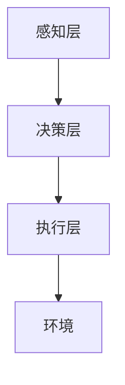
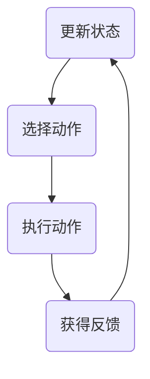
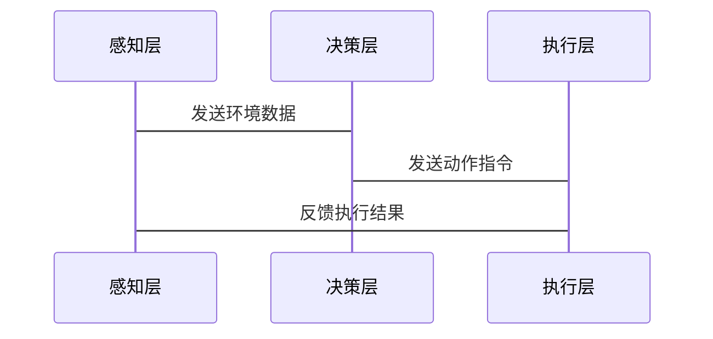

                 


# 构建具有自动机器学习能力的AI Agent

## 关键词：AI Agent, 自动机器学习, 强化学习, 系统架构设计, 机器学习算法

## 摘要：本文将详细探讨如何构建一个具有自动机器学习能力的AI Agent。从基本概念到算法原理，从系统架构设计到项目实战，我们将一步步解析如何实现一个能够自我优化和适应环境的智能代理系统。本文将涵盖AI Agent的核心原理、自动机器学习的算法实现、系统架构设计以及实际案例分析，帮助读者全面理解并掌握构建此类系统的知识。

---

# 第1章 AI Agent与自动机器学习概述

## 1.1 AI Agent的基本概念

### 1.1.1 AI Agent的定义
AI Agent（人工智能代理）是指能够感知环境、自主决策并执行任务的智能系统。它可以是一个软件程序，也可以是一个物理机器人，其核心目标是通过与环境的交互实现特定的目标。

### 1.1.2 AI Agent的核心特征
- **自主性**：能够在没有外部干预的情况下独立运行。
- **反应性**：能够实时感知环境并做出反应。
- **目标导向性**：基于目标驱动行为，优化决策以实现目标。
- **学习能力**：通过机器学习技术不断优化自身性能。

### 1.1.3 自动机器学习的必要性
传统的机器学习需要大量人工干预，而自动机器学习能够自动完成数据预处理、模型选择和优化等任务，从而提高AI Agent的效率和适应性。

## 1.2 机器学习与AI Agent的关系

### 1.2.1 机器学习的基本原理
机器学习是通过数据训练模型，使其能够从经验中学习并做出预测或决策。AI Agent可以利用机器学习模型来提高其感知和决策能力。

### 1.2.2 AI Agent中的机器学习应用
- **感知层**：通过机器学习模型处理和理解环境数据。
- **决策层**：利用机器学习模型进行策略优化和决策。
- **执行层**：根据决策结果执行具体操作。

### 1.2.3 自动机器学习的特点
- **自动化**：无需人工干预，自动完成模型训练和优化。
- **高效性**：通过自动化流程提高效率，降低开发成本。
- **适应性**：能够根据环境变化自动调整模型参数。

## 1.3 自动机器学习的背景与挑战

### 1.3.1 传统机器学习的局限性
- **人工干预过多**：需要大量人工参与数据预处理和模型调优。
- **适应性差**：难以快速适应环境的变化。

### 1.3.2 自动机器学习的优势
- **提高效率**：自动化流程减少了人工干预，提高了开发效率。
- **增强适应性**：能够快速响应环境变化，自动优化模型。

### 1.3.3 当前的主要挑战
- **计算资源消耗大**：自动机器学习需要大量的计算资源。
- **模型解释性差**：复杂的模型可能难以解释其决策过程。
- **数据质量要求高**：需要高质量的数据才能保证模型的性能。

## 1.4 本章小结
本章介绍了AI Agent的基本概念和自动机器学习的特点，分析了两者之间的关系以及自动机器学习的背景和挑战。

---

# 第2章 AI Agent与自动机器学习的核心原理

## 2.1 AI Agent的感知与决策机制

### 2.1.1 感知层的实现原理
AI Agent通过传感器或数据接口感知环境，获取必要的信息。这些信息可能包括图像、文本、数值等不同类型的数据。

### 2.1.2 决策层的算法选择
决策层负责根据感知到的信息选择最优的动作。常用的算法包括强化学习、监督学习和无监督学习等。

### 2.1.3 执行层的实现方式
执行层负责将决策层的决策转化为具体的动作，例如发送指令、控制设备等。

## 2.2 自动机器学习的算法原理

### 2.2.1 强化学习算法
强化学习是一种通过试错机制来优化策略的机器学习方法。AI Agent通过与环境交互，不断优化其行为策略以获得最大化的累积奖励。

### 2.2.2 自动机器学习算法
自动机器学习算法包括自动特征工程、自动模型选择和自动超参数优化等技术。这些技术能够自动完成传统机器学习中的繁琐步骤。

## 2.3 AI Agent与自动机器学习的结合

### 2.3.1 系统架构设计
AI Agent的系统架构通常包括感知层、决策层和执行层。自动机器学习技术可以应用于决策层，以提高其决策能力。

### 2.3.2 数据流的处理流程
数据流的处理流程包括数据采集、数据预处理、模型训练和模型部署等步骤。自动机器学习能够自动化这些流程，提高效率。

### 2.3.3 系统的可扩展性分析
系统的可扩展性是指在增加新的功能或数据时，系统能够保持良好的性能。自动机器学习技术能够帮助系统更好地扩展。

## 2.4 核心概念属性特征对比表
| 概念 | 属性 | 特征 |
|------|------|------|
| AI Agent | 感知能力 | 数据采集与处理能力 |
| 自动机器学习 | 自适应性 | 算法自动优化能力 |

## 2.5 系统ER实体关系图
```mermaid
er
actor(AI Agent) --|> environment: 感知数据
actor(AI Agent) --|> model: 优化算法
model --> environment: 输出决策
```

## 2.6 本章小结
本章详细讲解了AI Agent的核心原理和自动机器学习的算法原理，并分析了两者结合的系统架构设计。

---

# 第3章 强化学习算法原理

## 3.1 强化学习的基本概念

### 3.1.1 状态、动作与奖励的定义
- **状态**：环境在某一时刻的描述，例如当前的传感器数据。
- **动作**：AI Agent在某一状态下选择的行为。
- **奖励**：环境对AI Agent行为的反馈，用于指导其学习。

### 3.1.2 强化学习的试错机制
AI Agent通过不断尝试不同的动作，根据奖励的反馈优化其行为策略。

### 3.1.3 基于Q-learning的算法实现
Q-learning是一种经典的强化学习算法，其核心思想是通过Q表记录状态-动作对的期望奖励值，从而找到最优策略。

## 3.2 基于Q-learning的算法实现

### 3.2.1 Q-learning算法的伪代码
```python
初始化Q表为零
while True:
    状态s通过环境获取
    动作a根据策略选择
    执行动作a，获得奖励r和新的状态s'
    Q[s][a] += 学习率 * (r + 折扣因子 * max(Q[s'][a']) - Q[s][a])
```

### 3.2.2 Q-learning算法的数学模型
Q-learning算法的数学模型如下：
$$ Q(s, a) = Q(s, a) + \alpha \left[r + \gamma \max Q(s', a') - Q(s, a)\right] $$
其中：
- $\alpha$ 是学习率，控制更新步长。
- $\gamma$ 是折扣因子，平衡当前奖励和未来奖励的重要性。

### 3.2.3 Q-learning算法的优缺点
- **优点**：简单易实现，适用于离散状态和动作空间。
- **缺点**：在连续状态和动作空间中表现不佳，难以处理高维问题。

## 3.3 强化学习在AI Agent中的应用

### 3.3.1 强化学习的环境建模
AI Agent需要通过与环境交互来学习，环境可以是虚拟的，也可以是真实的。

### 3.3.2 动作空间与状态空间的设计
动作空间和状态空间的设计直接影响强化学习的效果。设计合理的动作空间和状态空间是实现高效强化学习的关键。

### 3.3.3 奖励函数的设计
奖励函数的设计是强化学习的核心之一，它决定了AI Agent的学习目标和行为方向。

## 3.4 本章小结
本章详细讲解了强化学习的基本原理和Q-learning算法的实现，并分析了强化学习在AI Agent中的应用。

---

# 第4章 系统分析与架构设计

## 4.1 系统架构设计

### 4.1.1 系统功能模块划分
AI Agent的系统架构通常包括感知层、决策层和执行层。每个层都有其特定的功能模块。

### 4.1.2 系统架构图


### 4.1.3 系统模块之间的交互流程
感知层负责获取环境数据，决策层根据数据选择动作，执行层负责执行动作并反馈结果。

## 4.2 系统功能设计

### 4.2.1 系统功能需求分析
系统需要具备感知环境、自主决策和执行任务的核心功能。

### 4.2.2 系统功能模块的实现
每个功能模块的实现需要考虑其输入、输出和内部逻辑。

### 4.2.3 系统功能流程图


## 4.3 系统架构设计

### 4.3.1 系统架构设计原则
系统架构设计需要考虑可扩展性、可维护性和可测试性。

### 4.3.2 系统架构图


### 4.3.3 系统模块之间的接口设计
需要明确各个模块之间的接口和交互方式，确保系统的协同工作。

## 4.4 系统交互设计

### 4.4.1 系统交互流程图


### 4.4.2 系统交互的实现细节
需要详细描述各个模块之间的交互过程，确保系统的流畅运行。

## 4.5 本章小结
本章详细分析了AI Agent系统的架构设计，包括功能模块划分、系统架构图和交互流程图。

---

# 第5章 项目实战

## 5.1 环境安装与配置

### 5.1.1 开发环境的安装
需要安装Python、机器学习库（如TensorFlow、Scikit-learn）和可视化工具（如Matplotlib）。

### 5.1.2 系统依赖的安装
安装必要的依赖包，例如：
```bash
pip install numpy matplotlib scikit-learn
```

## 5.2 系统核心实现

### 5.2.1 环境数据的获取
通过传感器或API接口获取环境数据。

### 5.2.2 模型的训练与优化
使用机器学习算法对模型进行训练，并通过自动机器学习技术优化模型性能。

### 5.2.3 动作的执行与反馈
根据模型的决策执行具体动作，并获取环境的反馈。

## 5.3 代码实现与分析

### 5.3.1 基于Q-learning的AI Agent实现
```python
import numpy as np

class QLearningAgent:
    def __init__(self, state_space_size, action_space_size):
        self.state_space_size = state_space_size
        self.action_space_size = action_space_size
        self.Q = np.zeros((state_space_size, action_space_size))
    
    def choose_action(self, state, epsilon):
        if np.random.random() < epsilon:
            return np.random.randint(self.action_space_size)
        else:
            return np.argmax(self.Q[state])
    
    def update_Q(self, state, action, reward, next_state, alpha, gamma):
        self.Q[state][action] += alpha * (reward + gamma * np.max(self.Q[next_state]) - self.Q[state][action])
```

### 5.3.2 代码实现的详细解读
- **Q表的初始化**：创建一个二维数组，用于存储状态-动作对的期望奖励值。
- **动作选择**：基于epsilon-greedy策略选择动作，平衡探索与利用。
- **Q表更新**：根据奖励和下一状态的期望奖励值更新Q表。

### 5.3.3 系统实现的数学模型
Q-learning算法的数学模型如下：
$$ Q(s, a) = Q(s, a) + \alpha \left[r + \gamma \max Q(s', a') - Q(s, a)\right] $$

## 5.4 实际案例分析

### 5.4.1 案例背景
假设我们正在开发一个自动驾驶AI Agent，需要在复杂的交通环境中做出决策。

### 5.4.2 系统实现的细节
自动驾驶AI Agent需要实时感知交通状况，通过强化学习优化其驾驶策略。

### 5.4.3 案例分析与小结
通过实际案例分析，我们可以更好地理解AI Agent与自动机器学习的结合方式。

## 5.5 本章小结
本章通过实际项目实战，详细讲解了AI Agent的实现过程，包括环境安装、代码实现和案例分析。

---

# 第6章 总结与展望

## 6.1 本章总结
本文详细探讨了如何构建一个具有自动机器学习能力的AI Agent，从基本概念到算法实现，再到系统设计和项目实战，全面解析了AI Agent的核心原理和实现方法。

## 6.2 最佳实践 tips

### 6.2.1 系统设计中的注意事项
- **模块化设计**：确保系统的模块化和可扩展性。
- **数据质量**：保证数据的准确性和完整性。
- **模型优化**：合理选择和优化机器学习模型。

### 6.2.2 项目开发中的小贴士
- **版本控制**：使用Git进行代码版本管理。
- **日志记录**：记录系统运行日志，便于调试和优化。
- **持续集成**：使用CI/CD工具实现自动化测试和部署。

## 6.3 未来展望
随着人工智能技术的不断发展，AI Agent和自动机器学习将会有更广泛的应用场景。未来的研究方向可能包括更高效的强化学习算法、更智能的系统架构设计以及更强大的多智能体协作技术。

---

# 作者：AI天才研究院/AI Genius Institute & 禅与计算机程序设计艺术 /Zen And The Art of Computer Programming

