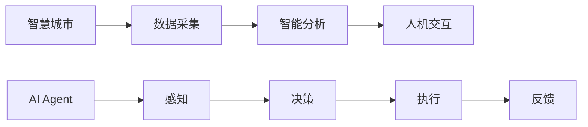
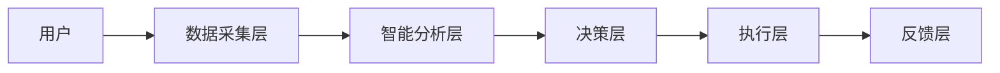
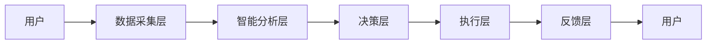

                 


# 构建智能城市管理AI Agent系统

> 关键词：智能城市，AI Agent，系统架构，算法原理，项目实战，智慧城市管理

> 摘要：本文详细探讨了如何构建智能城市管理AI Agent系统，从概念到技术实现，从系统架构到项目实战，全面分析了AI Agent在智慧城市建设中的应用。通过多智能体系统、分布式计算和博弈论的结合，本文提出了一个完整的解决方案，并通过实际案例展示了系统的实现与优化。

---

## 第二章: AI Agent系统的核心要素

### 2.1 AI Agent系统的核心要素

AI Agent（人工智能代理）是智慧城市系统中实现智能化管理的核心技术之一。AI Agent能够通过感知环境、分析信息、做出决策并执行动作，从而优化城市管理的效率和质量。以下是AI Agent系统的核心要素：

#### 2.1.1 感知与理解
AI Agent的第一步是感知外部环境，这包括从各种传感器、数据库和用户输入中获取数据。感知的主要任务是对这些数据进行解析和理解，提取有用的信息。例如，在交通管理中，AI Agent需要感知道路上的车流量、交通信号灯状态、天气条件等信息。

#### 2.1.2 决策与推理
在感知环境的基础上，AI Agent需要根据当前的状态和目标，通过推理和计算，制定出最优的决策。这一步骤通常涉及复杂的算法，如强化学习、博弈论和分布式计算。例如，在智能交通系统中，AI Agent需要根据实时数据，决定是否调整交通信号灯的时序，以缓解交通拥堵。

#### 2.1.3 执行与反馈
AI Agent在做出决策后，需要通过执行机构（如交通信号灯控制器、智能路灯等）来实现决策。同时，AI Agent还需要收集执行后的反馈信息，以评估决策的效果，并为未来的决策提供参考。例如，在智能路灯系统中，AI Agent可以根据实时的光照强度和人流量，自动调节路灯的亮度，并根据反馈信息优化调节策略。

### 2.2 智慧城市与AI Agent系统的概念结构图

以下是智慧城市与AI Agent系统的概念结构图，展示了系统的主要组成部分及其之间的关系：



---

## 第三章: AI Agent系统的技术基础

### 3.1 多智能体系统（MAS）

多智能体系统（Multi-Agent System，MAS）是AI Agent技术的重要组成部分，由多个智能体组成，每个智能体都有自己的目标和行为规则。以下是MAS的核心原理：

#### 3.1.1 多智能体系统的定义
多智能体系统是由多个智能体组成的分布式系统，这些智能体能够通过协作和竞争完成复杂的任务。例如，在智能交通系统中，多个AI Agent可以分别负责不同的交通节点（如十字路口、匝道等），并通过协作优化整体交通流量。

#### 3.1.2 多智能体系统的分类
多智能体系统可以根据智能体之间的关系分为以下几类：
1. **协作型MAS**：智能体之间相互协作，共同完成任务。
2. **竞争型MAS**：智能体之间存在竞争关系，各自追求自己的目标。
3. **混合型MAS**：智能体之间既有协作也有竞争。

#### 3.1.3 多智能体系统的协作机制
在MAS中，智能体之间的协作可以通过以下几种机制实现：
1. **分布式计算**：通过分布式计算技术，智能体可以在不同的节点上独立运行，并通过通信协议进行协作。
2. **博弈论**：通过博弈论中的纳什均衡等概念，智能体可以在竞争中找到最优的协作策略。
3. **分布式规划**：通过分布式规划技术，智能体可以在不冲突的情况下制定和执行各自的计划。

### 3.2 分布式计算与通信

分布式计算是MAS的核心技术之一，它通过将计算任务分配到多个节点上，提高了系统的并行计算能力和资源利用率。以下是分布式计算与通信的核心原理：

#### 3.2.1 分布式计算的基本概念
分布式计算是一种将计算任务分配到多个计算节点上进行并行计算的技术。通过分布式计算，可以充分利用多个节点的计算能力，提高系统的整体性能。

#### 3.2.2 AI Agent之间的通信协议
在MAS中，智能体之间的通信需要通过特定的通信协议。这些协议可以基于消息传递机制，也可以基于共享内存机制。以下是两种常见的通信方式：
1. **基于消息传递的通信**：智能体通过发送消息进行通信，消息中包含需要传递的信息和操作请求。
2. **基于共享内存的通信**：智能体通过共享内存进行通信，可以直接访问共享内存中的数据。

#### 3.2.3 分布式系统中的同步与一致性
在分布式系统中，同步与一致性是确保系统正确运行的重要问题。以下是几种常见的同步与一致性技术：
1. **时间戳法**：通过为每个操作分配一个时间戳，确保操作的顺序是正确的。
2. **乐观并发控制**：通过假设操作之间没有冲突，允许多个智能体同时修改共享数据，并在提交时检查冲突。
3. **悲观并发控制**：通过锁机制限制多个智能体同时访问共享数据，确保数据一致性。

### 3.3 博弈论与决策优化

博弈论是研究智能体之间相互作用的数学理论，广泛应用于MAS中的决策优化问题。以下是博弈论与决策优化的核心原理：

#### 3.3.1 博弈论基础
博弈论研究的是多个智能体在决策过程中相互作用的现象。以下是博弈论中的几个基本概念：
1. **博弈**：一个博弈由参与者、策略、结果和支付构成。
2. **纳什均衡**：在纳什均衡状态下，每个智能体的策略都是最优的，即没有任何智能体可以通过单方面改变策略而获得更好的结果。
3. **极大极小算法**：一种用于计算纳什均衡的算法，通过递归地考虑所有可能的策略组合，找到每个智能体的最佳策略。

#### 3.3.2 决策树与策略优化
决策树是一种用于表示决策过程的树状结构，广泛应用于博弈论和决策优化问题中。以下是决策树的基本结构：
1. **决策节点**：表示智能体需要做出的决策。
2. **结果节点**：表示决策的结果，可能是一个确定的结果或是一个概率分布的结果。
3. **策略**：智能体在每个决策节点上选择的策略。

#### 3.3.3 贪婪算法与动态规划
贪婪算法是一种用于优化问题的简单而有效的算法，它通过在每一步选择当前最优的策略，最终达到全局最优。动态规划是一种用于解决重叠子问题的算法，通过将问题分解成更小的子问题，逐个解决并存储中间结果。

---

## 第四章: AI Agent系统的算法原理

### 4.1 基于强化学习的决策算法

强化学习是一种通过试错方法来优化决策策略的机器学习技术。以下是基于强化学习的决策算法的核心原理：

#### 4.1.1 强化学习的基本原理
强化学习的核心是智能体通过与环境的交互，学习如何采取最优的动作以获得最大的累计奖励。以下是强化学习的基本要素：
1. **状态（State）**：智能体所处的环境状态。
2. **动作（Action）**：智能体可以采取的动作。
3. **奖励（Reward）**：智能体采取动作后获得的奖励，用于指导学习过程。
4. **策略（Policy）**：智能体采取动作的概率分布。

#### 4.1.2 Q-learning算法
Q-learning是一种经典的强化学习算法，适用于离散状态和动作空间的情况。以下是Q-learning算法的基本步骤：
1. 初始化Q表，所有动作的价值初始化为0。
2. 在每个时间步，智能体根据当前状态选择一个动作。
3. 执行动作，观察下一个状态和获得的奖励。
4. 更新Q表中对应动作-状态对的价值：$$ Q(s,a) = Q(s,a) + \alpha (r + \gamma \max Q(s',a')) $$
   其中，$\alpha$是学习率，$\gamma$是折扣因子。

#### 4.1.3 策略梯度算法
策略梯度算法是一种基于梯度的强化学习算法，适用于连续动作空间的情况。以下是策略梯度算法的基本步骤：
1. 初始化参数$\theta$，表示策略函数的参数。
2. 在每个时间步，智能体根据当前状态$s$，根据策略函数$\pi_\theta(a|s)$选择动作$a$。
3. 执行动作，观察下一个状态$s'$和获得的奖励$r$。
4. 计算策略梯度：$$ \nabla_\theta J(\theta) = \sum_{t=1}^T r_t \nabla_\theta \log \pi_\theta(a_t|s_t) $$
5. 更新参数：$$ \theta = \theta + \alpha \nabla_\theta J(\theta) $$

### 4.2 联合学习与分布式优化

联合学习是一种在分布式系统中优化多个智能体目标函数的技术。以下是联合学习与分布式优化的核心原理：

#### 4.2.1 联合学习的定义
联合学习是指多个智能体通过共享数据或参数，共同优化一个全局目标函数的技术。联合学习可以提高系统的整体性能，同时保护每个智能体的隐私。

#### 4.2.2 分布式优化算法
分布式优化算法是一种在分布式系统中优化多个智能体目标函数的技术。以下是几种常见的分布式优化算法：
1. **分布式梯度下降**：每个智能体在本地计算梯度，并通过通信协议将梯度汇总到中心节点，中心节点更新全局参数。
2. **分布式Adam优化**：结合了Adam优化算法的自适应学习率和动量技术，在分布式系统中优化参数。

#### 4.2.3 联合学习与分布式优化的挑战
联合学习与分布式优化在实际应用中面临以下挑战：
1. **通信开销**：智能体之间的通信需要消耗大量的带宽和时间。
2. **隐私保护**：智能体的数据可能包含敏感信息，需要保护隐私。
3. **同步与一致性**：在分布式系统中，如何保证全局参数的同步与一致性是一个难题。

---

## 第五章: AI Agent系统的系统设计

### 5.1 系统架构设计

系统架构设计是构建AI Agent系统的第一步，以下是系统的总体架构：



#### 5.1.1 数据采集层
数据采集层负责从各种传感器、数据库和用户输入中获取数据。以下是数据采集的主要任务：
1. **传感器数据采集**：通过物联网设备采集环境数据，如温度、湿度、光照强度等。
2. **数据库查询**：从数据库中获取历史数据和背景知识。
3. **用户输入**：接收用户的指令和反馈。

#### 5.1.2 智能分析层
智能分析层负责对采集的数据进行分析和处理。以下是智能分析的主要任务：
1. **数据预处理**：对数据进行清洗、转换和归一化处理。
2. **特征提取**：从数据中提取有用的特征，为后续的分析和决策提供依据。
3. **模型训练**：利用机器学习和深度学习算法，训练分类器、回归器和生成器等模型。

#### 5.1.3 决策层
决策层负责根据分析结果，制定决策策略。以下是决策层的主要任务：
1. **策略选择**：根据当前状态和目标，选择最优的策略。
2. **决策优化**：通过强化学习和博弈论等技术，优化决策策略。
3. **结果输出**：将决策结果输出到执行层。

#### 5.1.4 执行层
执行层负责根据决策层的指令，执行具体的动作。以下是执行层的主要任务：
1. **动作执行**：通过执行机构（如机器人、传感器等）执行决策层的指令。
2. **反馈采集**：采集执行结果的反馈信息，并将其传递给反馈层。
3. **状态更新**：根据反馈信息，更新系统的状态。

#### 5.1.5 反馈层
反馈层负责对执行结果进行评估和反馈。以下是反馈层的主要任务：
1. **结果评估**：评估执行结果是否达到预期目标。
2. **反馈优化**：根据评估结果，优化反馈机制，提高系统的整体性能。
3. **日志记录**：记录系统的运行日志，为后续的分析和优化提供依据。

### 5.2 系统功能设计

系统功能设计是构建AI Agent系统的第二步，以下是系统的主要功能模块：

#### 5.2.1 数据采集模块
数据采集模块负责从各种来源采集数据，以下是数据采集模块的功能：
1. **传感器数据采集**：通过物联网设备采集环境数据。
2. **数据库查询**：从数据库中获取历史数据和背景知识。
3. **用户输入**：接收用户的指令和反馈。

#### 5.2.2 智能分析模块
智能分析模块负责对采集的数据进行分析和处理，以下是智能分析模块的功能：
1. **数据预处理**：对数据进行清洗、转换和归一化处理。
2. **特征提取**：从数据中提取有用的特征，为后续的分析和决策提供依据。
3. **模型训练**：利用机器学习和深度学习算法，训练分类器、回归器和生成器等模型。

#### 5.2.3 决策模块
决策模块负责根据分析结果，制定决策策略，以下是决策模块的功能：
1. **策略选择**：根据当前状态和目标，选择最优的策略。
2. **决策优化**：通过强化学习和博弈论等技术，优化决策策略。
3. **结果输出**：将决策结果输出到执行层。

#### 5.2.4 执行模块
执行模块负责根据决策层的指令，执行具体的动作，以下是执行模块的功能：
1. **动作执行**：通过执行机构（如机器人、传感器等）执行决策层的指令。
2. **反馈采集**：采集执行结果的反馈信息，并将其传递给反馈层。
3. **状态更新**：根据反馈信息，更新系统的状态。

#### 5.2.5 反馈模块
反馈模块负责对执行结果进行评估和反馈，以下是反馈模块的功能：
1. **结果评估**：评估执行结果是否达到预期目标。
2. **反馈优化**：根据评估结果，优化反馈机制，提高系统的整体性能。
3. **日志记录**：记录系统的运行日志，为后续的分析和优化提供依据。

### 5.3 系统接口设计

系统接口设计是构建AI Agent系统的第三步，以下是系统的主要接口：

#### 5.3.1 数据采集接口
数据采集接口负责与传感器、数据库和用户输入进行交互，以下是数据采集接口的设计：
1. **传感器接口**：通过标准接口（如UART、SPI、I2C等）与传感器连接。
2. **数据库接口**：通过JDBC、ODBC等接口与数据库连接。
3. **用户输入接口**：通过命令行、图形界面或API与用户交互。

#### 5.3.2 智能分析接口
智能分析接口负责与智能分析模块进行交互，以下是智能分析接口的设计：
1. **数据预处理接口**：提供数据清洗、转换和归一化等功能。
2. **特征提取接口**：提供特征提取算法，如主成分分析（PCA）、线性判别分析（LDA）等。
3. **模型训练接口**：提供机器学习和深度学习算法，如支持向量机（SVM）、随机森林（Random Forest）、卷积神经网络（CNN）等。

#### 5.3.3 决策接口
决策接口负责与决策模块进行交互，以下是决策接口的设计：
1. **策略选择接口**：提供多种策略选择算法，如Q-learning、策略梯度等。
2. **决策优化接口**：提供强化学习和博弈论算法，如纳什均衡、极大极小算法等。
3. **结果输出接口**：将决策结果输出到执行层。

#### 5.3.4 执行接口
执行接口负责与执行模块进行交互，以下是执行接口的设计：
1. **动作执行接口**：通过执行机构（如机器人、传感器等）执行决策层的指令。
2. **反馈采集接口**：采集执行结果的反馈信息，并将其传递给反馈层。
3. **状态更新接口**：根据反馈信息，更新系统的状态。

#### 5.3.5 反馈接口
反馈接口负责与反馈模块进行交互，以下是反馈接口的设计：
1. **结果评估接口**：评估执行结果是否达到预期目标。
2. **反馈优化接口**：根据评估结果，优化反馈机制，提高系统的整体性能。
3. **日志记录接口**：记录系统的运行日志，为后续的分析和优化提供依据。

### 5.4 系统交互设计

系统交互设计是构建AI Agent系统的第四步，以下是系统的主要交互流程：



#### 5.4.1 交互流程
1. **用户输入**：用户通过图形界面或命令行输入指令。
2. **数据采集**：系统通过传感器、数据库和用户输入获取数据。
3. **智能分析**：系统对数据进行分析和处理，生成决策建议。
4. **决策制定**：系统根据分析结果，制定决策策略。
5. **执行动作**：系统根据决策策略，执行具体的动作。
6. **反馈采集**：系统采集执行结果的反馈信息。
7. **结果评估**：系统评估执行结果是否达到预期目标。
8. **优化反馈**：系统根据评估结果，优化反馈机制，提高系统的整体性能。

#### 5.4.2 交互界面设计
1. **用户界面**：提供图形化界面，方便用户与系统交互。
2. **日志界面**：显示系统的运行日志，方便调试和优化。
3. **反馈界面**：显示执行结果的反馈信息，方便用户监控系统运行状态。

---

## 第六章: AI Agent系统的项目实战

### 6.1 项目环境安装

以下是构建AI Agent系统的项目环境安装步骤：

#### 6.1.1 安装Python
Python是当前最流行的编程语言之一，支持丰富的第三方库和框架。以下是安装Python的步骤：
1. 访问Python官方网站（https://www.python.org/）。
2. 下载适合您操作系统的Python安装包。
3. 按照安装向导的提示完成安装。

#### 6.1.2 安装Python第三方库
以下是构建AI Agent系统所需的Python第三方库：
1. **NumPy**：用于数组和矩阵运算。
2. **Pandas**：用于数据处理和分析。
3. **Matplotlib**：用于数据可视化。
4. **Scikit-learn**：用于机器学习算法。
5. **TensorFlow**：用于深度学习算法。
6. **OpenAI Gym**：用于强化学习算法。
7. **Flask**：用于Web接口开发。

安装这些库的命令如下：
```bash
pip install numpy pandas matplotlib scikit-learn tensorflow gym flask
```

#### 6.1.3 安装开发工具
以下是推荐的开发工具：
1. **VS Code**：支持Python开发的轻量级编辑器。
2. **Jupyter Notebook**：用于数据探索和算法开发的交互式笔记本。
3. **PyCharm**：专业的Python IDE。

---

### 6.2 系统核心实现

以下是AI Agent系统的核心实现代码：

#### 6.2.1 数据采集模块

```python
import numpy as np
import pandas as pd
import requests
import json

class DataCollector:
    def __init__(self, api_key):
        self.api_key = api_key
        self.url = "https://api.example.com/data"

    def collect_sensor_data(self):
        headers = {'Authorization': f'Bearer {self.api_key}'}
        response = requests.get(self.url, headers=headers)
        if response.status_code == 200:
            return response.json()
        else:
            return None

    def collect_db_data(self, query):
        # 数据库查询逻辑
        pass

    def collect_user_input(self):
        # 用户输入逻辑
        pass
```

#### 6.2.2 智能分析模块

```python
import numpy as np
import pandas as pd
from sklearn.model_selection import train_test_split
from sklearn.ensemble import RandomForestClassifier

class SmartAnalyzer:
    def __init__(self):
        self.model = None

    def preprocess_data(self, data):
        # 数据预处理逻辑
        pass

    def extract_features(self, data):
        # 特征提取逻辑
        pass

    def train_model(self, features, labels):
        X_train, X_test, y_train, y_test = train_test_split(features, labels, test_size=0.2)
        self.model = RandomForestClassifier().fit(X_train, y_train)
        return self.model

    def predict(self, features):
        return self.model.predict(features)
```

#### 6.2.3 决策模块

```python
import numpy as np
import pandas as pd
from gym import Env, spaces
from gym.utils import seeding

class DecisionAgent:
    def __init__(self, env):
        self.env = env
        self.state = env.reset()
        self.done = False

    def act(self, action):
        observation, reward, done, info = self.env.step(action)
        self.state = observation
        self.done = done
        return reward, self.done, info
```

#### 6.2.4 执行模块

```python
import numpy as np
import pandas as pd
import requests
import json

class Executor:
    def __init__(self, api_key):
        self.api_key = api_key
        self.url = "https://api.example.com/execute"

    def execute_action(self, action):
        headers = {'Authorization': f'Bearer {self.api_key}'}
        data = json.dumps({'action': action})
        response = requests.post(self.url, headers=headers, data=data)
        if response.status_code == 200:
            return response.json()
        else:
            return None

    def get_feedback(self):
        # 反馈采集逻辑
        pass
```

#### 6.2.5 反馈模块

```python
import numpy as np
import pandas as pd
import logging

class FeedbackCollector:
    def __init__(self):
        self.log = []

    def collect_feedback(self, result):
        # 反馈采集逻辑
        pass

    def evaluate_result(self, result):
        # 结果评估逻辑
        pass

    def optimize_feedback(self, result):
        # 反馈优化逻辑
        pass

    def log_result(self, result):
        # 日志记录逻辑
        pass
```

---

### 6.3 项目实战分析

以下是AI Agent系统在智慧城市管理中的实际应用案例：

#### 6.3.1 智能交通管理
在智能交通管理中，AI Agent系统可以通过实时监测交通流量、调整交通信号灯时序、优化路线规划等方式，提高交通效率，减少拥堵和污染。

#### 6.3.2 智能环境监测
在智能环境监测中，AI Agent系统可以通过实时监测空气质量、温度、湿度等环境参数，及时发现和预警环境异常，保护居民健康。

#### 6.3.3 智能能源管理
在智能能源管理中，AI Agent系统可以通过实时监测能源消耗、优化能源分配、预测能源需求等方式，提高能源利用效率，减少浪费和排放。

---

## 第七章: AI Agent系统的扩展与优化

### 7.1 系统优化建议

以下是优化AI Agent系统的建议：
1. **算法优化**：通过改进算法，提高系统的计算效率和准确性。
2. **硬件优化**：通过使用更高效的硬件，提高系统的处理能力和响应速度。
3. **数据优化**：通过优化数据采集和处理流程，提高数据的质量和利用率。
4. **模型优化**：通过改进模型结构和参数，提高模型的泛化能力和预测精度。

### 7.2 未来发展趋势

以下是AI Agent系统在智慧城市管理中的未来发展趋势：
1. **边缘计算**：通过边缘计算技术，实现数据的本地处理和决策，减少数据传输的延迟。
2. **区块链技术**：通过区块链技术，实现智能合约的自动执行和数据的安全共享。
3. **5G技术**：通过5G技术，实现高速、低延迟的数据传输，支持更复杂的AI Agent系统。

### 7.3 最佳实践 Tips

以下是构建AI Agent系统的最佳实践建议：
1. **模块化设计**：将系统划分为多个模块，每个模块负责特定的功能，提高系统的可维护性和可扩展性。
2. **数据安全**：在数据采集和处理过程中，注意保护用户隐私和数据安全。
3. **系统容错**：在系统设计中，考虑可能出现的故障和异常，设计容错机制，确保系统的稳定运行。
4. **持续优化**：通过持续监控和评估系统性能，不断优化系统，提高系统的整体性能。

---

## 第八章: 结语

### 8.1 总结

本文详细探讨了如何构建智能城市管理AI Agent系统，从概念到技术实现，从系统架构到项目实战，全面分析了AI Agent在智慧城市建设中的应用。通过多智能体系统、分布式计算和博弈论的结合，本文提出了一个完整的解决方案，并通过实际案例展示了系统的实现与优化。

### 8.2 展望

随着AI技术的不断发展，AI Agent系统在智慧城市管理中的应用将越来越广泛。通过技术创新和实践积累，AI Agent系统将能够更好地服务于城市管理，提高城市的智能化水平和居民的生活质量。

---

## 作者信息

作者：AI天才研究院/AI Genius Institute & 禅与计算机程序设计艺术 /Zen And The Art of Computer Programming

