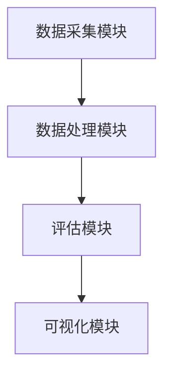
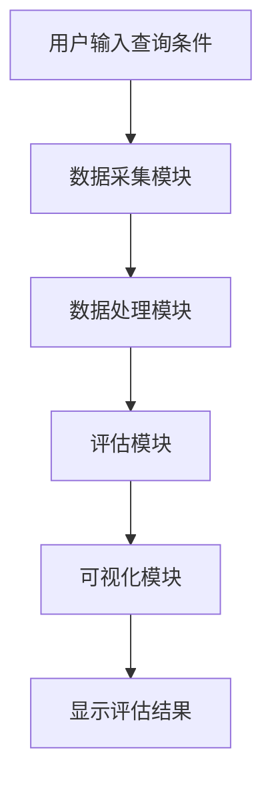

                 


# 股市估值在国际专利池价值评估中的应用

> 关键词：股市估值，国际专利池，价值评估，知识产权，专利池

> 摘要：本文探讨了股市估值在国际专利池价值评估中的应用，分析了国际专利池的定义、特点及价值评估的核心理论，详细讲解了基于股市数据的专利池价值评估方法与流程，结合数学模型与系统架构设计，展示了如何通过系统化的方法实现国际专利池的价值评估，并通过实际案例分析了评估结果的应用。文章最后总结了评估中的关键点与未来研究方向。

---

# 第1章: 股市估值与国际专利池概述

## 1.1 股市估值的基本概念
### 1.1.1 股市估值的定义与作用
股市估值是指通过对公司财务数据、市场表现和行业环境等多维度分析，估算公司股票的内在价值或市场价值。其作用在于帮助投资者判断股票的合理价格区间，辅助投资决策。股市估值的核心在于平衡市场情绪与公司基本面之间的关系。

### 1.1.2 股市估值的核心指标与方法
- **核心指标**：
  - 市盈率（P/E）：市价与每股收益的比率。
  - 市净率（P/B）：市价与每股净资产的比率。
  - 市销率（P/S）：市价与每股营业收入的比率。
  - 股息率：股息与股价的比率。
- **主要方法**：
  - 市盈率法：基于行业平均市盈率估算公司股票价值。
  - 股息贴现模型（DDM）：基于未来股息的现值估算股票价值。
  - 现金流折现模型（DCF）：基于公司未来现金流的现值估算股票价值。

### 1.1.3 股市估值与企业价值的关系
股市估值是企业价值的重要体现。企业价值不仅包括账面资产，还包括品牌、专利、技术等无形资产。股市估值通过市场行为将这些资产的价值外化，反映了市场对企业的整体价值判断。

---

## 1.2 国际专利池的定义与特点
### 1.2.1 专利池的基本概念
专利池是指一组具有战略意义的专利组合，通常由多个专利组成，涵盖某一技术领域或跨领域。专利池的核心目标是通过专利的协同作用，最大化专利组合的价值。

### 1.2.2 国际专利池的形成机制
国际专利池的形成通常基于以下几个方面：
- **技术协同**：专利池中的专利相互补充，形成完整的技术解决方案。
- **防御性布局**：企业通过收购或合作，构建防御性的专利组合，防止竞争对手发起专利诉讼。
- **商业价值**：专利池可以通过交叉授权、技术许可等方式，直接创造商业价值。

### 1.2.3 国际专利池的价值特征
- **技术领先性**：专利池通常包含行业领先的技术专利。
- **法律稳定性**：专利池中的专利经过严格的法律审查，具有较高的法律稳定性。
- **市场覆盖性**：国际专利池通常覆盖多个国家或地区的专利布局，具有广泛的市场覆盖性。

---

## 1.3 股市估值在国际专利池评估中的应用背景
### 1.3.1 股市估值与专利价值的关联性
股市估值能够反映企业的整体市场价值，而专利作为企业的重要资产，其价值变化会直接影响企业的市场估值。因此，通过分析企业的专利组合与股市表现的关系，可以间接评估专利池的价值。

### 1.3.2 国际专利池评估的市场需求
随着全球化和技术竞争的加剧，企业对专利池的需求日益增加。专利池不仅是技术竞争的武器，也是企业并购和价值评估的重要考量因素。

### 1.3.3 股市估值在专利池评估中的优势
- **数据丰富性**：股市数据具有较强的可获得性，能够提供丰富的参考指标。
- **市场敏感性**：股市估值能够快速反映市场对专利池价值的判断。
- **动态调整性**：股市估值能够实时跟踪专利池的市场表现，便于动态调整评估结果。

---

## 1.4 本章小结
本章主要介绍了股市估值的基本概念、国际专利池的定义与特点，以及股市估值在专利池评估中的应用背景。通过分析股市估值与专利池价值的关联性，为后续的理论分析和方法探讨奠定了基础。

---

# 第2章: 国际专利池价值评估的核心理论

## 2.1 专利价值评估的基本理论
### 2.1.1 专利价值的影响因素
专利价值受多种因素影响，包括技术先进性、法律稳定性、市场覆盖性、经济收益能力等。

### 2.1.2 专利价值评估的主要方法
- **市场法**：通过对比类似专利的市场交易价格，估算专利价值。
- **收益法**：基于专利的未来收益能力，估算其价值。
- **成本法**：基于专利的开发成本，估算其价值。

### 2.1.3 专利价值评估的数学模型
常用数学模型包括：
- **加权评分法**：$$V = \sum (w_i \cdot f_i)$$，其中$w_i$为权重，$f_i$为评分。
- **收益现值法**：$$V = \sum \frac{CF_i}{(1+r)^i}$$，其中$CF_i$为未来现金流，$r$为折现率。

---

## 2.2 股市估值在专利池评估中的应用理论
### 2.2.1 股市估值与专利池价值的关系
股市估值能够反映企业的整体市场价值，而专利池作为企业的重要资产，其价值变化会直接影响企业的市场估值。

### 2.2.2 股市估值在专利池评估中的理论基础
- **市场比较法**：基于相似企业的股市表现，估算专利池的市场价值。
- **收益折现法**：基于专利池的未来收益，结合股市估值模型，估算其现值。

### 2.2.3 股市估值与专利池评估的结合模型
通过结合市场法和收益法，构建综合评估模型。例如：
$$V = \alpha \cdot V_{\text{市场}} + \beta \cdot V_{\text{收益}}$$
其中，$\alpha$和$\beta$为权重系数，$V_{\text{市场}}$和$V_{\text{收益}}$分别为基于市场的评估值和基于收益的评估值。

---

## 2.3 本章小结
本章重点探讨了国际专利池价值评估的核心理论，包括专利价值的影响因素、主要评估方法以及股市估值在专利池评估中的应用理论。通过结合市场法和收益法，构建了综合评估模型，为后续的系统分析与实现奠定了理论基础。

---

# 第3章: 国际专利池价值评估的方法与流程

## 3.1 专利池评估的主要方法
### 3.1.1 市场法
通过对比类似专利的市场交易价格，估算专利池的市场价值。

### 3.1.2 收益法
基于专利池的未来收益，结合折现率，估算其现值。

### 3.1.3 成本法
基于专利池的开发成本，估算其价值。

---

## 3.2 股市估值在专利池评估中的具体应用
### 3.2.1 股价波动与专利价值的关系
股价波动可以反映市场对专利池价值的判断。例如，专利池的价值提升可能伴随着股价的上涨。

### 3.2.2 基于股价的专利池价值评估模型
通过分析股价与专利池价值的关系，构建评估模型。例如：
$$V = k \cdot P + b$$
其中，$P$为股价，$k$和$b$为模型参数。

### 3.2.3 股市数据在专利池评估中的应用
利用股市数据，如历史股价、成交量、市场情绪等，优化专利池的评估结果。

---

## 3.3 专利池评估的流程与步骤
### 3.3.1 数据收集与整理
- 收集专利池相关的专利信息。
- 收集相关企业的股价数据。

### 3.3.2 评估方法的选择与应用
根据具体情况选择合适的评估方法，如市场法或收益法。

### 3.3.3 评估结果的验证与调整
通过历史数据验证评估结果，并根据市场变化进行动态调整。

---

## 3.4 本章小结
本章详细介绍了国际专利池价值评估的主要方法，并探讨了股市估值在专利池评估中的具体应用。通过流程与步骤的分析，为后续的系统设计提供了实践指导。

---

# 第4章: 国际专利池价值评估的数学模型与公式

## 4.1 专利价值评估的数学模型
### 4.1.1 基于收益的专利价值评估模型
$$V = \sum_{i=1}^{n} \frac{CF_i}{(1+r)^i}$$
其中，$CF_i$为未来第$i$年的现金流，$r$为折现率。

### 4.1.2 基于市场比较的专利价值评估模型
$$V = \frac{P_{\text{市场}} \cdot L}{N}$$
其中，$P_{\text{市场}}$为类似专利的平均价格，$L$为目标专利的法律强度，$N$为类似专利的数量。

### 4.1.3 综合评估模型
$$V = \alpha \cdot V_{\text{市场}} + \beta \cdot V_{\text{收益}}$$
其中，$\alpha$和$\beta$为权重系数，$V_{\text{市场}}$和$V_{\text{收益}}$分别为基于市场的评估值和基于收益的评估值。

---

## 4.2 股市估值在专利池评估中的数学公式
### 4.2.1 股票价格与专利价值的关系公式
$$P = k \cdot V + b$$
其中，$P$为股价，$V$为专利池价值，$k$和$b$为模型参数。

### 4.2.2 基于股价波动的专利池价值评估公式
$$V = \sum_{i=1}^{n} \frac{P_i}{(1+r)^i}$$
其中，$P_i$为第$i$期的股价，$r$为折现率。

### 4.2.3 综合评估公式
$$V_{\text{综合}} = \lambda \cdot V_{\text{市场}} + (1-\lambda) \cdot V_{\text{收益}}$$
其中，$\lambda$为市场法权重，$V_{\text{市场}}$和$V_{\text{收益}}$分别为基于市场的评估值和基于收益的评估值。

---

## 4.3 本章小结
本章通过数学模型与公式，详细讲解了国际专利池价值评估的理论基础与实践方法。通过结合股市估值与专利池评估，构建了综合评估模型，为后续的系统设计与实现提供了理论支持。

---

# 第5章: 国际专利池价值评估的系统分析与架构设计

## 5.1 系统分析与需求分析
### 5.1.1 问题场景介绍
随着技术竞争的加剧，企业需要一种高效、准确的专利池价值评估方法。

### 5.1.2 项目目标与范围
目标是通过系统化的方法，实现国际专利池价值的自动评估。范围包括数据采集、模型构建、结果分析与可视化。

### 5.1.3 系统功能需求
- 数据采集模块：采集专利池与股市数据。
- 评估模块：基于数学模型，计算专利池价值。
- 可视化模块：展示评估结果。

---

## 5.2 系统架构设计
### 5.2.1 系统架构的模块划分
- 数据采集模块：负责采集专利池与股市数据。
- 数据处理模块：对数据进行清洗与预处理。
- 评估模块：基于数学模型，计算专利池价值。
- 可视化模块：展示评估结果。

### 5.2.2 模块之间的关系与交互
数据采集模块将数据传输给数据处理模块，处理后的数据输入评估模块，评估结果输出给可视化模块。

### 5.2.3 系统架构图（使用mermaid）


---

## 5.3 系统接口设计
### 5.3.1 数据接口设计
- 输入接口：接收专利池与股市数据。
- 输出接口：输出评估结果。

### 5.3.2 用户接口设计
- 输入：用户输入查询条件。
- 输出：显示评估结果。

### 5.3.3 系统交互流程设计


---

## 5.4 本章小结
本章通过系统分析与架构设计，明确了国际专利池价值评估系统的功能需求与模块划分。通过mermaid图展示了系统架构与交互流程，为后续的系统实现提供了清晰的指导。

---

# 第6章: 国际专利池价值评估的项目实战

## 6.1 环境安装与数据准备
### 6.1.1 开发环境的安装与配置
- 安装Python、Jupyter Notebook、Pandas、Matplotlib等工具。

### 6.1.2 数据源的获取与处理
- 从公开数据库获取专利池数据与股市数据。
- 使用Pandas进行数据清洗与预处理。

### 6.1.3 数据清洗与预处理
- 删除无效数据。
- 处理缺失值。
- 标准化数据。

---

## 6.2 系统核心实现
### 6.2.1 专利池数据的采集与存储
使用爬虫技术采集专利池数据，并存储在数据库中。

### 6.2.2 股市数据的获取与处理
通过API获取股市数据，并进行清洗与预处理。

### 6.2.3 评估模型的实现与应用
基于数学模型，实现专利池价值评估，并进行结果分析。

---

## 6.3 代码实现与解读
### 6.3.1 数据处理代码
```python
import pandas as pd

# 读取专利池数据
patent_data = pd.read_csv('patent.csv')

# 读取股市数据
stock_data = pd.read_csv('stock.csv')

# 数据清洗
patent_data.dropna(inplace=True)
stock_data.dropna(inplace=True)
```

### 6.3.2 评估模型实现
```python
def calculate_value(patent_data, stock_data):
    # 计算专利池价值
    V_market = patent_data['市场价值'].mean()
    V_revenue = patent_data['收益'].mean()
    # 综合评估模型
    lambda_ = 0.6
    V_total = lambda_ * V_market + (1 - lambda_) * V_revenue
    return V_total

# 调用函数
V_total = calculate_value(patent_data, stock_data)
print("专利池总价值：", V_total)
```

### 6.3.3 结果分析与可视化
```python
import matplotlib.pyplot as plt

plt.plot(stock_data['日期'], stock_data['股价'])
plt.title('股价波动与专利池价值关系')
plt.xlabel('日期')
plt.ylabel('股价')
plt.show()
```

---

## 6.4 本章小结
本章通过项目实战，展示了如何将理论应用于实际。通过Python代码实现数据处理、模型构建与结果分析，验证了理论的可行性和实用性。

---

# 第7章: 总结与扩展阅读

## 7.1 本章总结
本文系统地探讨了股市估值在国际专利池价值评估中的应用，从理论到实践，详细介绍了评估方法与流程，并通过实际案例分析了评估结果的应用。

## 7.2 最佳实践 tips
- 数据采集与清洗是评估的关键步骤。
- 选择合适的评估方法与模型。
- 结合市场动态调整评估结果。

## 7.3 注意事项
- 数据的准确性和完整性。
- 模型的适用性与局限性。
- 市场风险与法律风险。

## 7.4 拓展阅读
- 《专利评估的数学模型与方法》
- 《股市分析与投资策略》
- 《知识产权管理与战略》

---

# 作者：AI天才研究院 & 禅与计算机程序设计艺术

---

以上是文章的完整内容，涵盖了从理论到实践的各个方面，结合了数学模型、系统架构与实际代码示例，为读者提供了全面的指导与参考。

