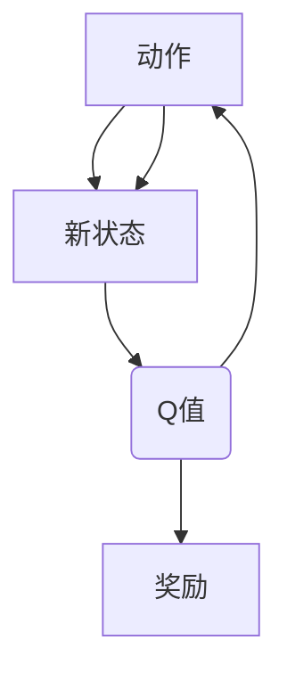
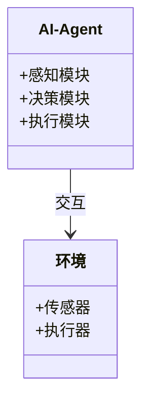
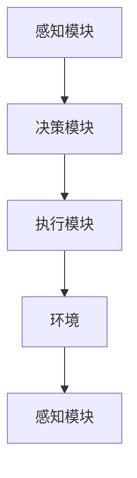
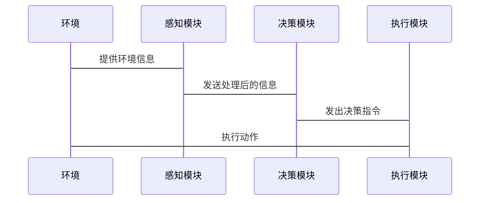

                 


# 《设计可扩展的AI Agent架构》

---

## 关键词：AI Agent，可扩展性，架构设计，模块化，算法原理，系统架构

---

## 摘要：

AI Agent（人工智能代理）是一种能够感知环境、自主决策并执行任务的智能实体。在设计AI Agent架构时，可扩展性是确保其能够适应复杂应用场景和未来需求的关键因素。本文从AI Agent的基本概念出发，深入分析其内部模块化设计、可扩展性算法实现、系统架构优化以及实际项目案例，全面探讨如何设计出高效、可扩展的AI Agent架构。通过结合理论与实践，本文为读者提供了从理论到实践的设计方法和优化策略。

---

# 正文

## 第1章：AI Agent概述与可扩展性需求

### 1.1 AI Agent的基本概念

#### 1.1.1 AI Agent的定义与特点

AI Agent是一种能够感知环境、自主决策并执行任务的智能实体。它可以是一个软件程序、一个机器人，或者是任何能够与环境交互的智能系统。AI Agent的核心特点包括：

- **自主性**：能够自主决策，无需外部干预。
- **反应性**：能够实时感知环境并做出响应。
- **目标导向性**：具有明确的目标，能够优化行为以实现目标。
- **可扩展性**：能够根据需求扩展其功能和性能。

#### 1.1.2 AI Agent的分类与应用场景

AI Agent可以根据功能、智能水平和应用场景进行分类：

- **按功能分类**：分为简单反射型Agent、基于模型的反射型Agent、目标驱动型Agent、效用驱动型Agent等。
- **按智能水平分类**：分为反应式AI Agent、基于知识的AI Agent、学习型AI Agent等。
- **按应用场景分类**：分为服务机器人、智能助手、自动驾驶、智能推荐系统等。

#### 1.1.3 可扩展性在AI Agent设计中的重要性

随着AI技术的快速发展，AI Agent的应用场景日益复杂，对可扩展性的要求也越来越高。可扩展性设计能够使AI Agent在面对更大规模、更复杂任务时依然保持高效运行，同时支持功能扩展和性能优化。

---

### 1.2 可扩展性设计的核心问题

#### 1.2.1 AI Agent扩展性需求的背景

随着AI Agent的应用范围不断扩大，其需要处理的数据量和任务复杂性也在不断增加。传统的单体架构难以满足这些需求，因此，设计可扩展的AI Agent架构成为必然趋势。

#### 1.2.2 可扩展性设计的目标与关键挑战

**目标**：
- 支持功能扩展：能够方便地添加新的功能模块。
- 高可用性：在扩展过程中不影响系统正常运行。
- 高性能：能够处理更大的数据量和更复杂的任务。

**挑战**：
- 模块之间的耦合性问题。
- 资源分配与调度问题。
- 并发处理与通信问题。

#### 1.2.3 可扩展性与系统性能的关系

可扩展性设计不仅关注系统性能的提升，还关注系统在扩展过程中的稳定性与可靠性。通过合理设计架构，可以在扩展过程中实现性能的线性增长，同时避免系统崩溃或性能下降。

---

## 第2章：AI Agent的内部架构与模块化设计

### 2.1 AI Agent的感知、决策与执行模块

#### 2.1.1 感知模块的功能与实现

感知模块是AI Agent与环境交互的接口，负责获取环境信息并进行初步处理。常见的感知方式包括：

- **传感器输入**：如摄像头、麦克风等设备获取的数据。
- **API调用**：通过调用外部服务获取数据。
- **事件监听**：通过订阅事件的方式获取实时信息。

感知模块的关键在于数据的准确性和实时性。

#### 2.1.2 决策模块的算法选择

决策模块负责根据感知到的信息做出决策。常用的算法包括：

- **强化学习（Reinforcement Learning）**：通过奖励机制优化决策策略。
- **基于规则的决策**：通过预定义的规则进行决策。
- **基于知识图谱的推理**：通过知识推理得出最优决策。

#### 2.1.3 执行模块的实现方式

执行模块负责将决策转化为具体行动。常见的实现方式包括：

- **调用外部服务**：如调用云服务、第三方API等。
- **控制机器人**：如通过舵机、电机等硬件执行动作。
- **数据存储**：将决策结果存储到数据库中。

---

### 2.2 模块化设计的原则与方法

#### 2.2.1 模块化设计的核心原则

- **单一职责原则**：每个模块只负责一个核心功能。
- **松耦合设计**：模块之间依赖关系松散，便于扩展和维护。
- **可替换性**：模块可以被新的模块替换而不影响系统整体。

#### 2.2.2 模块间通信机制的设计

- **消息队列**：如Kafka、RabbitMQ等，用于异步通信。
- **远程过程调用（RPC）**：如gRPC，用于模块间的同步通信。
- **事件发布-订阅模式**：模块通过发布事件通知其他模块。

#### 2.2.3 模块化设计的优缺点分析

**优点**：
- 便于功能扩展和维护。
- 提高系统的可维护性和可测试性。
- 便于团队协作开发。

**缺点**：
- 增加了系统设计的复杂性。
- 模块间的通信开销可能影响性能。

---

### 2.3 模块化架构的可扩展性实现

#### 2.3.1 模块化架构的扩展性优势

- 支持功能模块的动态加载与卸载。
- 便于在不修改其他模块的情况下扩展功能。
- 提高系统的灵活性和适应性。

#### 2.3.2 模块化架构的实现方式

- **微服务架构**：将AI Agent的功能模块化为多个微服务，通过API进行通信。
- **插件式架构**：通过插件的方式扩展系统功能。
- **事件驱动架构**：通过事件驱动的方式实现模块间的松耦合通信。

#### 2.3.3 模块化架构的优化策略

- **模块间的依赖管理**：使用依赖注入（DI）的方式管理模块间的依赖关系。
- **模块的负载均衡**：通过负载均衡技术优化模块的性能。
- **模块的容错设计**：通过断路器等技术实现模块的容错能力。

---

## 第3章：AI Agent可扩展性设计的算法基础

### 3.1 强化学习算法的可扩展性实现

#### 3.1.1 强化学习的基本原理

强化学习是一种通过试错机制优化决策策略的算法。其基本原理是通过与环境的交互获得奖励，从而优化动作选择策略。

**数学模型**：
- **状态空间（S）**：环境的所有可能状态。
- **动作空间（A）**：代理在每个状态下可以执行的所有动作。
- **奖励函数（R）**：代理执行某个动作后获得的奖励。

**算法流程图**：



#### 3.1.2 强化学习在AI Agent中的应用

- **自动驾驶**：通过强化学习优化自动驾驶汽车的决策策略。
- **游戏AI**：通过强化学习训练游戏代理在复杂环境中做出最优决策。

#### 3.1.3 强化学习的扩展性实现

- **分布式训练**：通过分布式计算加速强化学习的训练过程。
- **多智能体协作**：在多智能体环境中，通过强化学习实现智能体之间的协作与竞争。

---

### 3.2 图神经网络的可扩展性应用

#### 3.2.1 图神经网络的基本原理

图神经网络是一种处理图结构数据的深度学习模型。其基本原理是通过聚合邻居节点的信息，逐步传播信息到目标节点。

**数学模型**：

$$
h_v = \sigma\left(\sum_{u \in N(v)} W_{vu} x_u\right)
$$

其中，$h_v$ 表示节点 $v$ 的隐藏状态，$N(v)$ 表示节点 $v$ 的邻居节点，$W_{vu}$ 表示权重矩阵，$\sigma$ 表示激活函数。

#### 3.2.2 图神经网络在AI Agent中的应用

- **社交网络分析**：通过图神经网络分析社交网络中的关系。
- **推荐系统**：通过图神经网络优化推荐系统的推荐效果。

#### 3.2.3 图神经网络的扩展性实现

- **分布式计算**：通过分布式计算优化图神经网络的训练过程。
- **模型压缩**：通过模型压缩技术减少图神经网络的计算开销。

---

## 第4章：AI Agent系统架构的优化设计

### 4.1 问题场景介绍

#### 4.1.1 系统需求分析

- **功能性需求**：AI Agent需要具备感知、决策和执行功能。
- **性能需求**：系统需要支持高并发和大规模数据处理。
- **扩展性需求**：系统需要支持功能扩展和性能优化。

#### 4.1.2 系统约束条件

- **资源限制**：系统需要在有限的计算资源下运行。
- **实时性要求**：系统需要在规定的时间内完成任务。
- **安全性要求**：系统需要保证数据的安全性和隐私性。

---

### 4.2 系统架构设计

#### 4.2.1 领域模型设计

**领域模型类图**：



#### 4.2.2 系统架构设计

**系统架构图**：



#### 4.2.3 接口设计与交互流程

**系统交互流程图**：



---

## 第5章：AI Agent项目实战

### 5.1 环境安装与配置

#### 5.1.1 系统环境要求

- **操作系统**：Linux/Windows/MacOS
- **Python版本**：3.8以上
- **依赖库安装**：如numpy、pandas、scikit-learn、tensorflow等。

#### 5.1.2 开发工具配置

- **IDE选择**：推荐使用PyCharm、VS Code等。
- **版本控制工具**：推荐使用Git进行代码管理。

---

### 5.2 核心代码实现

#### 5.2.1 感知模块的实现

```python
class 感知模块:
    def __init__(self):
        self.传感器 = 传感器()

    def 获取环境信息(self):
        return self.传感器.读取数据()
```

#### 5.2.2 决策模块的实现

```python
class 决策模块:
    def __init__(self):
        self.策略 = 强化学习算法()

    def 执行决策(self, 状态):
        return self.策略.选择动作(状态)
```

#### 5.2.3 执行模块的实现

```python
class 执行模块:
    def __init__(self):
        self.执行器 = 执行器()

    def 执行动作(self, 动作):
        self.执行器.执行(动作)
```

---

### 5.3 代码应用解读与分析

- **模块间的依赖关系**：感知模块依赖传感器，决策模块依赖强化学习算法，执行模块依赖执行器。
- **代码的可扩展性**：通过接口设计，可以方便地替换不同的传感器、算法和执行器。

---

### 5.4 实际案例分析与详细讲解

#### 5.4.1 案例背景

假设我们设计一个智能助手AI Agent，用于智能家居的控制。AI Agent需要能够感知家庭环境（如温度、湿度等），通过决策模块决定是否开启空调、加湿器等设备。

#### 5.4.2 系统实现

```python
class 智能家居环境:
    def __init__(self):
        self.温度传感器 = 温度传感器()
        self.湿度传感器 = 湿度传感器()
        self.空调 = 空调()
        self.加湿器 = 加湿器()

class 感知模块:
    def __init__(self, 环境):
        self.环境 = 环境

    def 获取环境信息(self):
        return {
            '温度': self.环境.温度传感器.读取数据(),
            '湿度': self.环境.湿度传感器.读取数据()
        }

class 决策模块:
    def __init__(self):
        self.目标温度 = 25  # 默认目标温度

    def 决策是否开启空调(self, 状态):
        if 状态['温度'] > self.目标温度:
            return True
        else:
            return False

class 执行模块:
    def __init__(self):
        pass

    def 执行动作(self, 动作):
        if 动作 == '开启空调':
            self.开启空调()
        elif 动作 == '关闭空调':
            self.关闭空调()

    def 开启空调(self):
        print("空调已开启")

    def 关闭空调(self):
        print("空调已关闭")
```

---

## 第6章：最佳实践、小结与注意事项

### 6.1 最佳实践

- **模块化设计**：尽量将功能模块化，便于扩展和维护。
- **分布式架构**：在处理大规模数据时，采用分布式架构可以提高系统的扩展性。
- **容错设计**：在系统设计中加入容错机制，提高系统的健壮性。

### 6.2 小结

本文从AI Agent的基本概念出发，深入分析了其内部模块化设计、可扩展性算法实现、系统架构优化以及实际项目案例。通过结合理论与实践，本文为读者提供了从理论到实践的设计方法和优化策略。

### 6.3 注意事项

- **性能优化**：在扩展系统时，要注意系统性能的优化，避免因扩展而影响系统的响应速度。
- **安全性设计**：在设计AI Agent时，要重视数据的安全性和隐私性。
- **可维护性**：在设计系统架构时，要注重系统的可维护性和可测试性。

---

## 作者信息

作者：AI天才研究院/AI Genius Institute & 禅与计算机程序设计艺术/Zen And The Art of Computer Programming

--- 

**[End of Document]**

