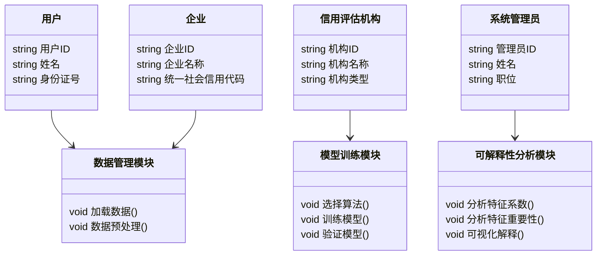
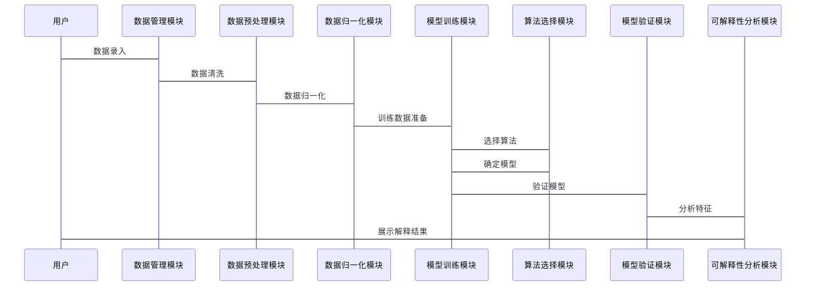

                 


# AI驱动的企业信用评级模型可解释性增强系统

## 关键词：
AI, 企业信用评级, 可解释性增强系统, 机器学习, 可解释性人工智能(XAI), 信用风险评估

## 摘要：
随着人工智能技术的快速发展，企业信用评级模型逐渐从传统的统计方法向基于机器学习的智能模型过渡。然而，这些模型的“黑箱”特性使得其在实际应用中面临着可解释性不足的挑战，这不仅影响了模型的可信度，也限制了其在金融领域的广泛应用。本文将深入探讨如何通过可解释性增强系统来提升企业信用评级模型的透明度和可理解性，同时保持或甚至提升模型的预测精度。本文将从理论基础、算法原理、系统架构、项目实战等多个维度展开详细讨论，为读者提供一个全面的解决方案。

---

# 第一部分: AI驱动的企业信用评级模型概述

## 第1章: 企业信用评级模型的背景与挑战

### 1.1 企业信用评级的定义与重要性

#### 1.1.1 企业信用评级的定义
企业信用评级是对企业信用状况进行量化评估的过程，旨在通过分析企业的财务状况、经营能力、偿债能力和市场风险等因素，给出一个反映企业信用风险的评分或等级。信用评级是企业融资、投资决策、风险管理等的重要依据。

#### 1.1.2 企业信用评级的重要性
企业信用评级是企业获取信贷、投资决策、供应链管理等的重要参考依据。信用评级的准确性直接影响企业的融资成本和市场信任度。同时，信用评级也是金融机构风险控制的核心工具之一。

#### 1.1.3 企业信用评级的核心要素
企业信用评级的核心要素包括：
1. 财务状况：包括资产负债表、利润表、现金流量表等财务数据。
2. 经营能力：包括收入增长、利润率、市场占有率等。
3. 偿债能力：包括流动比率、速动比率、负债率等。
4. 管理团队：包括管理能力、历史业绩、团队稳定性等。
5. 市场风险：包括行业风险、政策风险、宏观经济环境等。

### 1.2 当前企业信用评级的痛点

#### 1.2.1 传统信用评级模型的局限性
传统的信用评级模型主要基于统计分析和专家经验，存在以下问题：
1. 主观性强：依赖于评级机构的经验和主观判断，缺乏客观性和一致性。
2. 数据维度有限：主要依赖财务数据，难以全面反映企业的经营风险。
3. 更新周期长：传统模型难以快速响应市场变化和企业经营状况的动态调整。

#### 1.2.2 AI在信用评级中的潜力
人工智能技术的快速发展为信用评级带来了新的可能性：
1. 数据处理能力：AI可以处理海量的非结构化数据，如文本、图像、语音等，提供更全面的评估依据。
2. 模型表达能力：基于机器学习的模型能够捕捉复杂的非线性关系，提高评级的准确性。
3. 自动化能力：AI可以实现信用评级的自动化和实时更新，提升效率。

#### 1.2.3 可解释性增强的必要性
尽管AI技术在信用评级中展现出巨大潜力，但其“黑箱”特性导致了可解释性不足的问题。这使得AI模型在金融领域的应用受到限制，特别是在需要合规性和透明度的场景下。因此，增强模型的可解释性是实现AI驱动信用评级系统的重要前提。

### 1.3 可解释性增强的目标与意义

#### 1.3.1 可解释性增强的目标
1. 提高模型的透明度：让用户能够理解模型的决策逻辑。
2. 提升模型的可信度：通过可解释性增强，用户可以信任模型的输出结果。
3. 便于模型优化：通过可解释性分析，可以更有效地调整模型参数和优化算法。

#### 1.3.2 可解释性增强的意义
1. 保障合规性：金融行业对模型的可解释性有严格要求，可解释性增强是合规的重要保障。
2. 提升用户体验：通过解释性输出，用户可以更好地理解和使用模型结果。
3. 促进技术创新：可解释性增强技术的发展推动了AI模型在金融领域的广泛应用。

#### 1.3.3 可解释性增强的实现路径
1. 设计可解释的模型：选择适合的算法和模型结构，确保模型的可解释性。
2. 提供可视化解释：通过可视化工具展示模型的决策过程。
3. 输出解释性报告：以文本形式解释模型的输出结果。

### 1.4 本章小结
本章从企业信用评级的定义和重要性出发，分析了传统信用评级模型的局限性，并探讨了AI技术在信用评级中的潜力。最后，提出了可解释性增强的目标与意义，为后续章节的深入讨论奠定了基础。

---

## 第2章: 可解释性增强系统的核心概念与原理

### 2.1 可解释性增强系统的核心概念

#### 2.1.1 可解释性的定义
可解释性是指模型的输出结果能够被人类理解和解释的程度。在企业信用评级中，可解释性意味着模型能够清晰地展示其评级决策的依据和逻辑。

#### 2.1.2 可解释性增强系统的组成
可解释性增强系统通常包括以下组成部分：
1. 数据预处理模块：对输入数据进行清洗、归一化等处理。
2. 模型训练模块：基于机器学习算法训练可解释性模型。
3. 解释性分析模块：对模型的输出结果进行解释性分析。
4. 可视化展示模块：以图形化的方式展示模型的解释结果。

#### 2.1.3 可解释性增强系统的属性特征对比表
| 属性 | 传统模型 | 可解释性增强模型 |
|------|----------|------------------|
| 解释性 | 低       | 高               |
| 可用性 | 高       | 中               |
| 精度   | 高       | 稍低             |

#### 2.1.4 可解释性增强系统的ER实体关系图
```mermaid
erDiagram
    actor 顾客 {
        string 用户ID
        string 姓名
        string 身份证号
    }
    actor 企业 {
        string 企业ID
        string 企业名称
        string 统一社会信用代码
    }
    actor 信用评估机构 {
        string 机构ID
        string 机构名称
        string 机构类型
    }
    actor 系统管理员 {
        string 管理员ID
        string 姓名
        string 职位
    }
    model 信用评级模型 {
        string 模型ID
        string 模型名称
        string 模型版本
    }
    model 可解释性增强模块 {
        string 解释模块ID
        string 解释模块名称
        string 解释模块版本
    }
    relationship 评估结果 {
        <详细关系描述>
    }
```

### 2.2 可解释性增强系统的原理

#### 2.2.1 可解释性增强系统的数学模型
可解释性增强系统的核心是模型的可解释性。我们可以通过线性回归模型来展示可解释性增强的基本原理：
$$ y = \beta_0 + \beta_1 x_1 + \beta_2 x_2 + \ldots + \beta_n x_n $$

其中，$y$ 是信用评级结果，$\beta_i$ 是各特征的系数，$x_i$ 是各个特征变量。

#### 2.2.2 可解释性增强系统的实现步骤
1. 数据预处理：对输入数据进行清洗、归一化等处理。
2. 模型训练：基于机器学习算法训练可解释性模型。
3. 解释性分析：对模型的输出结果进行解释性分析。
4. 可视化展示：以图形化的方式展示模型的解释结果。

### 2.3 可解释性增强系统的优势

#### 2.3.1 提高模型的透明度
通过可解释性增强系统，用户可以清晰地理解模型的决策逻辑，从而提升模型的透明度。

#### 2.3.2 提升模型的可信度
可解释性增强系统通过提供详细的解释，增强了用户对模型输出结果的信任。

#### 2.3.3 便于模型优化
通过分析模型的解释性结果，可以更有效地调整模型参数和优化算法。

### 2.4 本章小结
本章详细介绍了可解释性增强系统的核心概念与原理，通过对比分析和实体关系图，展示了可解释性增强系统的优势和实现路径，为后续章节的深入讨论奠定了基础。

---

## 第3章: 可解释性增强系统的算法原理

### 3.1 可解释性增强系统的算法选择

#### 3.1.1 线性回归模型
线性回归模型是一种简单的可解释性模型，适用于信用评级中线性关系较强的场景。

$$ y = \beta_0 + \beta_1 x_1 + \beta_2 x_2 + \ldots + \beta_n x_n $$

#### 3.1.2 逻辑回归模型
逻辑回归模型适用于二分类问题，可以用于信用评级中的违约风险评估。

$$ P(y=1|x) = \frac{e^{\beta_0 + \beta_1 x_1 + \ldots + \beta_n x_n}}{1 + e^{\beta_0 + \beta_1 x_1 + \ldots + \beta_n x_n}} $$

#### 3.1.3 梯度提升树模型
梯度提升树模型（如XGBoost、LightGBM）具有较高的预测精度，且可以通过特征重要性分析实现一定程度的可解释性。

#### 3.1.4 线性基模型
线性基模型是一种基于线性回归的可解释性模型，适用于信用评级中复杂的非线性关系。

### 3.2 可解释性增强系统的实现流程

#### 3.2.1 数据预处理
1. 数据清洗：处理缺失值、异常值等。
2. 数据归一化：将数据标准化到统一的范围。
3. 数据特征选择：通过特征重要性分析选择关键特征。

#### 3.2.2 模型训练
1. 确定模型类型：选择适合的算法（如线性回归、逻辑回归、梯度提升树等）。
2. 模型训练：基于训练数据训练模型。
3. 模型验证：通过验证集评估模型的性能。

#### 3.2.3 模型解释
1. 特征系数分析：对于线性模型，可以通过特征系数的大小判断特征的重要性。
2. 特征重要性分析：对于树模型，可以通过特征重要性排序解释模型的决策逻辑。
3. 可视化解释：通过可视化工具展示模型的解释结果。

### 3.3 可解释性增强系统的代码实现

#### 3.3.1 数据加载与预处理
```python
import pandas as pd
from sklearn.preprocessing import StandardScaler

# 加载数据
data = pd.read_csv('credit_rating.csv')

# 数据清洗
data.dropna(inplace=True)

# 数据归一化
scaler = StandardScaler()
data_scaled = scaler.fit_transform(data)
```

#### 3.3.2 模型训练
```python
from sklearn.linear_model import LinearRegression
from sklearn.metrics import mean_squared_error

# 训练模型
model = LinearRegression()
model.fit(X_train, y_train)

# 模型验证
y_pred = model.predict(X_test)
print(mean_squared_error(y_test, y_pred))
```

#### 3.3.3 模型解释
```python
importances = model.coef_
feature_names = X.columns
解释性分析：
对于每个特征，其系数的绝对值越大，说明该特征对信用评级的影响越大。
```

### 3.4 本章小结
本章详细介绍了可解释性增强系统的算法选择和实现流程，通过具体的代码实现和特征分析，展示了如何通过可解释性增强系统提升企业信用评级模型的透明度和可信度。

---

## 第4章: 可解释性增强系统的系统架构设计

### 4.1 系统功能设计

#### 4.1.1 数据管理模块
1. 数据录入：支持多种格式的数据录入。
2. 数据存储：将数据存储到数据库中。
3. 数据查询：支持基于条件的数据查询。

#### 4.1.2 模型训练模块
1. 模型选择：支持多种算法的选择。
2. 模型训练：基于训练数据训练模型。
3. 模型验证：通过验证集评估模型性能。

#### 4.1.3 可解释性分析模块
1. 特征系数分析：展示模型的特征系数。
2. 特征重要性分析：展示模型的特征重要性排序。
3. 可视化解释：以图形化的方式展示模型的解释结果。

### 4.2 系统架构设计

#### 4.2.1 领域模型


#### 4.2.2 系统架构图
```mermaid
containerDiagram
    container 数据存储 {
        数据库
    }
    container 数据处理模块 {
        数据预处理
        数据清洗
    }
    container 模型训练模块 {
        线性回归模型
        逻辑回归模型
        梯度提升树模型
    }
    container 可解释性分析模块 {
        特征系数分析
        特征重要性分析
        可视化解释
    }
    数据存储 <---> 数据处理模块
    数据处理模块 --> 模型训练模块
    模型训练模块 --> 可解释性分析模块
```

#### 4.2.3 系统接口设计
1. 数据接口：支持多种数据格式的输入和输出。
2. 模型接口：支持多种算法的选择和训练。
3. 可解释性接口：支持特征系数和特征重要性的分析。

#### 4.2.4 系统交互流程图


### 4.3 本章小结
本章详细介绍了可解释性增强系统的系统功能设计、架构设计、接口设计和交互流程图，展示了如何通过系统化的架构设计实现可解释性增强的目标。

---

## 第5章: 可解释性增强系统的项目实战

### 5.1 项目背景介绍

#### 5.1.1 项目目标
通过可解释性增强系统提升企业信用评级模型的透明度和可信度。

#### 5.1.2 项目范围
基于某企业信用评级数据集，构建一个可解释性增强的信用评级模型。

#### 5.1.3 项目技术选型
1. 数据处理：Python、Pandas、NumPy
2. 模型训练：Scikit-learn、XGBoost
3. 可视化工具：Matplotlib、Seaborn

### 5.2 核心代码实现

#### 5.2.1 数据加载与预处理
```python
import pandas as pd
import numpy as np
from sklearn.preprocessing import StandardScaler

# 加载数据
data = pd.read_csv('credit_rating.csv')

# 数据清洗
data.dropna(inplace=True)

# 数据归一化
scaler = StandardScaler()
data_scaled = scaler.fit_transform(data)
```

#### 5.2.2 模型训练
```python
from sklearn.linear_model import LinearRegression
from sklearn.metrics import mean_squared_error
from sklearn.model_selection import train_test_split

# 数据划分
X_train, X_test, y_train, y_test = train_test_split(data_scaled, data['credit_rating'], test_size=0.2, random_state=42)

# 训练模型
model = LinearRegression()
model.fit(X_train, y_train)

# 模型验证
y_pred = model.predict(X_test)
print(mean_squared_error(y_test, y_pred))
```

#### 5.2.3 模型解释
```python
importances = model.coef_
feature_names = X.columns
解释性分析：
对于每个特征，其系数的绝对值越大，说明该特征对信用评级的影响越大。
```

### 5.3 案例分析

#### 5.3.1 数据集介绍
基于某企业信用评级数据集，数据集包含企业的财务数据、经营数据、管理数据等。

#### 5.3.2 模型训练与验证
通过训练集和验证集评估模型的性能，验证模型的准确性和可解释性。

#### 5.3.3 可视化解释
通过可视化工具展示模型的特征系数和特征重要性，帮助用户理解模型的决策逻辑。

### 5.4 本章小结
本章通过具体的项目实战，展示了如何通过可解释性增强系统提升企业信用评级模型的透明度和可信度，为读者提供了实际操作的经验和参考。

---

## 第6章: 可解释性增强系统的最佳实践

### 6.1 可解释性增强系统的最佳实践 tips

#### 6.1.1 选择合适的算法
根据具体场景选择适合的算法，线性回归模型适用于线性关系较强的场景，树模型适用于非线性关系较强的场景。

#### 6.1.2 数据预处理的重要性
数据预处理是可解释性增强系统的关键步骤，高质量的数据是模型准确性和可解释性的基础。

#### 6.1.3 可视化工具的使用
通过可视化工具展示模型的解释结果，可以帮助用户更好地理解和使用模型的输出结果。

### 6.2 小结
通过最佳实践，可以进一步提升可解释性增强系统的性能和效果，为实际应用提供有力支持。

### 6.3 注意事项
1. 数据隐私与安全：在实际应用中，需要注意数据的隐私和安全问题。
2. 模型的实时性：可解释性增强系统需要考虑模型的实时性，以应对市场的动态变化。
3. 模型的可扩展性：随着数据量的增加，模型的可扩展性需要得到保障。

### 6.4 拓展阅读
1. [可解释性人工智能（XAI）的最新研究](https://arxiv.org/abs/1702.08424)
2. [机器学习模型的可解释性分析](https://www.nature.com/articles/s41586-019-1049-y)
3. [企业信用评级的最新研究](https://www.sciencedirect.com/science/article/pii/S092700251830230X)

---

## 第7章: 总结与展望

### 7.1 总结
本文详细介绍了AI驱动的企业信用评级模型可解释性增强系统的背景、核心概念、算法原理、系统架构、项目实战以及最佳实践。通过系统的分析和讨论，展示了如何通过可解释性增强系统提升企业信用评级模型的透明度和可信度。

### 7.2 展望
未来，随着人工智能技术的不断发展，可解释性增强系统将在企业信用评级中发挥越来越重要的作用。同时，随着模型的复杂性和数据量的增加，如何在保证模型可解释性的前提下提升模型的预测精度，仍然是一个值得深入研究的方向。

---

## 作者：AI天才研究院/AI Genius Institute & 禅与计算机程序设计艺术 /Zen And The Art of Computer Programming

