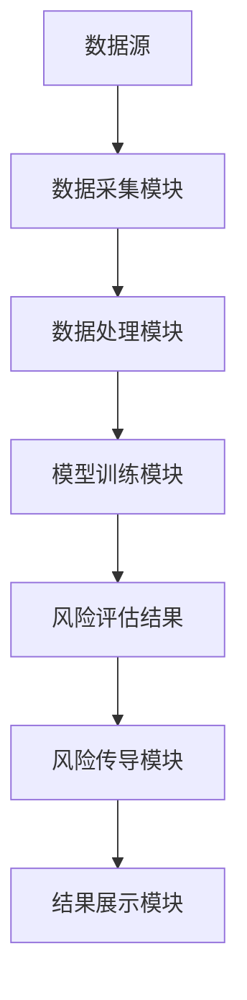
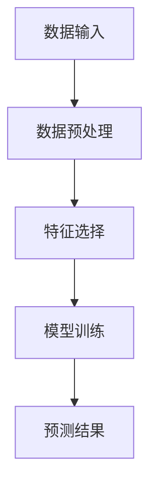
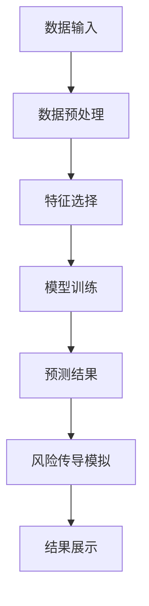

                 


# AI驱动的企业信用风险传导模拟系统

## 关键词：
- 企业信用风险
- AI驱动
- 风险传导模拟
- 机器学习
- 系统架构设计

## 摘要：
在当前经济全球化和金融化的背景下，企业信用风险的评估和管理变得至关重要。传统的信用风险评估方法存在效率低下、覆盖面有限等问题，难以应对日益复杂的市场环境。基于人工智能（AI）的信用风险传导模拟系统能够通过大数据分析和机器学习算法，实时捕捉和预测企业的信用风险，帮助企业做出更明智的决策。本文将详细介绍AI驱动的企业信用风险传导模拟系统的构建过程，包括系统设计、算法实现、项目实战等部分，为读者提供全面的技术指导。

---

## 第1章: 企业信用风险概述

### 1.1 信用风险的基本概念
信用风险是指企业在借贷活动中，由于债务人或交易对手无法履行其义务而给债权人造成损失的可能性。信用风险的核心在于评估企业的还款能力和还款意愿。

#### 1.1.1 信用风险的定义
信用风险是企业在经济活动中因债务人或交易对手违约而可能导致的损失。这种风险广泛存在于银行、投资、供应链管理等领域。

#### 1.1.2 信用风险的分类
信用风险可以分为以下几类：
1. **单家企业风险**：由于单家企业自身经营状况不佳或财务问题导致的违约风险。
2. **行业风险**：由于整个行业不景气或政策变化导致的系统性风险。
3. **系统性风险**：由于经济周期波动、金融危机等宏观因素导致的广泛性风险。

#### 1.1.3 信用风险对企业的影响
信用风险可能对企业造成直接的经济损失，包括资产损失、声誉损失以及业务机会的丧失。此外，信用风险还可能引发连锁反应，影响整个供应链或金融市场的稳定。

### 1.2 企业信用风险的传导机制
信用风险的传导机制是指风险从一家企业向其他相关企业和金融机构扩散的过程。这种传导机制可能通过供应链、金融市场或社会网络等多个渠道进行。

#### 1.2.1 风险传导的定义
风险传导是指信用风险从一家企业向其他相关企业或金融机构传播的过程。这种传导可能通过直接的债务关系、供应链上下游关系或金融市场中的投资关系进行。

#### 1.2.2 风险传导的路径
风险传导的路径主要包括以下几种：
1. **供应链传导**：一家企业的违约可能导致其供应商或客户的连锁违约。
2. **金融市场传导**：企业违约可能引发金融市场的波动，影响投资者信心。
3. **声誉传导**：一家企业的违约可能影响整个行业的声誉，导致其他企业融资成本上升。

#### 1.2.3 传导机制的影响因素
风险传导的影响因素包括企业的财务状况、行业结构、市场环境、政策法规等。这些因素可能通过多种渠道影响信用风险的传导路径和程度。

### 1.3 AI在信用风险评估中的应用
人工智能技术的快速发展为信用风险评估提供了新的工具和方法。通过大数据分析和机器学习算法，可以更准确地识别和预测信用风险。

#### 1.3.1 AI技术在信用评估中的优势
1. **数据处理能力**：AI能够处理海量数据，包括企业的财务数据、市场数据和社交数据。
2. **预测能力**：通过机器学习算法，AI可以预测企业的信用状况和违约概率。
3. **实时性**：AI系统可以实时更新数据，提供实时的信用评估结果。

#### 1.3.2 AI驱动信用风险评估的现状
目前，AI技术已经在信用风险评估中得到了广泛应用。例如，银行和金融机构利用AI技术进行客户信用评分、风险预警和欺诈检测。

#### 1.3.3 系统的目标与意义
本系统的目标是通过AI技术构建一个信用风险传导模拟系统，帮助企业识别和管理信用风险，降低企业的财务损失和经营风险。

---

## 第2章: 企业信用风险传导模拟系统的核心概念

### 2.1 核心概念与联系
在构建信用风险传导模拟系统之前，我们需要明确系统的核心概念及其之间的联系。

#### 2.1.1 核心概念原理
信用风险传导模拟系统的核心概念包括企业信用评分、风险传导路径、风险预测模型等。这些概念通过数据流和逻辑关系相互关联。

#### 2.1.2 概念属性特征对比表
以下是一个概念属性特征对比表，用于帮助读者理解各个核心概念的特点：

| 概念       | 属性         | 特征                         |
|------------|--------------|------------------------------|
| 企业信用评分 | 数据来源     | 财务数据、市场数据、社交数据 |
|            | 计算方法     | 机器学习模型                 |
|            | 输出结果     | 信用评分（0-100）           |
| 风险传导路径 | 路径类型     | 供应链、金融市场、声誉传导  |
|            | 影响因素     | 企业财务状况、行业结构、政策 |

#### 2.1.3 ER实体关系图
以下是信用风险传导模拟系统的ER实体关系图：

```mermaid
er
actor:
    User
    系统
    数据源

entity:
    企业
    风险评估结果
    风险传导路径

relationship:
    用户 -> 数据源: 提供数据
    企业 -> 风险评估结果: 生成评估结果
    风险评估结果 -> 风险传导路径: 确定传导路径
```

### 2.2 系统架构设计
系统架构设计是构建信用风险传导模拟系统的关键步骤。

#### 2.2.1 系统模块划分
信用风险传导模拟系统主要包括以下几个模块：
1. 数据采集模块：负责采集企业的财务数据、市场数据和社交数据。
2. 数据处理模块：对采集的数据进行清洗、转换和预处理。
3. 模型训练模块：利用机器学习算法训练信用风险预测模型。
4. 风险传导模块：模拟信用风险的传导路径和影响范围。
5. 结果展示模块：将模拟结果以可视化形式展示给用户。

#### 2.2.2 系统架构图
以下是信用风险传导模拟系统的架构图：



#### 2.2.3 系统功能设计
系统功能设计包括以下方面：
1. 数据采集：支持多种数据源的接入，包括企业财务数据、市场数据和社交数据。
2. 数据处理：提供数据清洗、转换和特征提取功能。
3. 模型训练：支持多种机器学习算法，如逻辑回归、随机森林和神经网络。
4. 风险传导：模拟信用风险的传导路径和影响范围。
5. 结果展示：提供可视化界面，展示信用风险评估结果和传导模拟结果。

### 2.3 算法原理讲解
机器学习算法是信用风险预测的核心工具。以下是几种常用的算法及其原理。

#### 2.3.1 算法选择与实现
在信用风险预测中，逻辑回归和随机森林是常用的算法。逻辑回归适用于二分类问题，而随机森林适用于特征较多的情况。

#### 2.3.2 算法流程图
以下是逻辑回归算法的流程图：



#### 2.3.3 算法实现代码
以下是逻辑回归算法的Python实现代码：

```python
import numpy as np
from sklearn.linear_model import LogisticRegression

# 数据预处理
X = np.array([[age], [sex], [income]])  # 特征数据
y = np.array([label])  # 标签数据

# 模型训练
model = LogisticRegression()
model.fit(X, y)

# 预测
predicted = model.predict(X)
print(predicted)
```

---

## 第3章: 信用风险传导模拟的算法实现

### 3.1 算法原理
机器学习算法是信用风险预测的核心工具。以下是几种常用的算法及其原理。

#### 3.1.1 机器学习模型选择
在信用风险预测中，逻辑回归和随机森林是常用的算法。逻辑回归适用于二分类问题，而随机森林适用于特征较多的情况。

#### 3.1.2 算法的数学模型
逻辑回归的数学模型如下：

$$ P(y=1|x) = \frac{e^{\beta_0 + \beta_1 x}}{1 + e^{\beta_0 + \beta_1 x}} $$

其中，$\beta_0$ 和 $\beta_1$ 是模型的参数，$x$ 是输入特征。

#### 3.1.3 算法实现步骤
1. 数据预处理：清洗数据，处理缺失值和异常值。
2. 特征选择：选择对信用风险影响较大的特征。
3. 模型训练：利用训练数据训练机器学习模型。
4. 模型评估：通过测试数据评估模型的性能。

### 3.2 算法实现代码
以下是逻辑回归算法的Python实现代码：

```python
import numpy as np
from sklearn.linear_model import LogisticRegression

# 数据预处理
X = np.array([[age], [sex], [income]])  # 特征数据
y = np.array([label])  # 标签数据

# 模型训练
model = LogisticRegression()
model.fit(X, y)

# 预测
predicted = model.predict(X)
print(predicted)
```

### 3.3 算法优化与调优
算法优化是提高模型性能的重要步骤。

#### 3.3.1 参数优化方法
1. 调整学习率：通过交叉验证找到最优学习率。
2. 调整正则化参数：通过网格搜索找到最优正则化参数。
3. 特征选择：去除冗余特征，提高模型性能。

#### 3.3.2 模型评估指标
1. 准确率（Accuracy）：预测正确的样本数占总样本数的比例。
2. 召回率（Recall）：预测为正类的样本中实际为正类的比例。
3. F1分数（F1 Score）：准确率和召回率的调和平均数。

#### 3.3.3 算法性能提升策略
1. 使用更复杂的模型：如随机森林、梯度提升树等。
2. 增加数据量：通过数据增强和数据采样提高数据量。
3. 调整超参数：通过网格搜索和随机搜索优化模型参数。

---

## 第4章: 信用风险传导模拟系统的系统分析

### 4.1 系统功能设计
系统功能设计是构建信用风险传导模拟系统的关键步骤。

#### 4.1.1 系统功能模块划分
信用风险传导模拟系统主要包括以下几个模块：
1. 数据采集模块：负责采集企业的财务数据、市场数据和社交数据。
2. 数据处理模块：对采集的数据进行清洗、转换和预处理。
3. 模型训练模块：利用机器学习算法训练信用风险预测模型。
4. 风险传导模块：模拟信用风险的传导路径和影响范围。
5. 结果展示模块：将模拟结果以可视化形式展示给用户。

#### 4.1.2 系统功能流程图
以下是信用风险传导模拟系统的功能流程图：



#### 4.1.3 系统功能实现代码
以下是系统功能实现的Python代码示例：

```python
import pandas as pd
from sklearn.model_selection import train_test_split
from sklearn.metrics import accuracy_score

# 数据预处理
data = pd.read_csv('data.csv')
X = data.drop('label', axis=1)
y = data['label']

# 数据分割
X_train, X_test, y_train, y_test = train_test_split(X, y, test_size=0.2)

# 模型训练
model = LogisticRegression()
model.fit(X_train, y_train)

# 模型预测
y_pred = model.predict(X_test)
print('准确率:', accuracy_score(y_test, y_pred))
```

### 4.2 系统架构设计
系统架构设计是构建信用风险传导模拟系统的基础。

#### 4.2.1 系统架构图
以下是信用风险传导模拟系统的架构图：


#### 4.2.2 系统模块接口设计
系统模块接口设计包括以下方面：
1. 数据采集模块接口：定义数据输入格式和接口调用方式。
2. 数据处理模块接口：定义数据清洗和特征提取的接口。
3. 模型训练模块接口：定义模型训练和预测的接口。
4. 风险传导模块接口：定义风险传导模拟的接口。
5. 结果展示模块接口：定义结果展示的接口。

#### 4.2.3 系统交互流程图
以下是系统交互流程图：

```mermaid
graph TD
    User --> 数据采集模块: 提供数据
    数据采集模块 --> 数据处理模块: 传输数据
    数据处理模块 --> 模型训练模块: 提供处理后的数据
    模型训练模块 --> 风险评估结果: 提供评估结果
    风险评估结果 --> 风险传导模块: 确定传导路径
    风险传导模块 --> 结果展示模块: 提供模拟结果
    结果展示模块 --> User: 展示结果
```

### 4.3 系统性能优化
系统性能优化是提高系统运行效率和准确性的关键。

#### 4.3.1 系统性能评估指标
1. 处理速度：系统处理数据的速度和响应时间。
2. 准确率：系统预测的准确率。
3. 扩展性：系统能否扩展到更大的数据量和更复杂的场景。

#### 4.3.2 系统优化方法
1. 数据预处理：通过数据清洗和特征选择提高数据质量。
2. 算法优化：通过参数调优和模型选择提高预测准确率。
3. 系统架构优化：通过分布式计算和并行处理提高系统性能。

#### 4.3.3 系统扩展性设计
1. 模块化设计：将系统设计为模块化的组件，方便扩展。
2. 可扩展算法：选择支持扩展的算法，如分布式机器学习算法。
3. 可扩展数据存储：使用分布式数据库和大数据存储技术。

---

## 第5章: 项目实战——信用风险传导模拟系统实现

### 5.1 环境搭建与配置
项目实战部分需要搭建开发环境并进行必要的配置。

#### 5.1.1 开发环境安装
1. 安装Python和必要的库：如NumPy、Pandas、Scikit-learn等。
2. 安装Jupyter Notebook：用于数据处理和模型训练。
3. 安装数据可视化工具：如Matplotlib和Seaborn。

#### 5.1.2 依赖库安装
通过pip安装必要的依赖库：

```bash
pip install numpy pandas scikit-learn matplotlib seaborn
```

#### 5.1.3 数据集准备
准备企业信用数据，包括企业的财务数据、市场数据和社交数据。数据可以存储在CSV文件中。

### 5.2 系统核心功能实现
系统核心功能实现包括数据采集、数据处理、模型训练和风险传导模拟。

#### 5.2.1 数据采集与处理
以下是数据采集和处理的Python代码：

```python
import pandas as pd

# 数据采集
data = pd.read_csv('data.csv')

# 数据处理
data_cleaned = data.dropna()
data_processed = pd.get_dummies(data_cleaned)
```

#### 5.2.2 风险评估模型实现
以下是风险评估模型的实现代码：

```python
from sklearn.model_selection import train_test_split
from sklearn.linear_model import LogisticRegression

# 数据分割
X_train, X_test, y_train, y_test = train_test_split(data_processed, data_processed['label'], test_size=0.2)

# 模型训练
model = LogisticRegression()
model.fit(X_train, y_train)

# 模型预测
y_pred = model.predict(X_test)
print('准确率:', accuracy_score(y_test, y_pred))
```

#### 5.2.3 风险传导模拟实现
以下是风险传导模拟的实现代码：

```python
import networkx as nx

# 创建风险传导图
graph = nx.DiGraph()

# 添加节点
graph.add_nodes_from(['企业A', '企业B', '企业C'])

# 添加边
graph.add_edge('企业A', '企业B')
graph.add_edge('企业B', '企业C')

# 可视化
nx.draw(graph, with_labels=True)
plt.show()
```

### 5.3 项目案例分析
以下是项目案例分析的具体内容。

#### 5.3.1 案例背景
假设我们有一家制造企业，其供应商发生了财务危机，可能会影响该企业的信用评级。

#### 5.3.2 数据分析
通过数据分析，我们发现供应商的违约概率较高，可能会影响企业的信用评分。

#### 5.3.3 模型预测
通过模型预测，我们发现企业的信用评分可能下降，存在较高的违约风险。

#### 5.3.4 风险传导模拟
通过风险传导模拟，我们发现供应商的违约可能会影响企业的供应链，进而影响整个行业的信用风险。

### 5.4 项目小结
通过本项目，我们成功构建了一个信用风险传导模拟系统，能够帮助企业识别和管理信用风险，降低企业的财务损失和经营风险。

---

## 总结
通过本文的介绍，我们详细讲解了AI驱动的企业信用风险传导模拟系统的构建过程，包括系统设计、算法实现、项目实战等部分。希望读者能够通过本文掌握信用风险评估和模拟的核心技术，并能够将其应用到实际工作中。未来，随着AI技术的不断发展，信用风险评估和模拟将变得更加精准和高效。

---

## 作者：AI天才研究院/AI Genius Institute & 禅与计算机程序设计艺术 /Zen And The Art of Computer Programming

