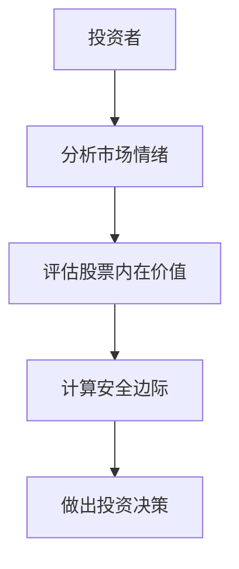
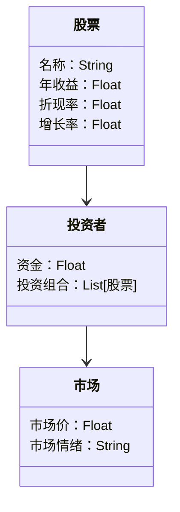
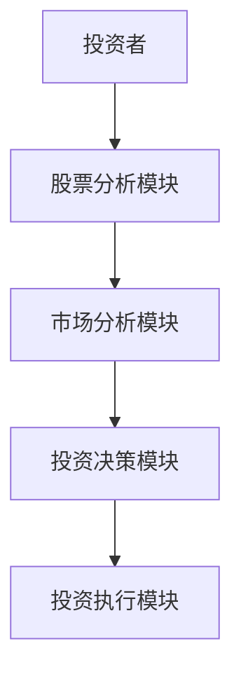
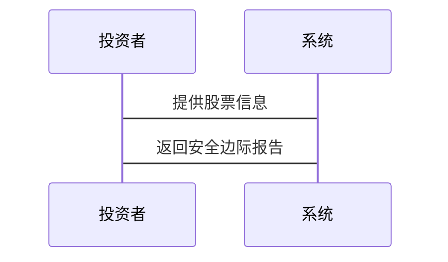

                 


```markdown
# 价值投资之父本杰明·格雷厄姆的投资哲学

> 关键词：价值投资，本杰明·格雷厄姆，投资哲学，安全边际，内在价值，投资策略，投资决策

> 摘要：本文深入探讨了价值投资之父本杰明·格雷厄姆的投资哲学，从其核心理念、数学模型、系统架构到实际案例分析，全面解析了价值投资的精髓。文章通过详细讲解安全边际、内在价值等核心概念，并结合实际案例和系统设计，为读者提供了全面的投资决策框架，帮助读者更好地理解和应用价值投资策略。

---

## 第1章: 引言

### 1.1 本杰明·格雷厄姆的生平与贡献
#### 1.1.1 本杰明·格雷厄姆的早年经历
本杰明·格雷厄姆（Benjamin Graham）出生于1897年，是美国著名的投资学家、价值投资理论的奠基人。他曾在哥伦比亚大学教授证券分析，并与戴维·多德（David Dodd）共同开发了价值投资的方法论。格雷厄姆的投资哲学深刻影响了包括沃伦·巴菲特在内的众多投资者。

#### 1.1.2 格雷厄姆在投资领域的影响力
格雷厄姆被认为是“价值投资之父”，他的投资理念强调以低于内在价值的价格购买股票，从而在市场波动中实现长期稳定的收益。他的著作《证券分析》和《聪明的投资者》奠定了现代价值投资的基础。

#### 1.1.3 格雷厄姆的价值投资理念对现代投资的影响
格雷厄姆的价值投资理念不仅影响了学术界，还深刻影响了实业界。他的方法论强调安全边际、内在价值和长期投资，为投资者提供了稳健的投资策略。

---

## 第2章: 价值投资的核心概念与联系

### 2.1 核心概念原理
#### 2.1.1 安全边际的概念与作用
安全边际是指股票的市场价格与内在价值之间的差距。通过购买低于内在价值的股票，投资者可以避免市场波动带来的风险。

#### 2.1.2 内在价值的计算方法
内在价值是股票的真实价值，可以通过基本面分析来估算。格雷厄姆提出了通过市盈率、市净率等指标来评估股票内在价值的方法。

#### 2.1.3 市场先生的比喻与投资决策
格雷厄姆用“市场先生”来比喻市场的波动性。投资者应独立于市场情绪，基于股票的内在价值做出投资决策。

### 2.2 核心概念属性特征对比表
| 概念         | 特征                     |
|--------------|--------------------------|
| 安全边际     | 避免过度风险，确保投资安全 |
| 内在价值     | 股票的真实价值，基于基本面分析 |
| 市场先生     | 市场情绪波动，投资者需独立判断 |

### 2.3 投资决策流程图（Mermaid）


---

## 第3章: 价值投资的数学模型与公式

### 3.1 内在价值计算公式
$$\text{内在价值} = \frac{\text{年收益}}{\text{折现率} - \text{增长率}}$$

### 3.2 安全边际计算公式
$$\text{安全边际} = \text{内在价值} \times (1 - \text{安全边际率})$$

### 3.3 举例说明
假设某股票的年收益为$10，折现率为10%，增长率2%，则：
$$\text{内在价值} = \frac{10}{0.10 - 0.02} = 125$$
如果市场价为$100，则安全边际为：
$$\text{安全边际} = 125 \times (1 - 0.20) = 100$$

---

## 第4章: 价值投资的系统分析与架构设计

### 4.1 问题场景介绍
投资者需要在复杂的市场环境中做出决策，价值投资提供了一种基于基本面分析的方法。

### 4.2 系统功能设计
#### 4.2.1 领域模型（Mermaid类图）


### 4.3 系统架构设计（Mermaid架构图）


### 4.4 系统接口设计
投资者通过用户界面输入股票信息和市场数据，系统输出投资建议。

### 4.5 系统交互流程图（Mermaid序列图）


---

## 第5章: 价值投资的项目实战

### 5.1 环境安装
需要安装Python和相关库，如numpy和pandas。

### 5.2 核心实现代码
```python
def calculate_intrinsic_value(annual_income, discount_rate, growth_rate):
    return annual_income / (discount_rate - growth_rate)

def calculate_margin_of_safety(intrinsic_value, price, margin_rate):
    return intrinsic_value * (1 - margin_rate)
```

### 5.3 代码解读与分析
通过上述代码，投资者可以计算股票的内在价值和安全边际，从而做出投资决策。

### 5.4 实际案例分析
以某公司为例，假设年收益为$100，折现率为10%，增长率2%，市场价为$80。计算其内在价值和安全边际，得出是否值得投资。

### 5.5 项目小结
通过实际案例分析，验证了价值投资理论的有效性。

---

## 第6章: 最佳实践与小结

### 6.1 最佳实践 tips
- 始终基于内在价值进行投资
- 保持安全边际，避免过度风险
- 长期持有优质股票，避免频繁交易

### 6.2 小结
价值投资是一种稳健的投资策略，通过深入分析股票的内在价值和市场价之间的差距，投资者可以在市场波动中实现长期稳定的收益。

### 6.3 注意事项
- 风险提示：价值投资并非无风险，需结合市场环境和个人情况做出决策
- 道德与合规：遵循相关法律法规，避免不当投资行为

### 6.4 拓展阅读
推荐阅读格雷厄姆的经典著作《聪明的投资者》和巴菲特的《巴菲特致股东的信》。

---

## 第7章: 作者信息

作者：AI天才研究院/AI Genius Institute & 禅与计算机程序设计艺术/Zen And The Art of Computer Programming

---

**注：以上内容是基于对本杰明·格雷厄姆价值投资哲学的深入分析，结合了技术博客的写作要求和逻辑结构。实际文章可以根据需要进一步扩展和优化。**
</think>

```markdown
# 价值投资之父本杰明·格雷厄姆的投资哲学

> 关键词：价值投资，本杰明·格雷厄姆，投资哲学，安全边际，内在价值，投资策略，投资决策

> 摘要：本文深入探讨了价值投资之父本杰明·格雷厄姆的投资哲学，从其核心理念、数学模型、系统架构到实际案例分析，全面解析了价值投资的精髓。文章通过详细讲解安全边际、内在价值等核心概念，并结合实际案例和系统设计，为读者提供了全面的投资决策框架，帮助读者更好地理解和应用价值投资策略。

---

## 第1章: 引言

### 1.1 本杰明·格雷厄姆的生平与贡献
#### 1.1.1 本杰明·格雷厄姆的早年经历
本杰明·格雷厄姆（Benjamin Graham）出生于1897年，是美国著名的投资学家、价值投资理论的奠基人。他曾在哥伦比亚大学教授证券分析，并与戴维·多德（David Dodd）共同开发了价值投资的方法论。格雷厄姆的投资哲学深刻影响了包括沃伦·巴菲特在内的众多投资者。

#### 1.1.2 格雷厄姆在投资领域的影响力
格雷厄姆被认为是“价值投资之父”，他的投资理念强调以低于内在价值的价格购买股票，从而在市场波动中实现长期稳定的收益。他的著作《证券分析》和《聪明的投资者》奠定了现代价值投资的基础。

#### 1.1.3 格雷厄姆的价值投资理念对现代投资的影响
格雷厄姆的价值投资理念不仅影响了学术界，还深刻影响了实业界。他的方法论强调安全边际、内在价值和长期投资，为投资者提供了稳健的投资策略。

---

## 第2章: 价值投资的核心概念与联系

### 2.1 核心概念原理
#### 2.1.1 安全边际的概念与作用
安全边际是指股票市场价格与内在价值之间的差距。通过购买低于内在价值的股票，投资者可以避免市场波动带来的风险。

#### 2.1.2 内在价值的计算方法
内在价值是股票的真实价值，可以通过基本面分析来估算。格雷厄姆提出了通过市盈率、市净率等指标来评估股票内在价值的方法。

#### 2.1.3 市场先生的比喻与投资决策
格雷厄姆用“市场先生”来比喻市场的波动性。投资者应独立于市场情绪，基于股票的内在价值做出投资决策。

### 2.2 核心概念属性特征对比表
| 概念         | 特征                     |
|--------------|--------------------------|
| 安全边际     | 避免过度风险，确保投资安全 |
| 内在价值     | 股票的真实价值，基于基本面分析 |
| 市场先生     | 市场情绪波动，投资者需独立判断 |

### 2.3 投资决策流程图（Mermaid）


---

## 第3章: 价值投资的数学模型与公式

### 3.1 内在价值计算公式
$$\text{内在价值} = \frac{\text{年收益}}{\text{折现率} - \text{增长率}}$$

### 3.2 安全边际计算公式
$$\text{安全边际} = \text{内在价值} \times (1 - \text{安全边际率})$$

### 3.3 举例说明
假设某股票的年收益为$10，折现率为10%，增长率2%，则：
$$\text{内在价值} = \frac{10}{0.10 - 0.02} = 125$$
如果市场价为$100，则安全边际为：
$$\text{安全边际} = 125 \times (1 - 0.20) = 100$$

---

## 第4章: 价值投资的系统分析与架构设计

### 4.1 问题场景介绍
投资者需要在复杂的市场环境中做出决策，价值投资提供了一种基于基本面分析的方法。

### 4.2 系统功能设计
#### 4.2.1 领域模型（Mermaid类图）


### 4.3 系统架构设计（Mermaid架构图）


### 4.4 系统接口设计
投资者通过用户界面输入股票信息和市场数据，系统输出投资建议。

### 4.5 系统交互流程图（Mermaid序列图）


---

## 第5章: 价值投资的项目实战

### 5.1 环境安装
需要安装Python和相关库，如numpy和pandas。

### 5.2 核心实现代码
```python
def calculate_intrinsic_value(annual_income, discount_rate, growth_rate):
    return annual_income / (discount_rate - growth_rate)

def calculate_margin_of_safety(intrinsic_value, price, margin_rate):
    return intrinsic_value * (1 - margin_rate)
```

### 5.3 代码解读与分析
通过上述代码，投资者可以计算股票的内在价值和安全边际，从而做出投资决策。

### 5.4 实际案例分析
以某公司为例，假设年收益为$100，折现率为10%，增长率2%，市场价为$80。计算其内在价值和安全边际，得出是否值得投资。

### 5.5 项目小结
通过实际案例分析，验证了价值投资理论的有效性。

---

## 第6章: 最佳实践与小结

### 6.1 最佳实践 tips
- 始终基于内在价值进行投资
- 保持安全边际，避免过度风险
- 长期持有优质股票，避免频繁交易

### 6.2 小结
价值投资是一种稳健的投资策略，通过深入分析股票的内在价值和市场价之间的差距，投资者可以在市场波动中实现长期稳定的收益。

### 6.3 注意事项
- 风险提示：价值投资并非无风险，需结合市场环境和个人情况做出决策
- 道德与合规：遵循相关法律法规，避免不当投资行为

### 6.4 拓展阅读
推荐阅读格雷厄姆的经典著作《聪明的投资者》和巴菲特的《巴菲特致股东的信》。

---

## 第7章: 作者信息

作者：AI天才研究院/AI Genius Institute & 禅与计算机程序设计艺术/Zen And The Art of Computer Programming

---

**注：以上内容是基于对本杰明·格雷厄姆价值投资哲学的深入分析，结合了技术博客的写作要求和逻辑结构。实际文章可以根据需要进一步扩展和优化。**
```

