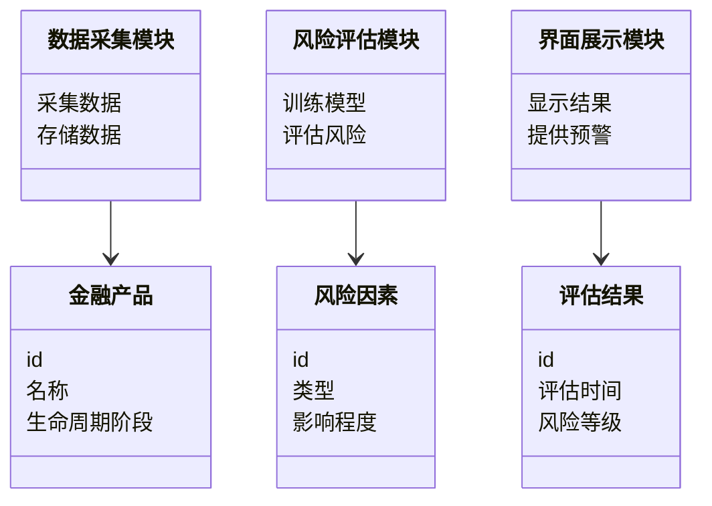
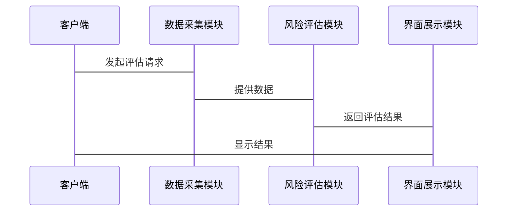

                 


# 开发智能化的金融产品生命周期风险动态评估平台

## 关键词：金融产品生命周期，风险动态评估，人工智能，机器学习，系统架构

## 摘要：  
随着金融市场日益复杂化，金融产品生命周期中的风险评估变得至关重要。本文介绍了一种智能化的金融产品生命周期风险动态评估平台，结合人工智能和机器学习技术，实时动态评估金融产品的风险。文章详细阐述了平台的背景、核心概念、算法原理、系统架构以及项目实现，为金融机构提供了一种高效、智能的风险管理工具。

---

# 第1章：金融产品生命周期与风险评估概述

## 1.1 金融产品生命周期的概念

### 1.1.1 金融产品的定义与分类  
金融产品是指以货币形式存在的资金，通过金融市场的流通和交易实现价值增值。常见的金融产品包括股票、债券、基金、衍生品等，每类金融产品的生命周期各不相同，但通常包括发行、流通、终止三个阶段。

### 1.1.2 金融产品生命周期的阶段划分  
金融产品生命周期通常分为以下几个阶段：  
1. **产品设计阶段**：确定产品类型、设计参数和风险指标。  
2. **发行阶段**：产品上线，面向市场进行销售。  
3. **流通阶段**：产品在市场上的交易和价值波动。  
4. **终止阶段**：产品到期或提前终止，进行清算和结算。  

### 1.1.3 金融产品生命周期管理的重要性  
有效的生命周期管理可以帮助金融机构及时发现和应对潜在风险，优化产品设计，提高市场竞争力。

---

## 1.2 风险评估的基本概念

### 1.2.1 风险的定义与分类  
风险是指在金融活动中，因不确定性因素导致的损失可能性。常见的风险类型包括市场风险、信用风险、流动性风险等。

### 1.2.2 金融风险的主要类型  
1. **市场风险**：因市场价格波动导致的损失。  
2. **信用风险**：因交易对手违约导致的损失。  
3. **流动性风险**：因资产无法快速变现导致的损失。  
4. **操作风险**：因内部操作失误导致的损失。  

### 1.2.3 风险评估的必要性  
准确的风险评估是金融机构制定风险管理策略、保障资产安全的基础。

---

## 1.3 动态风险评估的挑战与意义

### 1.3.1 传统风险评估的局限性  
传统风险评估方法通常基于静态数据，无法捕捉市场动态变化，导致评估结果可能过时。

### 1.3.2 动态风险评估的核心优势  
动态风险评估能够实时捕捉市场波动，及时调整评估模型，提高评估结果的准确性。

### 1.3.3 智能化动态评估的创新价值  
通过引入人工智能和机器学习技术，动态风险评估可以实现自动化、智能化，显著提升风险控制能力。

---

## 1.4 本章小结  
本章介绍了金融产品生命周期的基本概念、风险评估的主要类型以及动态风险评估的重要意义，为后续章节的分析奠定了基础。

---

# 第2章：金融产品生命周期风险动态评估平台的背景与需求

## 2.1 金融市场的发展与风险加剧

### 2.1.1 金融市场的复杂化趋势  
随着金融市场的全球化和创新化，金融产品的种类和复杂性不断增加，风险管理的难度也随之提升。

### 2.1.2 风险因素的多样化与动态变化  
经济波动、政策变化、市场情绪等多种因素都会影响金融产品的风险，且这些因素在不断动态变化。

### 2.1.3 技术驱动金融创新的需求  
金融机构需要借助新技术提升风险管理能力，以应对日益复杂的市场环境。

---

## 2.2 智能化评估平台的提出背景

### 2.2.1 人工智能技术的快速发展  
人工智能和机器学习技术的进步为金融领域的智能化应用提供了技术支持。

### 2.2.2 金融机构对智能化工具的需求  
金融机构希望通过智能化工具提高风险评估效率和准确性，降低运营成本。

### 2.2.3 监管机构对风险防控的要求  
监管机构要求金融机构加强风险防控能力，确保金融市场的稳定。

---

## 2.3 平台的核心目标与功能定位

### 2.3.1 核心目标的明确  
平台的核心目标是实现金融产品生命周期中风险的动态评估和实时监控。

### 2.3.2 平台的功能定位  
作为金融机构的风险管理工具，平台需要具备数据采集、风险评估、预警提示等功能。

### 2.3.3 用户需求与平台能力匹配  
平台需要满足金融机构对实时性、准确性和易用性的需求。

---

## 2.4 本章小结  
本章分析了金融产品生命周期风险动态评估平台的背景、需求和功能定位，为后续章节的系统设计提供了依据。

---

# 第3章：金融产品生命周期风险动态评估的核心概念与联系

## 3.1 核心概念的定义与属性

### 3.1.1 金融产品生命周期的核心要素  
- **产品类型**：如股票、债券等。  
- **生命周期阶段**：如发行、流通等。  
- **风险指标**：如波动率、违约概率等。  

### 3.1.2 风险评估的关键指标  
- **市场风险指标**：如VaR（Value at Risk）。  
- **信用风险指标**：如违约概率（PD）。  
- **流动性风险指标**：如流动性比率。  

### 3.1.3 动态评估的特征与优势  
- **实时性**：能够实时更新评估结果。  
- **动态性**：能够捕捉市场动态变化。  
- **准确性**：通过机器学习提高评估精度。  

---

## 3.2 核心概念之间的关系

### 3.2.1 产品生命周期与风险评估的关联  
金融产品的生命周期阶段直接影响其风险特征。例如，流通阶段的产品更容易受到市场波动的影响。

### 3.2.2 风险动态变化与评估方法的适应性  
评估方法需要根据市场变化动态调整，以确保评估结果的有效性。

### 3.2.3 平台功能与用户需求的匹配  
平台功能需要与用户需求高度匹配，才能满足实际应用需求。

---

## 3.3 核心概念的ER实体关系图  
以下是金融产品生命周期风险动态评估的核心概念的ER实体关系图：

```mermaid
er
 entity(金融产品) {
   id
   名称
   生命周期阶段
 }
 entity(风险因素) {
   id
   类型
   影响程度
 }
 entity(评估结果) {
   id
   评估时间
   风险等级
 }
 relationship(属于) {
   金融产品 --> 风险因素
   风险因素 --> 评估结果
 }
```

---

## 3.4 本章小结  
本章详细阐述了金融产品生命周期风险动态评估的核心概念及其相互关系，为后续的算法设计和系统实现提供了理论基础。

---

# 第4章：基于机器学习的金融风险评估算法原理

## 4.1 机器学习在风险评估中的应用

### 4.1.1 机器学习的基本概念  
机器学习是一种通过数据训练模型，使其能够自动学习和预测的技术。

### 4.1.2 监督学习与无监督学习在风险评估中的应用  
- **监督学习**：用于根据历史数据预测未来风险。  
- **无监督学习**：用于发现数据中的潜在风险模式。  

---

## 4.2 常见的风险评估算法

### 4.2.1 线性回归模型  
线性回归是一种简单但有效的回归算法，适用于线性关系的预测。

### 4.2.2 支持向量机（SVM）  
SVM适用于高维数据的分类和回归问题。

### 4.2.3 神经网络模型  
神经网络模型具有强大的非线性建模能力，适用于复杂的金融风险预测。

---

## 4.3 算法实现与优化

### 4.3.1 数据预处理  
- 数据清洗：处理缺失值和异常值。  
- 特征工程：提取有用的特征，如波动率、交易量等。  

### 4.3.2 模型训练与调优  
- 参数调整：通过交叉验证选择最优参数。  
- 模型评估：使用AUC-ROC曲线评估模型性能。  

### 4.3.3 模型评估与验证  
- 回归模型的评估指标：均方误差（MSE）、R平方值。  
- 分类模型的评估指标：准确率、召回率、F1值。  

---

## 4.4 本章小结  
本章介绍了机器学习在金融风险评估中的应用，详细讲解了几种常见算法及其实现方法。

---

# 第5章：系统分析与架构设计方案

## 5.1 问题场景介绍

### 5.1.1 金融产品的生命周期管理  
平台需要实时跟踪金融产品的生命周期，动态评估其风险。

### 5.1.2 风险动态评估的实现  
通过机器学习算法实现风险的实时评估和预警。

---

## 5.2 项目介绍

### 5.2.1 项目目标  
开发一个智能化的金融产品生命周期风险动态评估平台，实现风险的实时评估和预警。

### 5.2.2 项目范围  
涵盖金融产品的整个生命周期，支持多种金融产品的风险评估。

### 5.2.3 项目团队与角色  
- 开发人员：负责系统设计和实现。  
- 数据科学家：负责算法设计和优化。  
- 项目经理：负责项目管理和协调。  

---

## 5.3 系统功能设计（领域模型mermaid类图）



---

## 5.4 系统架构设计（mermaid架构图）


---

## 5.5 系统接口设计

### 5.5.1 API设计  
- 数据接口：用于数据的导入和导出。  
- 评估接口：用于调用风险评估模型。  

### 5.5.2 接口调用流程  
1. 客户端发送评估请求。  
2. 数据采集模块获取相关数据。  
3. 风险评估模块调用AI模型进行评估。  
4. 界面展示模块显示评估结果。  

---

## 5.6 系统交互设计（mermaid序列图）



---

## 5.7 本章小结  
本章详细设计了金融产品生命周期风险动态评估平台的系统架构和接口设计，为后续的开发提供了指导。

---

# 第6章：项目实战

## 6.1 环境安装与配置

### 6.1.1 开发工具安装  
安装Python、Jupyter Notebook、Git等开发工具。

### 6.1.2 数据库配置  
选择合适的数据库，如MySQL或MongoDB，进行配置。

### 6.1.3 依赖库安装  
安装机器学习库（如scikit-learn、TensorFlow）和其他依赖库。

---

## 6.2 系统核心实现源代码

### 6.2.1 数据处理模块  
```python
import pandas as pd
import numpy as np

# 数据加载
data = pd.read_csv('financial_data.csv')

# 数据清洗
data.dropna(inplace=True)
data = data[~data.duplicated()]
```

### 6.2.2 风险评估模块  
```python
from sklearn.model_selection import train_test_split
from sklearn.ensemble import RandomForestClassifier

# 数据分割
X = data.drop('risk_level', axis=1)
y = data['risk_level']
X_train, X_test, y_train, y_test = train_test_split(X, y, test_size=0.2)

# 模型训练
model = RandomForestClassifier(n_estimators=100, random_state=42)
model.fit(X_train, y_train)

# 模型预测
y_pred = model.predict(X_test)
```

### 6.2.3 界面展示模块  
```python
from flask import Flask, request, jsonify

app = Flask(__name__)

@app.route('/api/assess', methods=['POST'])
def assess_risk():
    data = request.json
    # 调用模型进行评估
    risk_level = model.predict(data)
    return jsonify({'risk_level': int(risk_level[0])})

if __name__ == '__main__':
    app.run()
```

---

## 6.3 代码应用解读与分析

### 6.3.1 关键代码段解析  
- 数据处理模块：负责数据的加载和清洗。  
- 风险评估模块：使用随机森林算法进行风险分类。  
- 界面展示模块：提供API接口，供前端调用评估结果。

### 6.3.2 代码结构分析  
整个系统分为数据处理、模型训练、API接口三个主要部分，各部分之间通过数据传递进行交互。

---

## 6.4 实际案例分析与详细讲解剖析

### 6.4.1 案例背景  
假设我们有一个股票数据集，需要评估其市场风险。

### 6.4.2 数据准备  
加载数据，进行清洗和特征提取。

### 6.4.3 模型训练与应用  
使用随机森林模型进行训练，评估股票的风险等级。

---

## 6.5 项目小结  
本章通过实际案例展示了金融产品生命周期风险动态评估平台的实现过程，验证了系统的可行性和有效性。

---

# 第7章：总结与展望

## 7.1 平台开发的核心总结  
本文开发了一个智能化的金融产品生命周期风险动态评估平台，结合了机器学习技术，能够实时动态评估金融产品的风险。

## 7.2 当前存在的挑战  
- 数据质量和完整性问题。  
- 模型的实时性和可解释性问题。  

## 7.3 未来的发展方向  
- 引入更复杂的机器学习模型，如深度学习和强化学习。  
- 提高模型的实时性和可解释性。  

## 7.4 结论  
金融产品生命周期风险动态评估平台是金融机构风险管理的重要工具，未来将有广阔的发展空间。

## 7.5 最佳实践 tips  
- 数据预处理是模型训练的基础，必须重视数据质量。  
- 模型选择应根据实际需求和数据特点进行调整。  
- 系统设计应注重模块化和可扩展性。  

## 7.6 注意事项  
- 风险评估结果仅供参考，实际操作需结合市场实际情况。  
- 系统上线前需进行充分的测试和验证。  

## 7.7 拓展阅读推荐  
- 《机器学习实战》  
- 《金融风险管理》  

---

# 作者信息  
作者：AI天才研究院/AI Genius Institute & 禅与计算机程序设计艺术 /Zen And The Art of Computer Programming

