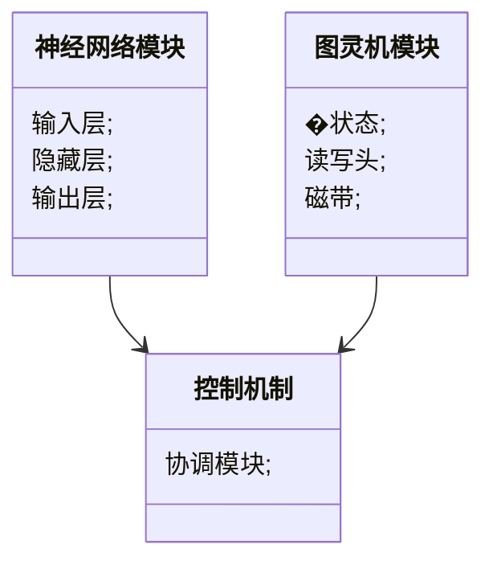
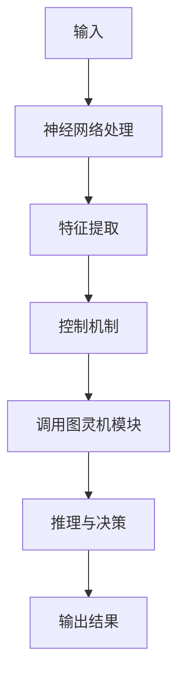
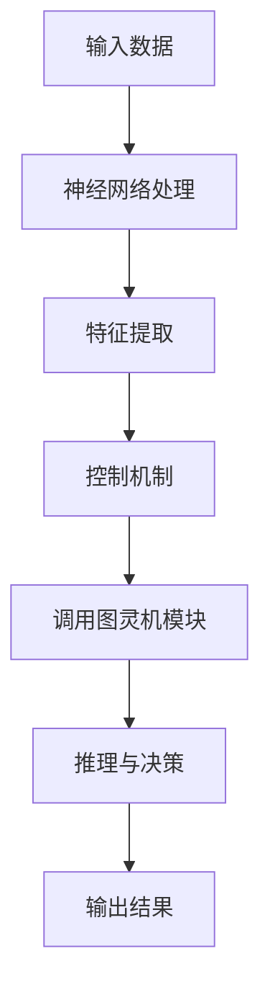
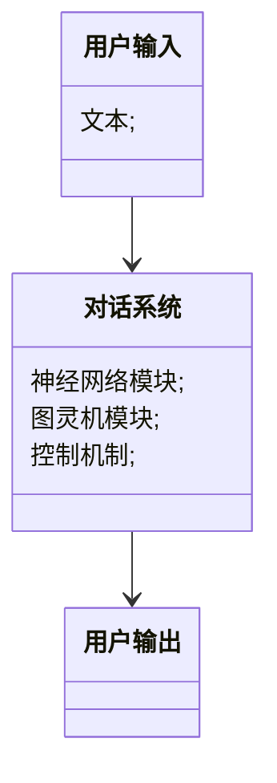
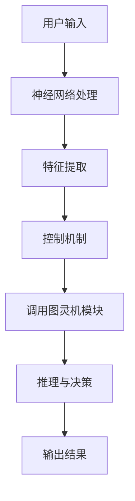
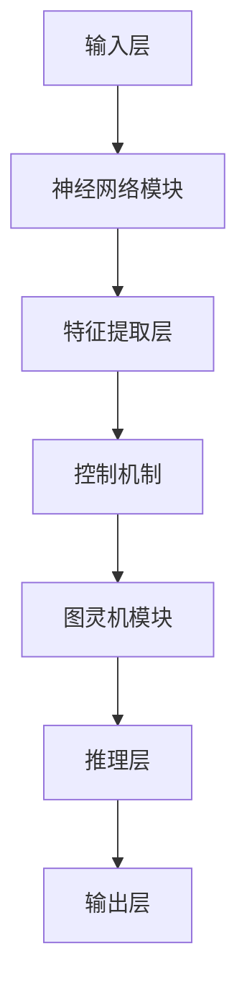
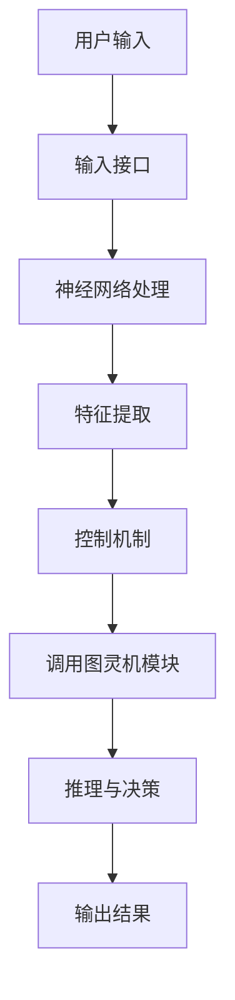

                 


# 《神经图灵机：增强AI Agent的算法学习能力》

## 关键词：神经图灵机, AI Agent, 算法学习能力, 神经网络, 图灵机

## 摘要：神经图灵机是一种结合了神经网络和图灵机理论的新型AI架构，旨在增强AI代理的学习能力。本文将详细探讨其核心概念、算法原理、系统架构及项目实战，帮助读者深入了解其在提升AI Agent智能水平中的应用。

---

# 第1章: 神经图灵机的背景与基本概念

## 1.1 神经图灵机的背景与起源

### 1.1.1 神经网络与传统AI的演进

传统AI主要依赖规则和逻辑推理，而神经网络通过大量数据学习特征，实现了如图像识别、自然语言处理等复杂任务。神经网络的崛起推动了AI的进步，但其在需要推理和逻辑处理的任务上仍显不足。

### 1.1.2 图灵机模型的理论基础

图灵机是由艾伦·图灵提出的一种计算模型，通过读写头在磁带上操作，实现任意可计算函数。图灵机具有强大的计算能力，但缺乏学习能力。

### 1.1.3 神经图灵机的提出与意义

神经图灵机结合了神经网络的学习能力和图灵机的推理能力，旨在弥补传统AI在复杂任务中的不足，推动AI向更通用智能方向发展。

## 1.2 神经图灵机的基本概念

### 1.2.1 神经图灵机的定义

神经图灵机是一种结合了神经网络和图灵机的混合模型，通过神经网络进行特征学习，利用图灵机机制进行推理和决策。

### 1.2.2 神经图灵机的核心特点

- **端到端学习**：神经网络部分通过端到端训练，提升模型的适应性。
- **推理能力**：图灵机部分赋予模型推理和逻辑处理能力。
- **可扩展性**：能够处理复杂任务，如对话系统和问题解答。

### 1.2.3 神经图灵机与传统AI的区别

| **特点**       | **神经图灵机**                  | **传统AI**                     |
|----------------|--------------------------------|--------------------------------|
| 学习能力       | 强大，结合神经网络             | 较弱，依赖规则和逻辑             |
| 推理能力       | 强，结合图灵机机制             | 较弱，依赖预设规则               |
| 适应性         | 高，适用于复杂任务             | 低，适用于简单任务               |

## 1.3 神经图灵机在AI Agent中的应用

### 1.3.1 AI Agent的基本概念

AI Agent是一种智能体，能够感知环境、执行任务并做出决策。传统AI Agent依赖规则和逻辑推理，但在复杂场景中表现受限。

### 1.3.2 神经图灵机如何增强AI Agent的学习能力

神经图灵机通过神经网络学习环境特征，并利用图灵机机制进行推理和决策，提升AI Agent在复杂环境中的适应性和智能性。

### 1.3.3 神经图灵机在AI Agent中的应用场景

- **对话系统**：提升对话生成的自然性和连贯性。
- **问题解答**：增强理解和推理能力，提供更精准的答案。
- **任务规划**：通过推理能力优化任务执行策略。

## 1.4 本章小结

本章介绍了神经图灵机的背景、核心概念及其在AI Agent中的应用。神经图灵机结合了神经网络的学习能力和图灵机的推理能力，为AI Agent的智能化发展提供了新的思路。

---

# 第2章: 神经图灵机的核心概念与原理

## 2.1 神经图灵机的核心概念

### 2.1.1 神经网络与图灵机的结合

神经图灵机将神经网络作为感知和特征提取模块，图灵机作为推理和决策模块，两者协同工作。

### 2.1.2 神经图灵机的组成要素

- **神经网络模块**：负责特征提取和初步处理。
- **图灵机模块**：负责推理和决策。
- **控制机制**：协调两模块的交互。

### 2.1.3 神经图灵机的数学模型

$$
f(x) = \sigma(Wx + b)
$$

其中，$W$ 和 $b$ 是神经网络的参数，$\sigma$ 是激活函数。

### 2.1.4 神经图灵机的类图关系



## 2.2 神经图灵机的工作原理

### 2.2.1 神经网络的计算机制

神经网络通过多层感知器对输入数据进行非线性变换，提取特征并生成输出。

### 2.2.2 图灵机的控制结构

图灵机通过状态和读写头在磁带上操作，模拟任意计算过程。

### 2.2.3 神经图灵机的协同工作模式

1. 神经网络处理输入，提取特征。
2. 控制机制根据特征状态，决定调用图灵机模块。
3. 图灵机模块执行推理，输出决策。
4. 决策返回神经网络，优化模型。

### 2.2.4 神经图灵机的工作流程图



## 2.3 神经图灵机与其他模型的对比

### 2.3.1 与传统神经网络的对比

神经图灵机结合了推理能力，而传统神经网络仅能进行特征学习。

### 2.3.2 与图灵机模型的对比

神经图灵机引入了学习能力，而传统图灵机缺乏数据处理能力。

### 2.3.3 与增强学习模型的对比

神经图灵机在决策过程中引入了推理机制，提升决策的合理性。

## 2.4 本章小结

本章详细探讨了神经图灵机的核心概念与工作原理，分析了其与其他模型的差异，展示了其在AI Agent中的独特优势。

---

# 第3章: 神经图灵机的算法原理

## 3.1 神经图灵机的算法原理

### 3.1.1 神经网络的数学模型

神经网络通过多层感知机对输入数据进行变换，生成输出。

$$
y = \sigma(Wx + b)
$$

其中，$W$ 是权重矩阵，$x$ 是输入向量，$b$ 是偏置，$\sigma$ 是激活函数。

### 3.1.2 图灵机的数学模型

图灵机通过状态和读写头在磁带上操作，模拟任意计算过程。

$$
Q = \{q_0, q_1, ..., q_n\}
$$

其中，$Q$ 是状态集合，$q_0$ 是初始状态。

### 3.1.3 神经图灵机的联合模型

神经图灵机将神经网络和图灵机模块结合，形成联合模型。

### 3.1.4 神经图灵机的训练过程

神经图灵机通过端到端训练，优化模型参数，提升性能。

### 3.1.5 神经图灵机的算法流程图



## 3.2 神经图灵机的实现步骤

### 3.2.1 环境安装

安装必要的库，如TensorFlow、Keras等。

### 3.2.2 核心代码实现

```python
import tensorflow as tf
from tensorflow.keras import layers

# 神经网络模块
def neural_network_module(input_shape):
    inputs = layers.Input(shape=input_shape)
    x = layers.Dense(64, activation='relu')(inputs)
    x = layers.Dense(32, activation='relu')(x)
    outputs = layers.Dense(1, activation='sigmoid')(x)
    return tf.keras.Model(inputs=inputs, outputs=outputs)

# 图灵机模块
def turing_machine_module():
    # 实现图灵机的具体操作
    pass

# 神经图灵机模型
def neural_turing_machine():
    input = layers.Input(shape=(100,))  # 示例输入
    nn_output = neural_network_module(input.shape)(input)
    tm_output = turing_machine_module()(nn_output)
    outputs = layers.Dense(10, activation='softmax')(tm_output)
    return tf.keras.Model(inputs=input, outputs=outputs)
```

### 3.2.3 算法的数学模型

神经网络部分的数学模型如前所述，图灵机部分通过状态和读写头的操作实现。

## 3.3 神经图灵机的数学模型

神经图灵机的数学模型结合了神经网络和图灵机的模型，具体如下：

$$
y = \sigma(W_{nt} \cdot (\sigma(W_n x + b_n) + q))
$$

其中，$W_{nt}$ 是神经图灵机的权重矩阵，$x$ 是输入，$q$ 是图灵机的状态。

## 3.4 本章小结

本章详细讲解了神经图灵机的算法原理，包括数学模型和实现步骤，帮助读者理解其技术细节。

---

# 第4章: 神经图灵机的系统分析与架构设计

## 4.1 问题场景介绍

假设我们正在开发一个智能客服系统，需要提升对话系统的智能性。

## 4.2 系统功能设计

### 4.2.1 领域模型设计



### 4.2.2 系统架构设计



## 4.3 系统架构设计

### 4.3.1 系统架构图



### 4.3.2 系统接口设计

- **输入接口**：接收用户输入。
- **输出接口**：输出对话结果。
- **控制接口**：协调神经网络和图灵机模块的交互。

### 4.3.3 系统交互流程图



## 4.4 本章小结

本章通过系统分析与架构设计，展示了神经图灵机在智能客服系统中的应用，详细设计了系统架构和交互流程。

---

# 第5章: 神经图灵机的项目实战

## 5.1 项目背景与目标

开发一个智能客服对话系统，提升对话的自然性和准确性。

## 5.2 项目实现

### 5.2.1 环境安装

安装必要的库，如TensorFlow、Keras等。

### 5.2.2 核心代码实现

```python
import tensorflow as tf
from tensorflow.keras import layers

# 神经网络模块
def neural_network_module(input_shape):
    inputs = layers.Input(shape=input_shape)
    x = layers.Dense(64, activation='relu')(inputs)
    x = layers.Dense(32, activation='relu')(x)
    outputs = layers.Dense(1, activation='sigmoid')(x)
    return tf.keras.Model(inputs=inputs, outputs=outputs)

# 图灵机模块
def turing_machine_module():
    # 实现图灵机的具体操作
    pass

# 神经图灵机模型
def neural_turing_machine():
    input = layers.Input(shape=(100,))  # 示例输入
    nn_output = neural_network_module(input.shape)(input)
    tm_output = turing_machine_module()(nn_output)
    outputs = layers.Dense(10, activation='softmax')(tm_output)
    return tf.keras.Model(inputs=input, outputs=outputs)
```

### 5.2.3 算法实现

神经图灵机的实现结合了神经网络和图灵机模块，通过训练优化模型参数。

## 5.3 项目小结

本章通过项目实战，展示了神经图灵机在智能客服系统中的应用，详细描述了实现过程和代码细节。

---

# 第6章: 神经图灵机的总结与展望

## 6.1 总结

神经图灵机结合了神经网络的学习能力和图灵机的推理能力，为AI Agent的智能化发展提供了新的思路。

## 6.2 注意事项

- 神经图灵机的训练需要大量数据和计算资源。
- 图灵机模块的设计需要考虑复杂度和效率。

## 6.3 未来展望

随着AI技术的发展，神经图灵机有望在更多领域得到应用，推动AI向更通用智能方向发展。

---

# 作者

作者：AI天才研究院/AI Genius Institute & 禅与计算机程序设计艺术 /Zen And The Art of Computer Programming

