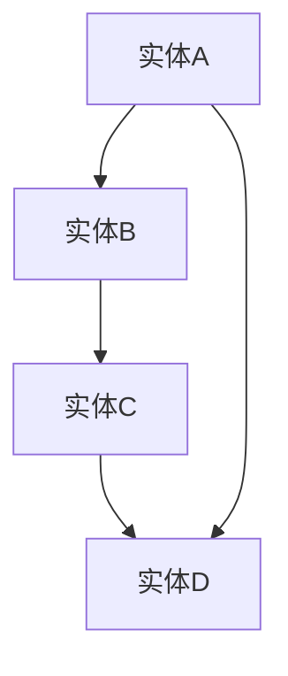
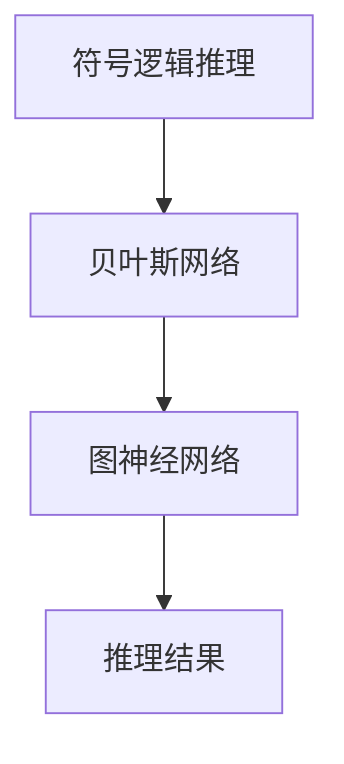
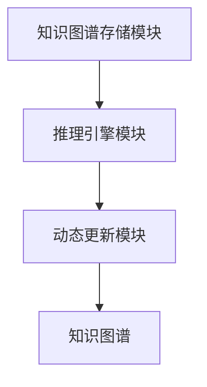
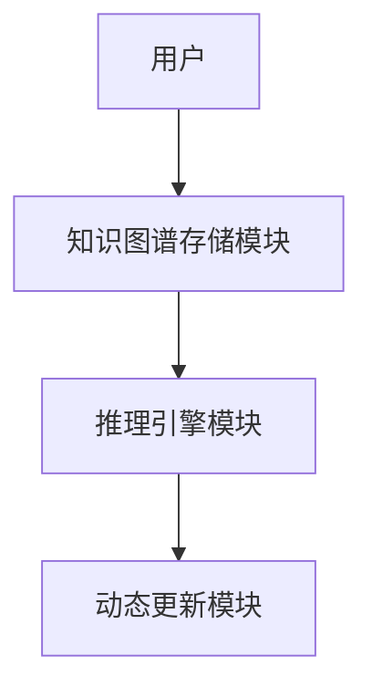

                 


# 设计AI Agent的动态知识图谱推理引擎

> 关键词：AI Agent，动态知识图谱，推理引擎，符号逻辑推理，概率推理，图神经网络

> 摘要：本文详细探讨了设计AI Agent的动态知识图谱推理引擎的核心概念、算法原理、系统架构和项目实现。通过分析动态知识图谱的特点，结合推理引擎的工作原理，提出了基于符号逻辑推理和概率推理的动态知识图谱推理算法，并通过系统架构设计和项目实战，展示了如何实现一个高效的动态知识图谱推理引擎。

---

# 第一部分: AI Agent与动态知识图谱推理引擎的背景与概念

# 第1章: 问题背景与核心概念

## 1.1 问题背景

### 1.1.1 当前AI Agent的发展现状
AI Agent（智能代理）作为一种能够感知环境并执行任务的智能体，近年来得到了广泛的研究和应用。从简单的规则驱动型代理到复杂的基于模型的代理，AI Agent的能力不断提升。然而，随着应用场景的复杂化，AI Agent需要处理的知识图谱也在动态变化，这对推理引擎提出了更高的要求。

### 1.1.2 知识图谱推理的挑战与需求
知识图谱是一种结构化的数据表示方式，能够有效地表示实体之间的关系。然而，知识图谱的动态变化（如新增实体、关系更新等）使得传统的静态推理方法难以满足需求。动态知识图谱推理引擎需要能够实时处理这些变化，并快速更新推理结果。

### 1.1.3 动态知识图谱的定义与特点
动态知识图谱是指随着时间推移不断变化的知识图谱。其特点包括：
- 动态性：知识图谱中的实体和关系可以随时更新。
- 不确定性：知识图谱中的信息可能存在不一致或不完整的情况。
- 鲜活性：知识图谱需要实时反映最新信息。

---

## 1.2 核心概念

### 1.2.1 AI Agent的基本概念
AI Agent是一种能够感知环境、执行任务的智能体。它可以分为：
- 单一智能体：独立执行任务。
- 多智能体：多个智能体协同工作。

### 1.2.2 知识图谱的结构与特点
知识图谱由实体和关系组成，通常表示为三元组（头实体，关系，尾实体）。动态知识图谱的特点包括动态性、不确定性和鲜活性。

### 1.2.3 推理引擎的工作原理
推理引擎通过从知识图谱中提取信息并根据推理规则生成新的知识。推理引擎的核心是推理算法，包括符号逻辑推理和概率推理。

---

## 1.3 问题描述与解决方案

### 1.3.1 AI Agent推理中的知识动态更新问题
AI Agent需要实时处理动态知识图谱中的信息，传统的静态推理方法无法满足动态更新的需求。

### 1.3.2 动态知识图谱推理引擎的目标
动态知识图谱推理引擎的目标是实时更新知识图谱，并根据动态变化的信息生成新的推理结果。

### 1.3.3 解决方案的初步思路
- 建立动态知识图谱的更新机制。
- 设计高效的推理算法，能够处理动态知识图谱中的变化。

---

## 1.4 边界与外延

### 1.4.1 知识图谱推理的边界
知识图谱推理的边界包括：
- 知识图谱的表示方式。
- 推理引擎的算法选择。

### 1.4.2 动态知识图谱的外延
动态知识图谱的外延包括：
- 动态知识图谱的更新机制。
- 动态知识图谱的存储方式。

### 1.4.3 AI Agent推理引擎的应用场景
AI Agent推理引擎的应用场景包括：
- 智能问答系统。
- 自动推理系统。
- 多智能体协作系统。

---

## 1.5 概念结构与核心要素

### 1.5.1 动态知识图谱推理引擎的组成
动态知识图谱推理引擎由以下部分组成：
- 知识图谱存储模块。
- 推理引擎模块。
- 动态更新模块。

### 1.5.2 核心要素的对比分析
| 要素 | 静态知识图谱 | 动态知识图谱 |
|------|--------------|--------------|
| 动态性 | 静态 | 动态 |
| 不确定性 | 低 | 高 |
| 鲜活性 | 低 | 高 |

### 1.5.3 概念结构图


---

# 第二部分: 动态知识图谱与推理引擎的核心概念与联系

# 第2章: 动态知识图谱的构建与管理

## 2.1 动态知识图谱的构建

### 2.1.1 知识抽取与表示
知识抽取是从文本中提取实体和关系的过程，通常使用自然语言处理技术。知识表示可以采用三元组形式（头实体，关系，尾实体）。

### 2.1.2 知识融合与关联
知识融合是将多个来源的知识整合到一个知识图谱中，需要处理实体对齐和关系关联问题。

### 2.1.3 动态更新机制
动态更新机制包括定期检查知识图谱的变化，并根据变化更新知识图谱。

---

## 2.2 知识图谱的存储与管理

### 2.2.1 图数据库的选择
常用图数据库包括Neo4j、RDF4J等。

### 2.2.2 知识图谱的版本控制
版本控制是管理知识图谱变化的重要手段，可以采用分布式版本控制系统（如Git）。

### 2.2.3 动态更新的实现方式
动态更新的实现方式包括：
- 增量更新：只更新变化的部分。
- 全量更新：重新构建知识图谱。

---

## 2.3 动态知识图谱的属性特征对比

### 2.3.1 静态知识图谱与动态知识图谱的对比
| 属性 | 静态知识图谱 | 动态知识图谱 |
|------|--------------|--------------|
| 动态性 | 静态 | 动态 |
| 不确定性 | 低 | 高 |
| 鲜活性 | 低 | 高 |

### 2.3.2 动态知识图谱的特征分析
动态知识图谱具有动态性、不确定性和鲜活性的特点。

### 2.3.3 动态知识图谱的优缺点
优点：
- 能够实时反映最新信息。
- 支持动态更新。

缺点：
- 复杂性高。
- 对计算资源要求高。

---

## 2.4 ER实体关系图架构


---

# 第三部分: 推理引擎的算法原理与实现

# 第3章: 推理引擎的算法原理

## 3.1 符号逻辑推理

### 3.1.1 基于符号逻辑的推理规则
符号逻辑推理基于逻辑规则，如合取（AND）、析取（OR）、蕴含（IMPLIES）等。

### 3.1.2 常用的推理算法
常用的符号逻辑推理算法包括：
- 周期性推理：定期更新推理结果。
- 触发式推理：根据触发条件更新推理结果。

### 3.1.3 符号逻辑推理的优缺点
优点：
- 简单易懂。
- 可解释性强。

缺点：
- 无法处理不确定性。
- 计算复杂度高。

---

## 3.2 概率推理

### 3.2.1 贝叶斯网络的原理
贝叶斯网络是一种概率推理模型，通过概率分布描述变量之间的关系。

### 3.2.2 证据推理与概率传播
证据推理是根据已知证据更新概率分布的过程，概率传播是将概率从一个节点传播到另一个节点的过程。

### 3.2.3 概率推理的优缺点
优点：
- 能够处理不确定性。
- 计算效率高。

缺点：
- 需要先验概率。
- 复杂性高。

---

## 3.3 图神经网络

### 3.3.1 图神经网络的原理
图神经网络是一种处理图结构数据的深度学习模型，能够有效地处理实体之间的关系。

### 3.3.2 图神经网络的实现
图神经网络的实现包括：
- 图嵌入：将实体和关系映射到低维向量空间。
- 图传播：通过消息传递机制更新实体的表示。

### 3.3.3 图神经网络的优缺点
优点：
- 能够处理复杂的关系。
- 计算效率高。

缺点：
- 需要大量训练数据。
- 计算资源消耗大。

---

## 3.4 算法流程图



---

## 3.5 算法实现

### 3.5.1 符号逻辑推理的实现
符号逻辑推理的实现步骤：
1. 提取知识图谱中的实体和关系。
2. 建立逻辑规则。
3. 根据逻辑规则进行推理。

### 3.5.2 概率推理的实现
概率推理的实现步骤：
1. 构建贝叶斯网络。
2. 根据已知证据更新概率分布。
3. 输出推理结果。

### 3.5.3 图神经网络的实现
图神经网络的实现步骤：
1. 构建图结构数据。
2. 训练图神经网络模型。
3. 使用模型进行推理。

---

## 3.6 数学模型与公式

### 3.6.1 符号逻辑推理
符号逻辑推理的公式：
$$ P(A \land B) = P(A) \times P(B|A) $$

### 3.6.2 概率推理
贝叶斯定理：
$$ P(B|A) = \frac{P(A|B) \times P(B)}{P(A)} $$

### 3.6.3 图神经网络
图神经网络的公式：
$$ h_v = \sum_{u \in N(v)} \frac{h_u}{|N(v)|} $$

---

# 第四部分: 系统分析与架构设计方案

# 第4章: 系统分析与架构设计

## 4.1 问题场景介绍

### 4.1.1 知识图谱的动态更新
知识图谱需要实时更新，以反映最新信息。

### 4.1.2 推理引擎的实时推理
推理引擎需要实时处理动态知识图谱中的信息，快速生成推理结果。

---

## 4.2 系统功能设计

### 4.2.1 知识图谱存储模块
知识图谱存储模块负责存储和管理知识图谱数据。

### 4.2.2 推理引擎模块
推理引擎模块负责根据知识图谱数据进行推理，生成推理结果。

### 4.2.3 动态更新模块
动态更新模块负责实时更新知识图谱数据。

---

## 4.3 系统架构设计

### 4.3.1 系统架构图


### 4.3.2 系统交互图


---

## 4.4 系统实现

### 4.4.1 知识图谱存储模块的实现
知识图谱存储模块可以使用图数据库（如Neo4j）进行实现。

### 4.4.2 推理引擎模块的实现
推理引擎模块可以使用符号逻辑推理、概率推理或图神经网络进行实现。

### 4.4.3 动态更新模块的实现
动态更新模块可以使用增量更新或全量更新的方式进行实现。

---

# 第五部分: 项目实战

# 第5章: 项目实战

## 5.1 环境安装

### 5.1.1 安装Python
安装Python 3.8或更高版本。

### 5.1.2 安装相关库
安装以下Python库：
- `networkx`：用于图数据的处理。
- `numpy`：用于数值计算。
- `scikit-learn`：用于机器学习算法。

---

## 5.2 系统核心实现

### 5.2.1 知识图谱构建
使用`networkx`库构建知识图谱：
```python
import networkx as nx

G = nx.Graph()
G.add_edge("实体A", "实体B")
G.add_edge("实体B", "实体C")
```

### 5.2.2 推理引擎实现
使用符号逻辑推理实现推理引擎：
```python
def infer(G):
    for edge in G.edges():
        head, tail = edge
        if tail == "实体D":
            return True
    return False
```

### 5.2.3 动态更新实现
使用增量更新方式实现动态更新：
```python
def update(G):
    new_edge = ("实体C", "实体D")
    G.add_edge(*new_edge)
```

---

## 5.3 代码应用解读与分析

### 5.3.1 知识图谱构建代码解读
上述代码使用`networkx`库构建了一个简单的知识图谱，包含实体A、实体B和实体C之间的关系。

### 5.3.2 推理引擎代码解读
上述代码实现了一个简单的符号逻辑推理算法，能够根据知识图谱中的关系进行推理。

### 5.3.3 动态更新代码解读
上述代码实现了一个增量更新算法，能够动态更新知识图谱。

---

## 5.4 实际案例分析

### 5.4.1 案例背景
假设我们有一个动态知识图谱，表示公司员工之间的关系。我们需要实时更新员工信息，并根据更新后的信息进行推理。

### 5.4.2 代码实现
```python
import networkx as nx

G = nx.Graph()
G.add_edge("员工A", "部门B")
G.add_edge("部门B", "公司C")

def update(G):
    new_edge = ("员工A", "职位D")
    G.add_edge(*new_edge)

update(G)
```

### 5.4.3 结果分析
更新后的知识图谱包含员工A的职位信息，推理引擎可以根据更新后的知识图谱进行推理。

---

## 5.5 项目小结

### 5.5.1 项目总结
通过上述项目实战，我们实现了一个简单的动态知识图谱推理引擎，能够实时更新知识图谱并进行推理。

### 5.5.2 经验教训
在实际应用中，需要考虑知识图谱的规模和复杂性，选择合适的推理算法和存储方式。

---

# 第六部分: 总结与展望

# 第6章: 总结与展望

## 6.1 总结
本文详细探讨了设计AI Agent的动态知识图谱推理引擎的核心概念、算法原理、系统架构和项目实现。通过分析动态知识图谱的特点，结合推理引擎的工作原理，提出了基于符号逻辑推理和概率推理的动态知识图谱推理算法，并通过系统架构设计和项目实战，展示了如何实现一个高效的动态知识图谱推理引擎。

---

## 6.2 未来展望

### 6.2.1 技术局限性
当前动态知识图谱推理引擎的主要技术局限性包括：
- 计算复杂度高。
- 对动态更新的支持有限。
- 可解释性差。

### 6.2.2 未来改进方向
未来可以研究以下方向：
- 更高效的推理算法。
- 更智能的动态更新机制。
- 更好的可解释性。

---

## 6.3 最佳实践

### 6.3.1 数据质量
确保知识图谱的数据质量，减少不确定性。

### 6.3.2 模型可解释性
提高推理引擎的可解释性，便于调试和优化。

### 6.3.3 计算资源
合理分配计算资源，提高推理效率。

---

## 6.4 总结
通过本文的探讨，我们对设计AI Agent的动态知识图谱推理引擎有了更深入的理解。未来，随着技术的进步，动态知识图谱推理引擎将在更多领域得到广泛应用。

---

作者：AI天才研究院/AI Genius Institute & 禅与计算机程序设计艺术 /Zen And The Art of Computer Programming

