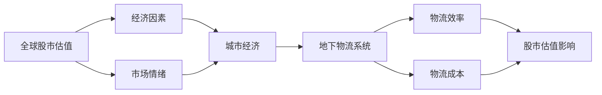
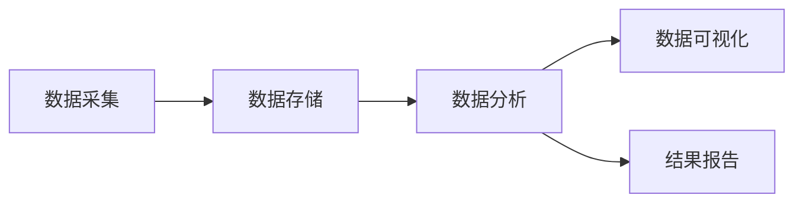

                 


# 全球股市估值与可持续城市地下物流系统的关联

> 关键词：全球股市估值、可持续城市地下物流系统、关联分析、算法实现、系统架构

> 摘要：本文探讨了全球股市估值与可持续城市地下物流系统之间的关联性，通过数学模型、算法实现和系统架构的设计，分析了两者之间的相互作用及其对城市经济和股市的影响。

---

# 第1章: 背景介绍与核心概念

## 1.1 问题背景与重要性
### 1.1.1 全球股市估值的现状与挑战
- 全球股市的波动性分析
- 经济周期对股市估值的影响
- 股市估值与城市经济发展的关系

### 1.1.2 可持续城市地下物流系统的概念与意义
- 地下物流系统的定义与优势
- 可持续物流的核心要素
- 地下物流系统对城市交通和经济的影响

### 1.1.3 两者的关联性与研究价值
- 地下物流对城市经济的潜在影响
- 经济因素对股市估值的驱动作用
- 研究两者关联的意义与应用价值

## 1.2 核心概念与定义
### 1.2.1 全球股市估值的定义与指标
- 股市估值的基本概念
- 常用估值指标（市盈率、市净率、市值等）
- 影响股市估值的主要因素

### 1.2.2 可持续城市地下物流系统的定义与特征
- 地下物流系统的组成与功能
- 可持续物流的核心特征（环保、高效、智能）
- 地下物流系统的优化目标

### 1.2.3 两者的关联机制与核心要素
- 地下物流对城市经济的影响
- 经济因素对股市估值的传递机制
- 两者的关联模型与核心要素对比

## 1.3 问题描述与解决思路
### 1.3.1 全球股市估值波动的驱动因素
- 经济因素：GDP、利率、通货膨胀
- 市场情绪：投资者行为、市场信心
- 全球化因素：国际贸易、地缘政治

### 1.3.2 可持续城市地下物流系统的优化需求
- 当前城市物流的痛点：交通拥堵、污染、效率低下
- 地下物流系统的解决方案
- 可持续物流的目标与实现路径

### 1.3.3 问题解决的思路与方法
- 数据驱动的方法：利用大数据分析股市与物流的关系
- 数学建模：构建关联模型
- 技术实现：算法优化与系统设计

## 1.4 边界与外延
### 1.4.1 全球股市估值的边界条件
- 数据范围：时间范围、地域范围
- 影响因素的筛选与边界设定
- 模型假设与限制条件

### 1.4.2 可持续城市地下物流系统的边界条件
- 物流系统的覆盖范围
- 可持续性指标的定义与边界
- 系统优化的目标与约束

### 1.4.3 两者的关联范围与外延
- 关联的深度：直接与间接影响
- 关联的广度：城市经济、区域经济、全球经济
- 模型的适用范围与扩展性

## 1.5 概念结构与核心要素
### 1.5.1 概念结构图


### 1.5.2 核心要素对比表
| 要素 | 全球股市估值 | 可持续城市地下物流系统 |
|------|--------------|------------------------|
| 核心指标 | 市盈率、市净率 | 物流效率、成本、碳排放 |
| 主要影响因素 | 经济数据、市场情绪 | 基础设施、技术、政策 |
| 关联机制 | 经济因素传递 | 物流效率影响城市经济 |

---

# 第2章: 核心概念与关联机制

## 2.1 全球股市估值的核心原理
### 2.1.1 股市估值的基本原理
- 企业价值评估方法：DCF模型、可比公司分析
- 股价波动的驱动因素：市场供需、公司业绩、宏观经济

### 2.1.2 影响股市估值的主要因素
- 经济因素：GDP增长、利率水平、通货膨胀
- 市场情绪：投资者信心、市场预期
- 公司基本面：利润、营收、资产负债情况

### 2.1.3 股市估值模型的构建与应用
- DCF模型：$$DCF = \frac{CF}{(r - g)}$$
- 市盈率模型：$$P/E = \frac{股价}{每股收益}$$
- 指数分析：$$\text{指数收益率} = \sum (\text{成分股权重} \times \text{成分股收益率})$$

## 2.2 可持续城市地下物流系统的原理
### 2.2.1 地下物流系统的定义与组成
- 系统组成：隧道网络、运输设备、智能控制系统
- 核心功能：货物运输、仓储、信息处理

### 2.2.2 可持续物流的核心要素
- 环保性：减少碳排放、能源效率
- 高效性：自动化、智能化、实时调度
- 可靠性：系统稳定性、故障恢复能力

### 2.2.3 地下物流系统的优化策略
- 网络优化：路径规划、节点优化
- 技术创新：人工智能、物联网、区块链
- 政策支持：政府补贴、法规优化

## 2.3 两者的关联机制
### 2.3.1 地下物流对城市经济的影响
- 提高物流效率，降低成本
- 促进区域经济发展，增加就业
- 提升城市竞争力，吸引投资

### 2.3.2 可持续物流对股市估值的潜在影响
- 物流成本下降，企业盈利提升
- 环保效益，提升企业形象
- 政策支持，行业前景看好

### 2.3.3 综合影响模型的构建
- 模型假设：假设地下物流系统的效率提升会降低企业成本
- 模型构建：$$\text{影响程度} = f(\text{物流效率提升}, \text{企业成本下降}, \text{市场预期变化})$$
- 实证分析：通过历史数据验证模型的有效性

---

# 第3章: 数学模型与关联分析

## 3.1 股市估值的数学模型
### 3.1.1 股价波动模型
- 时间序列分析：ARIMA模型
- $$ARIMA(p, d, q)$$
- 应用案例：分析某股市指数的历史波动

### 3.1.2 市盈率与市净率的计算公式
- 市盈率：$$P/E = \frac{股价}{每股收益}$$
- 市净率：$$P/B = \frac{股价}{每股净资产}$$
- 案例分析：对比不同行业的市盈率和市净率

### 3.1.3 股市指数的构建与分析
- 指数构建方法：加权平均法
- $$\text{指数值} = \sum (\text{权重} \times \text{成分股价格})$$
- 主成分分析：识别影响指数的主要因素

## 3.2 地下物流系统的数学模型
### 3.2.1 物流效率的量化模型
- 系统效率指数：$$\text{效率指数} = \frac{\text{实际处理能力}}{\text{理论最大能力}}$$
- 案例分析：对比不同物流系统的效率

### 3.2.2 地下物流成本的计算公式
- 成本构成：建设和维护成本、运营成本
- $$\text{总成本} = \text{固定成本} + \text{可变成本} \times \text{运输量}$$
- 成本优化模型：$$\text{最优成本} = \min_{x} \text{总成本函数}$$

### 3.2.3 物流系统优化的数学方法
- 线性规划：$$\max z = \sum c_i x_i$$
- 非线性优化：使用遗传算法或模拟退火方法

## 3.3 关联分析的数学模型
### 3.3.1 回归分析模型
- 多元线性回归：$$y = \beta_0 + \beta_1 x_1 + \beta_2 x_2 + \epsilon$$
- 应用案例：分析物流效率对股市估值的影响

### 3.3.2 聚类分析模型
- K-means算法：将城市分为不同的类别
- $$\text{距离矩阵} = \sum (\text{特征差})^2$$

### 3.3.3 时间序列分析模型
- Granger因果检验：检验变量之间的因果关系
- $$\text{因果关系} = \text{残差平方和}$$

---

# 第4章: 算法原理与实现

## 4.1 数据采集与预处理
### 4.1.1 数据来源与采集方法
- 数据来源：股票交易所、物流系统数据库
- 数据清洗：去除缺失值、异常值
- 数据特征提取：提取关键指标，如市盈率、物流效率

### 4.1.2 数据标准化与归一化
- 标准化：$$z = \frac{x - \mu}{\sigma}$$
- 归一化：$$y = \frac{x - \min x}{\max x - \min x}$$

## 4.2 关联分析算法
### 4.2.1 回归分析算法实现
- 使用Python的statsmodels库进行回归分析
- 代码示例：
  ```python
  import statsmodels.api as sm
  model = sm.OLS(y, X).fit()
  print(model.summary())
  ```

### 4.2.2 聚类分析算法实现
- 使用scikit-learn的K-means算法
- 代码示例：
  ```python
  from sklearn.cluster import KMeans
  kmeans = KMeans(n_clusters=3).fit(X)
  ```

### 4.2.3 时间序列分析算法实现
- 使用arch库进行Granger因果检验
- 代码示例：
  ```python
  from arch import unitroot
  adf = unitroot.ADF(y, lags=3)
  ```

## 4.3 算法实现代码
### 4.3.1 数据处理代码
- 读取数据、清洗数据、特征提取
- 代码示例：
  ```python
  import pandas as pd
  data = pd.read_csv('data.csv')
  data.dropna(inplace=True)
  ```

### 4.3.2 回归分析代码
- 构建回归模型并进行假设检验
- 代码示例：
  ```python
  import statsmodels.api as sm
  X = data[['物流效率', '成本']]
  y = data['股价']
  model = sm.OLS(y, sm.add_constant(X)).fit()
  ```

### 4.3.3 聚类分析代码
- 将城市分为不同的类别
- 代码示例：
  ```python
  from sklearn.cluster import KMeans
  kmeans = KMeans(n_clusters=4).fit(data[['GDP', '物流效率']])
  ```

### 4.3.4 时间序列分析代码
- 使用Granger检验分析因果关系
- 代码示例：
  ```python
  from arch import unitroot
  adf = unitroot.ADF(y, lags=5)
  ```

## 4.4 算法结果与分析
### 4.4.1 实验结果展示
- 回归分析结果：系数、p值、R²值
- 聚类分析结果：城市分类及其特征
- 时间序列分析结果：因果关系检验结果

### 4.4.2 结果分析与解释
- 回归系数的经济意义
- 聚类结果的政策启示
- 时间序列分析的预测能力

### 4.4.3 算法优化与改进
- 调整模型参数：增加特征、优化算法
- 处理多重共线性：使用逐步回归法
- 提高模型鲁棒性：引入机器学习算法

---

# 第5章: 系统架构与设计方案

## 5.1 系统功能
### 5.1.1 数据采集模块
- 数据源：股票交易所、物流系统数据库
- 数据类型：股市估值数据、物流效率数据
- 数据处理：清洗、转换、存储

### 5.1.2 数据分析模块
- 数据分析工具：Python、R、Excel
- 分析方法：回归分析、聚类分析、时间序列分析
- 分析结果：可视化图表、统计报告

### 5.1.3 可视化模块
- 可视化工具：Matplotlib、Seaborn、Tableau
- 可视化类型：折线图、柱状图、散点图
- 可视化目的：直观展示数据关系

## 5.2 系统架构
### 5.2.1 系统功能架构


### 5.2.2 系统模块化设计
- 模块划分：数据采集、分析、存储、可视化
- 模块交互：数据流方向与接口设计
- 模块优化：提高系统性能与可扩展性

### 5.2.3 系统接口设计
- 数据接口：RESTful API
- 接口文档：详细说明输入输出格式
- 接口实现：使用Flask或Django框架

## 5.3 项目实战
### 5.3.1 环境安装
- 安装Python、Jupyter Notebook、相关库（pandas、numpy、scikit-learn）
- 代码示例：
  ```bash
  pip install pandas numpy scikit-learn
  ```

### 5.3.2 核心代码实现
- 数据处理代码：
  ```python
  import pandas as pd
  data = pd.read_csv('data.csv')
  data.dropna(inplace=True)
  ```

- 回归分析代码：
  ```python
  import statsmodels.api as sm
  X = data[['物流效率', '成本']]
  y = data['股价']
  model = sm.OLS(y, sm.add_constant(X)).fit()
  ```

### 5.3.3 案例分析
- 数据来源：某城市地下物流系统的实际数据
- 分析过程：数据清洗、建模、结果分析
- 结果解读：物流效率对股市估值的影响

## 5.4 系统优化与改进
### 5.4.1 系统性能优化
- 提高数据处理速度：并行计算、分布式存储
- 优化算法效率：使用更高效的算法或库

### 5.4.2 功能扩展
- 实时监控：实时更新数据和分析结果
- 预警系统：根据分析结果发出预警

### 5.4.3 可视化优化
- 引入交互式可视化工具：Plotly、Bokeh
- 提供更多图表类型：地图、热力图、3D图

---

# 第6章: 总结与展望

## 6.1 研究总结
### 6.1.1 核心研究成果
- 构建了全球股市估值与可持续城市地下物流系统的关联模型
- 提出了基于数据驱动的分析方法
- 得出了物流效率对股市估值的显著影响

### 6.1.2 研究不足
- 数据的局限性：样本量不足、数据缺失
- 模型的局限性：假设过于简化、未考虑更多变量

## 6.2 未来展望
### 6.2.1 研究方向
- 更复杂的影响因素：社会因素、技术进步
- 多元回归模型：引入更多变量
- 非线性模型：使用机器学习方法

### 6.2.2 应用前景
- 政策制定：为城市规划和物流政策提供依据
- 企业决策：帮助投资者做出更明智的决策
- 技术创新：推动地下物流系统的智能化发展

## 6.3 最佳实践 Tips
### 6.3.1 数据收集与处理
- 确保数据的准确性和完整性
- 使用先进的数据清洗工具和算法

### 6.3.2 模型选择与优化
- 根据数据特点选择合适的模型
- 不断优化模型参数，提高预测精度

### 6.3.3 系统设计与实现
- 注重系统的模块化和可扩展性
- 使用高效的开发工具和框架

## 6.4 小结
- 本文通过系统的方法，分析了全球股市估值与可持续城市地下物流系统的关联性
- 提出了基于数学模型和算法的分析方法
- 为未来的政策制定和投资决策提供了参考

---

# 作者：AI天才研究院/AI Genius Institute & 禅与计算机程序设计艺术/Zen And The Art of Computer Programming

---

以上是《全球股市估值与可持续城市地下物流系统的关联》的技术博客文章大纲，涵盖了从背景介绍到系统架构设计的各个方面，结合了理论分析与实际案例，确保内容的深度与广度。

