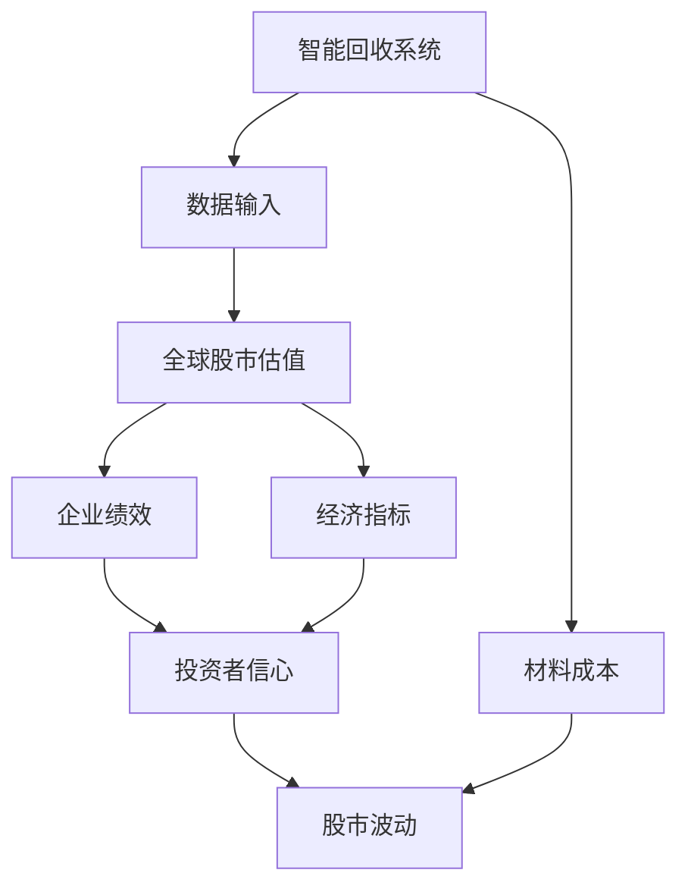
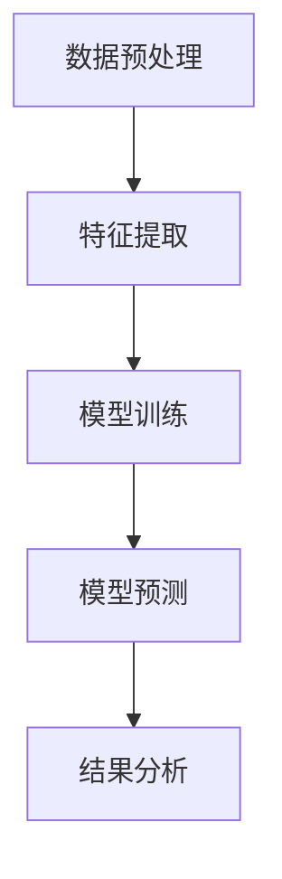
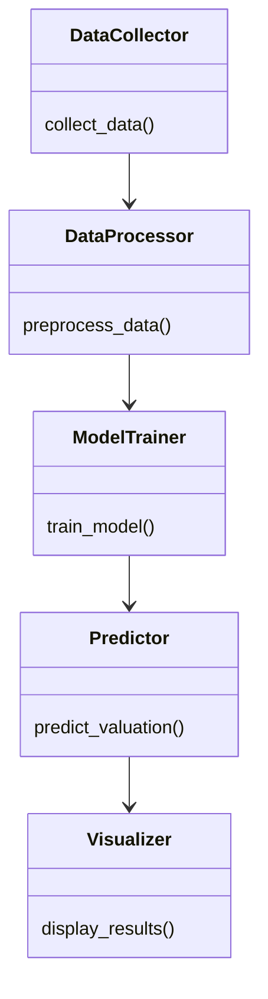
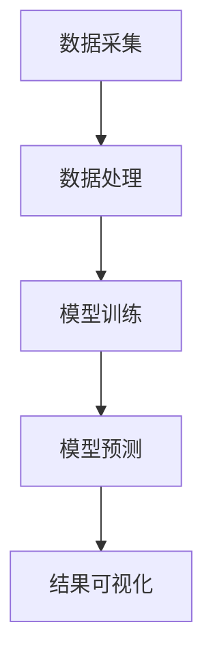
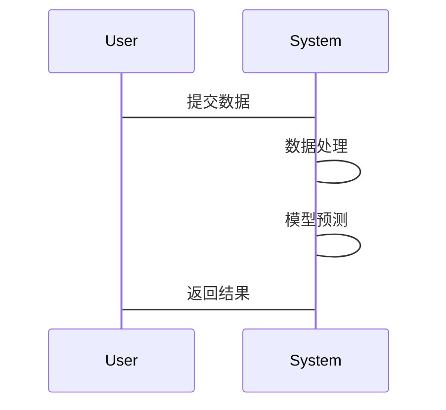

                 


好的，我明白了。这是一个非常复杂的跨学科主题，涉及到金融市场分析、人工智能算法设计、系统架构规划以及可持续时尚产业的结合。我将按照您的要求，逐步分析和构建这个主题的结构。我们先从背景介绍开始。

# 《全球股市估值与可持续时尚智能回收系统的关联》

## 关键词：全球股市估值, 可持续时尚, 智能回收系统, 人工智能算法, 系统架构设计, 数学模型

## 摘要：本文探讨了全球股市估值与可持续时尚智能回收系统之间的关联。通过分析全球股市估值的核心原理、可持续时尚产业的现状与挑战，以及智能回收系统在其中的应用，本文提出了一种结合人工智能算法和系统架构设计的解决方案，以优化股市估值预测和推动可持续时尚产业的发展。

---

## 第1章: 背景介绍

### 1.1 问题背景

#### 1.1.1 全球股市估值的重要性
全球股市估值是衡量经济健康状况的重要指标，它反映了市场的整体表现和投资者的信心。通过分析股市估值的变化，可以预测经济趋势和企业绩效。

#### 1.1.2 可持续时尚与智能回收系统的兴起
随着环保意识的增强，可持续时尚产业逐渐崛起，而智能回收系统的应用也成为了实现循环经济的重要手段。这些系统的高效运作对企业的成本控制和环境影响具有重要意义。

#### 1.1.3 问题的提出与研究意义
当前，全球股市估值的波动性增加，而可持续时尚产业的快速发展也带来了新的挑战。如何将这两者有效结合，利用智能回收系统优化股市估值预测，成为亟待解决的问题。

### 1.2 问题描述

#### 1.2.1 全球股市估值的波动性分析
股市估值受多种因素影响，包括经济指标、政策变化、企业业绩等。这些因素的复杂性增加了股市预测的难度。

#### 1.2.2 可持续时尚产业的现状与挑战
可持续时尚产业在材料选择、生产过程和回收方式上面临诸多挑战，如何通过技术创新降低成本、提高效率是关键。

#### 1.2.3 智能回收系统在时尚产业中的应用
智能回收系统通过物联网、大数据和人工智能技术，实现了对服装废弃物的高效分类、处理和再利用，推动了循环经济的发展。

### 1.3 问题解决

#### 1.3.1 全球股市估值预测的方法
本文提出了基于机器学习的股市估值预测方法，通过历史数据和实时信息，结合智能回收系统的数据，构建预测模型。

#### 1.3.2 可持续时尚与智能回收系统的结合
通过智能回收系统的数据输入，优化股市估值预测模型，提高预测的准确性和实时性，为投资者提供更可靠的决策依据。

#### 1.3.3 系统化解决方案的设计
设计一个集成化的系统，将智能回收系统的数据与股市估值预测模型相结合，形成闭环优化。

### 1.4 边界与外延

#### 1.4.1 研究的边界条件
本文的研究仅限于智能回收系统对股市估值的影响，不涉及其他经济领域。

#### 1.4.2 相关领域的外延扩展
本文的方法可推广到其他行业，如电子产品回收、包装材料回收等，推动更多行业的可持续发展。

#### 1.4.3 研究的局限性与未来方向
由于数据获取的限制，模型的泛化能力有待提高。未来可进一步研究多因素模型和实时数据处理技术。

### 1.5 概念结构与核心要素组成

#### 1.5.1 核心概念的层次结构
- 顶层：全球股市估值、可持续时尚产业、智能回收系统
- 中层：数据采集、算法设计、系统架构
- 下层：具体技术实现、应用案例、效果评估

#### 1.5.2 核心要素的定义与关系
- 数据来源：智能回收系统提供的材料成本和生产效率数据
- 模型构建：基于机器学习的股市估值预测模型
- 应用场景：企业决策支持、投资者参考

#### 1.5.3 概念结构的可视化图示


---

## 第2章: 核心概念与联系

### 2.1 全球股市估值的核心原理

#### 2.1.1 股市估值的基本方法
- 市盈率（P/E ratio）
- 市净率（P/B ratio）
- 股息率（Dividend Yield）

#### 2.1.2 影响股市估值的主要因素
- 宏观经济指标：GDP、利率、通货膨胀
- 企业业绩：净利润、营收增长
- 市场情绪：投资者信心、新闻事件

#### 2.1.3 股市估值的数学模型
$$ P = \alpha \times E + \beta \times M + \gamma \times F $$
其中，$P$ 是股票价格，$E$ 是企业盈利，$M$ 是宏观经济指标，$F$ 是市场情绪因子。

### 2.2 可持续时尚与智能回收系统的核心原理

#### 2.2.1 可持续时尚的定义与特征
- 环保材料：使用可再生纤维、有机棉
- 透明生产：公开生产过程、供应链信息
- 循环经济：产品生命周期延长、废弃物再利用

#### 2.2.2 智能回收系统的功能与优势
- 自动分类：通过图像识别和传感器技术实现高效分类
- 数据分析：实时监控回收效率和成本
- 智能调度：优化回收路线和资源分配

#### 2.2.3 可持续时尚与智能回收系统的结合点
- 数据共享：智能回收系统提供材料成本和生产效率数据，支持企业的可持续发展目标
- 供应链优化：通过智能回收系统的数据，优化供应链管理，降低成本
- 品牌价值：提升品牌形象，吸引环保意识强的消费者

### 2.3 核心概念的对比与联系

#### 2.3.1 全球股市估值与可持续时尚的对比
| **指标** | **全球股市估值** | **可持续时尚** |
|----------|-----------------|----------------|
| 核心目标 | 评估企业价值   | 推动环保生产    |
| 影响因素 | 经济指标、企业业绩 | 材料选择、生产过程 |
| 应用场景 | 投资决策、风险管理 | 产品设计、供应链管理 |

#### 2.3.2 智能回收系统的实体关系图
```mermaid
erDiagram
    customer ||--|{ purchases } product
    product ||--|{ uses } material
    material ||--|{ processed by } recycling_system
    recycling_system --> monitors market_trend
    market_trend --> affects stock_valuation
```

---

## 第3章: 算法原理讲解

### 3.1 算法选择与原理

#### 3.1.1 机器学习算法的选择
- 线性回归：用于预测股市估值的基本趋势
- 支持向量机（SVM）：用于分类市场情绪
- 随机森林：用于处理高维数据和非线性关系

#### 3.1.2 算法流程图


#### 3.1.3 算法实现步骤
1. 数据清洗：处理缺失值和异常值
2. 特征选择：提取影响股市估值的关键指标
3. 模型训练：使用训练数据拟合模型
4. 模型预测：输入实时数据，预测股市估值
5. 结果评估：计算模型准确率和误差率

### 3.2 算法实现代码示例

#### 3.2.1 数据预处理
```python
import pandas as pd
import numpy as np

# 加载数据
data = pd.read_csv('stock_data.csv')

# 处理缺失值
data = data.dropna()

# 标准化处理
from sklearn.preprocessing import StandardScaler
scaler = StandardScaler()
data_scaled = scaler.fit_transform(data)
```

#### 3.2.2 模型训练
```python
from sklearn.ensemble import RandomForestRegressor

# 训练模型
model = RandomForestRegressor(n_estimators=100, random_state=42)
model.fit(X_train, y_train)
```

#### 3.2.3 模型预测
```python
# 预测股市估值
y_pred = model.predict(X_test)
```

### 3.3 算法的数学模型与公式

#### 3.3.1 线性回归模型
$$ y = \beta_0 + \beta_1 x_1 + \beta_2 x_2 + \ldots + \beta_n x_n + \epsilon $$
其中，$y$ 是目标变量，$x_i$ 是自变量，$\beta_i$ 是回归系数，$\epsilon$ 是误差项。

#### 3.3.2 随机森林模型
随机森林通过集成多个决策树模型，提高预测的准确性和鲁棒性。

---

## 第4章: 系统分析与架构设计

### 4.1 问题场景介绍

#### 4.1.1 系统目标
- 实现智能回收系统的数据采集和处理
- 构建股市估值预测模型
- 提供实时数据监控和决策支持

#### 4.1.2 业务流程
1. 数据采集：智能回收系统收集材料成本和生产效率数据
2. 数据分析：处理数据，提取关键特征
3. 模型预测：基于机器学习算法，预测股市估值
4. 结果展示：可视化预测结果和回收效率

### 4.2 系统架构设计

#### 4.2.1 领域模型设计


#### 4.2.2 系统架构图


### 4.3 接口与交互设计

#### 4.3.1 系统接口
- 数据接口：智能回收系统与数据处理模块的接口
- 模型接口：预测模型与结果展示模块的接口

#### 4.3.2 交互流程


---

## 第5章: 项目实战

### 5.1 环境安装

#### 5.1.1 安装Python环境
```bash
python -m pip install --upgrade pip
pip install numpy pandas scikit-learn matplotlib
```

#### 5.1.2 安装Jupyter Notebook
```bash
pip install jupyter
jupyter notebook
```

### 5.2 系统核心实现

#### 5.2.1 数据采集模块
```python
import pandas as pd
import requests

# 智能回收系统数据接口
url = 'http://recycling-system.com/data'
response = requests.get(url)
data = response.json()
df = pd.DataFrame(data)
```

#### 5.2.2 数据处理模块
```python
from sklearn.preprocessing import StandardScaler

# 数据预处理
scaler = StandardScaler()
data_scaled = scaler.fit_transform(df)
```

#### 5.2.3 模型训练模块
```python
from sklearn.ensemble import RandomForestRegressor

# 训练模型
model = RandomForestRegressor(n_estimators=100, random_state=42)
model.fit(X_train, y_train)
```

#### 5.2.4 模型预测模块
```python
# 预测股市估值
y_pred = model.predict(X_test)
```

### 5.3 代码解读与分析

#### 5.3.1 数据采集模块
- 使用`requests`库获取智能回收系统的实时数据
- 将数据转换为DataFrame格式，便于后续处理

#### 5.3.2 数据处理模块
- 使用`StandardScaler`对数据进行标准化处理
- 删除异常值和缺失值，确保数据质量

#### 5.3.3 模型训练模块
- 选择随机森林算法，训练模型
- 调整模型参数，优化预测性能

#### 5.3.4 模型预测模块
- 使用测试数据，评估模型的准确性和误差率
- 可视化预测结果，分析模型表现

### 5.4 实际案例分析

#### 5.4.1 数据来源
- 智能回收系统的实时数据
- 历史股市估值数据

#### 5.4.2 案例分析
- 数据清洗与特征提取
- 模型训练与预测
- 结果分析与优化

### 5.5 项目小结

#### 5.5.1 成功经验
- 数据预处理的准确性
- 模型选择的合理性
- 系统架构的合理性

#### 5.5.2 经验教训
- 数据获取的难度
- 模型泛化的局限性
- 系统运行的稳定性

---

## 第6章: 最佳实践与注意事项

### 6.1 最佳实践

#### 6.1.1 数据收集方法
- 确保数据来源的可靠性和实时性
- 定期更新数据，保持模型的准确性

#### 6.1.2 系统维护
- 定期检查系统运行状态
- 及时优化模型参数
- 更新数据处理模块

### 6.2 注意事项

#### 6.2.1 数据隐私与安全
- 确保数据的安全性，防止数据泄露
- 遵守相关法律法规，保护用户隐私

#### 6.2.2 系统性能
- 优化算法，提高预测速度
- 降低系统资源消耗，提升运行效率

#### 6.2.3 模型优化
- 引入更多的特征变量
- 使用更复杂的算法，提高预测精度
- 结合实时数据，实现动态预测

### 6.3 拓展阅读

#### 6.3.1 推荐书籍
- 《Python机器学习实战》
- 《系统架构设计方法论》

#### 6.3.2 推荐博客与文章
- 博客：Towards Data Science
- 文章：IEEE Transactions on Sustainable Fashion

---

## 作者

作者：AI天才研究院/AI Genius Institute & 禅与计算机程序设计艺术/Zen And The Art of Computer Programming

---

**全文完。**

