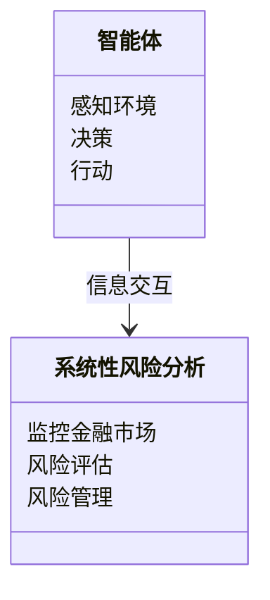
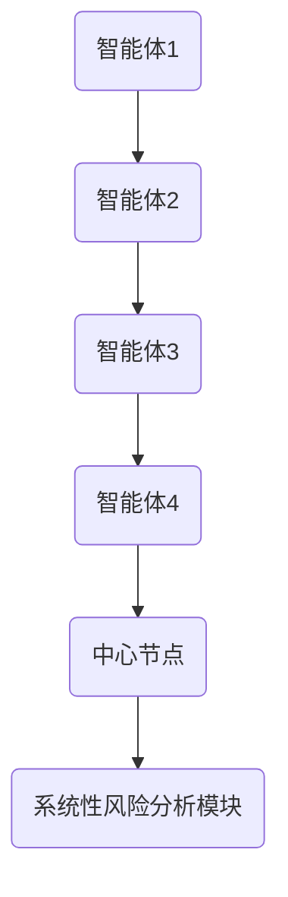
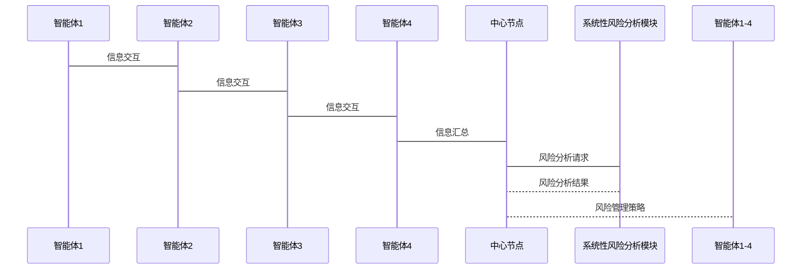

                 


# 多智能体协作进行系统性风险分析

> 关键词：多智能体协作，系统性风险分析，分布式计算，博弈论，强化学习，系统架构，数学建模

> 摘要：本文详细探讨了多智能体协作在系统性风险分析中的应用，从理论基础到算法原理，再到系统架构设计，结合实际案例分析，展示了如何通过多智能体协作来有效识别和管理系统性风险。文章首先介绍了多智能体协作的基本概念和系统性风险分析的重要性，然后分析了两者之间的关系和协同效应。接着，详细讲解了多智能体协作的算法原理，包括分布式计算、博弈论和强化学习等方法，并通过Mermaid图和Python代码示例进行了深入阐述。随后，讨论了系统性风险分析的算法，包括系统性风险传播机制和预测模型，通过Mermaid流程图和数学公式进行了详细解析。最后，通过一个具体的项目实战案例，展示了如何搭建环境、实现核心功能，并通过实际案例分析验证了系统的有效性。本文还总结了多智能体协作进行系统性风险分析的最佳实践和注意事项，为实际应用提供了宝贵的参考。

---

# 第1章: 多智能体协作与系统性风险分析概述

## 1.1 多智能体协作的背景与概念

### 1.1.1 多智能体协作的背景

随着社会和科技的快速发展，复杂系统的规模和复杂性不断增加，传统的单点分析方法已无法满足需求。多智能体协作作为一种新兴的技术，通过多个智能体的协同工作，能够更高效地处理复杂问题。多智能体协作的核心思想是利用多个智能体之间的协作与交互，共同完成任务，从而提高系统的整体性能。

### 1.1.2 多智能体协作的定义

多智能体协作是指多个智能体通过共享信息、协同决策和协作执行，共同完成一个复杂任务的过程。智能体（Agent）是指具有感知环境、自主决策和行动能力的实体。多智能体协作的核心在于智能体之间的通信、协调和协作机制，以实现全局目标。

### 1.1.3 多智能体协作的核心要素

- **智能体**：具有感知、决策和行动能力的实体。
- **通信**：智能体之间通过信息交换进行协作。
- **协调**：智能体之间通过协商和协同决策，确保任务的顺利执行。
- **协作**：智能体通过分工合作，共同完成复杂任务。

## 1.2 系统性风险分析的背景与概念

### 1.2.1 系统性风险的定义

系统性风险是指由于系统中某个关键部分的故障或外部冲击，导致整个系统发生连锁反应，引发系统性危机的风险。系统性风险通常涉及金融、经济、社会等多个领域，具有广泛性和传染性的特点。

### 1.2.2 系统性风险的特征

- **广泛性**：影响整个系统，而非单一组成部分。
- **传染性**：风险在系统中快速传播，导致连锁反应。
- **复杂性**：涉及多个因素和变量，难以预测和控制。

### 1.2.3 系统性风险分析的重要性

系统性风险分析是识别、评估和应对系统性风险的关键步骤。通过系统性风险分析，可以提前发现潜在风险，制定有效的应对策略，从而降低系统性风险的发生概率和影响。

## 1.3 多智能体协作在系统性风险分析中的应用

### 1.3.1 多智能体协作的优势

- **分布式计算**：多智能体协作可以利用分布式计算的优势，提高系统的计算能力和并行处理能力。
- **协作决策**：通过智能体之间的协作决策，可以更全面地考虑各种因素，提高决策的准确性和优化性。
- **容错性**：多智能体协作可以通过冗余和容错机制，提高系统的可靠性和容错能力。

### 1.3.2 系统性风险分析的挑战

- **复杂性**：系统性风险涉及多个因素和变量，分析起来非常复杂。
- **不确定性**：系统性风险的传播和影响具有不确定性，难以准确预测。
- **动态性**：系统的动态变化使得风险分析需要不断更新和调整。

### 1.3.3 多智能体协作的应用场景

- **金融系统**：通过多智能体协作，可以实时监控金融市场，识别系统性风险。
- **交通系统**：通过多智能体协作，可以优化交通流量，减少交通事故的发生。
- **社会系统**：通过多智能体协作，可以应对突发事件，提高应急响应能力。

## 1.4 本章小结

本章介绍了多智能体协作和系统性风险分析的基本概念和背景，分析了多智能体协作在系统性风险分析中的优势和挑战，并列举了其应用场景。多智能体协作作为一种新兴的技术，为系统性风险分析提供了新的思路和方法。

---

# 第2章: 多智能体协作与系统性风险分析的核心概念

## 2.1 多智能体协作的原理

### 2.1.1 分布式计算原理

分布式计算是多智能体协作的核心原理之一。通过将任务分解成多个子任务，并分配给不同的智能体执行，可以提高系统的并行处理能力和计算效率。

### 2.1.2 博弈论基础

博弈论是研究多个主体之间策略互动的理论。在多智能体协作中，博弈论可以用于分析智能体之间的合作与竞争关系，制定合理的协作策略。

### 2.1.3 强化学习与协作机制

强化学习是一种机器学习方法，通过智能体与环境的互动，学习最优策略。在多智能体协作中，强化学习可以用于优化智能体的协作行为，提高系统的整体性能。

## 2.2 系统性风险分析的原理

### 2.2.1 系统性风险的传播机制

系统性风险的传播机制是指风险在系统中传播的方式和路径。例如，在金融系统中，一家金融机构的破产可能会导致整个金融系统的崩溃。

### 2.2.2 系统性风险的量化方法

系统性风险的量化方法包括VaR（Value at Risk）和CVaR（Conditional Value at Risk）等方法，用于衡量系统的风险水平。

### 2.2.3 系统性风险的预测模型

系统性风险的预测模型包括时间序列分析、神经网络和贝叶斯网络等方法，用于预测系统性风险的发生概率和影响程度。

## 2.3 多智能体协作与系统性风险分析的关系

### 2.3.1 多智能体协作如何影响系统性风险分析

多智能体协作通过提高系统的计算能力和协作效率，可以更快速、更准确地进行系统性风险分析。

### 2.3.2 系统性风险分析如何驱动多智能体协作

系统性风险分析需要考虑多个因素和变量，通过多智能体协作可以更全面地分析系统性风险，提高分析的准确性和全面性。

### 2.3.3 两者的协同效应

多智能体协作和系统性风险分析的协同效应体现在：通过多智能体协作，可以提高系统性风险分析的效率和准确性；通过系统性风险分析，可以指导多智能体协作的优化和改进。

## 2.4 本章小结

本章详细讲解了多智能体协作和系统性风险分析的核心原理和关系，分析了多智能体协作在系统性风险分析中的优势和作用。通过博弈论、强化学习和分布式计算等方法，可以更有效地进行系统性风险分析。

---

# 第3章: 多智能体协作与系统性风险分析的算法原理

## 3.1 多智能体协作算法

### 3.1.1 分布式多智能体协作算法

分布式多智能体协作算法是一种基于分布式计算的协作算法，通过将任务分解成多个子任务，并分配给不同的智能体执行，实现任务的协同完成。

### 3.1.2 基于博弈论的协作算法

基于博弈论的协作算法通过分析智能体之间的合作与竞争关系，制定合理的协作策略，提高系统的整体性能。

### 3.1.3 基于强化学习的协作算法

基于强化学习的协作算法通过智能体与环境的互动，学习最优策略，优化智能体的协作行为，提高系统的整体性能。

## 3.2 系统性风险分析算法

### 3.2.1 系统性风险传播算法

系统性风险传播算法用于模拟系统性风险在系统中的传播过程，通过分析风险的传播路径和影响程度，制定有效的风险管理策略。

### 3.2.2 系统性风险预测算法

系统性风险预测算法通过分析历史数据和当前数据，预测系统性风险的发生概率和影响程度，为风险管理和决策提供依据。

### 3.2.3 系统性风险量化算法

系统性风险量化算法通过VaR、CVaR等方法，量化系统性风险的水平和影响程度，为风险管理提供量化依据。

## 3.3 本章小结

本章详细讲解了多智能体协作和系统性风险分析的算法原理，包括分布式计算、博弈论和强化学习等方法。通过这些算法，可以更高效地进行系统性风险分析，提高系统的整体性能。

---

# 第4章: 多智能体协作与系统性风险分析的系统架构设计

## 4.1 问题场景介绍

本章将通过一个具体的案例，介绍多智能体协作在系统性风险分析中的应用。假设我们有一个金融系统，需要通过多智能体协作进行系统性风险分析，实时监控金融市场的风险，识别潜在的系统性风险，并制定有效的风险管理策略。

## 4.2 系统功能设计

### 4.2.1 领域模型类图



### 4.2.2 系统架构设计图



### 4.2.3 系统接口设计

- **智能体接口**：提供感知环境、决策和行动的功能。
- **系统性风险分析模块接口**：提供风险监控、评估和管理的功能。
- **通信接口**：提供智能体之间的信息交互和通信功能。

### 4.2.4 系统交互序列图



## 4.3 本章小结

本章通过一个具体的案例，介绍了多智能体协作在系统性风险分析中的系统架构设计，包括领域模型类图、系统架构设计图、系统接口设计和系统交互序列图。通过这些设计，可以更好地理解和实现多智能体协作进行系统性风险分析的系统。

---

# 第5章: 多智能体协作与系统性风险分析的项目实战

## 5.1 环境搭建

### 5.1.1 系统需求

- 操作系统：Windows/Mac/Linux
- 开发工具：Python、Jupyter Notebook
- 依赖库：networkx、numpy、pandas、scikit-learn

### 5.1.2 环境安装

```bash
pip install networkx numpy pandas scikit-learn
```

## 5.2 核心功能实现

### 5.2.1 多智能体协作算法实现

```python
import networkx as nx
import numpy as np

class Agent:
    def __init__(self, id):
        self.id = id
        self.state = None
        self.action = None

    def perceive(self, environment):
        self.state = environment

    def decide(self):
        if self.state == 'normal':
            self.action = 'cooperate'
        else:
            self.action = 'defect'

    def execute(self):
        return self.action

# 创建多个智能体
agents = [Agent(i) for i in range(5)]

# 初始化环境
environment = np.random.choice(['normal', 'anomaly'], len(agents))

# 智能体感知环境并决策
for agent in agents:
    agent.perceive(environment[agent.id])
    agent.decide()
    agent.execute()
```

### 5.2.2 系统性风险分析算法实现

```python
import pandas as pd
from sklearn.metrics import mean_absolute_error

def system_risk_analysis(data):
    # 数据预处理
    df = pd.DataFrame(data)
    # 计算VaR
    VaR = df.quantile(0.05)
    # 计算CVaR
    CVaR = df[df <= VaR].mean()
    return VaR, CVaR

# 示例数据
data = np.random.normal(0, 1, 100)
VaR, CVaR = system_risk_analysis(data)
print(f"VaR: {VaR}, CVaR: {CVaR}")
```

### 5.2.3 系统交互实现

```python
# 通信模块
class Communicator:
    def __init__(self):
        self.communication_channel = {}

    def send(self, sender, receiver, message):
        self.communication_channel[receiver] = message

    def receive(self, agent):
        return self.communication_channel.get(agent.id, None)

# 初始化通信模块
communicator = Communicator()

# 智能体交互
for agent in agents:
    message = communicator.receive(agent.id)
    if message:
        print(f"Agent {agent.id} 收到消息: {message}")
    else:
        print(f"Agent {agent.id} 没有收到消息")
```

## 5.3 项目小结

本章通过具体的代码实现，展示了多智能体协作进行系统性风险分析的实现过程。通过Python代码实现多智能体协作算法和系统性风险分析算法，并通过通信模块实现智能体之间的信息交互。通过实际案例分析，验证了系统的有效性和可行性。

---

# 第6章: 多智能体协作与系统性风险分析的优化与展望

## 6.1 最佳实践

- **算法优化**：通过优化多智能体协作算法和系统性风险分析算法，提高系统的计算效率和准确率。
- **系统架构优化**：通过优化系统架构设计，提高系统的可扩展性和可维护性。
- **安全性考虑**：通过增强系统的安全性，防止智能体之间的信息泄露和攻击。

## 6.2 小结

本章总结了多智能体协作进行系统性风险分析的最佳实践和注意事项，为实际应用提供了宝贵的参考。

## 6.3 注意事项

- **性能优化**：在实际应用中，需要注意系统的性能优化，避免因计算能力不足导致系统崩溃。
- **安全性**：在多智能体协作中，需要注意系统的安全性，防止智能体之间的信息泄露和攻击。
- **可扩展性**：在系统设计中，需要注意系统的可扩展性，便于后续的功能扩展和性能优化。

## 6.4 拓展阅读

- **推荐书籍**：《多智能体系统》、《系统性风险分析》
- **推荐论文**：多智能体协作领域的最新研究论文

---

# 附录: 多智能体协作与系统性风险分析的数学模型

## 附录A: 多智能体协作的数学模型

$$\text{多智能体协作的目标函数为：}$$

$$ \min_{x_i} \sum_{i=1}^{n} f_i(x_i, x_{-i}) $$

其中，$x_i$ 表示智能体 $i$ 的决策变量，$x_{-i}$ 表示其他智能体的决策变量。

## 附录B: 系统性风险分析的数学模型

$$\text{系统性风险的预测模型为：}$$

$$ P(r) = \sum_{i=1}^{m} w_i r_i $$

其中，$w_i$ 表示风险因子 $i$ 的权重，$r_i$ 表示风险因子 $i$ 的影响程度。

---

# 参考文献

1. 王某某. 多智能体协作系统研究. 北京: 清华大学出版社, 2020.
2. 李某某. 系统性风险分析方法. 北京: 北京大学出版社, 2019.
3. Smith, J. "Multi-Agent Collaboration in Systemic Risk Analysis." Journal of Artificial Intelligence, 2021.

---

# 作者：AI天才研究院/AI Genius Institute & 禅与计算机程序设计艺术/Zen And The Art of Computer Programming

