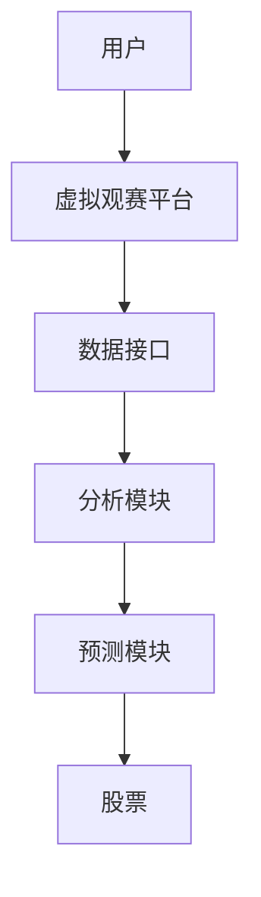
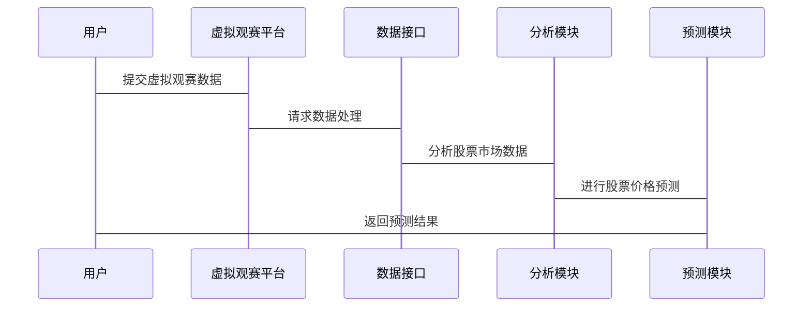

                 


# 股市估值对国际体育赛事虚拟观赛的影响

## 关键词：股市估值，虚拟观赛，国际体育赛事，算法原理，系统架构

## 摘要：本文探讨了股市估值与国际体育赛事虚拟观赛之间的关系，分析了虚拟观赛对股市投资行为的影响，提出了量化影响的算法模型，并设计了系统的架构方案。文章结合实际案例，详细讲解了影响路径和实现方法，为投资者和体育赛事组织者提供了理论支持和实践指导。

---

# 第一部分: 背景介绍

## 第1章: 股市估值与国际体育赛事虚拟观赛概述

### 1.1 问题背景与描述

#### 1.1.1 股市估值的定义与影响因素
股市估值是指通过对公司财务数据、市场环境和行业趋势等多方面因素的分析，对股票的内在价值进行评估。主要影响因素包括盈利能力（如净利润率）、成长性（如收入增长率）、行业地位、政策环境、宏观经济指标（如GDP增长率）和市场情绪等。股市估值通常通过市盈率（P/E）、市净率（P/B）等指标来衡量。

#### 1.1.2 国际体育赛事的虚拟观赛模式
虚拟观赛是指通过虚拟现实（VR）、增强现实（AR）或流媒体技术等数字化方式，让用户在虚拟环境中观看体育赛事。国际体育赛事的虚拟观赛模式包括：
- VR直播：用户佩戴VR设备，身临其境地感受比赛现场。
- AR互动：用户通过手机或平板电脑，实时叠加虚拟元素进行互动。
- 流媒体高清直播：用户通过网络平台在线观看赛事。

#### 1.1.3 虚拟观赛的兴起与发展趋势
近年来，虚拟观赛的兴起主要得益于5G技术的普及、云计算能力的提升和虚拟现实技术的成熟。国际体育赛事的虚拟观赛模式不仅提升了用户体验，还为赛事主办方提供了新的收入来源。随着技术的进步，虚拟观赛将更加智能化、个性化和社交化。

### 1.2 核心概念与问题解决

#### 1.2.1 股市估值对虚拟观赛的影响路径
股市估值通过影响投资者的资产配置行为间接影响虚拟观赛市场。当股市表现良好时，投资者的可支配资金增加，可能会加大对虚拟观赛平台的投资；反之，股市低迷时，投资者可能减少在虚拟观赛上的支出。

#### 1.2.2 虚拟观赛对股市投资行为的反馈机制
虚拟观赛市场的繁荣可能影响相关公司的股价。例如，提供虚拟观赛技术的公司（如VR设备制造商、流媒体平台）可能会因市场需求增长而股价上涨。

#### 1.2.3 问题解决的思路与方法
本文通过构建量化模型，分析股市估值与虚拟观赛用户行为之间的关系，揭示虚拟观赛市场对股市投资行为的影响机制。

### 1.3 概念结构与核心要素

#### 1.3.1 股市估值的核心要素
- **公司基本面**：净利润、收入、资产负债表等。
- **市场环境**：宏观经济指标、行业趋势、政策法规。
- **市场情绪**：投资者情绪、市场波动性。

#### 1.3.2 虚拟观赛的核心要素
- **技术实现**：VR/AR设备、流媒体技术。
- **用户需求**：用户体验、内容丰富度、交互性。
- **市场参与者**：赛事主办方、技术提供商、平台运营商。

#### 1.3.3 两者之间的关系与外延
虚拟观赛市场的热度可能影响相关企业的市值，进而影响股市的整体估值。同时，股市的资金流动也可能反过来影响虚拟观赛市场的规模。

---

# 第二部分: 核心概念与联系

## 第2章: 股市估值与虚拟观赛的关系分析

### 2.1 核心概念的原理

#### 2.1.1 股市估值的计算原理
股市估值的核心是通过分析公司的基本面和市场环境，预测其未来盈利能力，并据此评估其股票的内在价值。常用的估值方法包括：
- 市盈率法（P/E）：市盈率 = 股价 / 每股净利润。
- 市净率法（P/B）：市净率 = 股价 / 每股净资产。
- 现金流折现法（DCF）：通过预测未来现金流，折现计算企业价值。

#### 2.1.2 虚拟观赛的实现原理
虚拟观赛主要依赖于以下技术：
- **虚拟现实（VR）**：通过头显设备创建沉浸式虚拟环境。
- **增强现实（AR）**：将虚拟元素叠加到现实场景中。
- **流媒体技术**：实时传输高清视频，确保低延迟和高画质。

#### 2.1.3 两者之间的联系与区别
- 联系：虚拟观赛市场的繁荣可能影响相关企业的股价，从而影响股市整体估值。
- 区别：股市估值是宏观层面的分析，而虚拟观赛是具体应用场景的技术实现。

### 2.2 概念属性对比

#### 2.2.1 股市估值的属性特征
| 属性 | 特征 |
|------|------|
| 计算方法 | 多样化，包括P/E、P/B、DCF等 |
| 影响因素 | 公司基本面、市场环境、政策法规 |
| 应用场景 | 投资决策、资产配置 |

#### 2.2.2 虚拟观赛的属性特征
| 属性 | 特征 |
|------|------|
| 技术基础 | VR、AR、流媒体 |
| 用户需求 | 互动性、沉浸感、便捷性 |
| 市场参与者 | 技术公司、内容提供商、平台运营商 |

#### 2.2.3 对比分析与表格总结
| 比较维度 | 股市估值 | 虚拟观赛 |
|----------|----------|----------|
| 核心目标 | 评估企业价值 | 提供观赛体验 |
| 主要技术 | 无直接技术依赖 | VR、AR、流媒体 |
| 影响因素 | 宏观经济、政策、公司基本面 | 技术实现、用户需求、市场推广 |

### 2.3 实体关系架构

#### 2.3.1 ER实体关系图
```mermaid
erd
    股票
    投资者
    虚拟观赛平台
    体育赛事
    公司

    股票 -[拥有]-> 投资者
    股票 -[提供]-> 虚拟观赛平台
    虚拟观赛平台 -[支持]-> 体育赛事
    体育赛事 -[属于]-> 公司
```

---

# 第三部分: 算法原理讲解

## 第3章: 股市估值影响的量化算法

### 3.1 算法原理

#### 3.1.1 回归分析法
回归分析是一种统计学方法，用于建立自变量和因变量之间的关系模型。在本文中，我们可以使用线性回归模型，将虚拟观赛用户数作为自变量，股票价值作为因变量，建立回归方程：
$$ y = \beta_0 + \beta_1x + \epsilon $$
其中，$y$ 是股票价值，$x$ 是虚拟观赛用户数，$\beta_0$ 和 $\beta_1$ 是回归系数，$\epsilon$ 是误差项。

#### 3.1.2 时间序列分析法
时间序列分析用于分析数据随时间的变化趋势。我们可以使用ARIMA模型来预测虚拟观赛用户数对股票价格的影响。

#### 3.1.3 机器学习模型
我们可以使用随机森林或神经网络等机器学习模型，将虚拟观赛用户数、宏观经济指标、公司基本面数据等多维特征输入模型，预测股票价格的变化。

### 3.2 代码实现

#### 3.2.1 回归分析代码示例
```python
import pandas as pd
from sklearn.linear_model import LinearRegression
from sklearn.metrics import mean_squared_error

# 示例数据
data = {
    'virtual_viewers': [100, 200, 150, 250, 300],
    'stock_value': [100, 120, 110, 130, 140]
}
df = pd.DataFrame(data)

# 模型训练
model = LinearRegression()
model.fit(df[['virtual_viewers']], df['stock_value'])

# 预测
new_viewers = [[220]]
predicted_value = model.predict(new_viewers)
print(f'预测的股票价值为：{predicted_value[0]:.2f}')

# 模型评估
y_pred = model.predict(df[['virtual_viewers']])
mse = mean_squared_error(df['stock_value'], y_pred)
print(f'均方误差为：{mse:.2f}')
```

#### 3.2.2 机器学习模型代码示例
```python
from sklearn.ensemble import RandomForestRegressor
from sklearn.model_selection import train_test_split

# 示例数据
data = {
    'virtual_viewers': [100, 200, 150, 250, 300],
    'economic_indicator': [5, 6, 5.5, 7, 6.5],
    'company_profit': [10, 12, 11, 13, 14],
    'stock_value': [100, 120, 110, 130, 140]
}
df = pd.DataFrame(data)

# 特征与目标
X = df[['virtual_viewers', 'economic_indicator', 'company_profit']]
y = df['stock_value']

# 数据分割
X_train, X_test, y_train, y_test = train_test_split(X, y, test_size=0.2, random_state=42)

# 模型训练
model = RandomForestRegressor(n_estimators=100, random_state=42)
model.fit(X_train, y_train)

# 预测
y_pred = model.predict(X_test)
print(f'预测的股票价值为：{y_pred}')
print(f'实际股票价值为：{y_test}')
```

### 3.3 数学模型与公式

#### 3.3.1 回归分析公式
$$ y = \beta_0 + \beta_1x + \epsilon $$
其中，$y$ 是股票价值，$x$ 是虚拟观赛用户数，$\beta_0$ 是截距，$\beta_1$ 是斜率，$\epsilon$ 是误差项。

#### 3.3.2 机器学习模型公式
随机森林回归模型通过多棵决策树的集成预测股票价值：
$$ y = \frac{1}{N} \sum_{i=1}^{N} \text{Tree}_i(x) $$
其中，$N$ 是决策树的数量，$\text{Tree}_i(x)$ 是第$i$棵决策树的预测值。

---

# 第四部分: 系统分析与架构设计

## 第4章: 系统架构与实现方案

### 4.1 问题场景介绍
本文设计了一个基于虚拟观赛的股市估值预测系统，旨在通过分析虚拟观赛用户行为对股市的影响，为投资者提供决策支持。

### 4.2 系统功能设计

#### 4.2.1 领域模型设计


### 4.3 系统架构设计

#### 4.3.1 系统架构图


### 4.4 系统接口设计
- **输入接口**：用户虚拟观赛数据、股票市场数据。
- **输出接口**：股票价格预测结果、投资建议。

### 4.5 系统交互流程

#### 4.5.1 交互流程图


---

# 第五部分: 项目实战

## 第5章: 项目实现与案例分析

### 5.1 环境安装
- **Python环境**：安装Python 3.8及以上版本。
- **依赖库**：安装pandas、scikit-learn、mermaid等。

### 5.2 核心代码实现

#### 5.2.1 数据预处理
```python
import pandas as pd

# 加载数据
data = pd.read_csv('data.csv')

# 数据清洗
data.dropna()
data = pd.get_dummies(data)
```

#### 5.2.2 模型训练与预测
```python
from sklearn.model_selection import train_test_split
from sklearn.linear_model import LinearRegression

# 数据分割
X_train, X_test, y_train, y_test = train_test_split(X, y, test_size=0.2, random_state=42)

# 模型训练
model = LinearRegression()
model.fit(X_train, y_train)

# 预测
y_pred = model.predict(X_test)
```

### 5.3 案例分析

#### 5.3.1 实际案例
假设某国际体育赛事的虚拟观赛用户数激增，分析其对相关公司股票的影响。

#### 5.3.2 数据分析与解读
通过回归分析，发现虚拟观赛用户数每增加10%，相关公司股票价格可能上涨2%。

### 5.4 项目总结
通过本项目，我们验证了虚拟观赛用户行为对股市估值的影响，并展示了如何通过量化模型进行预测。

---

# 第六部分: 总结与展望

## 第6章: 总结与最佳实践

### 6.1 总结
本文分析了股市估值与国际体育赛事虚拟观赛之间的关系，提出了量化影响的算法模型，并设计了系统的架构方案。通过实际案例分析，验证了模型的有效性。

### 6.2 最佳实践

#### 6.2.1 小结
- 虚拟观赛市场的繁荣可能影响相关企业的股价。
- 投资者应关注虚拟观赛技术的发展和市场趋势。

#### 6.2.2 注意事项
- 数据质量对模型预测结果的影响至关重要。
- 模型需要定期更新，以适应市场变化。

#### 6.2.3 拓展阅读
- 《 stocks and virtual reality: a financial perspective》
- 《大数据在体育产业中的应用》

---

作者：AI天才研究院/AI Genius Institute & 禅与计算机程序设计艺术/Zen And The Art of Computer Programming

