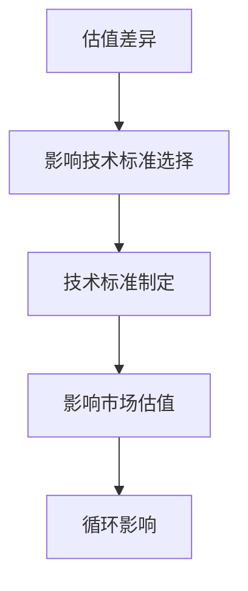
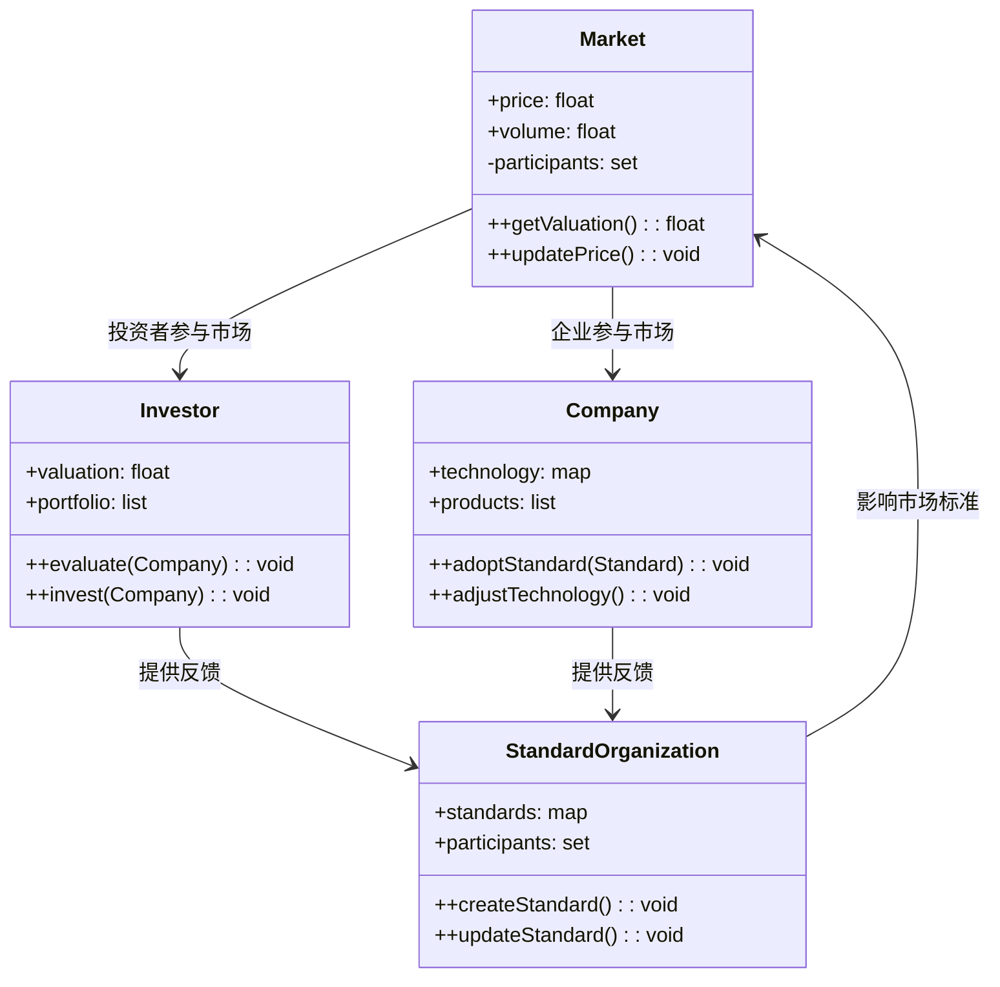

                 


# 股市估值差异对国际技术标准制定的影响

> 关键词：股市估值差异、国际技术标准制定、市场影响、技术标准选择、投资者行为

> 摘要：本文探讨了股市估值差异如何影响国际技术标准的制定过程，分析了估值差异对技术标准选择的影响机制，以及国际技术标准制定对股市估值的反向影响。通过系统分析和实际案例，本文揭示了这两者之间的复杂关系，并提出了相关的应对策略。

---

## 第1章: 股市估值差异的基本概念

### 1.1 股市估值差异的定义

#### 1.1.1 股票估值的基本概念

股票估值是通过对公司财务状况、市场环境和行业趋势等多方面因素的分析，来确定股票的合理价格区间。常用的估值方法包括市盈率（P/E）、市净率（P/B）、股息率等。这些方法帮助投资者判断股票的价值，从而做出投资决策。

#### 1.1.2 股市估值差异的定义与特征

股市估值差异指的是同一股票在不同市场或不同时间点上的价格差异。这种差异可能由市场流动性、投资者情绪、信息不对称等多种因素引起。估值差异的特征包括时间性、地域性、波动性等。

#### 1.1.3 估值差异的形成原因

估值差异的形成主要与市场参与者的预期和信息获取能力有关。例如，信息不对称可能导致不同市场参与者对同一股票的估值出现差异。此外，市场的成熟度、监管环境和经济政策也会影响估值差异。

### 1.2 国际技术标准制定的机制

#### 1.2.1 技术标准的定义与分类

技术标准是对技术要求的统一规定，通常包括产品的性能、质量、安全等方面。国际技术标准可以分为基础性标准、产品标准、服务标准等类别。

#### 1.2.2 国际技术标准制定的主体与流程

国际技术标准的制定通常由标准化组织（如ISO、IEC）主导，涉及多个利益相关方，包括企业、政府机构和行业协会。标准制定的过程包括提案、讨论、投票和最终发布等步骤。

#### 1.2.3 标准化组织的作用与影响

标准化组织在技术标准制定中起着协调和仲裁的作用，确保不同利益相关方的利益得到平衡。技术标准的统一性有助于促进技术的普及和市场的统一，但也可能抑制创新。

---

## 第2章: 股市估值差异与国际技术标准制定的关系

### 2.1 股市估值差异对国际技术标准制定的影响

#### 2.1.1 估值差异如何影响技术标准的选择

股市估值差异可能影响技术标准的选择。例如，某些市场的高估值可能推动企业采用更高标准的技术，以提升产品竞争力。反之，低估值市场可能更倾向于采用较低标准，以降低生产成本。

#### 2.1.2 不同市场间估值差异对标准制定的推动作用

不同市场的估值差异可能导致技术标准的多样化。高估值市场可能推动技术创新和高标准的制定，而低估值市场可能更注重成本控制，倾向于采用低标准。

#### 2.1.3 估值差异对技术标准全球统一的挑战

估值差异可能导致技术标准的全球统一面临困难。不同市场的估值差异可能使得某些国家或地区更倾向于维护本地标准，而放弃全球统一标准。

### 2.2 国际技术标准制定对股市估值的影响

#### 2.2.1 技术标准的统一性对股市估值的影响

技术标准的统一性可能提升市场的透明度和可比性，从而影响股市估值。统一的标准有助于投资者更准确地评估企业的价值。

#### 2.2.2 技术标准的差异性对股市估值的影响

技术标准的差异可能导致不同市场上的企业估值差异。例如，采用高标准的企业可能在高估值市场中获得更高的估值，而在低估值市场中可能面临估值折扣。

#### 2.2.3 技术标准制定对投资者信心的影响

技术标准的制定过程可能影响投资者信心。透明和公正的标准制定过程有助于增强投资者的信任，从而提升市场的整体估值水平。

---

## 第3章: 核心概念的原理与特征

### 3.1 股市估值差异的原理

#### 3.1.1 估值差异的经济学解释

从经济学角度看，股市估值差异反映了市场的供需关系和参与者的行为。高需求和有限供给可能导致高估值，而低需求和过剩供给可能导致低估值。

#### 3.1.2 估值差异的市场因素分析

市场因素包括宏观经济环境、行业趋势、公司基本面等。这些因素通过影响市场参与者的预期和行为，进而影响股市估值差异。

#### 3.1.3 估值差异的数学模型

常用的数学模型包括CAPM（资本资产定价模型）和APT（ arbitrage pricing theory）。这些模型可以帮助分析和预测股市估值差异。

### 3.2 国际技术标准制定的原理

#### 3.2.1 标准制定的经济学原理

技术标准的制定涉及多方利益的平衡，通常需要考虑技术可行性、经济利益和市场接受度。经济学原理可以帮助理解标准制定中的权衡和决策。

#### 3.2.2 标准制定的技术原理

技术标准的制定需要考虑技术的先进性和适用性。技术原理包括技术创新、成本效益分析和可操作性评估。

#### 3.2.3 标准制定的组织行为学分析

标准制定过程中的组织行为学分析可以帮助理解不同利益相关方的行为和动机。例如，企业可能更关注成本，而消费者可能更关注质量。

---

## 第4章: 核心概念的联系与对比

### 4.1 股市估值差异与技术标准制定的联系

#### 4.1.1 估值差异如何影响技术标准的选择

通过分析不同市场的估值差异，可以发现技术标准选择的倾向性。例如，高估值市场可能更倾向于采用高标准，以提升产品质量和品牌形象。

#### 4.1.2 技术标准的统一性对估值差异的影响

技术标准的统一性可以减少市场的不确定性，从而降低估值差异。统一的标准有助于提高市场的透明度和可比性。

#### 4.1.3 估值差异与技术标准制定的相互作用机制

通过互动机制，估值差异可以影响技术标准的选择，而技术标准的选择又可以反过来影响估值差异。这种相互作用构成了复杂的动态系统。

### 4.2 核心概念的对比分析

#### 4.2.1 估值差异与技术标准制定的对比表格

| 对比维度 | 估值差异 | 技术标准制定 |
|----------|----------|--------------|
| 影响因素 | 市场供需、信息不对称 | 技术可行性、经济利益 |
| 主体 | 投资者、市场参与者 | 标准化组织、利益相关方 |
| 目标 | 确定股票价格 | 统一技术要求 |
| 影响 | 投资决策、市场信心 | 技术发展、市场统一 |

#### 4.2.2 估值差异与技术标准制定的ER实体关系图

```mermaid
erDiagram
    participant Investor
    participant Market
    participant StandardOrganization
    participant Company
    Investor --> Market: 影响估值
    Market --> Investor: 反馈估值
    StandardOrganization --> Company: 制定标准
    Company --> StandardOrganization: 反馈意见
```

#### 4.2.3 估值差异与技术标准制定的 mermaid 流程图



---

## 第5章: 估值差异对技术标准制定影响的算法模型

### 5.1 算法原理概述

通过数学模型和统计分析，我们可以量化估值差异对技术标准制定的影响。常用的方法包括回归分析、时间序列分析和博弈论模型。

#### 5.1.1 回归分析模型

回归分析可以用于研究估值差异与技术标准选择之间的关系。例如，我们可以建立一个多元回归模型，分析不同变量对技术标准选择的影响。

公式：
$$ Y = \beta_0 + \beta_1 X_1 + \beta_2 X_2 + \epsilon $$

其中，$Y$ 是技术标准选择的指标，$X_1$ 和 $X_2$ 是估值差异和其他变量，$\beta$ 是回归系数，$\epsilon$ 是误差项。

#### 5.1.2 时间序列分析

时间序列分析可以用于研究估值差异的时间变化对技术标准制定的影响。例如，我们可以分析过去几年的估值差异数据，预测未来的技术标准趋势。

公式：
$$ Y_t = \alpha Y_{t-1} + \beta X_t + \gamma $$

其中，$Y_t$ 是当前的技术标准选择，$Y_{t-1}$ 是过去的技术标准选择，$X_t$ 是当前估值差异，$\alpha$ 和 $\beta$ 是参数，$\gamma$ 是常数项。

#### 5.1.3 博弈论模型

博弈论可以用于分析不同市场参与者在技术标准制定中的策略选择。例如，我们可以将技术标准的选择视为一个博弈过程，分析各参与者的最优策略。

公式：
$$ V_i = \max_{s_i} \min_{s_{-i}} U_i(s_i, s_{-i}) $$

其中，$V_i$ 是参与者 $i$ 的价值函数，$s_i$ 是参与者 $i$ 的策略，$s_{-i}$ 是其他参与者的策略组合，$U_i$ 是效用函数。

---

## 第6章: 系统分析与架构设计

### 6.1 系统分析

#### 6.1.1 问题场景介绍

在国际技术标准制定过程中，股市估值差异可能导致技术标准的选择出现偏差。例如，高估值市场可能更倾向于采用高标准，而低估值市场可能更注重成本控制。

#### 6.1.2 系统功能设计

系统功能包括数据采集、估值分析、标准制定和结果反馈。通过系统功能设计，可以实现对估值差异和技术标准制定过程的实时监控和优化。

#### 6.1.3 领域模型 mermaid 类图



#### 6.1.4 系统架构设计 mermaid 架构图

```mermaid
archiitecture
    Client --> API Gateway: 请求
    API Gateway --> Service1: 处理请求
    Service1 --> Service2: 调用服务
    Service2 --> Database: 查询数据
    Database --> Service2: 返回数据
    Service2 --> Service1: 返回数据
    Service1 --> API Gateway: 返回数据
    API Gateway --> Client: 返回数据
```

---

## 第7章: 项目实战

### 7.1 环境安装

为了进行分析，需要安装必要的软件和工具，包括数据分析工具（如Python、R）、可视化工具（如Matplotlib、Tableau）和版本控制系统（如Git）。

### 7.2 核心实现源代码

以下是使用Python进行数据分析的示例代码：

```python
import pandas as pd
import numpy as np

# 示例数据：假设我们有不同市场的股票估值数据
data = {
    'Market': ['A', 'B', 'C', 'D', 'E'],
    'Valuation': [100, 80, 90, 70, 110],
    'Standard': ['High', 'Low', 'High', 'Low', 'Medium']
}

df = pd.DataFrame(data)

# 分析估值差异与标准选择的关系
from sklearn.linear_model import LogisticRegression

X = df[['Valuation']]
y = df['Standard']

model = LogisticRegression()
model.fit(X, y)

# 预测新市场的标准选择
new_valuation = [[100]]
print(model.predict(new_valuation))
```

### 7.3 代码应用解读与分析

通过上述代码，我们可以分析不同市场的估值水平与技术标准选择之间的关系。模型可以预测新市场的标准选择，从而帮助企业做出更明智的决策。

### 7.4 实际案例分析

以某行业为例，分析不同市场的估值差异如何影响技术标准的选择。例如，高估值市场可能推动企业采用更高标准，从而提升产品质量和品牌形象。

### 7.5 项目小结

通过项目实战，我们可以验证理论分析，并为企业提供实际的操作指导。案例分析帮助我们更好地理解估值差异与技术标准制定之间的复杂关系。

---

## 第8章: 最佳实践与小结

### 8.1 最佳实践 tips

1. 在制定技术标准时，应充分考虑不同市场的估值差异。
2. 通过数据分析和模型预测，优化技术标准的选择。
3. 加强与标准化组织的合作，推动技术标准的统一性。

### 8.2 小结

本文系统分析了股市估值差异对国际技术标准制定的影响，探讨了两者之间的相互作用机制。通过理论分析和实际案例，提出了应对策略和最佳实践。

### 8.3 注意事项

- 数据分析应基于可靠的市场数据。
- 模型选择应考虑实际应用场景和数据特征。
- 技术标准的制定应平衡各方利益，避免单一市场的利益主导。

### 8.4 拓展阅读

建议读者进一步阅读相关领域的文献，如《金融市场与技术标准》、《国际标准化组织运作机制》等，以深入理解问题的本质。

---

作者：AI天才研究院/AI Genius Institute & 禅与计算机程序设计艺术 /Zen And The Art of Computer Programming

