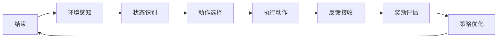
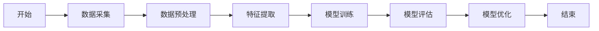
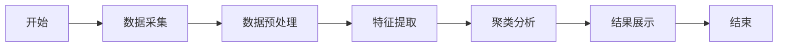
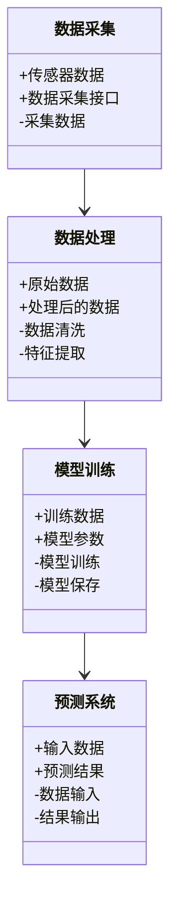
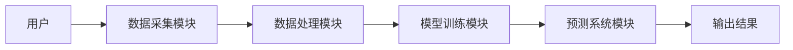
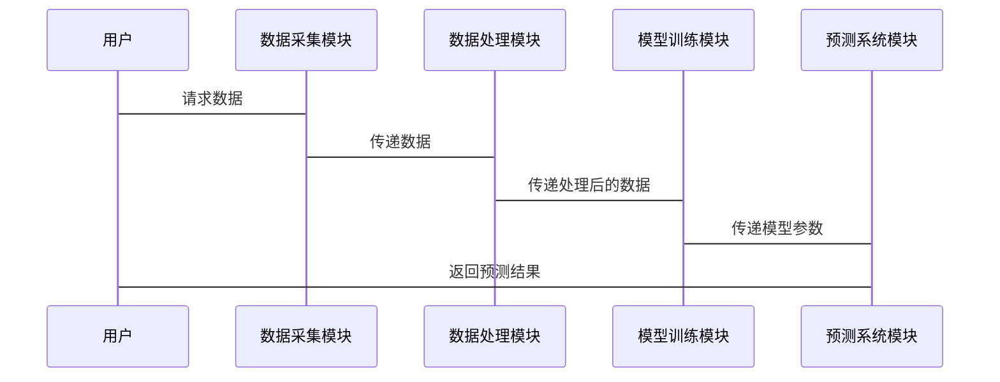

                 


# AI Agent在智能农业产量预测中的实践

> 关键词：AI Agent，智能农业，产量预测，机器学习，深度学习，农业数据，数据挖掘

> 摘要：  
本文探讨了AI Agent在智能农业中的应用，特别是如何利用AI Agent进行产量预测。文章从AI Agent的基本概念、智能农业的背景、产量预测的重要性入手，详细分析了AI Agent在农业数据处理、算法原理、系统架构、项目实战等方面的核心内容。通过理论与实践相结合的方式，展示了AI Agent在智能农业中的巨大潜力和实际应用价值。

---

## 第一部分: AI Agent在智能农业中的背景与基础

### 第1章: AI Agent与智能农业概述

#### 1.1 AI Agent的基本概念

##### 1.1.1 什么是AI Agent
AI Agent（人工智能代理）是一种能够感知环境、自主决策并执行任务的智能实体。它能够通过传感器获取数据，利用算法进行分析，并根据结果采取行动。AI Agent的核心在于其智能化和自主性，能够在复杂环境中完成特定任务。

##### 1.1.2 AI Agent的核心特征
- **自主性**：AI Agent能够自主决策，无需外部干预。
- **反应性**：能够实时感知环境变化并做出反应。
- **学习能力**：通过数据和经验不断优化自身的算法。
- **协作性**：能够与其他AI Agent或系统协同工作。

##### 1.1.3 AI Agent与传统农业的区别
传统农业依赖人工经验进行作物管理和产量预测，而AI Agent能够通过数据驱动的方式，利用机器学习和深度学习算法，快速、准确地进行预测和优化。

---

#### 1.2 智能农业的现状与发展

##### 1.2.1 智能农业的定义与特点
智能农业是将现代信息技术（如物联网、大数据、人工智能）应用于农业生产的全过程，以提高农业生产效率和资源利用率。

##### 1.2.2 当前智能农业的主要技术
- **物联网（IoT）**：通过传感器收集土壤湿度、温度、光照等数据。
- **大数据分析**：对农业数据进行处理和挖掘，提取有价值的信息。
- **人工智能**：利用机器学习和深度学习模型进行预测和优化。

##### 1.2.3 智能农业的发展趋势
随着技术的进步，智能农业将更加智能化、自动化和数据驱动化。AI Agent在智能农业中的应用将越来越广泛，特别是在产量预测、病虫害监测和资源优化配置方面。

---

#### 1.3 产量预测的重要性

##### 1.3.1 产量预测在农业中的作用
产量预测能够帮助农民提前规划种植计划、优化资源分配，从而提高农业生产效率和经济效益。

##### 1.3.2 传统产量预测的局限性
传统产量预测主要依赖经验，存在主观性强、准确性低、效率低下的问题。

##### 1.3.3 AI Agent在产量预测中的优势
AI Agent能够快速处理大量数据，利用机器学习算法进行建模和预测，显著提高了产量预测的准确性和效率。

---

## 第2章: AI Agent在产量预测中的核心概念

### 2.1 AI Agent的核心原理

#### 2.1.1 AI Agent的基本工作流程
1. **感知环境**：通过传感器或其他数据源获取农业数据。
2. **分析数据**：利用机器学习算法对数据进行处理和分析。
3. **制定决策**：根据分析结果生成预测或优化方案。
4. **执行任务**：根据决策结果采取相应的行动，如调整灌溉或施肥。

#### 2.1.2 AI Agent的感知、决策与执行机制
- **感知机制**：通过传感器获取土壤湿度、光照强度等数据。
- **决策机制**：利用机器学习模型进行预测和优化。
- **执行机制**：通过自动化设备（如灌溉系统）执行决策。

#### 2.1.3 AI Agent的智能学习能力
AI Agent能够通过不断学习新的数据，优化自身的预测模型，从而提高预测的准确性。

---

### 2.2 AI Agent与农业数据的关系

#### 2.2.1 农业数据的类型与特点
- **类型**：包括土壤数据、气象数据、作物生长数据、市场数据等。
- **特点**：数据量大、多样性高、实时性强。

#### 2.2.2 AI Agent如何处理农业数据
AI Agent通过数据清洗、特征提取、模型训练等步骤，对农业数据进行分析和处理。

#### 2.2.3 数据质量对AI Agent性能的影响
数据质量直接影响AI Agent的预测精度。高质量的数据能够显著提高模型的准确性。

---

### 2.3 AI Agent的系统架构

#### 2.3.1 AI Agent的分层架构
AI Agent的系统架构通常分为感知层、决策层和执行层。

#### 2.3.2 各层之间的关系与功能
- **感知层**：负责数据的采集和初步处理。
- **决策层**：利用机器学习模型进行预测和优化。
- **执行层**：根据决策结果采取相应的行动。

#### 2.3.3 系统架构的可扩展性
AI Agent的系统架构具有良好的可扩展性，能够适应不同的应用场景和数据规模。

---

## 第3章: AI Agent的算法原理

### 3.1 常见的AI Agent算法

#### 3.1.1 强化学习算法
强化学习是一种通过试错方式优化决策的算法，适用于动态环境下的预测和优化。

#### 3.1.2 监督学习算法
监督学习是一种基于标注数据进行模型训练的算法，适用于分类和回归任务。

#### 3.1.3 非监督学习算法
非监督学习是一种基于无标签数据进行聚类分析的算法，适用于数据挖掘和模式识别。

---

### 3.2 算法原理与流程图

#### 3.2.1 强化学习的流程图



#### 3.2.2 监督学习的流程图



#### 3.2.3 非监督学习的流程图



---

### 3.3 算法实现与代码示例

#### 3.3.1 强化学习的Python代码示例

```python
import numpy as np

# 定义状态空间
states = ['晴天', '阴天', '雨天']

# 定义动作空间
actions = ['浇水', '施肥', '什么都不做']

# 定义奖励函数
def reward_function(current_state, action):
    if action == '浇水' and current_state == '晴天':
        return 1
    elif action == '施肥' and current_state == '阴天':
        return 1
    else:
        return -1

# 初始化策略
policy = np.random.choice(actions, 1)[0]

# 训练过程
for _ in range(100):
    current_state = np.random.choice(states)
    action = policy
    reward = reward_function(current_state, action)
    # 更新策略
    if reward == 1:
        policy = action
```

#### 3.3.2 监督学习的Python代码示例

```python
import numpy as np
from sklearn.tree import DecisionTreeRegressor

# 生成训练数据
X = np.array([[1, 2], [3, 4], [5, 6], [7, 8]])
y = np.array([3, 5, 7, 9])

# 训练决策树回归模型
model = DecisionTreeRegressor()
model.fit(X, y)

# 预测新数据
X_new = np.array([[9, 10]])
y_pred = model.predict(X_new)
print(y_pred)
```

---

## 第4章: 数学模型与公式

### 4.1 常见的数学模型

#### 4.1.1 线性回归模型
线性回归是一种简单而有效的回归模型，适用于线性关系的数据。

$$ y = \beta_0 + \beta_1 x + \epsilon $$

其中，$\beta_0$ 是截距，$\beta_1$ 是斜率，$\epsilon$ 是误差项。

#### 4.1.2 决策树模型
决策树是一种基于树状结构的分类和回归模型，适用于非线性关系的数据。

#### 4.1.3 支持向量机模型
支持向量机（SVM）是一种强大的分类和回归模型，适用于高维数据。

---

## 第5章: 系统分析与架构设计

### 5.1 问题场景介绍

#### 5.1.1 农业数据的获取与处理
通过物联网传感器获取土壤湿度、光照强度等数据，并进行清洗和预处理。

#### 5.1.2 产量预测的需求分析
根据历史数据和当前环境条件，预测未来作物的产量。

---

### 5.2 项目介绍

#### 5.2.1 项目目标
开发一个基于AI Agent的产量预测系统，帮助农民优化种植计划。

#### 5.2.2 项目范围
- 数据采集：土壤湿度、光照强度、温度等。
- 数据分析：利用机器学习算法进行预测。
- 系统设计：开发一个用户友好的界面。

---

### 5.3 系统功能设计

#### 5.3.1 领域模型（Mermaid 类图）



---

### 5.4 系统架构设计（Mermaid 架构图）



---

### 5.5 系统接口设计

#### 5.5.1 数据采集接口
- 接口名称：`get_sensor_data`
- 输入：无
- 输出：传感器数据（如土壤湿度、光照强度等）

#### 5.5.2 模型接口
- 接口名称：`predict_yield`
- 输入：环境数据
- 输出：预测产量

---

### 5.6 系统交互（Mermaid 序列图）



---

## 第6章: 项目实战

### 6.1 环境安装

#### 6.1.1 安装Python
- 下载并安装Python 3.x
- 安装必要的库：`numpy`, `scikit-learn`, `mermaid`, `matplotlib`

#### 6.1.2 安装硬件设备
- 传感器套件（如土壤湿度传感器、光照传感器）
- 数据采集卡

---

### 6.2 系统核心实现

#### 6.2.1 数据采集模块

```python
import serial

# 连接传感器
ser = serial.Serial('COM3', 9600)

# 读取数据
data = ser.readline().decode().strip()
print(data)
```

#### 6.2.2 数据处理模块

```python
import numpy as np

# 数据清洗
data = np.array([1, 2, 3, 4, 5])
clean_data = np.where(data > 2, data, 0)
print(clean_data)
```

#### 6.2.3 模型训练模块

```python
from sklearn.tree import DecisionTreeRegressor

# 训练决策树模型
model = DecisionTreeRegressor()
model.fit(X_train, y_train)
```

---

### 6.3 案例分析

#### 6.3.1 数据分析与可视化

```python
import matplotlib.pyplot as plt

# 绘制散点图
plt.scatter(X, y)
plt.xlabel('X')
plt.ylabel('Y')
plt.show()
```

#### 6.3.2 模型评估

```python
from sklearn.metrics import mean_squared_error

# 预测结果
y_pred = model.predict(X_test)

# 计算均方误差
mse = mean_squared_error(y_test, y_pred)
print(mse)
```

---

## 第7章: 最佳实践、小结与注意事项

### 7.1 最佳实践

#### 7.1.1 数据预处理的重要性
数据预处理是提高模型性能的关键步骤，建议在数据采集后立即进行清洗和特征提取。

#### 7.1.2 模型选择的策略
根据具体问题选择合适的算法，例如回归问题选择线性回归或决策树模型。

---

### 7.2 小结

本文详细介绍了AI Agent在智能农业产量预测中的实践，从理论基础到算法实现，再到系统设计和项目实战，为读者提供了一个全面的视角。通过AI Agent的应用，农民能够更高效、更精准地进行农业生产管理。

---

### 7.3 注意事项

#### 7.3.1 数据隐私问题
在处理农业数据时，需要注意数据的隐私保护，避免数据泄露。

#### 7.3.2 系统稳定性
确保系统的稳定性和可靠性，特别是在数据采集和模型预测环节。

---

### 7.4 拓展阅读

#### 7.4.1 深度学习在农业中的应用
探索深度学习算法在农业中的应用，如卷积神经网络（CNN）在作物病虫害识别中的应用。

#### 7.4.2 多 Agent 系统
研究多 Agent 系统在农业中的应用，如分布式农业监测系统。

---

## 作者信息

作者：AI天才研究院/AI Genius Institute & 禅与计算机程序设计艺术/Zen And The Art of Computer Programming

---

通过本文的详细介绍，读者可以全面了解AI Agent在智能农业产量预测中的实践，掌握从理论到实践的全过程，并为未来的研究和应用提供有价值的参考。

