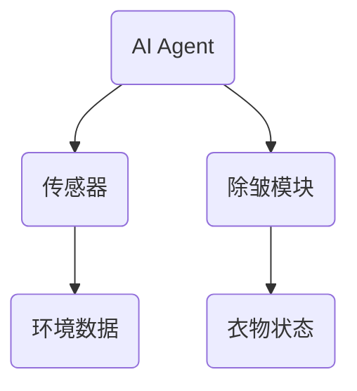
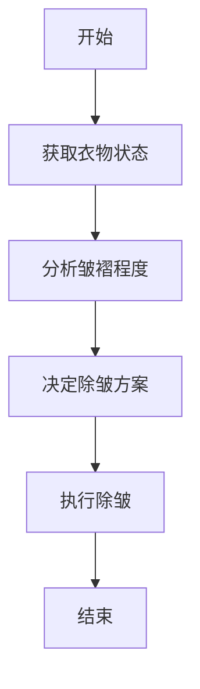
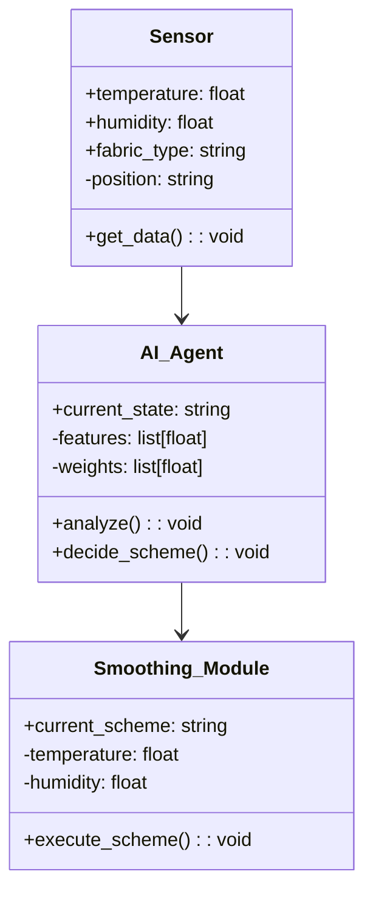
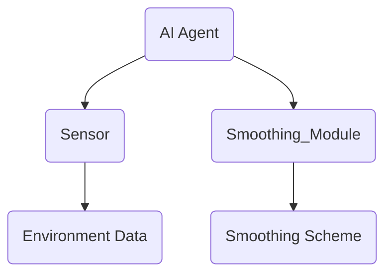
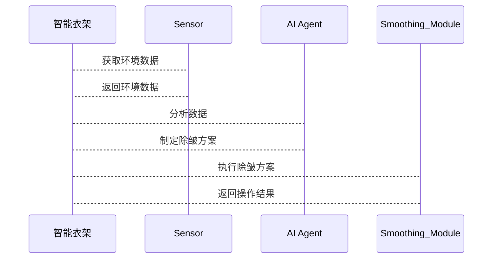

                 


# AI Agent在智能衣架中的衣物除皱功能

> 关键词：AI Agent，智能衣架，衣物除皱，算法原理，系统架构设计

> 摘要：本文探讨了AI Agent在智能衣架中的应用，重点分析了衣物除皱功能的实现。通过背景介绍、核心概念、算法原理、系统架构设计、项目实战和最佳实践等部分，详细阐述了AI Agent如何通过传感器数据、机器学习算法和智能控制系统实现衣物的自动除皱功能。

---

# 第一部分: AI Agent与智能衣架概述

# 第1章: AI Agent与智能衣架的背景介绍

## 1.1 问题背景与描述

### 1.1.1 衣物皱褶问题的普遍性
衣物皱褶是日常生活中常见的问题，尤其是在衣物洗涤、晾干和收纳过程中，由于衣物材质、洗涤方式和环境因素的影响，衣物容易产生皱褶。传统的除皱方式通常依赖人工操作，效率低且效果不稳定。

### 1.1.2 智能衣架的出现与目标
智能衣架作为一种智能家居设备，通过集成传感器、AI技术和智能控制系统，能够自动检测衣物状态并执行相应的除皱操作。其目标是通过技术创新，提升衣物护理的效率和效果。

### 1.1.3 AI Agent在智能衣架中的角色
AI Agent（人工智能代理）在智能衣架中扮演着核心角色，负责接收和处理传感器数据，分析衣物的皱褶程度，并根据分析结果制定和执行除皱方案。

## 1.2 问题解决与边界

### 1.2.1 AI Agent如何解决衣物除皱问题
AI Agent通过以下方式解决衣物除皱问题：
1. **数据采集**：利用传感器获取衣物的状态信息，如温度、湿度、衣物材质等。
2. **数据分析**：通过机器学习算法分析衣物的皱褶程度和类型。
3. **方案制定**：根据分析结果，选择合适的除皱方案。
4. **执行控制**：通过智能控制系统执行除皱操作。

### 1.2.2 智能衣架的功能边界
智能衣架的功能边界包括：
- **数据采集**：仅限于衣物状态的传感器数据。
- **除皱功能**：仅限于通过AI Agent控制的自动化除皱。
- **用户交互**：仅限于通过智能终端或手机APP进行远程控制。

### 1.2.3 AI Agent与其他功能模块的交互
AI Agent需要与以下功能模块进行交互：
- **传感器模块**：获取衣物的状态数据。
- **除皱模块**：执行除皱操作。
- **用户交互模块**：与用户进行信息交换。

## 1.3 概念结构与核心要素

### 1.3.1 AI Agent的核心概念
AI Agent的核心概念包括：
- **自主性**：能够自主决策和执行操作。
- **反应性**：能够实时感知环境变化并做出反应。
- **学习能力**：能够通过数据学习和优化算法。

### 1.3.2 智能衣架的系统架构
智能衣架的系统架构包括：
- **传感器模块**：用于采集衣物状态数据。
- **AI Agent模块**：用于分析数据并制定除皱方案。
- **执行模块**：用于执行除皱操作。
- **用户交互模块**：用于与用户进行信息交换。

### 1.3.3 核心要素之间的关系
核心要素之间的关系如下：
- **传感器模块**向AI Agent模块提供数据。
- AI Agent模块根据数据制定除皱方案。
- 执行模块根据除皱方案执行操作。
- 用户交互模块实时反馈操作结果。

## 1.4 本章小结
本章介绍了AI Agent在智能衣架中的背景和作用，分析了问题解决的思路和功能边界，明确了系统架构的核心要素及其关系。

---

# 第二部分: AI Agent的核心概念与联系

# 第2章: AI Agent的核心原理

## 2.1 AI Agent的基本原理

### 2.1.1 AI Agent的定义与分类
AI Agent是一种能够感知环境、自主决策并执行操作的智能体。根据应用场景的不同，AI Agent可以分为任务型和反应型两类。

### 2.1.2 AI Agent的核心算法
AI Agent的核心算法包括：
1. **数据采集与预处理**：通过传感器获取数据并进行清洗和归一化处理。
2. **特征提取**：从数据中提取有助于分类的特征。
3. **模型训练**：使用机器学习算法训练分类模型。
4. **决策制定**：根据模型结果制定除皱方案。

### 2.1.3 AI Agent与智能衣架的结合
AI Agent与智能衣架的结合主要体现在：
- **数据采集**：通过传感器获取衣物状态数据。
- **数据分析**：通过AI算法分析数据并制定除皱方案。
- **执行控制**：通过智能控制系统执行除皱操作。

## 2.2 核心概念对比表

| 比较维度 | AI Agent | 传统算法 |
|----------|----------|----------|
| 自主性   | 高       | 低       |
| 反应性   | 高       | 低       |
| 学习能力 | 高       | 无       |
| 适应性   | 高       | 低       |

## 2.3 ER实体关系图


## 2.4 本章小结
本章详细介绍了AI Agent的核心原理和其在智能衣架中的应用，通过对比表和实体关系图明确了AI Agent与其他模块的关系。

---

# 第三部分: 算法原理与数学模型

# 第3章: AI Agent的算法原理

## 3.1 算法流程图


## 3.2 数学模型与公式

### 3.2.1 皱褶程度评估公式
$$ 皱褶程度 = \sum_{i=1}^{n} w_i \cdot f_i $$
其中，$w_i$ 是第i个特征的权重，$f_i$ 是第i个特征的值。

### 3.2.2 除皱方案选择算法
$$ 方案选择 = \argmin_{k} \sum_{i=1}^{m} c_i \cdot s_i $$
其中，$c_i$ 是第i个方案的成本，$s_i$ 是第i个方案的成功概率。

## 3.3 算法实现代码
```python
def calculate_wrinkle_level(features):
    # 特征加权求和
    total = sum(w * f for w, f in zip(weights, features))
    return total

def choose_smoothing_scheme(wrinkle_level):
    # 根据皱褶程度选择除皱方案
    if wrinkle_level < 0.2:
        return 'low'
    elif 0.2 <= wrinkle_level < 0.5:
        return 'medium'
    else:
        return 'high'

# 示例调用
features = [0.8, 0.6, 0.7]
weights = [0.3, 0.4, 0.3]
wrinkle_level = calculate_wrinkle_level(features)
scheme = choose_smoothing_scheme(wrinkle_level)
print(f"选择的除皱方案为：{scheme}")
```

## 3.4 本章小结
本章详细讲解了AI Agent在智能衣架中的算法原理，包括皱褶程度评估公式和除皱方案选择算法，并通过代码示例展示了算法的实现过程。

---

# 第四部分: 系统分析与架构设计

# 第4章: 智能衣架系统的架构设计

## 4.1 项目场景介绍

### 4.1.1 项目背景
本项目旨在通过AI Agent实现智能衣架的衣物除皱功能，提升衣物护理的效率和效果。

### 4.1.2 项目目标
项目的最终目标是实现一个能够自动检测衣物状态并执行除皱操作的智能衣架系统。

## 4.2 系统功能设计

### 4.2.1 领域模型类图


### 4.2.2 系统架构设计

#### 4.2.2.1 系统架构图


### 4.2.3 接口设计
- **Sensor接口**：提供获取环境数据的方法。
- **AI Agent接口**：提供分析数据和制定方案的方法。
- **Smoothing Module接口**：提供执行除皱方案的方法。

### 4.2.4 交互序列图


## 4.3 本章小结
本章详细设计了智能衣架系统的架构，包括系统功能、类图、架构图和交互序列图，明确了各模块之间的关系和交互流程。

---

# 第五部分: 项目实战

# 第5章: 智能衣架系统的实现

## 5.1 环境安装

### 5.1.1 安装Python环境
安装Python 3.8及以上版本，并安装必要的库：
```bash
pip install numpy scikit-learn matplotlib
```

### 5.1.2 安装硬件设备
安装必要的硬件设备，如温度传感器、湿度传感器和智能执行模块。

## 5.2 系统核心实现

### 5.2.1 传感器数据采集
```python
import numpy as np

def get_sensor_data():
    # 模拟传感器数据
    temperature = np.random.uniform(20, 30)
    humidity = np.random.uniform(40, 60)
    fabric_type = 'cotton'
    return temperature, humidity, fabric_type
```

### 5.2.2 AI Agent实现
```python
from sklearn.neighbors import KNeighborsClassifier

class AI_Agent:
    def __init__(self):
        self.weights = [0.3, 0.4, 0.3]
        self.features = []
    
    def analyze(self, features):
        self.features = features
        return self.calculate_wrinkle_level()
    
    def calculate_wrinkle_level(self):
        return sum(w * f for w, f in zip(self.weights, self.features))
    
    def decide_scheme(self, level):
        if level < 0.2:
            return 'low'
        elif 0.2 <= level < 0.5:
            return 'medium'
        else:
            return 'high'
```

### 5.2.3 除皱模块实现
```python
class Smoothing_Module:
    def __init__(self):
        self.temperature = 0
        self.humidity = 0
        self.scheme = 'none'
    
    def execute_scheme(self, scheme):
        if scheme == 'low':
            self.temperature = 25
            self.humidity = 50
        elif scheme == 'medium':
            self.temperature = 30
            self.humidity = 60
        elif scheme == 'high':
            self.temperature = 35
            self.humidity = 70
```

## 5.3 代码应用解读与分析
1. **传感器数据采集**：通过模拟传感器数据，获取衣物的环境数据。
2. **AI Agent分析**：通过AI Agent分析数据并制定除皱方案。
3. **除皱模块执行**：根据除皱方案执行相应的操作。

## 5.4 实际案例分析

### 5.4.1 案例1：低皱褶衣物
```python
# 获取传感器数据
temperature, humidity, fabric_type = get_sensor_data()
# 分析数据
agent = AI_Agent()
features = [temperature, humidity, fabric_type]
level = agent.analyze(features)
scheme = agent.decide_scheme(level)
print(f"选择的除皱方案为：{scheme}")
# 执行除皱方案
smoothing = Smoothing_Module()
smoothing.execute_scheme(scheme)
```

### 5.4.2 案例2：高皱褶衣物
```python
# 获取传感器数据
temperature, humidity, fabric_type = get_sensor_data()
# 分析数据
agent = AI_Agent()
features = [temperature, humidity, fabric_type]
level = agent.analyze(features)
scheme = agent.decide_scheme(level)
print(f"选择的除皱方案为：{scheme}")
# 执行除皱方案
smoothing = Smoothing_Module()
smoothing.execute_scheme(scheme)
```

## 5.5 本章小结
本章通过实际案例展示了AI Agent在智能衣架中的实现过程，包括传感器数据采集、AI Agent分析和除皱模块执行的全过程。

---

# 第六部分: 最佳实践

# 第6章: 最佳实践与总结

## 6.1 小结
AI Agent在智能衣架中的应用通过传感器数据采集、数据分析和智能控制实现了衣物的自动除皱功能，提升了衣物护理的效率和效果。

## 6.2 注意事项
1. **数据采集**：确保传感器数据的准确性和实时性。
2. **算法优化**：根据实际效果不断优化算法和模型。
3. **系统维护**：定期检查和维护硬件设备和软件系统。

## 6.3 拓展阅读
1. 《机器学习实战》
2. 《人工智能：一种现代方法》
3. 《智能控制系统设计》

## 6.4 本章小结
本章总结了AI Agent在智能衣架中的应用，并提出了注意事项和拓展阅读，为读者提供了进一步学习和实践的方向。

---

# 作者：AI天才研究院/AI Genius Institute & 禅与计算机程序设计艺术 /Zen And The Art of Computer Programming

---

以上是关于《AI Agent在智能衣架中的衣物除皱功能》的技术博客文章的完整目录和内容框架。通过逐步分析和详细讲解，文章全面覆盖了AI Agent在智能衣架中的应用，从背景介绍到系统架构设计，再到项目实战，为读者提供了全面的知识体系和实践指导。

