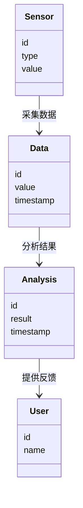
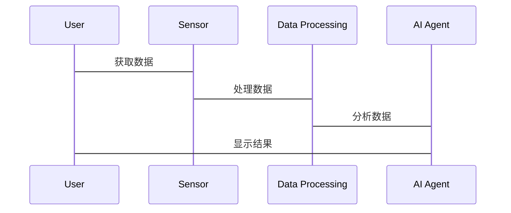

                 


```markdown
# AI Agent在智能门把手中的细菌检测

> 关键词：AI Agent, 细菌检测, 智能门把手, 物联网, 环境监测

> 摘要：本文深入探讨了AI Agent在智能门把手中进行细菌检测的技术实现，从问题背景到核心算法，再到系统架构，逐步分析了其实现原理和应用场景。通过具体案例分析和代码实现，展示了如何利用AI技术提升公共场所的卫生安全水平。

---

# 第一部分: AI Agent在智能门把手中的细菌检测背景介绍

# 第1章: 问题背景与应用场景

## 1.1 问题背景

### 1.1.1 传统门把手的卫生问题
传统门把手作为公共场所的重要组成部分，由于频繁被多人接触，成为细菌传播的重要媒介。细菌在门把手表面的滋生不仅影响公共环境的卫生，还可能引发交叉感染，尤其是在医院、学校、办公楼等人员密集场所。

### 1.1.2 公共场所细菌传播的风险
细菌通过门把手传播的风险主要体现在以下几个方面：
- 细菌在门把手表面的存活时间较长。
- 人们在接触门把手时可能不会进行彻底的手部清洁。
- 门把手清洁频率不足，导致细菌积累。

### 1.1.3 智能化门把手的市场需求
随着人们对公共卫生安全的关注度提高，智能化门把手的需求逐渐增加。市场对能够实时监测细菌浓度、自动提醒清洁或消毒的门把手系统的需求日益迫切。

## 1.2 问题描述

### 1.2.1 细菌检测的必要性
细菌检测的目的是为了实时了解门把手表面的细菌浓度，从而及时采取清洁措施，防止细菌传播。

### 1.2.2 智能门把手的功能需求
智能门把手需要具备以下功能：
- 实时监测细菌浓度。
- 自动记录细菌浓度数据。
- 提供清洁或消毒的提醒功能。
- 数据上传至云端，便于后续分析。

### 1.2.3 AI Agent在细菌检测中的作用
AI Agent（智能体）通过整合传感器数据、分析细菌特征、预测细菌浓度，为门把手的智能化管理提供技术支持。

## 1.3 问题解决

### 1.3.1 AI Agent的核心功能
AI Agent在智能门把手中的核心功能包括：
- 数据采集与处理。
- 细菌特征提取与分类。
- 细菌浓度预测与提醒。

### 1.3.2 细菌检测的技术实现
细菌检测的技术实现主要依赖于传感器和AI算法。传感器用于采集门把手表面的细菌特征数据，AI算法用于分析数据并输出检测结果。

### 1.3.3 智能门把手的创新设计
智能门把手的创新设计体现在以下几个方面：
- 集成多种传感器，实现多维度数据采集。
- 利用AI算法，提高检测精度和效率。
- 提供实时反馈和用户友好的交互界面。

## 1.4 边界与外延

### 1.4.1 系统的边界条件
- 系统仅监测门把手表面的细菌浓度。
- 系统不直接进行清洁或消毒操作，但可以提供相关建议。
- 系统仅适用于室内环境。

### 1.4.2 功能的外延扩展
- 扩展到其他公共场所的细菌检测。
- 集成更多传感器，检测更多类型的病原体。
- 提供更复杂的卫生安全解决方案。

### 1.4.3 系统的适用场景
- 医院、学校、办公楼等公共场所。
- 宾馆、餐厅等服务行业。
- 家庭环境的卫生监测。

## 1.5 概念结构与核心要素

### 1.5.1 系统构成要素
- 传感器：用于采集细菌特征数据。
- AI Agent：用于数据处理和分析。
- 用户界面：用于显示检测结果和交互操作。
- 云端平台：用于数据存储和分析。

### 1.5.2 各要素之间的关系
- 传感器采集数据，传输给AI Agent进行分析。
- AI Agent将分析结果反馈给用户界面，并上传至云端平台。
- 用户界面可以根据反馈结果进行相应的操作，如提醒清洁或消毒。

### 1.5.3 核心功能的实现方式
- 数据采集：通过传感器获取细菌特征数据。
- 数据分析：利用AI算法对数据进行处理和分类。
- 结果输出：通过用户界面显示检测结果。

## 1.6 本章小结
本章主要介绍了AI Agent在智能门把手中细菌检测的背景和应用场景，明确了系统的核心功能和实现方式。接下来将从核心概念与联系、算法原理等方面进一步展开分析。

---

# 第2章: AI Agent与细菌检测的核心概念

## 2.1 AI Agent的基本原理

### 2.1.1 AI Agent的定义
AI Agent是一种智能体，能够感知环境、自主决策并采取行动。在智能门把手中，AI Agent通过传感器数据和历史数据，分析门把手表面的细菌浓度，并提供相应的反馈。

### 2.1.2 AI Agent的核心功能
- 数据采集与处理：AI Agent通过传感器获取门把手表面的细菌特征数据，如温度、湿度、细菌种类等。
- 数据分析与分类：AI Agent利用机器学习算法对数据进行分析和分类，识别细菌的种类和浓度。
- 结果输出与反馈：AI Agent将分析结果反馈给用户界面，并上传至云端平台。

### 2.1.3 AI Agent与传统传感器的区别
| 特性       | AI Agent                  | 传统传感器                |
|------------|---------------------------|---------------------------|
| 功能       | 数据分析与决策            | 数据采集与传输            |
| 智能性     | 高                        | 低                        |
| 应用场景   | 复杂环境与决策支持        | 简单环境与数据采集        |

## 2.2 细菌检测的技术原理

### 2.2.1 细菌检测的常用方法
- 光谱分析：利用细菌的光谱特征进行识别。
- 传感器检测：通过传感器采集细菌的物理化学特征。
- 机器学习：利用机器学习算法对细菌数据进行分类和预测。

### 2.2.2 光谱分析与传感器技术
细菌的光谱特征可以通过紫外-可见光谱、红外光谱等技术进行分析。传感器技术则包括电容式传感器、电阻式传感器等，用于检测细菌的物理特性。

### 2.2.3 AI在细菌检测中的应用
AI通过分析细菌的光谱特征、传感器数据等，能够实现细菌的高精度检测和分类。

## 2.3 AI Agent与细菌检测的结合

### 2.3.1 数据采集与处理
AI Agent通过多种传感器采集门把手表面的细菌特征数据，如温度、湿度、细菌种类等。

### 2.3.2 数据分析与分类
AI Agent利用机器学习算法对数据进行分析和分类，识别细菌的种类和浓度。

### 2.3.3 结果输出与反馈
AI Agent将分析结果反馈给用户界面，并上传至云端平台，以便后续分析和管理。

## 2.4 核心概念对比表
| 特性       | AI Agent                  | 传统传感器                |
|------------|---------------------------|---------------------------|
| 功能       | 数据分析与决策            | 数据采集与传输            |
| 智能性     | 高                        | 低                        |
| 应用场景   | 复杂环境与决策支持        | 简单环境与数据采集        |

## 2.5 ER实体关系图
```mermaid
    entity User {
        id
        name
    }
    entity Sensor {
        id
        type
    }
    entity Data {
        id
        value
        timestamp
    }
    entity Analysis {
        id
        result
        timestamp
    }
    relation Sensor -> Data: 采集数据
    relation Data -> Analysis: 分析结果
    relation Analysis -> User: 提供反馈
```

---

# 第3章: 算法原理

## 3.1 数据预处理

### 3.1.1 数据采集
传感器采集门把手表面的细菌特征数据，如温度、湿度、细菌种类等。

### 3.1.2 数据清洗
对采集到的数据进行清洗，去除噪声和异常值。

### 3.1.3 数据归一化
对数据进行归一化处理，确保不同传感器的数据具有可比性。

## 3.2 特征提取

### 3.2.1 选择关键特征
根据细菌检测的需求，选择关键特征，如细菌的光谱特征、物理化学特征等。

### 3.2.2 特征提取方法
利用主成分分析（PCA）等方法提取关键特征。

## 3.3 分类模型

### 3.3.1 分类算法选择
选择适合细菌检测的分类算法，如支持向量机（SVM）、随机森林（Random Forest）等。

### 3.3.2 模型训练
利用训练数据对分类模型进行训练，得到最优模型参数。

### 3.3.3 模型评估
通过交叉验证等方法对模型进行评估，确保模型的准确性和稳定性。

## 3.4 算法流程图
```mermaid
    graph TD
        A[数据采集] -> B[数据清洗]
        B -> C[数据归一化]
        C -> D[特征提取]
        D -> E[选择分类算法]
        E -> F[模型训练]
        F -> G[模型评估]
```

## 3.5 Python代码实现

```python
import numpy as np
from sklearn.decomposition import PCA
from sklearn.svm import SVC
from sklearn.model_selection import train_test_split
from sklearn.metrics import accuracy_score

# 数据预处理
data = np.load('bacteria_data.npy')
X = data[:, :10]  # 假设我们选择了前10个特征
y = data[:, -1]   # 标签

# 划分训练集和测试集
X_train, X_test, y_train, y_test = train_test_split(X, y, test_size=0.2)

# 特征提取（主成分分析）
pca = PCA(n_components=5)
X_train_pca = pca.fit_transform(X_train)
X_test_pca = pca.transform(X_test)

# 模型训练
model = SVC()
model.fit(X_train_pca, y_train)

# 模型预测
y_pred = model.predict(X_test_pca)

# 模型评估
print("Accuracy:", accuracy_score(y_test, y_pred))
```

## 3.6 数学模型

### 3.6.1 支持向量机（SVM）
支持向量机是一种常用的分类算法，其核心思想是找到一个超平面，使得数据点被正确分类。数学模型如下：

$$
\text{目标函数：} \min_{w, b, \xi} \frac{1}{2}||w||^2 + C\sum_{i=1}^n \xi_i
$$

$$
\text{约束条件：} y_i(w \cdot x_i + b) \geq 1 - \xi_i, \xi_i \geq 0
$$

### 3.6.2 随机森林（Random Forest）
随机森林是一种基于树的集成分类算法，通过构建多个决策树并进行投票或平均，提高分类准确率。数学模型如下：

$$
y = \text{argmax}_k \sum_{i=1}^n \text{I}(tree_i(y) = k)
$$

## 3.7 实际案例分析
假设我们有一个细菌检测的数据集，包含门把手表面的温度、湿度、细菌种类等特征。通过上述算法，我们可以训练出一个细菌检测模型，并在测试数据上进行预测，评估模型的准确率。

---

# 第4章: 系统分析与架构设计

## 4.1 问题场景介绍
门把手细菌检测系统需要在公共场所实时监测细菌浓度，提供清洁或消毒的提醒服务。

## 4.2 系统功能设计

### 4.2.1 领域模型


### 4.2.2 系统架构
```mermaid
    graph TD
        A[Sensor] -> B[Data Processing] 
        B -> C[AI Agent]
        C -> D[User Interface]
        C -> E[Cloud Platform]
```

### 4.2.3 接口设计
- 传感器接口：与多种传感器连接，采集数据。
- 数据接口：与云端平台交互，上传和下载数据。
- 用户界面接口：与用户进行交互，显示检测结果和提供反馈。

### 4.2.4 交互流程图


---

# 第5章: 项目实战

## 5.1 环境安装
安装必要的Python库，如numpy、pandas、scikit-learn、mermaid等。

## 5.2 核心代码实现

### 5.2.1 数据预处理
```python
import numpy as np
import pandas as pd

data = pd.read_csv('bacteria_data.csv')
X = data.iloc[:, :-1].values
y = data.iloc[:, -1].values
```

### 5.2.2 特征提取
```python
from sklearn.decomposition import PCA

pca = PCA(n_components=5)
X_pca = pca.fit_transform(X)
```

### 5.2.3 模型训练与预测
```python
from sklearn.svm import SVC

model = SVC()
model.fit(X_pca, y)
y_pred = model.predict(X_pca)
```

### 5.2.4 模型评估
```python
from sklearn.metrics import accuracy_score

print("Accuracy:", accuracy_score(y, y_pred))
```

## 5.3 实际案例分析
通过具体的数据集，展示如何利用上述代码实现细菌检测模型，并进行模型评估和优化。

## 5.4 项目小结
本章通过具体案例展示了如何利用AI Agent实现智能门把手中的细菌检测，从数据预处理到模型训练，再到结果输出，详细介绍了项目的实现过程。

---

# 第6章: 最佳实践与注意事项

## 6.1 最佳实践
- 数据采集要尽量全面，确保数据的准确性和代表性。
- 在模型训练中，要合理选择特征和算法，确保模型的高效性和准确性。
- 在系统设计中，要考虑系统的可扩展性和可维护性。

## 6.2 小结
AI Agent在智能门把手中细菌检测的应用，不仅提升了公共卫生安全水平，还为智能化门把手的设计提供了新的思路。

## 6.3 注意事项
- 传感器的选择要根据具体场景和需求进行。
- 模型的训练需要大量的数据支持，数据质量直接影响模型性能。
- 系统的稳定性和安全性也是需要重点关注的方面。

## 6.4 拓展阅读
- 《机器学习实战》
- 《深入理解AI Agent》
- 《物联网技术与应用》

---

# 结束语

通过本文的详细分析和讲解，我们了解了AI Agent在智能门把手中细菌检测的技术实现和应用场景。未来，随着AI技术的不断发展，智能化门把手将在公共卫生安全领域发挥更重要的作用。

---

# 作者

作者：AI天才研究院/AI Genius Institute & 禅与计算机程序设计艺术/Zen And The Art of Computer Programming
```

