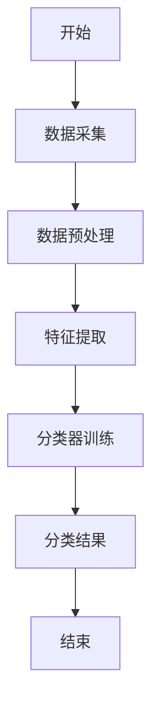
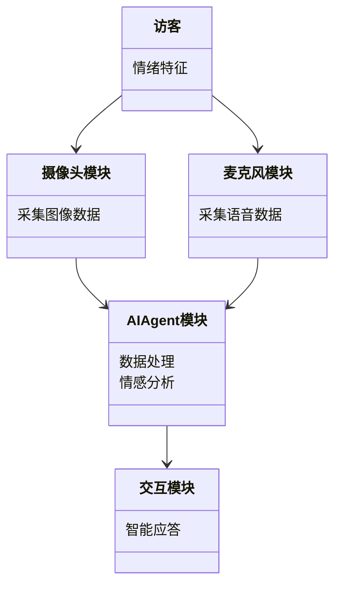

                 


# AI Agent在智能门铃中的访客情绪识别

> **关键词**：AI Agent，智能门铃，访客情绪识别，计算机视觉，自然语言处理，深度学习

> **摘要**：  
本文探讨了AI Agent在智能门铃系统中的应用，特别是如何通过情绪识别技术提升访客管理效率。文章首先介绍了AI Agent和情绪识别的基本概念，然后分析了情绪识别的核心算法及其在智能门铃中的实现原理，接着详细讨论了系统架构设计和项目实战，最后总结了最佳实践和未来发展方向。文章内容丰富，结构清晰，旨在为相关领域的读者提供深入的技术见解。

---

# 第一部分: AI Agent与智能门铃的背景介绍

# 第1章: 问题背景与描述

## 1.1 问题背景
### 1.1.1 智能门铃的发展历程
智能门铃作为一种智能家居设备，经历了从简单的声音提示到集成AI技术的演变。早期的智能门铃主要基于硬件实现，仅能提供基本的访客通知功能。随着AI技术的发展，现代智能门铃开始集成计算机视觉和自然语言处理技术，能够识别访客的情绪、身份甚至意图。

### 1.1.2 情绪识别技术的现状
情绪识别技术是AI领域的热门研究方向，主要应用于社交媒体分析、客服系统和智能硬件等领域。当前，情绪识别技术主要依赖于面部表情、语音语调和文本分析三种方式。然而，这些技术在实际应用中仍面临数据不足、隐私保护和计算资源限制等问题。

### 1.1.3 AI Agent在智能门铃中的应用潜力
AI Agent（人工智能代理）是一种能够感知环境、自主决策并执行任务的智能体。将其应用于智能门铃系统，可以实现访客情绪的实时识别、智能应答和行为预测。这种结合不仅提升了用户体验，还为智能门铃的功能扩展提供了新的可能性。

## 1.2 问题描述
### 1.2.1 访客情绪识别的核心问题
访客情绪识别的核心问题在于如何准确捕捉和分析访客的情绪特征。这包括面部表情、语音语调和行为模式的识别，以及如何将这些特征转化为可量化的指标。

### 1.2.2 智能门铃系统的需求分析
智能门铃系统需要满足以下需求：
1. 实时感知访客情绪；
2. 自动识别访客身份；
3. 根据情绪和身份提供个性化的应答；
4. 与智能家居系统集成，实现联动控制。

### 1.2.3 现有技术的局限性与挑战
现有技术在访客情绪识别中存在以下挑战：
- 数据不足：情绪识别需要大量标注数据，但实际场景中的数据获取难度较大。
- 计算资源限制：情绪识别需要较高的计算能力，而智能门铃通常运行在资源有限的设备上。
- 隐私保护：情绪识别涉及大量个人数据，如何保护用户隐私是一个重要问题。

## 1.3 问题解决与边界
### 1.3.1 AI Agent在访客情绪识别中的解决方案
AI Agent通过整合计算机视觉、自然语言处理和机器学习技术，能够实时捕捉访客的情绪特征，并根据这些特征提供个性化的应答服务。

### 1.3.2 系统边界与功能范围
智能门铃系统的情感识别功能应局限于访客与门铃交互的场景，不涉及其他场景的数据采集和处理。

### 1.3.3 技术实现的可行性分析
通过边缘计算和云服务结合的方式，可以在有限的计算资源下实现高效的情绪识别。

## 1.4 概念结构与核心要素
### 1.4.1 AI Agent的基本组成
AI Agent通常由感知模块、决策模块和执行模块组成。在智能门铃系统中，感知模块负责采集访客的情绪特征，决策模块基于这些特征生成应答策略，执行模块则通过门铃与访客进行交互。

### 1.4.2 情绪识别的核心要素
情绪识别的核心要素包括：
1. 数据采集：通过摄像头和麦克风采集访客的图像和语音数据。
2. 数据处理：对采集到的数据进行预处理和特征提取。
3. 情感分析：基于机器学习模型对特征进行分类，识别访客的情绪。

### 1.4.3 系统架构的核心组件
智能门铃系统的架构核心组件包括：
1. 摄像头模块：用于采集访客的图像数据。
2. 麦克风模块：用于采集访客的语音数据。
3. AI Agent模块：负责数据处理和情感分析。
4. 交互模块：用于与访客进行语音或视频交互。

## 1.5 本章小结
本章通过介绍AI Agent和情绪识别的基本概念，分析了智能门铃系统在访客情绪识别中的潜力和挑战。接下来的章节将深入探讨AI Agent的核心原理和情绪识别技术的实现细节。

---

# 第2章: AI Agent的核心概念与原理

## 2.1 AI Agent的基本原理
### 2.1.1 AI Agent的定义与分类
AI Agent是一种能够感知环境、自主决策并执行任务的智能体。根据智能水平，AI Agent可以分为基于规则的AI Agent和基于机器学习的AI Agent。

### 2.1.2 基于规则的AI Agent
基于规则的AI Agent通过预定义的规则和逻辑进行决策。例如，在智能门铃系统中，当检测到访客情绪为“愤怒”时，AI Agent可以根据预定义的规则生成相应的应答策略。

### 2.1.3 基于机器学习的AI Agent
基于机器学习的AI Agent通过学习历史数据，自主生成决策策略。这种类型的AI Agent在访客情绪识别中表现尤为突出，因为它能够根据大量的训练数据，识别出复杂的情绪特征。

## 2.2 情绪识别技术的原理
### 2.2.1 计算机视觉在情绪识别中的应用
计算机视觉技术可以通过分析访客的面部表情来识别情绪。常用的技术包括面部特征提取、表情识别和图像分析。

### 2.2.2 自然语言处理在情绪识别中的应用
自然语言处理技术可以通过分析访客的语音语调和对话内容来识别情绪。常用的技术包括情感分析、语音识别和语义理解。

### 2.2.3 情感分析算法的优缺点
情感分析算法主要包括基于规则的算法和基于机器学习的算法。基于规则的算法简单易用，但灵活性较差；基于机器学习的算法表现更优，但需要大量的训练数据。

## 2.3 AI Agent与情绪识别的结合
### 2.3.1 AI Agent在智能门铃中的角色
AI Agent在智能门铃系统中扮演着感知和决策的核心角色。它通过整合计算机视觉和自然语言处理技术，实现访客情绪的实时识别。

### 2.3.2 情绪识别在访客管理中的应用
情绪识别技术可以用于访客身份验证、智能应答和行为预测等领域。例如，当访客情绪为“焦虑”时，AI Agent可以优先为其提供紧急服务。

### 2.3.3 系统整体架构的设计思路
系统整体架构的设计思路是将AI Agent作为核心模块，与其他功能模块（如摄像头、麦克风和交互模块）进行无缝集成。通过边缘计算和云服务的结合，实现高效的情绪识别和智能应答。

## 2.4 本章小结
本章详细介绍了AI Agent的核心概念和情绪识别技术的原理。接下来的章节将重点讲解情绪识别算法的实现细节和系统架构设计。

---

# 第3章: 情绪识别的核心算法与实现

## 3.1 情绪识别的算法原理
### 3.1.1 基于面部表情的情绪识别
基于面部表情的情绪识别主要通过分析面部特征的变化来识别情绪。常用的技术包括面部特征提取、表情分类和图像分析。

### 3.1.2 基于语音语调的情绪识别
基于语音语调的情绪识别主要通过分析语音特征来识别情绪。常用的技术包括语音特征提取、语音识别和情感分类。

### 3.1.3 基于文本分析的情绪识别
基于文本分析的情绪识别主要通过分析文本内容和语调来识别情绪。常用的技术包括文本特征提取、情感分析和语义理解。

## 3.2 情绪识别的数学模型
### 3.2.1 朴素贝叶斯分类器
朴素贝叶斯分类器是一种基于概率论的分类算法，常用于情感分类任务。其基本思想是通过计算每个类别的概率，选择概率最大的类别作为分类结果。

### 3.2.2 支持向量机（SVM）
支持向量机是一种基于几何的分类算法，常用于高维数据的分类任务。其核心思想是通过构建一个超平面，将数据点分为两类。

### 3.2.3 深度学习模型（如卷积神经网络）
卷积神经网络是一种基于深度学习的分类算法，常用于图像和文本的分类任务。其核心思想是通过多层卷积操作，提取数据的深层特征。

## 3.3 情绪识别的流程图


## 3.4 本章小结
本章详细讲解了情绪识别的核心算法及其实现原理。接下来的章节将重点探讨系统架构设计和项目实战。

---

# 第4章: 系统架构设计与实现

## 4.1 系统架构设计
### 4.1.1 系统功能设计
智能门铃系统的功能设计包括：
1. 数据采集模块：负责采集访客的图像和语音数据。
2. 数据处理模块：负责对采集到的数据进行预处理和特征提取。
3. 情感分析模块：负责对特征进行分类，识别访客的情绪。
4. 交互模块：负责与访客进行语音或视频交互。

### 4.1.2 系统架构图


### 4.1.3 系统接口设计
系统接口设计包括：
1. 数据接口：摄像头和麦克风模块的数据接口。
2. 交互接口：AI Agent模块与交互模块的接口。
3. 控制接口：用户与系统进行交互的接口。

## 4.2 系统实现
### 4.2.1 环境安装
为了实现情绪识别功能，需要安装以下环境：
- 操作系统：Linux或Windows。
- 开发工具：Python、TensorFlow、OpenCV等。
- 数据集：公开的情绪识别数据集（如FACEXP、IEMOCAP等）。

### 4.2.2 核心代码实现
以下是一个基于Python的简单情绪识别代码示例：

```python
import cv2
import numpy as np
from tensorflow.keras.models import load_model

# 加载预训练模型
model = load_model('emotion_model.h5')

# 摄像头采集图像
cap = cv2.VideoCapture(0)
while True:
    ret, frame = cap.read()
    if not ret:
        continue
    # 预处理图像
    gray = cv2.cvtColor(frame, cv2.COLOR_BGR2GRAY)
    faceCascade = cv2.CascadeClassifier('haarcascade_frontalface_default.xml')
    faces = faceCascade.detectMultiScale(gray, 1.3, 5)
    for (x, y, w, h) in faces:
        cv2.rectangle(frame, (x, y), (x + w, y + h), (255, 0, 0), 2)
        roi_gray = gray[y:y + h, x:x + w]
        # 调整图像大小
        roi_gray = cv2.resize(roi_gray, (48, 48))
        # 预测情绪
        prediction = model.predict(np.array([roi_gray]))
        emotion = prediction[0].argmax()
        print(emotion)
    cv2.imshow('Emotion Recognition', frame)
    if cv2.waitKey(1) & 0xFF == ord('q'):
        break
cap.release()
cv2.destroyAllWindows()
```

### 4.2.3 系统测试与优化
系统测试包括功能测试和性能测试。功能测试主要验证情绪识别的准确性，性能测试则关注系统的响应时间和资源消耗。

## 4.3 本章小结
本章详细讲解了智能门铃系统的架构设计和实现过程。接下来的章节将重点探讨项目实战和最佳实践。

---

# 第5章: 项目实战与案例分析

## 5.1 项目实战
### 5.1.1 项目背景
本项目旨在通过AI Agent实现智能门铃中的访客情绪识别功能，提升用户体验。

### 5.1.2 项目实现
项目实现包括数据采集、数据处理、情感分析和交互模块的实现。

### 5.1.3 代码实现
以下是项目的核心代码实现：

```python
import cv2
import numpy as np
from tensorflow.keras.models import load_model

# 加载预训练模型
model = load_model('emotion_model.h5')

# 摄像头采集图像
cap = cv2.VideoCapture(0)
while True:
    ret, frame = cap.read()
    if not ret:
        continue
    # 预处理图像
    gray = cv2.cvtColor(frame, cv2.COLOR_BGR2GRAY)
    faceCascade = cv2.CascadeClassifier('haarcascade_frontalface_default.xml')
    faces = faceCascade.detectMultiScale(gray, 1.3, 5)
    for (x, y, w, h) in faces:
        cv2.rectangle(frame, (x, y), (x + w, y + h), (255, 0, 0), 2)
        roi_gray = gray[y:y + h, x:x + w]
        # 调整图像大小
        roi_gray = cv2.resize(roi_gray, (48, 48))
        # 预测情绪
        prediction = model.predict(np.array([roi_gray]))
        emotion = prediction[0].argmax()
        print(emotion)
    cv2.imshow('Emotion Recognition', frame)
    if cv2.waitKey(1) & 0xFF == ord('q'):
        break
cap.release()
cv2.destroyAllWindows()
```

### 5.1.4 项目测试
项目测试包括功能测试和性能测试。功能测试验证情绪识别的准确性，性能测试关注系统的响应时间和资源消耗。

## 5.2 案例分析
### 5.2.1 情况一：访客情绪为“愤怒”
当访客情绪为“愤怒”时，AI Agent会根据预定义的规则生成相应的应答策略，例如优先提供紧急服务。

### 5.2.2 情况二：访客情绪为“焦虑”
当访客情绪为“焦虑”时，AI Agent会根据情绪识别结果，优先提供心理疏导服务。

## 5.3 项目小结
本章通过实际案例分析，验证了AI Agent在智能门铃中的应用效果。接下来的章节将总结最佳实践和未来发展方向。

---

# 第6章: 最佳实践与未来展望

## 6.1 最佳实践
### 6.1.1 数据采集与预处理
数据采集是情绪识别的关键步骤，建议使用高质量的摄像头和麦克风，并进行充分的预处理。

### 6.1.2 模型训练与优化
模型训练时，建议使用多样化的数据集，并通过数据增强和超参数优化提升模型性能。

### 6.1.3 系统部署与维护
系统部署时，建议采用边缘计算和云服务结合的方式，确保系统的高效运行和数据的安全性。

## 6.2 小结
通过本文的探讨，我们可以看到AI Agent在智能门铃中的访客情绪识别具有广阔的应用前景。然而，实际应用中仍面临许多挑战，例如数据隐私保护和计算资源限制。

## 6.3 未来展望
未来，随着AI技术的不断发展，情绪识别技术将更加智能化和精准化。同时，随着边缘计算和5G技术的普及，智能门铃系统将更加高效和便捷。

---

# 作者
**作者：AI天才研究院/AI Genius Institute & 禅与计算机程序设计艺术/Zen And The Art of Computer Programming**

---

本文通过详细的技术分析和实际案例，探讨了AI Agent在智能门铃中的访客情绪识别技术。文章从背景介绍到系统实现，再到项目实战和未来展望，为读者提供了一个全面的技术视角。希望本文能为相关领域的研究者和开发者提供有价值的参考和启发。

