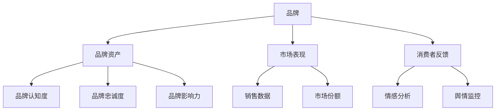
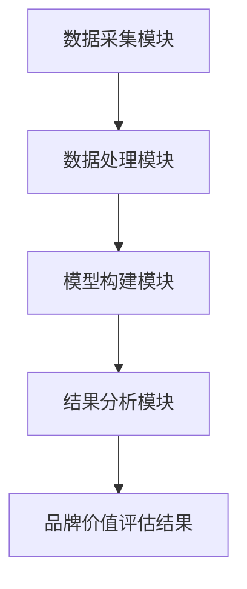

                 


# AI辅助企业品牌资产评估：多维度品牌价值量化与追踪

> 关键词：AI技术、品牌价值评估、多维度分析、情感计算、数据驱动、实时追踪

> 摘要：本文探讨了如何利用人工智能技术辅助企业品牌资产评估，通过多维度分析量化品牌价值，并实现品牌价值的实时追踪。文章从品牌价值评估的背景与需求出发，详细介绍了AI技术在品牌价值评估中的应用原理，包括文本挖掘、情感分析、机器学习模型构建等核心算法，结合系统架构设计和项目实战案例，展示了如何构建一个完整的品牌价值评估与追踪系统。文章最后总结了最佳实践经验和未来发展方向。

---

# 第1章: 企业品牌资产评估的背景与问题

## 1.1 问题背景

### 1.1.1 品牌价值评估的传统方法与局限性

传统品牌价值评估方法主要依赖于财务数据、市场调研和专家评分，存在以下局限性：
- 数据采集范围有限，难以覆盖线上和线下的全维度数据。
- 评估结果缺乏动态性，无法实时反映品牌价值的变化。
- 主观性较强，专家评分可能存在偏差。

### 1.1.2 数字化时代品牌价值评估的新需求

随着互联网和社交媒体的普及，品牌价值的评估需要考虑更多的维度，包括：
- **市场表现**：销售数据、市场份额。
- **消费者认知**：品牌知名度、美誉度。
- **社交媒体影响**：社交媒体上的品牌声量、情感倾向。
- **竞争环境**：竞争对手的动态和行业趋势。

### 1.1.3 AI技术在品牌价值评估中的潜力

AI技术可以通过以下方式提升品牌价值评估的效率和准确性：
- 自动化采集和处理海量数据。
- 利用自然语言处理（NLP）技术分析消费者反馈。
- 建立预测模型，实时追踪品牌价值的变化。

## 1.2 问题描述

### 1.2.1 品牌价值的多维度特征

品牌价值可以从多个维度进行评估，包括：
1. **市场表现**：销售额、利润、市场份额。
2. **消费者认知**：品牌知名度、美誉度、品牌忠诚度。
3. **社交媒体影响**：社交媒体上的品牌声量、情感倾向、互动频率。
4. **竞争环境**：竞争对手的市场动态、行业趋势。

### 1.2.2 品牌价值评估的复杂性

品牌价值评估的复杂性主要体现在以下几个方面：
- 数据来源多样，包括结构化数据和非结构化数据。
- 数据量大，需要高效的数据处理能力。
- 数据之间存在复杂的关联性，需要建立合理的模型进行分析。

### 1.2.3 现有方法的不足与改进方向

传统方法的不足主要体现在：
- 数据采集范围有限。
- 评估结果缺乏动态性。
- 主观性较强，难以量化。

改进方向包括：
- 引入AI技术，自动化处理数据。
- 建立多维度的评估模型。
- 实现品牌价值的实时追踪。

## 1.3 问题解决思路

### 1.3.1 引入AI技术的核心优势

AI技术的核心优势在于：
- **数据处理能力**：能够处理海量的结构化和非结构化数据。
- **自动化分析**：能够自动识别文本中的情感倾向、关键词。
- **动态评估**：能够实时追踪品牌价值的变化。

### 1.3.2 数据驱动的品牌价值评估框架

数据驱动的品牌价值评估框架包括以下几个步骤：
1. 数据采集：采集品牌相关的市场数据、消费者反馈、社交媒体数据。
2. 数据处理：清洗数据、提取特征。
3. 模型构建：建立机器学习模型，预测品牌价值。
4. 结果分析：输出品牌价值评估结果，并提出改进建议。

### 1.3.3 多维度品牌价值量化的目标与路径

目标：建立一个多维度的品牌价值评估模型，能够量化品牌价值，并实现品牌价值的实时追踪。

路径：
1. 确定品牌价值的评估维度。
2. 数据采集与处理。
3. 建立评估模型。
4. 实时监控品牌价值的变化。

## 1.4 问题的边界与外延

### 1.4.1 品牌价值评估的适用范围

品牌价值评估适用于以下场景：
- 品牌价值的定期评估。
- 品牌价值的实时监控。
- 品牌价值的预测与优化。

### 1.4.2 相关概念的界定与区分

- **品牌价值**：品牌在市场中的价值，包括品牌知名度、美誉度、忠诚度等。
- **品牌资产评估**：对品牌价值进行量化的过程。
- **AI辅助评估**：利用AI技术辅助品牌价值评估的过程。

### 1.4.3 AI辅助评估的边界条件

- 数据来源：需要保证数据的合法性和准确性。
- 模型准确性：需要保证评估结果的准确性。
- 实时性：需要保证评估结果的实时性。

## 1.5 核心概念结构与组成

### 1.5.1 品牌价值的核心要素

品牌价值的核心要素包括：
1. 品牌知名度：品牌在消费者中的认知程度。
2. 品牌美誉度：消费者对品牌的正面评价。
3. 品牌忠诚度：消费者对品牌的忠诚程度。
4. 品牌影响力：品牌在市场中的影响力。

### 1.5.2 多维度评估的维度分解

多维度评估的维度分解包括：
1. 市场表现：销售额、市场份额。
2. 消费者认知：品牌知名度、美誉度。
3. 社交媒体影响：社交媒体上的声量、情感倾向。
4. 竞争环境：竞争对手的动态、行业趋势。

### 1.5.3 AI辅助评估的系统架构

AI辅助评估的系统架构包括：
1. 数据采集模块：采集品牌相关的数据。
2. 数据处理模块：清洗数据、提取特征。
3. 模型构建模块：建立机器学习模型。
4. 结果分析模块：输出评估结果并提出改进建议。

---

# 第2章: AI辅助品牌价值评估的核心概念与联系

## 2.1 核心概念原理

### 2.1.1 品牌价值的多维度特征

品牌价值的多维度特征包括：
1. 市场表现：销售额、利润、市场份额。
2. 消费者认知：品牌知名度、美誉度、忠诚度。
3. 社交媒体影响：社交媒体上的声量、情感倾向、互动频率。
4. 竞争环境：竞争对手的动态、行业趋势。

### 2.1.2 AI技术在品牌评估中的应用原理

AI技术在品牌评估中的应用原理包括：
1. **文本挖掘**：从社交媒体数据中提取关键词和情感倾向。
2. **情感分析**：利用自然语言处理技术分析消费者反馈。
3. **机器学习模型**：建立预测模型，预测品牌价值的变化。

### 2.1.3 数据驱动的品牌价值评估模型

数据驱动的品牌价值评估模型包括：
1. 数据采集：采集品牌相关的数据。
2. 数据处理：清洗数据、提取特征。
3. 模型构建：建立机器学习模型。
4. 结果分析：输出评估结果并提出改进建议。

## 2.2 核心概念属性对比

```markdown
| 概念               | 特征1：数据驱动性 | 特征2：多维度性 | 特征3：动态性 |
|--------------------|------------------|----------------|-------------|
| 品牌价值           | 高               | 高             | 高           |
| AI技术             | 高               | 中             | 高           |
| 数据驱动的品牌评估 | 高               | 高             | 高           |
```

## 2.3 实体关系图



---

# 第3章: 多维度品牌价值量化的核心算法

## 3.1 文本挖掘与情感分析

### 3.1.1 文本挖掘的基本原理

文本挖掘的基本原理包括：
1. 数据清洗：去除噪声数据。
2. 分词：将文本分割成词语或短语。
3. 词频统计：统计词语的出现频率。
4. 主题提取：提取文本的主题。

### 3.1.2 情感分析的实现

情感分析的实现步骤：
1. 数据清洗：去除噪声数据。
2. 分词：将文本分割成词语或短语。
3. 词向量表示：将词语转换为向量表示。
4. 情感分类：利用机器学习模型进行情感分类。

### 3.1.3 基于词袋模型的文本表示

词袋模型的实现：
```python
from sklearn.feature_extraction.text import CountVectorizer

vectorizer = CountVectorizer()
X = vectorizer.fit_transform(corpus)
```

### 3.1.4 基于TF-IDF的特征提取

TF-IDF的实现：
```python
from sklearn.feature_extraction.text import TfidfVectorizer

vectorizer = TfidfVectorizer()
X = vectorizer.fit_transform(corpus)
```

## 3.2 机器学习模型的构建

### 3.2.1 线性回归模型

线性回归模型的实现：
```python
from sklearn.linear_model import LinearRegression

model = LinearRegression()
model.fit(X_train, y_train)
y_pred = model.predict(X_test)
```

### 3.2.2 支持向量机模型

支持向量机模型的实现：
```python
from sklearn.svm import SVC

model = SVC()
model.fit(X_train, y_train)
y_pred = model.predict(X_test)
```

### 3.2.3 随机森林模型

随机森林模型的实现：
```python
from sklearn.ensemble import RandomForestClassifier

model = RandomForestClassifier()
model.fit(X_train, y_train)
y_pred = model.predict(X_test)
```

### 3.2.4 神经网络模型

神经网络模型的实现：
```python
import tensorflow as tf

model = tf.keras.Sequential([
    tf.keras.layers.Dense(64, activation='relu'),
    tf.keras.layers.Dense(1, activation='sigmoid')
])
model.compile(optimizer='adam', loss='binary_crossentropy', metrics=['accuracy'])
model.fit(X_train, y_train, epochs=10, batch_size=32)
```

---

# 第4章: 基于AI的品牌价值评估系统设计

## 4.1 系统功能设计

### 4.1.1 数据采集模块

数据采集模块的功能包括：
1. 采集市场数据：销售数据、市场份额。
2. 采集消费者反馈：社交媒体评论、问卷调查。
3. 采集竞争数据：竞争对手的市场动态、行业趋势。

### 4.1.2 数据处理模块

数据处理模块的功能包括：
1. 数据清洗：去除噪声数据。
2. 数据转换：将数据转换为模型可接受的格式。
3. 数据存储：将数据存储到数据库中。

### 4.1.3 模型构建模块

模型构建模块的功能包括：
1. 特征提取：从数据中提取特征。
2. 模型训练：利用训练数据训练模型。
3. 模型评估：评估模型的性能。

### 4.1.4 结果分析模块

结果分析模块的功能包括：
1. 输出评估结果：品牌价值的量化结果。
2. 提出改进建议：根据评估结果提出改进建议。

## 4.2 系统架构设计

### 4.2.1 系统架构图



### 4.2.2 系统接口设计

系统接口设计包括：
1. 数据接口：与数据源对接。
2. 模型接口：与模型训练模块对接。
3. 结果接口：与结果展示模块对接。

## 4.3 系统交互设计

### 4.3.1 系统交互流程

系统交互流程包括：
1. 数据采集：采集品牌相关的数据。
2. 数据处理：清洗数据、提取特征。
3. 模型训练：训练机器学习模型。
4. 结果分析：输出品牌价值评估结果。

---

# 第5章: 项目实战——基于AI的品牌价值评估系统实现

## 5.1 环境安装

### 5.1.1 安装Python

安装Python：
```bash
python --version
```

### 5.1.2 安装必要的Python库

安装必要的Python库：
```bash
pip install numpy pandas scikit-learn tensorflow
```

## 5.2 系统核心实现

### 5.2.1 数据采集模块的实现

数据采集模块的实现：
```python
import requests
from bs4 import BeautifulSoup

def get_market_data(url):
    response = requests.get(url)
    soup = BeautifulSoup(response.text, 'html.parser')
    data = []
    for item in soup.find_all('div', class_='market-data'):
        data.append({
            'sales': float(item['sales']),
            'market_share': float(item['market_share'])
        })
    return data
```

### 5.2.2 数据处理模块的实现

数据处理模块的实现：
```python
import pandas as pd

def process_data(data):
    df = pd.DataFrame(data)
    df['date'] = pd.to_datetime(df['date'])
    df.set_index('date', inplace=True)
    return df
```

### 5.2.3 模型构建模块的实现

模型构建模块的实现：
```python
from sklearn.ensemble import RandomForestRegressor

def build_model(X_train, y_train):
    model = RandomForestRegressor()
    model.fit(X_train, y_train)
    return model
```

### 5.2.4 结果分析模块的实现

结果分析模块的实现：
```python
def analyze_results(y_true, y_pred):
    from sklearn.metrics import mean_squared_error
    mse = mean_squared_error(y_true, y_pred)
    print(f'Mean Squared Error: {mse}')
```

## 5.3 代码应用解读与分析

### 5.3.1 数据采集模块的代码解读

数据采集模块的代码解读：
- 使用`requests`库发送HTTP请求，获取网页内容。
- 使用`BeautifulSoup`解析网页内容，提取市场数据。

### 5.3.2 数据处理模块的代码解读

数据处理模块的代码解读：
- 使用`pandas`库将数据转换为DataFrame。
- 转换日期格式，并设置日期为索引。

### 5.3.3 模型构建模块的代码解读

模型构建模块的代码解读：
- 使用`RandomForestRegressor`建立回归模型。
- 使用训练数据训练模型。

### 5.3.4 结果分析模块的代码解读

结果分析模块的代码解读：
- 使用`mean_squared_error`计算均方误差，评估模型的性能。

## 5.4 实际案例分析

### 5.4.1 数据准备

数据准备：
```python
data = [
    {'date': '2023-01-01', 'sales': 100, 'market_share': 20},
    {'date': '2023-01-02', 'sales': 110, 'market_share': 22},
    # 更多数据...
]
```

### 5.4.2 模型训练

模型训练：
```python
X_train = data[['sales', 'market_share']]
y_train = data['target']
model = build_model(X_train, y_train)
```

### 5.4.3 结果分析

结果分析：
```python
y_pred = model.predict(X_test)
analyze_results(y_true, y_pred)
```

---

# 第6章: 系统优化与最佳实践

## 6.1 系统优化建议

### 6.1.1 数据优化

数据优化建议：
- 使用更丰富的数据源，包括社交媒体数据、消费者反馈数据。
- 定期更新数据，保持数据的实时性。

### 6.1.2 模型优化

模型优化建议：
- 使用更复杂的模型，如深度学习模型。
- 调整模型参数，优化模型性能。

### 6.1.3 系统性能优化

系统性能优化建议：
- 使用分布式计算，提升数据处理效率。
- 优化系统架构，提升系统的可扩展性。

## 6.2 最佳实践

### 6.2.1 数据采集的最佳实践

数据采集的最佳实践：
- 确保数据的合法性和准确性。
- 定期检查数据源，确保数据的及时性。

### 6.2.2 模型选择的最佳实践

模型选择的最佳实践：
- 根据数据特征选择合适的模型。
- 定期评估模型性能，及时调整模型。

### 6.2.3 系统维护的最佳实践

系统维护的最佳实践：
- 定期更新系统，修复系统漏洞。
- 定期备份数据，防止数据丢失。

## 6.3 小结

通过本文的介绍，我们可以看到，AI技术在品牌价值评估中具有重要的作用。通过多维度的数据分析和机器学习模型的构建，我们可以实现品牌价值的量化与实时追踪。同时，系统优化和最佳实践也是确保系统高效运行的关键。

---

# 第7章: 总结与展望

## 7.1 总结

本文详细介绍了AI技术在品牌价值评估中的应用，包括多维度品牌价值的量化与实时追踪。通过文本挖掘、情感分析、机器学习模型的构建等技术，我们可以实现品牌价值的自动化评估。同时，系统架构设计和项目实战案例也为读者提供了实际的应用参考。

## 7.2 展望

未来，随着AI技术的不断发展，品牌价值评估将更加智能化和自动化。我们可以期待更多创新的技术应用，如基于深度学习的情感分析模型、实时动态的品牌价值追踪系统等。

---

# 作者：AI天才研究院/AI Genius Institute & 禅与计算机程序设计艺术 /Zen And The Art of Computer Programming

