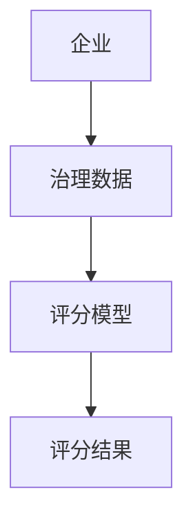
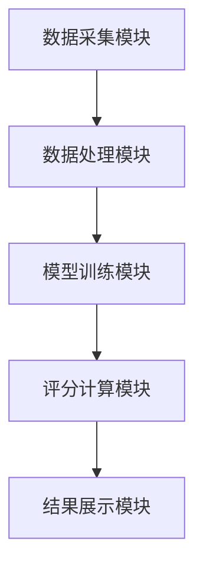
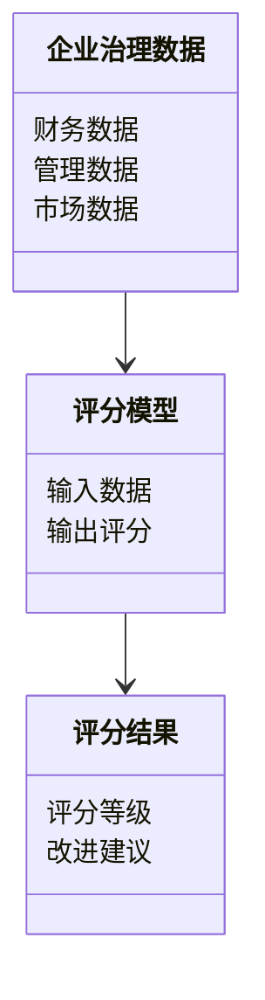
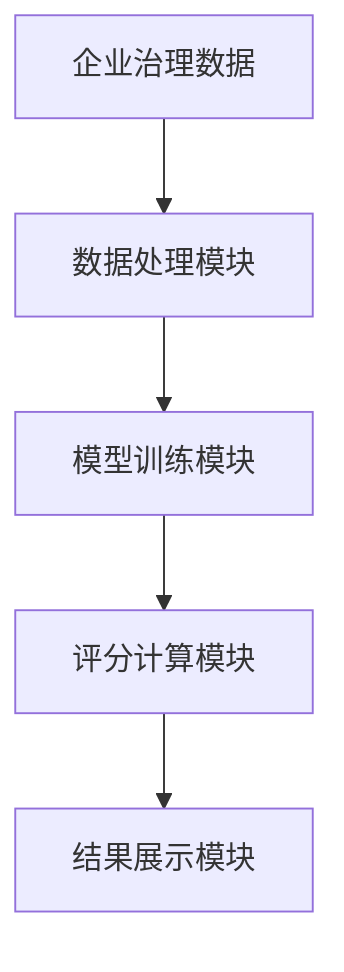

                 


# AI辅助的公司治理评分系统

> 关键词：AI、公司治理、评分系统、数据分析、机器学习、评分模型、评分标准

> 摘要：本文将探讨如何利用人工智能技术构建公司治理评分系统，通过数据分析和机器学习算法，实现对公司治理能力的自动化评估。我们将从背景介绍、核心概念、算法原理、系统架构设计、项目实战等多方面展开，详细分析如何利用AI技术优化公司治理评分过程。

---

# 第一部分: 背景介绍

## 第1章: 背景介绍

### 1.1 问题背景

#### 1.1.1 公司治理的核心问题
公司治理是现代企业管理体系中的核心环节，其目的是确保公司能够高效、透明、合规地运行。然而，传统的公司治理评估方法通常依赖于人工分析和经验判断，存在以下问题：
- **主观性**：不同评估者可能对同一公司治理表现有不同的评分结果。
- **效率低下**：手动评估需要大量时间和资源，难以覆盖大量企业。
- **数据复杂性**：公司治理涉及多个维度的数据，包括财务数据、管理数据、市场数据等，人工分析难以全面覆盖。

#### 1.1.2 传统公司治理的局限性
传统的公司治理评估方法主要依赖于财务报表分析、管理层访谈和行业对标。然而，这种方法存在以下局限性：
- **数据滞后性**：财务报表通常为季度或年度数据，难以反映实时公司治理状况。
- **缺乏量化标准**：公司治理的表现往往难以量化，导致评估结果缺乏客观性。
- **难以横向比较**：不同行业、不同规模的企业在治理表现上差异较大，传统的评估方法难以提供可比的结果。

#### 1.1.3 AI技术在公司治理中的应用价值
随着人工智能技术的快速发展，AI在公司治理中的应用逐渐成为可能。AI技术可以帮助企业实现以下目标：
- **自动化评估**：通过AI算法，自动分析企业治理数据，生成客观的评分结果。
- **实时监控**：利用实时数据流，实现对公司治理状况的实时监控和预警。
- **个性化建议**：根据企业的具体表现，提供个性化的治理改进建议。

### 1.2 问题描述

#### 1.2.1 公司治理评分的定义
公司治理评分是对企业在治理结构、治理效率、治理透明度等方面的综合评估，通常以分数形式表示，分数越高表示治理能力越强。

#### 1.2.2 评分系统的功能需求
- **数据采集**：从企业内外部获取相关数据，包括财务数据、管理数据、市场数据等。
- **数据处理**：对数据进行清洗、转换和特征提取。
- **模型训练**：利用机器学习算法训练评分模型。
- **评分计算**：根据模型预测企业治理评分。
- **结果展示**：以可视化形式展示评分结果，并提供改进建议。

#### 1.2.3 系统的边界与外延
- **边界**：系统仅关注公司治理评分，不涉及企业的具体业务操作。
- **外延**：系统可以与其他企业管理系统集成，提供更全面的企业管理解决方案。

### 1.3 问题解决

#### 1.3.1 AI技术如何辅助公司治理
- **数据处理**：AI可以帮助处理大量复杂数据，提取关键特征。
- **模型训练**：利用机器学习算法，训练高效的评分模型。
- **实时监控**：通过AI技术实现对公司治理状况的实时跟踪和预警。

#### 1.3.2 评分模型的设计思路
- **数据驱动**：以企业治理相关数据为基础，构建评分模型。
- **多维度评估**：从财务表现、治理结构、风险管理等多个维度进行综合评估。
- **动态调整**：根据企业实际表现和市场变化，动态调整评分模型。

#### 1.3.3 系统实现的关键技术
- **数据处理技术**：数据清洗、特征提取。
- **机器学习算法**：线性回归、随机森林、神经网络。
- **实时计算技术**：流数据处理、实时评分。

### 1.4 核心概念与联系

#### 1.4.1 核心概念原理
公司治理评分系统的核心在于将企业治理数据转化为可量化的评分结果。通过AI技术，可以实现数据的自动化处理和模型的高效训练。

#### 1.4.2 核心概念属性特征对比表格
| 概念 | 属性 | 特征 |
|------|------|------|
| 评分模型 | 输入 | 财务数据、管理数据、市场数据 |
| 评分模型 | 输出 | 治理评分 |
| 评分标准 | 维度 | 财务表现、治理结构、风险管理 |

#### 1.4.3 ER实体关系图


### 1.5 本章小结
本章介绍了公司治理评分系统的重要性和必要性，分析了传统评估方法的局限性，并提出了利用AI技术构建评分系统的优势和实现思路。通过核心概念和实体关系图的分析，读者可以清晰理解系统的基本架构和实现逻辑。

---

# 第2章: AI辅助的公司治理评分系统核心概念

## 2.1 评分模型原理

### 2.1.1 评分模型的输入与输出
- **输入**：企业治理相关数据，包括财务数据、管理数据、市场数据等。
- **输出**：企业的治理评分，通常以分数形式表示。

### 2.1.2 模型的训练与优化
- **训练**：利用历史数据训练评分模型，使其能够准确预测企业的治理评分。
- **优化**：通过调整模型参数和优化算法，提高模型的准确性和稳定性。

### 2.1.3 模型的评估与验证
- **评估**：使用测试数据验证模型的性能，包括准确率、召回率等指标。
- **验证**：通过实际应用验证模型的有效性和实用性。

## 2.2 数据来源与处理

### 2.2.1 数据采集方式
- **内部数据**：企业内部管理系统中的数据，包括财务报表、管理记录等。
- **外部数据**：从公开渠道获取的数据，包括行业数据、市场数据等。

### 2.2.2 数据清洗与预处理
- **数据清洗**：去除重复数据、处理缺失值、剔除异常值。
- **数据转换**：对数据进行标准化、归一化处理，使其适合模型输入。

### 2.2.3 数据特征提取
- **特征选择**：从数据中提取与公司治理相关的特征，例如财务比率、管理效率等。
- **特征工程**：通过组合、变换等方法，构造更有意义的特征。

## 2.3 评分标准与维度

### 2.3.1 评分维度的设计
- **财务表现**：包括盈利能力、偿债能力、运营效率等指标。
- **治理结构**：包括董事会结构、管理层稳定性、股权结构等。
- **风险管理**：包括风险识别、风险控制、危机应对能力等。

### 2.3.2 评分权重的分配
- **权重分配**：根据各个维度的重要性，分配不同的权重。例如，财务表现占40%，治理结构占30%，风险管理占30%。
- **权重调整**：根据实际情况和行业特点，动态调整各维度的权重。

### 2.3.3 评分结果的解释
- **评分解释**：将评分结果转化为易于理解的形式，例如分为A、B、C、D、E五个等级。
- **结果分析**：根据评分结果，分析企业的优势和不足，并提出改进建议。

## 2.4 系统架构与功能

### 2.4.1 系统功能模块划分
- **数据采集模块**：负责采集企业治理相关数据。
- **数据处理模块**：对数据进行清洗、转换和特征提取。
- **模型训练模块**：训练评分模型并优化模型性能。
- **评分计算模块**：根据模型预测企业治理评分。
- **结果展示模块**：以可视化形式展示评分结果，并提供改进建议。

### 2.4.2 模块之间的交互关系


### 2.4.3 系统的可扩展性设计
- **模块化设计**：各功能模块相对独立，便于后期扩展和维护。
- **接口设计**：系统提供标准接口，方便与其他企业管理系统集成。
- **动态调整**：根据企业需求和市场变化，动态调整系统功能和模型参数。

### 2.5 本章小结
本章详细介绍了评分模型的原理和实现过程，分析了数据处理的关键步骤，并提出了系统架构设计和功能划分。通过模块化设计和可扩展性设计，确保系统能够适应不同的企业需求和市场变化。

---

# 第3章: 评分模型的算法原理

## 3.1 算法原理概述

### 3.1.1 线性回归模型
- **线性回归模型**：是一种简单且常用的回归模型，适用于线性关系的数据。
- **公式**：
  $$ y = \beta_0 + \beta_1x + \epsilon $$
  其中，$y$ 是目标变量，$x$ 是自变量，$\beta_0$ 和 $\beta_1$ 是回归系数，$\epsilon$ 是误差项。
- **优点**：简单易懂，计算效率高。
- **缺点**：只能处理线性关系，对复杂数据表现不佳。

### 3.1.2 支持向量机模型
- **支持向量机模型**：是一种基于统计学习理论的分类和回归模型。
- **原理**：通过构建支持向量，将数据映射到高维空间，然后进行线性分类或回归。
- **优点**：对非线性数据表现良好，泛化能力强。
- **缺点**：计算复杂，需要较多参数调优。

### 3.1.3 神经网络模型
- **神经网络模型**：是一种模拟人脑神经网络的深度学习模型。
- **原理**：通过多层神经元网络，对数据进行非线性变换和特征提取。
- **优点**：能够处理复杂数据，表现优秀。
- **缺点**：计算资源消耗大，需要大量数据支持。

## 3.2 算法实现流程

### 3.2.1 数据预处理
- **数据清洗**：去除缺失值、异常值。
- **数据标准化**：对数据进行标准化处理，使其具有相同的量纲。
- **数据分割**：将数据分为训练集和测试集。

### 3.2.2 模型训练
- **选择算法**：根据数据特点选择合适的算法。
- **参数调优**：通过网格搜索等方法，优化模型参数。
- **训练模型**：利用训练数据训练模型，得到最优参数。

### 3.2.3 模型预测
- **输入测试数据**：将测试数据输入模型，进行预测。
- **计算评分结果**：输出企业的治理评分结果。

### 3.2.4 模型调优
- **评估模型性能**：计算模型的准确率、召回率等指标。
- **优化模型**：根据评估结果，调整模型参数或更换算法。

## 3.3 算法原理的数学模型

### 3.3.1 线性回归公式
$$ y = \beta_0 + \beta_1x + \epsilon $$
其中，$y$ 是目标变量，$x$ 是自变量，$\beta_0$ 是截距，$\beta_1$ 是回归系数，$\epsilon$ 是误差项。

### 3.3.2 支持向量回归公式
$$ y = w^T x + b $$
其中，$w$ 是权重向量，$x$ 是输入数据，$b$ 是偏置项。

### 3.3.3 神经网络模型公式
$$ y = \sigma(w^T x + b) $$
其中，$\sigma$ 是激活函数，$w$ 是权重矩阵，$x$ 是输入数据，$b$ 是偏置项。

## 3.4 本章小结
本章详细介绍了三种常用的评分模型：线性回归模型、支持向量机模型和神经网络模型。通过对每种模型的原理、公式和优缺点的分析，帮助读者选择合适的算法进行评分模型的训练和优化。

---

# 第4章: 系统分析与架构设计方案

## 4.1 问题场景介绍

### 4.1.1 问题场景描述
- **场景一**：企业需要对自身治理能力进行评估。
- **场景二**：企业需要对竞争对手的治理能力进行分析。
- **场景三**：企业需要对潜在合作伙伴的治理能力进行评估。

### 4.1.2 系统需求分析
- **需求一**：支持多种数据来源的接入。
- **需求二**：能够处理实时数据流，实现动态评分。
- **需求三**：提供可视化的评分结果和改进建议。

## 4.2 系统功能设计

### 4.2.1 领域模型设计


### 4.2.2 系统架构设计


### 4.2.3 系统接口设计
- **输入接口**：接受企业治理数据，支持多种数据格式。
- **输出接口**：输出评分结果，支持JSON、XML等格式。
- **用户接口**：提供可视化界面，方便用户查看评分结果和操作建议。

### 4.2.4 系统交互流程
```mermaid
sequenceDiagram
参与者：用户
系统：AI辅助的公司治理评分系统
用户 -> 系统：上传企业治理数据
系统 -> 数据处理模块：进行数据清洗和特征提取
数据处理模块 -> 模型训练模块：训练评分模型
模型训练模块 -> 评分计算模块：计算企业治理评分
评分计算模块 -> 结果展示模块：生成评分报告
结果展示模块 -> 用户：展示评分结果和改进建议
```

## 4.3 本章小结
本章通过问题场景分析和系统功能设计，明确了系统的需求和实现目标。通过领域模型设计和系统架构设计，帮助读者理解系统的整体结构和各模块之间的交互关系。同时，通过系统接口设计和交互流程图，展示了系统的实际应用过程。

---

# 第5章: 项目实战

## 5.1 环境安装

### 5.1.1 系统环境
- **操作系统**：Linux/Windows/MacOS
- **编程语言**：Python 3.8+
- **开发工具**：Jupyter Notebook、PyCharm
- **机器学习库**：Scikit-learn、XGBoost、Keras
- **数据处理库**：Pandas、NumPy
- **可视化库**：Matplotlib、Seaborn

### 5.1.2 安装步骤
1. 安装Python：
   ```bash
   apt-get install python3 python3-pip
   ```
2. 安装常用库：
   ```bash
   pip install numpy pandas scikit-learn xgboost keras matplotlib seaborn
   ```

## 5.2 系统核心实现源代码

### 5.2.1 数据处理代码
```python
import pandas as pd
import numpy as np

# 读取数据
data = pd.read_csv('governance_data.csv')

# 数据清洗
data.dropna(inplace=True)
data = data[~data.duplicated()]

# 特征提取
features = data[['revenue', 'net_profit', 'debt_ratio', 'board_size']]
labels = data['governance_score']
```

### 5.2.2 模型训练代码
```python
from sklearn.model

