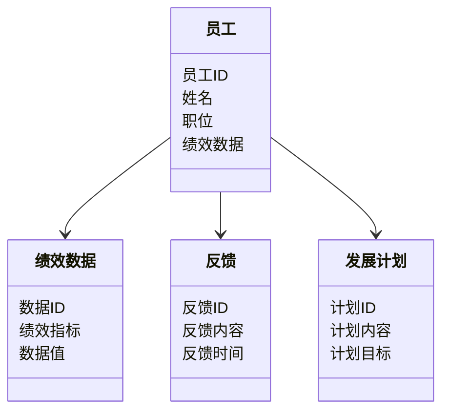
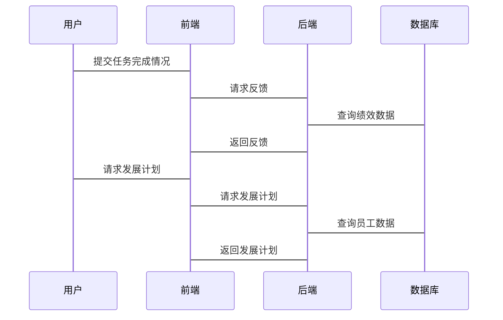

                 


# AI驱动的企业绩效管理：实时反馈与个性化发展计划

## 关键词：企业绩效管理，人工智能，实时反馈，个性化发展计划，数据驱动

## 摘要：  
本文深入探讨了AI在企业绩效管理中的应用，重点分析了实时反馈与个性化发展计划的实现方式。通过结合AI技术，企业能够更高效地进行绩效评估与员工发展。文章从背景、核心概念、算法原理、系统架构到项目实战，全面解析了AI驱动的企业绩效管理的实现路径，并通过具体案例展示了其实际应用价值。本文适合企业IT架构师、HR管理者以及对AI技术感兴趣的读者阅读。

---

# 第一部分: 背景介绍

## 第1章: 企业绩效管理的数字化转型

### 1.1 企业绩效管理的定义与重要性

#### 1.1.1 企业绩效管理的基本概念
企业绩效管理（Enterprise Performance Management，EPM）是指通过收集、分析和应用绩效数据，帮助组织优化业务流程、提升员工能力、实现战略目标的管理方法。传统的绩效管理依赖于定期评估和静态数据，难以满足现代企业对实时反馈和个性化发展的需求。

#### 1.1.2 绩效管理在企业管理中的作用
绩效管理是企业提升员工能力、优化组织结构、实现战略目标的重要工具。通过绩效管理，企业可以：
- 量化员工表现，识别优秀与需要改进的员工。
- 提供针对性的培训和发展计划，提升员工技能。
- 优化业务流程，提高企业整体效率。

#### 1.1.3 数字化转型对企业绩效管理的影响
随着数字化转型的推进，企业绩效管理逐渐从传统模式向数字化、智能化方向发展。AI技术的引入，使得绩效管理能够实时收集和分析数据，提供动态反馈和个性化建议，从而提升管理效率和员工体验。

### 1.2 AI在企业绩效管理中的应用背景

#### 1.2.1 传统绩效管理的局限性
传统的绩效管理存在以下问题：
- 数据收集周期长，反馈滞后。
- 绩效评估依赖主观判断，缺乏客观性。
- 员工发展计划缺乏个性化，难以满足不同员工的需求。

#### 1.2.2 AI技术如何解决传统绩效管理的痛点
AI技术通过以下方式解决了传统绩效管理的痛点：
- 实时数据采集与分析，提供即时反馈。
- 利用机器学习算法，自动化评估绩效。
- 根据员工表现和需求，推荐个性化发展计划。

#### 1.2.3 AI驱动绩效管理的潜在价值
AI驱动的绩效管理能够：
- 提高管理效率，降低人工成本。
- 增强评估的客观性和准确性。
- 优化员工体验，提升员工满意度和忠诚度。

---

## 第2章: 实时反馈与个性化发展计划的核心概念

### 2.1 实时反馈的定义与特征

#### 2.1.1 实时反馈的概念
实时反馈是指在员工完成任务或行为的瞬间，系统立即提供针对其表现的反馈。这种方式能够及时指导员工的行为，帮助其快速改进。

#### 2.1.2 实时反馈的特点
实时反馈具有以下特点：
- **实时性**：反馈即时发生，无需等待周期性评估。
- **针对性**：反馈基于具体行为，具有明确的方向性。
- **动态性**：反馈随时间变化，能够捕捉员工表现的波动。

#### 2.1.3 实时反馈在绩效管理中的应用
实时反馈可以应用于以下场景：
- **销售目标达成情况**：实时跟踪销售业绩，及时调整销售策略。
- **员工行为分析**：通过实时数据分析员工的工作态度和表现。
- **任务完成情况评估**：实时监控任务进度，提供即时指导。

### 2.2 个性化发展计划的定义与优势

#### 2.2.1 个性化发展计划的概念
个性化发展计划是指根据员工的个人特点、职业目标和绩效表现，为其量身定制的发展计划。这种计划能够帮助员工提升技能，实现职业目标。

#### 2.2.2 个性化发展计划的优势
个性化发展计划具有以下优势：
- **针对性强**：根据员工的具体需求制定计划，避免一刀切的问题。
- **员工满意度高**：员工感受到企业对其职业发展的关注和支持。
- **提升组织能力**：通过个性化发展，企业能够培养出更具竞争力的员工队伍。

#### 2.2.3 个性化发展计划与企业绩效的关系
个性化发展计划能够通过提升员工能力，进而提升企业的整体绩效。具体表现在：
- 员工技能提升，工作效率提高。
- 员工满意度高，离职率降低。
- 员工能力增强，企业创新能力提升。

### 2.3 AI驱动的实时反馈与个性化发展计划的核心要素

#### 2.3.1 数据采集与处理
AI驱动的实时反馈和个性化发展计划需要依赖大量的数据，包括：
- **员工行为数据**：如工作任务完成情况、会议参与度等。
- **绩效数据**：如销售业绩、项目完成质量等。
- **员工反馈数据**：如员工满意度调查、自我评估等。

#### 2.3.2 AI算法的应用
AI算法在实时反馈与个性化发展计划中的应用包括：
- **自然语言处理**：分析员工反馈文本，提取情感和关键信息。
- **机器学习**：预测员工绩效，推荐个性化发展计划。
- **深度学习**：通过神经网络模型，学习员工行为模式，优化反馈机制。

#### 2.3.3 系统架构设计
AI驱动的实时反馈与个性化发展计划系统架构包括：
- **数据采集层**：负责采集各类数据。
- **数据处理层**：对数据进行清洗、分析和建模。
- **用户交互层**：提供实时反馈和个性化发展计划的展示界面。

---

## 第3章: AI驱动的企业绩效管理的核心要素

### 3.1 数据采集与处理

#### 3.1.1 数据来源的多样性
AI驱动的企业绩效管理的数据来源包括：
- **结构化数据**：如销售数据、财务数据等。
- **非结构化数据**：如员工反馈、会议记录等。
- **实时数据**：如员工行为数据、任务完成情况等。

#### 3.1.2 数据预处理的关键步骤
数据预处理包括以下步骤：
- **数据清洗**：去除无效数据，处理缺失值。
- **数据转换**：将数据转换为适合算法处理的形式。
- **数据标准化**：对数据进行标准化处理，消除量纲影响。

#### 3.1.3 数据清洗与标准化
数据清洗与标准化是确保数据质量的重要步骤。例如，对于销售数据，需要处理缺失值和异常值，并将数据标准化为统一的格式。

### 3.2 AI算法在绩效管理中的应用

#### 3.2.1 机器学习算法在绩效预测中的应用
机器学习算法可以用于预测员工的绩效表现。例如，使用线性回归模型预测销售业绩，使用支持向量机（SVM）模型预测员工离职风险。

#### 3.2.2 自然语言处理在反馈分析中的应用
自然语言处理（NLP）可以用于分析员工反馈文本，提取情感和关键词。例如，使用情感分析模型判断员工对工作的满意度，使用关键词提取技术识别员工的主要诉求。

#### 3.2.3 深度学习在个性化推荐中的应用
深度学习算法可以用于推荐个性化发展计划。例如，使用协同过滤算法推荐培训课程，使用神经网络模型预测员工的最佳发展路径。

### 3.3 系统架构与实现

#### 3.3.1 系统架构设计
系统架构设计包括以下部分：
- **前端界面**：提供实时反馈和个性化发展计划的展示界面。
- **后端服务**：负责数据处理和算法计算。
- **数据库**：存储员工数据、绩效数据和反馈数据。

#### 3.3.2 系统功能模块划分
系统功能模块包括：
- **数据采集模块**：负责采集各类数据。
- **数据分析模块**：对数据进行分析和建模。
- **反馈模块**：提供实时反馈和个性化发展计划。
- **报表模块**：生成绩效报告和分析报表。

#### 3.3.3 系统实现的关键技术
系统实现的关键技术包括：
- **大数据技术**：如Hadoop、Spark，用于处理海量数据。
- **AI技术**：如机器学习、深度学习，用于数据分析和预测。
- **云计算技术**：用于系统的部署和扩展。

---

## 第4章: 算法与系统实现

### 4.1 实时反馈机制的算法原理

#### 4.1.1 反馈机制的数学模型
实时反馈机制的数学模型包括以下部分：
- **输入数据**：员工行为数据和绩效数据。
- **算法模型**：如线性回归、随机森林等。
- **输出结果**：实时反馈和建议。

#### 4.1.2 基于时间序列的反馈预测模型
基于时间序列的反馈预测模型可以用于预测员工的未来绩效。例如，使用ARIMA模型预测销售业绩。

#### 4.1.3 基于机器学习的反馈分类模型
基于机器学习的反馈分类模型可以用于分类员工的绩效等级。例如，使用SVM模型将员工分为优秀、良好、一般和较差四个等级。

#### 4.1.4 算法实现的Python代码示例
以下是一个基于线性回归的实时反馈算法实现示例：

```python
import numpy as np
from sklearn.linear_model import LinearRegression

# 示例数据
X = np.array([[1], [2], [3], [4], [5]])
y = np.array([2, 4, 5, 4, 6])

# 训练模型
model = LinearRegression()
model.fit(X, y)

# 预测结果
print(model.predict([[6]]))  # 输出：[[7.8]]
```

### 4.2 个性化发展计划的算法实现

#### 4.2.1 个性化推荐算法
个性化推荐算法包括协同过滤、基于内容的推荐和混合推荐。例如，使用协同过滤算法推荐培训课程。

#### 4.2.2 算法实现的Python代码示例
以下是一个基于协同过滤的个性化推荐算法实现示例：

```python
from sklearn.metrics.pairwise import cosine_similarity

# 示例数据
user_item_matrix = {
    'user1': [4, 5, 3],
    'user2': [5, 4, 3],
    'user3': [3, 4, 5]
}

# 计算相似度
similarity_matrix = cosine_similarity(user_item_matrix.values)

# 输出相似度矩阵
print(similarity_matrix)
```

---

## 第5章: 系统架构设计

### 5.1 问题场景介绍
本章将从实际问题出发，介绍AI驱动的企业绩效管理系统的应用场景和需求。

### 5.2 系统功能设计

#### 5.2.1 领域模型类图
以下是领域模型类图的Mermaid示意图：



### 5.3 系统架构设计

#### 5.3.1 系统架构图
以下是系统架构图的Mermaid示意图：

```mermaid
architecturalDiagram

    component 前端 {
        接收用户输入
        展示反馈和计划
    }

    component 后端 {
        处理数据
        运行算法
    }

    component 数据库 {
        存储员工数据
        存储绩效数据
    }

    前端 --> 后端
    后端 --> 数据库
```

### 5.4 系统接口设计

#### 5.4.1 接口描述
系统接口包括以下部分：
- **数据采集接口**：用于采集员工数据和绩效数据。
- **反馈接口**：用于提供实时反馈。
- **发展计划接口**：用于生成个性化发展计划。

#### 5.4.2 接口交互序列图
以下是接口交互序列图的Mermaid示意图：



---

## 第6章: 项目实战

### 6.1 环境安装

#### 6.1.1 安装Python
安装Python 3.x版本，确保环境满足后续代码运行需求。

#### 6.1.2 安装相关库
安装以下Python库：
- `numpy`
- `pandas`
- `scikit-learn`
- `mermaid`

#### 6.1.3 安装步骤示例
```bash
pip install numpy pandas scikit-learn mermaid
```

### 6.2 系统核心实现

#### 6.2.1 数据采集与处理
编写代码采集员工数据和绩效数据，并进行清洗和标准化。

#### 6.2.2 算法实现
实现实时反馈和个性化发展计划的算法，例如线性回归和协同过滤。

#### 6.2.3 系统集成
将算法集成到系统中，实现实时反馈和个性化推荐功能。

### 6.3 代码应用解读与分析

#### 6.3.1 数据处理代码示例
以下是一个数据处理代码示例：

```python
import pandas as pd

# 读取数据
data = pd.read_csv('employee_data.csv')

# 数据清洗
data = data.dropna()
data = data.drop_duplicates()

# 数据标准化
from sklearn.preprocessing import StandardScaler

scaler = StandardScaler()
data_scaled = scaler.fit_transform(data)
```

#### 6.3.2 算法实现代码示例
以下是一个算法实现代码示例：

```python
from sklearn.linear_model import LinearRegression

# 示例数据
X = pd.DataFrame({'feature': [1, 2, 3, 4, 5]})
y = pd.Series([2, 4, 5, 4, 6])

# 训练模型
model = LinearRegression()
model.fit(X, y)

# 预测结果
print(model.predict([[6]]))  # 输出：[[7.8]]
```

### 6.4 实际案例分析

#### 6.4.1 案例背景
某公司希望提升员工绩效，引入AI驱动的实时反馈和个性化发展计划系统。

#### 6.4.2 数据分析
通过分析员工数据和绩效数据，识别出需要重点关注的员工，并为其制定个性化发展计划。

#### 6.4.3 系统实现
实现实时反馈和个性化推荐功能，帮助员工提升绩效。

### 6.5 项目小结

#### 6.5.1 项目总结
通过本项目，我们实现了AI驱动的实时反馈和个性化发展计划系统，提升了企业的绩效管理水平。

#### 6.5.2 项目经验
项目中总结出以下经验：
- 数据质量是系统性能的关键。
- 算法选择需要根据具体场景进行调整。
- 系统架构设计需要考虑可扩展性和可维护性。

---

## 第7章: 总结与展望

### 7.1 总结

#### 7.1.1 核心内容回顾
本文深入探讨了AI驱动的企业绩效管理的实现路径，重点分析了实时反馈与个性化发展计划的核心概念和算法实现。

#### 7.1.2 本文的创新点
本文的创新点在于将AI技术应用于企业绩效管理，提出了实时反馈与个性化发展计划的实现方案。

#### 7.1.3 实际应用价值
本文提出的方案能够帮助企业提升绩效管理水平，优化员工体验，增强企业竞争力。

### 7.2 展望

#### 7.2.1 技术发展的未来趋势
未来，随着AI技术的不断发展，企业绩效管理将更加智能化和个性化。

#### 7.2.2 可能的改进方向
未来可以进一步优化算法，引入更多数据源，提升系统的准确性和实时性。

#### 7.2.3 对企业管理者的建议
企业管理者应积极拥抱AI技术，推动企业绩效管理的数字化转型。

---

## 作者：AI天才研究院/AI Genius Institute & 禅与计算机程序设计艺术 /Zen And The Art of Computer Programming

