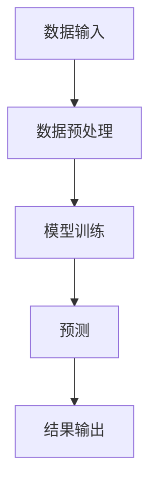
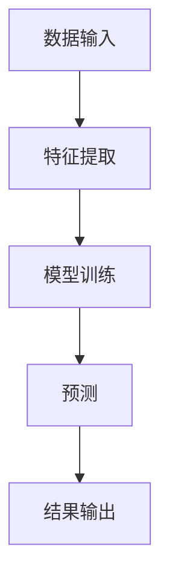
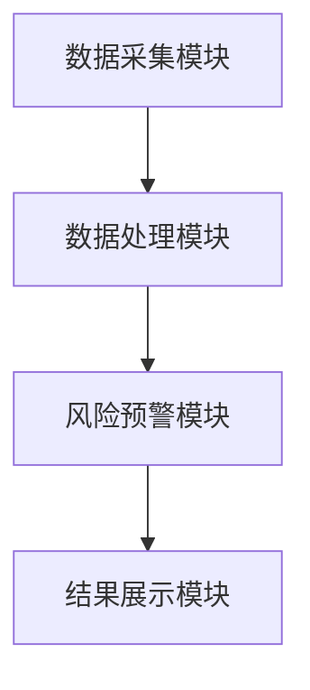

                 


# AI驱动的市场流动性风险预警

> 关键词：AI技术，流动性风险，市场预警，算法原理，系统架构，金融创新

> 摘要：随着金融市场日益复杂化和全球化，流动性风险作为金融市场中的重要风险之一，对金融机构的稳定运行构成重大威胁。本文从AI技术的视角出发，深入探讨市场流动性风险的预警机制，结合实际案例分析，详细阐述了AI技术在流动性风险预警中的应用场景、算法原理和系统架构设计。文章通过理论与实践相结合的方式，为读者提供了一套基于AI技术的市场流动性风险预警解决方案。

---

## 第1章：市场流动性风险与AI技术的结合

### 1.1 市场流动性风险的定义与特征

流动性风险是指资产在短时间内以合理价格变现的能力受到限制，从而可能导致损失的风险。这种风险在金融市场中无处不在，尤其是在股票、债券、货币市场等交易市场中，流动性风险的表现尤为突出。

#### 1.1.1 流动性风险的定义
流动性风险可以分为市场流动性风险和机构流动性风险。市场流动性风险是指整个市场上的资产买卖难度增加，导致价格波动加剧；机构流动性风险则是指单个金融机构由于资产变现困难而面临的风险。

#### 1.1.2 流动性风险的核心特征
- **波动性**：市场波动加剧时，流动性风险显著上升。
- **传染性**：流动性风险可能在市场中迅速蔓延，引发系统性风险。
- **隐蔽性**：流动性风险往往在市场正常的情况下隐藏，只有在市场出现极端情况时才显现出来。

#### 1.1.3 流动性风险的分类
- **资产流动性风险**：特定资产的流动性不足。
- **市场流动性风险**：整个市场的流动性不足。
- **机构流动性风险**：金融机构自身的流动性不足。

### 1.2 AI技术在金融领域的应用背景

#### 1.2.1 AI技术的发展历程
人工智能（AI）技术经历了从符号推理、专家系统到机器学习和深度学习的演变。近年来，随着计算能力的提升和数据量的爆炸式增长，深度学习技术在金融领域的应用日益广泛。

#### 1.2.2 AI在金融领域的应用现状
AI技术在金融领域的应用主要集中在以下几个方面：
- **量化交易**：利用算法进行高频交易。
- **风险管理**：通过AI技术预测市场风险，优化投资组合。
- **智能投顾**：为投资者提供个性化的投资建议。

#### 1.2.3 AI技术在流动性风险预警中的潜力
AI技术能够通过分析海量数据，发现市场中的潜在风险，从而提前发出预警。尤其是在处理非结构化数据（如新闻、社交媒体信息）方面，AI技术具有显著优势。

### 1.3 本章小结
本章主要介绍了流动性风险的定义、特征及其分类，同时探讨了AI技术在金融领域的应用背景，特别是AI技术在流动性风险预警中的潜力。

---

## 第2章：AI驱动的市场流动性风险预警的核心概念

### 2.1 核心概念的定义与属性对比

#### 2.1.1 流动性风险预警的定义
流动性风险预警是指通过分析市场数据和相关指标，提前预测和识别可能引发流动性风险的因素，并采取相应的措施进行应对。

#### 2.1.2 AI技术在流动性风险预警中的作用
AI技术能够通过数据挖掘、机器学习等方法，从海量数据中提取有用的特征，构建风险预警模型。

#### 2.1.3 核心概念的属性对比表格
以下是流动性风险预警和传统风险预警的核心属性对比：

| 属性 | 流动性风险预警 | 传统风险预警 |
|------|----------------|--------------|
| 数据来源 | 结构化与非结构化数据 | 主要为结构化数据 |
| 预警速度 | 实时或近实时 | 周期性 |
| 预警精度 | 高 | 较低 |
| 数据处理能力 | 强大 | 较弱 |

### 2.2 实体关系图（ER图）架构

以下是流动性风险预警系统的核心实体关系图（ER图）：

```mermaid
erDiagram
    participant 金融机构 : Financial Institution
    participant 资产 : Asset
    participant 交易 : Transaction
    participant 风险预警模型 : RiskWarningModel
    participant 预警结果 : WarningResult

    金融机构 --> 资产 : 持有
    资产 --> 风险预警模型 : 输入
    风险预警模型 --> 预警结果 : 输出
    交易 --> 风险预警模型 : 输入
    预警结果 --> 金融机构 : 通知
```

### 2.3 本章小结
本章通过定义和对比流动性风险预警的核心概念，分析了AI技术在其中的作用，并通过ER图展示了系统的实体关系。

---

## 第3章：AI驱动的市场流动性风险预警算法原理

### 3.1 常见的流动性风险预警算法

#### 3.1.1 时间序列分析
时间序列分析是一种基于历史数据预测未来趋势的方法。常用的时间序列模型包括ARIMA（自回归积分滑动平均模型）和GARCH（广义自回归条件异方差模型）。

#### 3.1.2 机器学习算法
机器学习算法通过训练模型，识别数据中的模式和特征。常用的算法包括支持向量机（SVM）、随机森林（Random Forest）和XGBoost。

#### 3.1.3 深度学习算法
深度学习算法通过构建多层神经网络，提取数据中的高层次特征。常用的模型包括LSTM（长短期记忆网络）和Transformer。

### 3.2 算法原理的数学模型与公式

#### 3.2.1 时间序列分析的ARIMA模型
ARIMA模型的数学表达式如下：

$$ ARIMA(p, d, q) $$
其中：
- \( p \) 是自回归阶数
- \( d \) 是差分阶数
- \( q \) 是移动平均阶数

#### 3.2.2 机器学习算法的逻辑回归模型
逻辑回归模型的损失函数如下：

$$ L(\theta) = -\frac{1}{m}\sum_{i=1}^{m} [y_i \ln(h(x_i)) + (1 - y_i) \ln(1 - h(x_i))] $$
其中：
- \( h(x_i) = \frac{1}{1 + e^{-\theta^T x_i}} \)

#### 3.2.3 深度学习算法的LSTM模型
LSTM模型通过门控机制来捕捉长期依赖关系。其核心公式包括输入门、遗忘门和输出门：

$$
\begin{cases}
f_t = \sigma(W_f x_t + U_f h_{t-1} + b_f) \\
i_t = \sigma(W_i x_t + U_i h_{t-1} + b_i) \\
o_t = \sigma(W_o x_t + U_o h_{t-1} + b_o) \\
g_t = \tanh(W_g x_t + U_g h_{t-1} + b_g) \\
h_t = f_t \cdot c_{t-1} + i_t \cdot g_t
\end{cases}
$$

### 3.3 算法流程图（Mermaid）

#### 3.3.1 时间序列分析流程图


#### 3.3.2 机器学习算法流程图


### 3.4 本章小结
本章详细介绍了流动性风险预警中常用的算法及其数学模型，并通过流程图展示了算法的实现步骤。

---

## 第4章：AI驱动的市场流动性风险预警系统架构设计

### 4.1 系统功能设计

#### 4.1.1 数据采集模块
数据采集模块负责从多种数据源（如数据库、API接口等）获取市场数据。

#### 4.1.2 数据处理模块
数据处理模块对采集到的数据进行清洗、转换和特征提取。

#### 4.1.3 风险预警模块
风险预警模块利用训练好的模型对数据进行分析，生成风险预警信号。

#### 4.1.4 结果展示模块
结果展示模块将预警结果以可视化的方式呈现给用户。

### 4.2 系统架构图（Mermaid）



### 4.3 接口设计与交互流程

#### 4.3.1 数据接口规范
- 数据输入格式：JSON
- 数据输出格式：JSON

#### 4.3.2 用户界面交互流程
1. 用户输入数据源信息。
2. 系统从数据源获取数据。
3. 系统处理数据并生成预警结果。
4. 系统将结果展示给用户。

### 4.4 本章小结
本章设计了流动性风险预警系统的整体架构，并详细描述了各模块的功能和交互流程。

---

## 第5章：AI驱动的市场流动性风险预警系统实现

### 5.1 环境安装与配置

#### 5.1.1 开发环境搭建
- 操作系统：Linux/Windows/MacOS
- 开发工具：PyCharm/VS Code
- 语言：Python

#### 5.1.2 数据库安装
- 数据库：MySQL/PostgreSQL
- 安装命令：`sudo apt-get install mysql-server`

#### 5.1.3 依赖库安装
- 依赖库：Pandas、NumPy、Scikit-learn、TensorFlow
- 安装命令：`pip install pandas numpy scikit-learn tensorflow`

### 5.2 系统核心实现代码

#### 5.2.1 数据处理代码
```python
import pandas as pd
import numpy as np

# 数据加载
data = pd.read_csv('market_data.csv')

# 数据清洗
data = data.dropna()

# 特征提取
X = data.iloc[:, :-1].values
y = data.iloc[:, -1].values

# 数据分割
from sklearn.model_selection import train_test_split
X_train, X_test, y_train, y_test = train_test_split(X, y, test_size=0.2)
```

#### 5.2.2 风险预警模型训练代码
```python
from sklearn.ensemble import RandomForestClassifier
from sklearn.metrics import accuracy_score

# 模型训练
model = RandomForestClassifier()
model.fit(X_train, y_train)

# 模型预测
y_pred = model.predict(X_test)

# 模型评估
print(accuracy_score(y_test, y_pred))
```

### 5.3 本章小结
本章详细介绍了流动性风险预警系统的实现过程，包括环境配置、数据处理和模型训练等步骤。

---

## 第6章：项目实战与总结

### 6.1 实际案例分析

#### 6.1.1 案例背景
假设我们有一个股票市场的数据集，包括股票价格、交易量、市场情绪等指标。

#### 6.1.2 数据分析与模型训练
```python
import pandas as pd
import numpy as np
import matplotlib.pyplot as plt

# 数据加载
data = pd.read_csv('stock_data.csv')

# 数据可视化
plt.plot(data['close_price'])
plt.title('Stock Price Trend')
plt.xlabel('Time')
plt.ylabel('Price')
plt.show()

# 数据分割
X = data.iloc[:, :-1].values
y = data.iloc[:, -1].values

from sklearn.model_selection import train_test_split
X_train, X_test, y_train, y_test = train_test_split(X, y, test_size=0.2)

# 模型训练
from sklearn.ensemble import RandomForestClassifier
model = RandomForestClassifier()
model.fit(X_train, y_train)

# 模型预测
y_pred = model.predict(X_test)

# 模型评估
from sklearn.metrics import confusion_matrix
print(confusion_matrix(y_test, y_pred))
```

#### 6.1.3 预警结果分析
通过模型预测结果，我们可以识别出潜在的流动性风险，并采取相应的措施。

### 6.2 项目总结

#### 6.2.1 项目小结
本项目通过AI技术实现了市场流动性风险的预警，验证了AI技术在金融领域的应用潜力。

#### 6.2.2 注意事项
- 数据质量对模型性能影响重大，需要确保数据的准确性和完整性。
- 模型需要定期更新，以适应市场环境的变化。

#### 6.2.3 拓展阅读
- 《机器学习实战》
- 《深度学习入门：基于Python》
- 《金融风险管理》

### 6.3 本章小结
本章通过实际案例分析，展示了AI技术在市场流动性风险预警中的应用，并总结了项目经验。

---

## 作者：AI天才研究院/AI Genius Institute & 禅与计算机程序设计艺术 /Zen And The Art of Computer Programming

---

以上是《AI驱动的市场流动性风险预警》的技术博客文章的完整内容，希望对您有所帮助！

